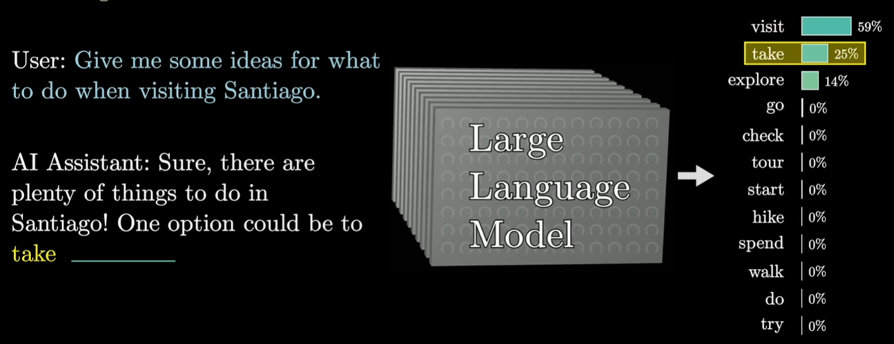

## 简介

本文主要用于教学如何用大语言模型（LLM）辅助写代码/写文章。  

## 推荐的AI

目前AI的发展速度极快，每个月都会有重磅级别的更新，这里介绍2025-3-28这个时间节点时推荐的AI。  

- T0级别  

| 模型名 | 官网 | 介绍 |
| :--- | :--- | :--- |
| Gemini 2.5 Pro | <https://aistudio.google.com> | 谷歌于3月25日发布的推理模型，在众多测评中均屠榜，每天50次免费 |
| Gemini 2.0 Flash Thinking | <https://aistudio.google.com> | 谷歌于1月21日发布的推理模型，优势是回复速度极快，每天1000次免费 |
| Deepseek V3-0324 | <https://chat.deepseek.com/> | 3月24日发布的新版本，在数学、代码等方面有明显增强，直接对话就是这个模型，每天限额免费 |
| Deepseek R1 | <https://chat.deepseek.com/> | 不用多介绍了，国产开源推理模型，每天限额免费 |
| Claude 3.7 Sonnet Thinking | <https://claude.ai/> | Anthropic家2月24发布的推理模型，代码能力最强，但是只建议通过Cursor或其他API中转站使用 |
| ChatGPT-o1 | <https://chatgpt.com/> | 推理模型，能力很强但是很贵 |

- T？级别  
  - kimi，豆包，文心一言，国产垃圾模型，别用  
  - 要用国产的就用通义千问和deepseek吧  

## 如何与AI沟通

LLM的本质是一个**概率模型**，它基于海量的文本数据进行训练，学习语言的模式、关联和上下文。它的目标是生成在统计上最连贯、最符合上下文的文本，而不是保证绝对的**事实正确性**或执行完美的**逻辑推理**。

当你给LLM一个提示（Prompt）时，它并不是真正“理解”你的问题，而是根据其学到的模式，计算出接下来最**可能**出现的词语序列。



正是因为LLM的概率本质，直接向它索要精确的、需要计算或核查事实的答案，有时会得到看似合理但实际错误的结果。LLM会生成一个“听起来”很像正确答案的序列，因为它在训练数据中见过类似的模式。

例如：

```
User：计算 2156 * 5648 等于多少，直接告诉我结果。
Assistant：1145141919810  // 这是一个看似合理但错误的答案
```

因此，我们不能简单地把LLM当作完美的计算器或百科全书。要想获得准确、有用的回答，我们需要**引导**它，而引导的关键就是**设计有效的提示词 (Prompt Engineering)**。

### 拆分步骤

最有效、最基础的引导技巧之一就是**要求AI“思考”过程，即拆分步骤**。  

为什么有效？

1.  **模拟人类解决问题的方式：** 复杂问题通常需要分解成小步骤来解决。要求LLM这样做，可以引导它遵循更严谨的逻辑路径。
2.  **降低错误率：** 每一步的计算或推理相对简单，LLM在处理简单步骤时更不容易出错。即使某一步出错，也更容易被发现和纠正。
3.  **提高透明度：** 你可以看到AI是如何得出结果的，有助于判断结果的可靠性。
4.  **强制聚焦：** 它迫使LLM不仅仅是“预测”最终答案，而是要生成一个连贯的、有逻辑的中间过程。  

比如：  

```
User：分步计算 2156 * 5648，并告诉我最终结果。
Assistant：
好的，让我们一步步计算 2156 * 5648：

1.  首先，将 5648 分解为其各个位数代表的值：8, 40, 600, 5000。
2.  计算 2156 * 8 = 17248
3.  计算 2156 * 40 = 86240
4.  计算 2156 * 600 = 1293600
5.  计算 2156 * 5000 = 10780000
6.  将以上所有部分结果相加：
    17248
    + 86240
    + 1293600
    + 10780000
    ----------
    = 12177088

所以，2156 * 5648 等于 12177088。
（这里只是举了个例子，实际计算的过程为了保证正确性可能会复杂很多）
```

**注意：** 即使使用分步引导，对于极其复杂的计算或推理，LLM仍可能出错，但是LLM的推理过程也许会对用户有所启发。

### 背景信息

即在提出问题或任务时，尽可能提供所有相关的**背景信息、约束条件和目标**，比如：  

- 你的身份是，你要干什么，需要如何完成，要求有什么，等等

**为什么有效？**
LLM 没有我们人类的常识记忆或对特定情境的即时感知（除非在特定应用中被设计如此）。它们依赖你提供的文本来理解任务。背景信息越充分、越明确，AI就越能：

*   **理解真实意图：** 避免因信息不足而产生的误解或猜测。
*   **缩小范围：** 将注意力集中在相关的知识和模式上。
*   **生成定制化内容：** 输出更符合你的具体需求，而非泛泛而谈。

坏例子:

```
User: 写一封关于项目延迟的邮件。
```

AI不知道你是谁，收件人是谁，哪个项目，延迟多久，原因是什么，你的语气应该是抱歉、解释还是寻求帮助，生成的结果很可能是模板化且无用的。

好例子:

```
User: 我是一名项目经理，需要给我的客户的代表张三写一封邮件。关于我们正在进行的某项目，原定本周五交付用户，但由于核心模块遇到了一个未预料到的技术问题，我们需要推迟3天交付。我们已经有了解决方案，正在加紧工作。请帮我写一封邮件，语气要专业、诚恳地表达歉意，解释延迟原因（无需过多技术细节），强调我们正在努力解决并给出新的预计交付日期（下周三）。
```
在这个提示词中吗，用户提供了角色、收件人、项目、问题、原因、解决方案、期望的语气和关键信息点，AI可以据此生成一封高度相关的邮件。

注意：由于大模型是在线联网使用的，实际沟通时应该避免把密码等敏感信息当作prompt一起发送给LLM，避免潜在的信息泄露，应该用xxx或张三等代替。

### 角色扮演

即明确指示LLM扮演一个特定的角色、专家或人物。

**为什么有效？**
这就像给演员分配角色一样，能帮助LLM：

*   **调整语气和风格：** 例如，“像一个经验丰富的营销总监”会比“像一个技术文档撰写者”产生不同的语言风格。
*   **调用相关知识：** 促使模型侧重于特定领域的知识和术语。
*   **设定视角：** 从特定的角度来分析问题或生成内容。

---

**如何应用？**

*   **通用提示:**
    ```
    User: 解释一下量子计算。
    ```
    *结果：* 可能得到一个相对标准、百科全书式的解释。

*   **角色扮演提示:**
    ```
    User: 假设你是一位擅长科普的物理学家，请用生动有趣、高中生也能听懂的比喻，解释一下量子计算的基本原理和它与经典计算的主要区别。
    ```
    *优势：* 预期会得到更通俗易懂、更具吸引力的解释，符合特定受众的需求。

#### 技巧四：指定输出格式 (Format Specification)

**是什么？**
明确告知LLM你希望得到的结果是什么样的格式。例如：列表、表格、JSON、代码块、段落、诗歌、邮件格式等。

**为什么有效？**
*   **结构化信息：** 便于阅读、比较和后续处理。
*   **直接可用：** 减少了你手动整理或转换格式的时间。
*   **引导思维：** 有时，要求特定格式（如表格）也能间接引导AI更系统地思考和组织信息。

**如何应用？**

*   **模糊提示:**
    ```
    User: 比较一下 React 和 Vue 这两个前端框架。
    ```
    *结果：* 可能是一大段文字，优缺点混杂。

*   **指定格式提示:**
    ```
    User: 请创建一个包含三列（特性, React优势, Vue优势）的Markdown表格，比较React和Vue在以下几个方面的关键差异：学习曲线、社区支持、性能、灵活性。
    ```
    *优势：* 直接得到清晰、结构化的对比表格，方便查阅。

#### 技巧五：使用示例 (Few-Shot Learning)

**是什么？**
在你的提示中提供一个或多个输入/输出的示例，向LLM展示你期望它完成的任务模式。

**为什么有效？**
*   **模式识别：** LLM非常擅长识别和复制模式。示例比复杂的文字描述更能清晰地传达你的意图，尤其对于需要特定风格、转换或分类的任务。
*   **减少歧义：** 示例可以消除指令中可能存在的模糊性。

**如何应用？**
假设你想让AI帮你提取文本中的关键信息：

```
User: 从以下会议记录中提取关键决策点和负责人，按“决策点：负责人”的格式输出。

示例输入：
会议记录：在项目启动会上，大家讨论了预算问题。李明建议增加市场推广预算10%，王红同意了。关于技术选型，赵雷提出使用新的云服务平台，经过讨论，团队决定采纳。

示例输出：
增加市场推广预算10%：王红
采用新的云服务平台：赵雷（团队决定）

现在，请处理以下会议记录：
会议记录：下午的评审会确定了下阶段目标。张伟负责完成用户调研报告，截止日期是下周五。刘芳提出需要优化现有数据库结构，大家都认为很重要，她将主导这项工作。

输出：
```
*优势：* AI通过示例学习到了期望的提取规则和输出格式，能够更准确地处理新的输入。

#### 技巧六：迭代优化提示 (Iterative Prompting)

**是什么？**
不要期望第一次就得到完美结果。与AI的沟通往往是一个**反复试验、逐步优化**的过程。

**为什么有效？**
*   **发现问题：** AI的首次回答可以暴露你提示中的不足之处（如不够具体、有歧义、缺少关键信息）。
*   **精准调整：** 根据AI的反馈，你可以更精确地修改提示，逐步引导它接近你想要的结果。

**如何应用？**

1.  **尝试初步提示：** "写一个关于在家工作的优势的段落。"
2.  **评估结果：** 发现结果太笼统，没有针对性。
3.  **优化提示：** "为那些考虑从办公室转向远程工作的软件开发者，写一个强调灵活性和专注度提升的段落，说明在家工作的优势。"
4.  **再次评估：** 结果好多了，但可能想加入一些挑战或建议。
5.  **进一步优化：** "为考虑转向远程工作的软件开发者写一段文字。先强调在家工作带来的灵活性和提升专注度的潜力，然后简要提及可能遇到的沟通挑战，并建议建立固定的线上沟通机制。语气要积极但务实。"

**核心思想：** 把与AI的互动看作是一场对话，通过不断的反馈和调整来共同达成目标。

### 总结：成为有效的AI沟通者

与AI（特别是LLM）的有效沟通，本质上是**理解其概率模型的工作原理，并运用清晰、结构化、有引导性的语言（提示）来最大化获得期望结果的可能性**。

我们学习了：

*   LLM是**概率模型**，擅长预测下一个词，而非保证事实正确。
*   **拆分步骤 (Chain of Thought)**：引导AI展示思考过程，提高准确性。
*   **提供背景信息 (Context)**：让AI理解任务的具体情境。
*   **角色扮演 (Role Playing)**：设定AI的语气、风格和知识焦点。
*   **指定输出格式 (Format Specification)**：获得结构化、易于使用的结果。
*   **使用示例 (Few-Shot Learning)**：通过具体例子教授模式和任务。
*   **迭代优化 (Iterative Prompting)**：将沟通视为持续改进的过程。

掌握这些技巧需要练习，但回报是巨大的。你会发现AI不再是一个难以捉摸的黑盒子，而是可以被引导、被驾驭的强大工具，能够极大地提升你的学习、创造和工作效率。

**现在，去尝试吧！** 带着这些技巧，与你的AI伙伴进行更深入、更有效的对话。

---