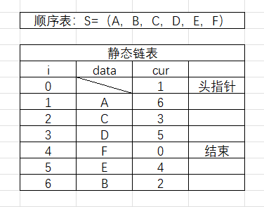

<script type="text/javascript" 
  src="http://cdn.mathjax.org/mathjax/latest/MathJax.js?config=TeX-AMS-MML_HTMLorMML">
</script>
<script type="text/x-mathjax-config">
  MathJax.Hub.Config({ tex2jax: {inlineMath: [['$', '$']]}, messageStyle: "none" });
</script>


# 线性结构

> 非空有限集，有且仅有一个首结点，一个尾结点，其余节点有且仅有一个直接前趋和一个直接后继

<br/>

# 线性表

$a_1$（线性起点），$a_2$，$\cdots$，$a_{i-1}$（$a_i$的直接前趋），$a_i$，$a_{i+1}$（$a_i$的直接后继），$\cdots$，$a_{n-1}$，$a_n$（线性终点）

> 元素数据的有限序列，下表表示元素序号（在表中的位置），从1开始；n为元素个数（表的长度），n=0时为空表（表中无元素，但是分配空间）。**空表≠表不存在**  

> 表中的数据元素**类型相同**，元素间为**线性关系**  

<br/>

## 顺序存储的线性表 顺序表

### 顺序存储

定义：
> 将逻辑上相邻的数据元素存储在**物理上相邻的存储单元**中的数据结构  

存储方法：
> 用**一组地址连续的储存单元**依次存储线性表的元素  
若每个元素占用L个字节，则任一元素的地址为：
$\text{LOC}(a_i) = \text{LOC}(a_{i-1}) + L = \text{LOC}(a_1) + (i-1)L$

<br/>

### 顺序表的运算

> 修改：通过下标直接访问元素并修改  
>> 时间复杂度：O(1)，执行时间固定，与元素数量n无关  
> 
> 插入：在第i个元素前插入一个元素  
>> 实现步骤：  
>>> 1.判断表是否已满，判断位置i是否合法  
>>> 2.将第[n,i]个元素依次后移，**从后往前，防止覆盖**  
>>> 3.在第i个元素处写入新的元素  
>>> 4.**表长加一**  
>> 
>> 效率：
>>> 在$a_1$前插入移动n次，在$a_1$后插入移动n-1次，$\cdots$，在$a_{n-1}$后插入移动1次，在$a_n$后插入移动0次  
>>> 总移动次数：$\sum_{i=1}^{n+1} (n-i+1)$  
>>> 平均时间复杂度：$
E_{\text{insert}} = \sum_{i=1}^{n+1} p_i (n-i+1) = \frac{n}{2}$
，即O(n)，呈线性关系
> 
> 删除：删除第i个位置上的元素
>> 实现步骤：
>>> 1.判断位置i是否合法  
>>> 2.将第[i+1,n]个元素依次前移  
>>> 3.**表长减一**  
>> 
>> 效率：
>>> 平均时间复杂度：$E_{\text{delete}} = \sum_{i=1}^{n} p_i (n-i) = \frac{1}{n} \cdot \frac{(n-1)n}{2} = \frac{n-1}{2}$，即O(n)，呈线性关系
> 
> 插入和删除不占用辅助空间，平均空间复杂度为O(1)

<br/>

```c
#include <stdio.h>
#include <stdlib.h>

#define MAX_SIZE 100  // 顺序表的最大容量

typedef int DataType;  // 定义顺序表中元素的数据类型

typedef struct {
    DataType data[MAX_SIZE];  // 存储顺序表元素的数组
    int length;               // 顺序表的当前长度
} SeqList;

// 初始化顺序表
void initSeqList(SeqList *list) {
    list->length = 0;
}

// 向顺序表中插入元素
int insertSeqList(SeqList *list, int pos, DataType value) {
    if (pos < 0 || pos > list->length || list->length == MAX_SIZE) {
        return 0;  // 插入位置非法或顺序表已满
    }
    for (int i = list->length; i > pos; i--) {
        list->data[i] = list->data[i - 1];
    }
    list->data[pos] = value;
    list->length++;
    return 1;  // 插入成功
}

// 从顺序表中删除元素
int deleteSeqList(SeqList *list, int pos) {
    if (pos < 0 || pos >= list->length) {
        return 0;  // 删除位置非法
    }
    for (int i = pos; i < list->length - 1; i++) {
        list->data[i] = list->data[i + 1];
    }
    list->length--;
    return 1;  // 删除成功
}

// 打印顺序表
void printSeqList(SeqList *list) {
    for (int i = 0; i < list->length; i++) {
        printf("%d ", list->data[i]);
    }
    printf("\n");
}

int main() {
    SeqList list;
    initSeqList(&list);

    insertSeqList(&list, 0, 10);
    insertSeqList(&list, 1, 20);
    insertSeqList(&list, 2, 30);

    printf("顺序表元素: ");
    printSeqList(&list);

    deleteSeqList(&list, 1);
    printf("删除元素后顺序表: ");
    printSeqList(&list);

    return 0;
}

```

<br/>

### 求线性表La和Lb的并集

```c
// 遍历b中的元素是否存在于a中，如果不存在就添加到a中
int* ListUnion(int* La, int* Lb){
  int len_b = ListLength(Lb);
  for(int i= 0; i <= len_b; i++){
    int temp = GetElem(Lb, i);  // 获取Lb中第i个元素的值
    int location = LocateElem(La, temp);  // 获取La中值为temp的元素位置，若没有则返回-1
    if (location == -1) ElemInsert(La, temp); // 在La中插入temp
  }
}
```

时间复杂度：O(len_a*len_b)  

<br/>

### 使用前趋prior(num)，后继next(num)，递归实现a+b

```c
// 假设0<a<b，实际上要考虑a和b的大小关系和正负情况
void add(int a, int b){
  if (a == 0) return b;
  return (add(prior(a), next(b)));
}
```

<br/>

### 动态数组

若元素数量超过数组定义长度，则采用**动态分配**的数组：先为顺序表分配一定大小的**初始空间**，空间不足时再增加**固定增量**（一般为初始空间的10%）  

存储结构描述：
```c
typedef ElemType int;
typedef struct{
    ElemType *elem;
    int length;    // 表元素个数（表长）
    int listsize;    // 当前分配的表尺寸（字节单位），表示表中可以容纳多少个ElemType类型的元素
}SqList L;    // 定义SqList类型，声明名为L的SqList类型变量，
```

<br/>

### 动态创建空顺序表

```c
#define LIST_INIT_SIZE 100

typedef int ElemType;

// 定义一个枚举类型，表示一组相关的命名整型常量。每个枚举常量默认从0开始，依次递增
typedef enum {
    success,
    error
} Status;

typedef struct{
    ElemType *elem;
    int length;
    int listsize;
} SqList;

Status InitSqList(SqList *L) {    // 初始化空线性表
    L->elem = (ElemType *)malloc(LIST_INIT_SIZE * sizeof(ElemType));    // 初始分配存储空间
    if (L->elem == NULL) {
        return error;   // 分配失败
    }
    L->length = 0;    // 初始化长度
    L->listsize = LIST_INIT_SIZE;    // 初始化存储容量
    return success;
}

int main() {
    SqList L;    // 创建SqList类型变量L
    InitList(&L);    // 将L的地址传给函数，初始化空线性表
}

```

<br/>

### 对动态顺序表的插入元素算法

```c
#define LIST_INCREMENT 10

// 在顺序表L的第i个位置插入新的元素e
Status InsertSqList(SqList* L, int i, ElemType e){
    // 检查插入位置是否合法，从1到length+1
    if (i < 1 || i > L->length + 1) {  
        return error;
    }
    
    // 若表长大于表尺寸则增加空间
    if (L->length >= L->listsize) {
        //新地址=realloc(原地址,增加的空间大小)
        ElemType *newbase = (ElemType *)realloc(L->elem, (L->listsize + LIST_INCREMENT) * sizeof(ElemType));
        if (newbase == NULL) {
            return error;  // 分配失败
        }
        L->elem = newbase;
        L->listsize += LIST_INCREMENT;
    }

    // 插入元素，先后移元素再覆盖
    for (int j = L->length - 1; j >= i - 1; j--) {
        L->elem[j + 1] = L->elem[j];
    }
    
    L->elem[i - 1] = e;  // 在位置i插入新元素
    (L->length)++;  // 表长度增加1
    return success;
}

```

<br/>

### 对动态顺序表的删除元素算法

```c
// 保存顺序表L中的第i个元素到e中，并删除表中第i个元素
Status DeleteElemSqList(SqList* L, int i, Elemtype* e){
    // 检测位置i的合法性
    if (i < 1 || i > L->length) return error;

    // p是被删除的元素的位置，q是表尾位置
    ElemType* p = L->elem[i-1];
    ElemType* q = L->elem+L->length-1;

    // e是被删除的元素
    *e = *p;

    for (; p < q; p++>){
        *p=*(p+1);
    }
    L->length--;
    return success;
}

```

<br/>

## 链式存储的线性表 链表

链式存储结构的特点：
> 结点在存储器中的位置是任意的，逻辑上相邻的数据在物理上不一定相邻
> 牺牲空间效率换取时间效率

储存节点包含**数据域和指针域**
> 数据-指针  或者  指针-数据-指针

> **头指针**：指向链表中第一个结点（头节点或首元结点）的指针
> **头节点**：在首元结点前**可选**的一个结点，存放表长等信息，不计入表长
> **首元结点**：链式存储的线性表中第一个数据元素a1的结点

### 使用链式存储的线性表存储英文字母表

```c
#include <stdio.h>
#include <stdlib.h>

typedef char ElemType;
typedef struct node{
    ElemType data;
    struct node* next;
}node;

node* CreateLinkList(int nodesize){
    node* head=(node *)malloc(nodesize);
    node* p=head;
    int i;
    //存入字母，最后一个结点要特殊处理
    for(i = 0; i<25; i++){
        p->data = 'a'+i;
        p->next = (node *)malloc(nodesize);
        if (p->next == NULL) {
            printf("out of memory!");
            exit(1);
        }
        p = p->next;
    }
    p->data = 'a'+i;
    p->next = NULL;
    return head;
}

void PrintLinkList(node* p){
    node* temp = p;
    while(temp != NULL){
        printf("%c ",temp->data);
        temp = temp->next;
    }
}

void FreeLinkList(node* p){
    node* temp;
    while (p != NULL) {
        temp = p;
        p = p->next;
        free(temp);
    }
}

int main(){
    // 每个结点的大小
    int nodesize = sizeof(node);

    // 创建链表
    node* p = CreateLinkList(nodesize);

    // 输出链表
    PrintLinkList(p);

    // 释放内存
    FreeLinkList(p);

    return 0;
}

```

<br/>

### 在链表中取第i个元素

```c
typedef enum{
    success,
    error
}status;

// 获取链表head中第i个元素并保存到e中，返回值为执行成功与否
status GetElemLinkList(node* head, int i, ElemType* e){
    if (i < 1) return error;
    // index表示当前是第几个节点
    int index = 1;
    node* p = head;

    // 从第一个节点遍历，直到到达第i个节点或链表尾部
    while (index < i && p != NULL){
        p = p->next;
        index++;
    }

    // 链表长度小于目标位置或i是非法索引
    if (p == NULL || index != i){
        return error;
    }

    // 储存目标元素
    *e = p->data;
    return success;

}
```

<br/>

### 在链表中删除第i个元素

```c
// 删除头指针为head的链表中第i个元素，保存其值到e
// 因为可能要修改head，所以使用node** head即指向指针head的指针，
status DelElemLinkList(node** head, int i, ElemType* e){
    // 首先判断链表是否为空，i是否有效
    if (*head == NULL || i < 1) return error;

    node* p = *head;

    // 删除第一个元素单独处理
    if (i == 1){
        // 保存第一个节点的数据，把head指向下一个节点，释放内存
        *e = p->data;
        *head = p->next;
        free(p);
        return success;
    }

    // 找到第i-1个节点
    for(int j = 1; j < i - 1; j++){
        if (p->next == NULL) return error;
        // i大于链表长度
        p = p->next;
    }

    // 若第i个节点不存在则报错
    if (p->next == NULL) return error;

    // 对第i个节点操作，保存第i个节点的数据，将第i-1个节点的next指向第i+1个节点
    // p是第i-1个节点，q是第i个节点
    node* q = p->next;
    *e = q->data;
    p->next = q->next;
    free(q);
    return success;
}

int main(){
    // 每个结点的大小
    int nodesize = sizeof(node);

    // 创建链表
    node* head = CreateLinkList(nodesize);
    node* p = head;

    //存入元素
    for (i = 0; i < 25; i++) {
        p->data = 'a' + i;
        p->next = (node *)malloc(nodesize);
        if (p->next == NULL) {
            printf("out of memory!");
            exit(1);
        }
        p = p->next;
    }

    // 删除元素
    int DelIndex = 3;
    ElemType e;
    status result = DelElemLinkList(&head, DelIndex, &e);
    if (result == OK) {
        printf("已删除第%d个节点的元素%c\n", DelIndex, e);
        PrintLinkList(head);
    } else {
        printf("error\n");
    }
}
```

<br/>

## 线性表的应用 静态链表

定义一个结构型数组，每个元素包含**数据域**和**指示域**  
指示域存放一个整型数，相当于链表中的指针，称为游标

<br/>

### 静态单链表类型定义

```c
#define MAXSIZE 1000    // 预分配最大元素个数，整个空间连续，但是逻辑上相邻的元素可能物理上不连续
typedef struct{
    ElemType data;    // 数据域
    int cur;    // 指示域
}component, SLinkList[MAXSIZE];
// 一维结构型数组

```

<br/>

### 用静态链表表示线性表



<br/>

### 静态链表的插入删除操作

假设静态链表此时已有6个元素ABCDEF，要在C后面插入G：

> 1. 在i=7处写入元素G
> 2. 将C原本的后继D的游标i=4写入G的指示域
> 3. 将G的游标i=7写入C的指示域


删除元素C：
> 1. 

```c
#define MAXSIZE 10
#define ElemType char

typedef struct{
    ElemType data;
    int cur;
}component, SLinkList[MAXSIZE];

void InitSLinkList(SLinkList list){
    for (int i = 0; i < MAXSIZE - 1; i++) {
        list[i].cur = i + 1;  // 每个节点的指示域指向下一个节点
    }
    list[MAXSIZE - 1].cur = 0;  // 最后一个节点的指示域为0，表示链表结束
}

void PrintSLinkList(SLinkList list, int i){
    // 从第i个元素开始打印
    while(i != 0){
        printf("第%d个元素是%c\n", i, list[i].data);
        i=list[i].cur;
    }
    printf("\n");
}

int GetFreeNode(SLinkList list){
    int freenode = list[0].cur; // 获取空闲节点
    if (freenode != 0){
        list[0].cur = list[freenode].cur; // 更新空闲节点
    }
    return freenode;
}

void InsertSLinkList(SLinkList list, int i, ElemType e){
    if(i < 1 || i >= MAXSIZE) return; // i非法
    // 在list中的第i个元素处插入新的元素（第i-1个元素后方）
    int j = 1, k = 1;
    //j控制循环，k检查i是否合法，链表第一个元素是list[1]
    for(j = 1; j < i; j++){
        k=list[k].cur;
        if (k == 0){
            printf("位置i大于链表长度");
            return;
        }
    }
    
    // 获取空闲节点
    int freenode = GetFreeNode(list);
    if (freenode == 0) {
        printf("Out Of Free Node\n");
        return; // 无空闲节点，插入失败
    }

    // 写入数据，更新指示域
    list[freenode].data = e;
    list[freenode].cur = list[k].cur;
    list[k].cur = freenode;
}

void DeleteElemSLinkList(SLinkList list, int i, ElemType* e){
    if(i < 1 || i >= MAXSIZE) return; // i非法
    // 删除list中的第i个元素，保存到e中
     int j = 1, target = list[1].cur, prev = 1;
    // j控制循环，target检查i是否合法，链表第一个元素是list[1]
    for(j = 1; j < i; j++){
        prev = target;
        target = list[target].cur;
        if (target == 0){
            printf("位置i大于链表长度");
            return;
        }
    }

    // 保存数据，更新指示域
    *e = list[target].data;
    list[prev].cur = list[target].cur;

    // 将被删除的节点加入到空闲节点链表的头部
    list[target].cur = list[0].cur;
    // 将list[0].cur赋值为被删除的节点的游标
    list[0].cur = target;
}

int main(){
    SLinkList list;    // 定义静态链表
    InitSLinkList(list);    // 初始化静态链表

    // 写入数据
    int i;
    int cur = list[0].cur;
    for (i = 1; i <= 6; i++) {
        list[cur].data = 'A' + (i - 1);  // 写入A B C D E F
        cur = list[cur].cur;
        }
    list[cur].cur = 0; // 链表结束
    
    PrintSLinkList(list, 1);    // 打印初始链表

    // 在第三个元素处插入G
    char insertdata = 'G';
    int insertcur = 3;
    InsertSLinkList(list, insertcur, insertdata);
    PrintSLinkList(list, 1);

    ElemType deleteddata;
    int deletecur = 4;
    DeleteElemSLinkList(list, deletecur, &deleteddata);
    PrintSLinkList(list, 1);
}
```

<br/>

## 双向链表 循环列表 双向循环列表