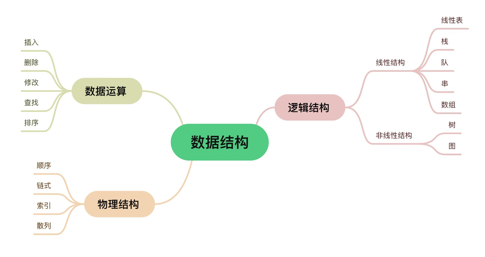

<script type="text/javascript" 
  src="http://cdn.mathjax.org/mathjax/latest/MathJax.js?config=TeX-AMS-MML_HTMLorMML">
</script>
<script type="text/x-mathjax-config">
  MathJax.Hub.Config({ tex2jax: {inlineMath: [['$', '$']]}, messageStyle: "none" });
</script>




# 线性结构
> 非空有限集，有且仅有一个首结点，一个尾结点，其余节点有且仅有一个直接前趋和一个直接后继

<br/>

# 线性表

$a_1$（线性起点），$a_2$，$\cdots$，$a_{i-1}$（$a_i$的直接前趋），$a_i$，$a_{i+1}$（$a_i$的直接后继），$\cdots$，$a_{n-1}$，$a_n$（线性终点）

> 元素数据的有限序列，下表表示元素序号（在表中的位置），从1开始；n为元素个数（表的长度），n=0时为空表（表中无元素，但是分配空间）。**空表≠表不存在**  

> 表中的数据元素**类型相同**，元素间为**线性关系**  

<br/>

## 顺序存储
定义：
> 将逻辑上相邻的数据元素存储在**物理上相邻的存储单元**中的数据结构  

存储方法：
> 用**一组地址连续的储存单元**依次存储线性表的元素  
若每个元素占用L个字节，则任一元素的地址为：
$\text{LOC}(a_i) = \text{LOC}(a_{i-1}) + L = \text{LOC}(a_1) + (i-1)L$

<br/>

## 线性表的运算
> 修改：通过下标直接访问元素并修改  
>> 时间复杂度：O(1)，执行时间固定，与元素数量n无关  
> 
> 插入：在第i个元素前插入一个元素  
>> 实现步骤：  
>>> 1.判断表是否已满，判断位置i是否合法  
>>> 2.将第[n,i]个元素依次后移，**从后往前，防止覆盖**  
>>> 3.在第i个元素处写入新的元素  
>>> 4.**表长加一**  
>> 
>> 效率：
>>> 在$a_1$前插入移动n次，在$a_1$后插入移动n-1次，$\cdots$，在$a_{n-1}$后插入移动1次，在$a_n$后插入移动0次  
>>> 总移动次数：$\sum_{i=1}^{n+1} (n-i+1)$  
>>> 平均时间复杂度：$
E_{\text{insert}} = \sum_{i=1}^{n+1} p_i (n-i+1) = \frac{n}{2}$
，即O(n)，呈线性关系
> 
> 删除：删除第i个位置上的元素
>> 实现步骤：
>>> 1.判断位置i是否合法  
>>> 2.将第[i+1,n]个元素依次前移  
>>> 3.**表长减一**  
>> 
>> 效率：
>>> 平均时间复杂度：$E_{\text{delete}} = \sum_{i=1}^{n} p_i (n-i) = \frac{1}{n} \cdot \frac{(n-1)n}{2} = \frac{n-1}{2}$，即O(n)，呈线性关系
> 
> 插入和删除不占用辅助空间，平均空间复杂度为O(1)

<br/>

## 创建顺序存储的线性表
```c
#include <stdio.h>
#include <stdlib.h>

#define MAX_SIZE 100  // 顺序表的最大容量

typedef int DataType;  // 定义顺序表中元素的数据类型

typedef struct {
    DataType data[MAX_SIZE];  // 存储顺序表元素的数组
    int length;               // 顺序表的当前长度
} SeqList;

// 初始化顺序表
void initSeqList(SeqList *list) {
    list->length = 0;
}

// 向顺序表中插入元素
int insertSeqList(SeqList *list, int pos, DataType value) {
    if (pos < 0 || pos > list->length || list->length == MAX_SIZE) {
        return 0;  // 插入位置非法或顺序表已满
    }
    for (int i = list->length; i > pos; i--) {
        list->data[i] = list->data[i - 1];
    }
    list->data[pos] = value;
    list->length++;
    return 1;  // 插入成功
}

// 从顺序表中删除元素
int deleteSeqList(SeqList *list, int pos) {
    if (pos < 0 || pos >= list->length) {
        return 0;  // 删除位置非法
    }
    for (int i = pos; i < list->length - 1; i++) {
        list->data[i] = list->data[i + 1];
    }
    list->length--;
    return 1;  // 删除成功
}

// 打印顺序表
void printSeqList(SeqList *list) {
    for (int i = 0; i < list->length; i++) {
        printf("%d ", list->data[i]);
    }
    printf("\n");
}

int main() {
    SeqList list;
    initSeqList(&list);

    insertSeqList(&list, 0, 10);
    insertSeqList(&list, 1, 20);
    insertSeqList(&list, 2, 30);

    printf("顺序表元素: ");
    printSeqList(&list);

    deleteSeqList(&list, 1);
    printf("删除元素后顺序表: ");
    printSeqList(&list);

    return 0;
}

```

<br/>

## 求线性表La和Lb的并集
```c
//遍历b中的元素是否存在于a中，如果不存在就添加到a中
int* ListUnion(int* La, int* Lb){
  int len_b = ListLength(Lb);
  for(int i= 0; i <= len_b; i++){
    int temp = GetElem(Lb, i);  //获取Lb中第i个元素的值
    int location = LocateElem(La, temp);  //获取La中值为temp的元素位置，若没有则返回-1
    if (location == -1) ElemInsert(La, temp); //在La中插入temp
  }
}
```
时间复杂度：O(len_a*len_b)  

<br/>

## 使用前趋prior(num)，后继next(num)，递归实现a+b
```c
//假设0<a<b，实际上要考虑a和b的大小关系和正负情况
void add(int a, int b){
  if (a == 0) return b;
  return (add(prior(a), next(b)));
}
```

<br/>

## 动态数组
若元素数量超过数组定义长度，则采用**动态分配**的数组：先为顺序表分配一定大小的**初始空间**，空间不足时再增加**固定增量**（一般为初始空间的10%）  

存储结构描述：
```c
typedef ElemType int;
typedef struct{
    ElemType *elem;
    int length;    //表元素个数（表长）
    int listsize;    //当前分配的表尺寸（字节单位），表示表中可以容纳多少个ElemType类型的元素
}SqList L;    //定义SqList类型，声明名为L的SqList类型变量，
```


1