<script type="text/javascript" 
  src="http://cdn.mathjax.org/mathjax/latest/MathJax.js?config=TeX-AMS-MML_HTMLorMML">
</script>
<script type="text/x-mathjax-config">
  MathJax.Hub.Config({ tex2jax: {inlineMath: [['$', '$']]}, messageStyle: "none" });
</script>


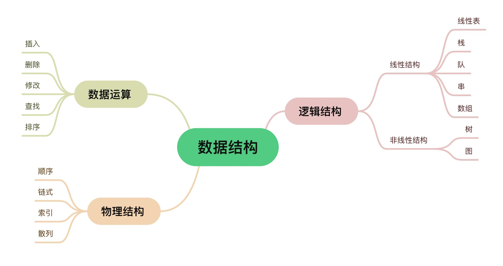

# 线性结构

> 非空有限集，有且仅有一个首结点，一个尾结点，其余节点有且仅有一个直接前趋和一个直接后继

<br/>

# 线性表 Linear list

$a_1$（线性起点），$a_2$，$\cdots$，$a_{i-1}$（$a_i$的直接前趋），$a_i$，$a_{i+1}$（$a_i$的直接后继），$\cdots$，$a_{n-1}$，$a_n$（线性终点）

> 元素数据的有限序列，下表表示元素序号（在表中的位置），从1开始；n为元素个数（表的长度），n=0时为空表（表中无元素，但是分配空间）。**空表≠表不存在**  

> 表中的数据元素 **类型相同** ，元素间为 **线性关系**  

<br/>

## 顺序存储的线性表 顺序表 SqList

### 顺序存储

定义：
> 将逻辑上相邻的数据元素存储在 **物理上相邻的存储单元** 中的数据结构  

存储方法：
> 用 **一组地址连续的储存单元** 依次存储线性表的元素  
若每个元素占用L个字节，则任一元素的地址为：
$\text{LOC}(a_i) = \text{LOC}(a_{i-1}) + L = \text{LOC}(a_1) + (i-1)L$

<br/>

### 顺序表的运算

> 修改：通过下标直接访问元素并修改  
>> 时间复杂度：O(1)，执行时间固定，与元素数量n无关  
> 
> 插入：在第i个元素前插入一个元素  
>> 实现步骤：  
>>> 1.判断表是否已满，判断位置i是否合法  
>>> 2.将第[n,i]个元素依次后移，**从后往前，防止覆盖**  
>>> 3.在第i个元素处写入新的元素  
>>> 4.**表长加一**  
>> 
>> 效率：
>>> 在$a_1$前插入移动n次，在$a_1$后插入移动n-1次，$\cdots$，在$a_{n-1}$后插入移动1次，在$a_n$后插入移动0次  
>>> 总移动次数：$\sum_{i=1}^{n+1} (n-i+1)$  
>>> 平均时间复杂度：$
E_{\text{insert}} = \sum_{i=1}^{n+1} p_i (n-i+1) = \frac{n}{2}$
，即O(n)，呈线性关系
> 
> 删除：删除第i个位置上的元素
>> 实现步骤：
>>> 1.判断位置i是否合法，表是否为空表  
>>> 2.将第[i+1,n]个元素依次前移  
>>> 3.**表长减一**  
>> 
>> 效率：
>>> 平均时间复杂度：$E_{\text{delete}} = \sum_{i=1}^{n} p_i (n-i) = \frac{1}{n} \cdot \frac{(n-1)n}{2} = \frac{n-1}{2}$，即O(n)，呈线性关系
> 
> 插入和删除不占用辅助空间，平均空间复杂度为O(1)

<br/>

```c
#include <stdio.h>
#include <stdlib.h>

#define MAX_SIZE 100  // 顺序表的最大容量

typedef int DataType;  // 定义顺序表中元素的数据类型

typedef struct {
    DataType data[MAX_SIZE];  // 存储顺序表元素的数组
    int length;               // 顺序表的当前长度
} SeqList;

// 初始化顺序表
void initSeqList(SeqList *list) {
    list->length = 0;
}

// 向顺序表中插入元素
int insertSeqList(SeqList *list, int pos, DataType value) {
    if (pos < 0 || pos > list->length || list->length == MAX_SIZE) {
        return 0;  // 插入位置非法或顺序表已满
    }
    for (int i = list->length; i > pos; i--) {
        list->data[i] = list->data[i - 1];
    }
    list->data[pos] = value;
    list->length++;
    return 1;  // 插入成功
}

// 从顺序表中删除元素
int deleteSeqList(SeqList *list, int pos) {
    if (pos < 0 || pos >= list->length) {
        return 0;  // 删除位置非法
    }
    for (int i = pos; i < list->length - 1; i++) {
        list->data[i] = list->data[i + 1];
    }
    list->length--;
    return 1;  // 删除成功
}

// 打印顺序表
void printSeqList(SeqList *list) {
    for (int i = 0; i < list->length; i++) {
        printf("%d ", list->data[i]);
    }
    printf("\n");
}

int main() {
    SeqList list;
    initSeqList(&list);

    insertSeqList(&list, 0, 10);
    insertSeqList(&list, 1, 20);
    insertSeqList(&list, 2, 30);

    printf("顺序表元素: ");
    printSeqList(&list);

    deleteSeqList(&list, 1);
    printf("删除元素后顺序表: ");
    printSeqList(&list);

    return 0;
}

```

<br/>

### 求线性表La和Lb的并集

```c
// 遍历b中的元素是否存在于a中，如果不存在就添加到a中
int* ListUnion(int* La, int* Lb){
  int len_b = ListLength(Lb);
  for(int i= 0; i <= len_b; i++){
    int temp = GetElem(Lb, i);  // 获取Lb中第i个元素的值
    int location = LocateElem(La, temp);  // 获取La中值为temp的元素位置，若没有则返回-1
    if (location == -1) ElemInsert(La, temp); // 在La中插入temp
  }
}
```

时间复杂度：O(len_a*len_b)  

<br/>

### 使用前趋prior(num)，后继next(num)，递归实现a+b

```c
// 假设0<a<b，实际上要考虑a和b的大小关系和正负情况
void add(int a, int b){
  if (a == 0) return b;
  return (add(prior(a), next(b)));
}
```

<br/>

### 动态数组

若元素数量超过数组定义长度，则采用 **动态分配** 的数组：先为顺序表分配一定大小的 **初始空间** ，空间不足时再增加 **固定增量**（一般为初始空间的10%）  

存储结构描述：
```c
typedef ElemType int;
typedef struct{
    ElemType *elem;
    int length;    // 表元素个数（表长）
    int listsize;    // 当前分配的表尺寸（字节单位），表示表中可以容纳多少个ElemType类型的元素
}SqList L;    // 定义SqList类型，声明名为L的SqList类型变量，
```

<br/>

### 动态创建空顺序表

```c
#define LIST_INIT_SIZE 100

typedef int ElemType;

// 定义一个枚举类型，表示一组相关的命名整型常量。每个枚举常量默认从0开始，依次递增
typedef enum {
    success,
    error
} Status;

typedef struct{
    ElemType *elem;
    int length;
    int listsize;
} SqList;

Status InitSqList(SqList *L) {    // 初始化空线性表
    L->elem = (ElemType *)malloc(LIST_INIT_SIZE * sizeof(ElemType));    // 初始分配存储空间
    if (L->elem == NULL) {
        return error;   // 分配失败
    }
    L->length = 0;    // 初始化长度
    L->listsize = LIST_INIT_SIZE;    // 初始化存储容量
    return success;
}

int main() {
    SqList L;    // 创建SqList类型变量L
    InitList(&L);    // 将L的地址传给函数，初始化空线性表
}

```

<br/>

### 对动态顺序表的插入元素算法

```c
#define LIST_INCREMENT 10

// 在顺序表L的第i个位置插入新的元素e
Status InsertSqList(SqList* L, int i, ElemType e){
    // 检查插入位置是否合法，从1到length+1
    if (i < 1 || i > L->length + 1) {  
        return error;
    }
    
    // 若表长大于表尺寸则增加空间
    if (L->length >= L->listsize) {
        //新地址=realloc(原地址,增加的空间大小)
        ElemType *newbase = (ElemType *)realloc(L->elem, (L->listsize + LIST_INCREMENT) * sizeof(ElemType));
        if (newbase == NULL) {
            return error;  // 分配失败
        }
        L->elem = newbase;
        L->listsize += LIST_INCREMENT;
    }

    // 插入元素，先后移元素再覆盖
    for (int j = L->length - 1; j >= i - 1; j--) {
        L->elem[j + 1] = L->elem[j];
    }
    
    L->elem[i - 1] = e;  // 在位置i插入新元素
    (L->length)++;  // 表长度增加1
    return success;
}

```

<br/>

### 对动态顺序表的删除元素算法

```c
// 保存顺序表L中的第i个元素到e中，并删除表中第i个元素
Status DeleteElemSqList(SqList* L, int i, Elemtype* e){
    // 检测位置i的合法性
    if (i < 1 || i > L->length) return error;

    // p是被删除的元素的位置，q是表尾位置
    ElemType* p = L->elem[i-1];
    ElemType* q = L->elem+L->length-1;

    // e是被删除的元素
    *e = *p;

    for (; p < q; p++>){
        *p=*(p+1);
    }
    L->length--;
    return success;
}

```

<br/>

## 链式存储的线性表 链表 LinkList

链式存储结构的特点：
> 结点在存储器中的位置是任意的，逻辑上相邻的数据在物理上不一定相邻
> 牺牲空间效率换取时间效率

储存节点包含 **数据域和指针域**
> 数据-指针  或者  指针-数据-指针

> **头指针**：指向链表中第一个结点（头节点或首元结点）的指针  
> **头节点**：在首元结点前 **可选** 的一个结点，存放表长等信息，不计入表长  
> **首元结点**：链式存储的线性表中第一个数据元素a1的结点  

### 使用链式存储的线性表存储英文字母表

```c
#include <stdio.h>
#include <stdlib.h>

typedef char ElemType;
typedef struct node{
    ElemType data;
    struct node* next;
}node;

node* CreateLinkList(int nodesize){
    node* head=(node *)malloc(nodesize);
    node* p=head;
    int i;
    //存入字母，最后一个结点要特殊处理
    for(i = 0; i<25; i++){
        p->data = 'a'+i;
        p->next = (node *)malloc(nodesize);
        if (p->next == NULL) {
            printf("out of memory!");
            exit(1);
        }
        p = p->next;
    }
    p->data = 'a'+i;
    p->next = NULL;
    return head;
}

void PrintLinkList(node* p){
    node* temp = p;
    while(temp != NULL){
        printf("%c ",temp->data);
        temp = temp->next;
    }
}

void FreeLinkList(node* p){
    node* temp;
    while (p != NULL) {
        temp = p;
        p = p->next;
        free(temp);
    }
}

int main(){
    // 每个结点的大小
    int nodesize = sizeof(node);

    // 创建链表
    node* p = CreateLinkList(nodesize);

    // 输出链表
    PrintLinkList(p);

    // 释放内存
    FreeLinkList(p);

    return 0;
}

```

<br/>

### 在链表中取第i个元素

```c
typedef enum{
    success,
    error
}status;

// 获取链表head中第i个元素并保存到e中，返回值为执行成功与否
status GetElemLinkList(node* head, int i, ElemType* e){
    if (i < 1) return error;
    // index表示当前是第几个节点
    int index = 1;
    node* p = head;

    // 从第一个节点遍历，直到到达第i个节点或链表尾部
    while (index < i && p != NULL){
        p = p->next;
        index++;
    }

    // 链表长度小于目标位置或i是非法索引
    if (p == NULL || index != i){
        return error;
    }

    // 储存目标元素
    *e = p->data;
    return success;

}
```

<br/>

### 在链表中删除第i个元素

```c
// 删除头指针为head的链表中第i个元素，保存其值到e
// 因为可能要修改head，所以使用node** head即指向指针head的指针，
status DelElemLinkList(node** head, int i, ElemType* e){
    // 首先判断链表是否为空，i是否有效
    if (*head == NULL || i < 1) return error;

    node* p = *head;

    // 删除第一个元素单独处理
    if (i == 1){
        // 保存第一个节点的数据，把head指向下一个节点，释放内存
        *e = p->data;
        *head = p->next;
        free(p);
        return success;
    }

    // 找到第i-1个节点
    for(int j = 1; j < i - 1; j++){
        if (p->next == NULL) return error;
        // i大于链表长度
        p = p->next;
    }

    // 若第i个节点不存在则报错
    if (p->next == NULL) return error;

    // 对第i个节点操作，保存第i个节点的数据，将第i-1个节点的next指向第i+1个节点
    // p是第i-1个节点，q是第i个节点
    node* q = p->next;
    *e = q->data;
    p->next = q->next;
    free(q);
    return success;
}

int main(){
    // 每个结点的大小
    int nodesize = sizeof(node);

    // 创建链表
    node* head = CreateLinkList(nodesize);
    node* p = head;

    //存入元素
    for (i = 0; i < 25; i++) {
        p->data = 'a' + i;
        p->next = (node *)malloc(nodesize);
        if (p->next == NULL) {
            printf("out of memory!");
            exit(1);
        }
        p = p->next;
    }

    // 删除元素
    int DelIndex = 3;
    ElemType e;
    status result = DelElemLinkList(&head, DelIndex, &e);
    if (result == OK) {
        printf("已删除第%d个节点的元素%c\n", DelIndex, e);
        PrintLinkList(head);
    } else {
        printf("error\n");
    }
}
```

### 链表的综合使用

```c
#define  _CRT_SECURE_NO_WARNINGS	//忽略vs要求使用scanf_s来替换scanf的警告
#pragma warning(disable:4996)
#include <stdio.h>
#include <stdlib.h>

typedef char ElemType;
typedef struct node {
	ElemType data;
	struct node* next;
}node;

node* CreateLinkList(int nodesize) {
	node* head = (node*)malloc(nodesize);
	node* p = head;
	int i;
	//存入字母，最后一个结点要特殊处理
	for (i = 0; i < 25; i++) {
		p->data = 'a' + i;
		p->next = (node*)malloc(nodesize);
		if (p->next == NULL) {
			printf("out of memory!");
			exit(1);
		}
		p = p->next;
	}
	p->data = 'a' + i;
	p->next = NULL;
	return head;
}
void PrintLinkList(node* p) {
	node* temp = p;
	while (temp != NULL) {
		printf("%c ", temp->data);
		temp = temp->next;
	}
}
void FreeLinkList(node* p) {
	node* temp;
	while (p != NULL) {
		temp = p;
		p = p->next;
		free(temp);
	}
}

int GetElemLinkList(node* head, int i, ElemType* e) {
	if (i < 1) return 1;
	// index表示当前是第几个节点
	int index = 1;
	node* p = head;

	// 从第一个节点遍历，直到到达第i个节点或链表尾部
	while (index < i && p != NULL) {
		p = p->next;
		index++;
	}

	// 链表长度小于目标位置或i是非法索引
	if (p == NULL || index != i) {
		return 1;
	}

	// 储存目标元素
	*e = p->data;
	return 0;
}

int DelElemLinkList(node** head, int i, ElemType* e) {
	// 首先判断链表是否为空，i是否有效
	if (*head == NULL || i < 1) return 1;

	node* p = *head;

	// 删除第一个元素单独处理
	if (i == 1) {
		// 保存第一个节点的数据，把head指向下一个节点，释放内存
		*e = p->data;
		*head = p->next;
		free(p);
		return 0;
	}

	// 找到第i-1个节点
	for (int j = 1; j < i - 1; j++) {
		if (p->next == NULL) return 1;
		// i大于链表长度
		p = p->next;
	}

	// 若第i个节点不存在则报错
	if (p->next == NULL) return 1;

	// 对第i个节点操作，保存第i个节点的数据，将第i-1个节点的next指向第i+1个节点
	// p是第i-1个节点，q是第i个节点
	node* q = p->next;
	*e = q->data;
	p->next = q->next;
	free(q);
	return 0;
}

int InsertElemLinkList(node** head, int i, ElemType e) {
	// 首先判断链表是否为空，i是否有效
	if (*head == NULL || i < 1) return 1;

	node* new = (node*)malloc(sizeof(node));
	if (new == NULL) exit(1);

	new->data = e;


	if (i == 1) {
		new->next = *head;
		*head = new;
		return 0;
	}

	node* cur = *head;

	for (int k = 0; k < i - 2; k++) {
		if (cur == NULL) {
			printf("插入失败\n");
			free(new);
			return 1;
		}
		cur = cur->next;
	}
	new->next = cur->next;
	cur->next = new;
}

int main() {
	// 每个结点的大小
	int nodesize = sizeof(node);
	// 创建链表
	node* p = CreateLinkList(nodesize);
	// 输出链表
	PrintLinkList(p);

	printf("\n要查询第几个元素：");
	int pos;
	scanf("%d", &pos);
	ElemType elem;
	GetElemLinkList(p, pos, &elem);
	printf("第%d个元素是%c\n", pos, elem);

	// 清空输入缓冲区
	while (getchar() != '\n');
	printf("要删除第几个元素：");
	scanf("%d", &pos);
	DelElemLinkList(&p, pos, &elem);
	printf("删除后的链表是：\n");
	PrintLinkList(p);

	printf("\n要在哪插入元素：");
	scanf("%d", &pos);
	// 清空输入缓冲区
	while (getchar() != '\n');
	printf("要插入的元素是：");
	scanf("%c", &elem);
	InsertElemLinkList(&p, pos, elem);
	printf("插入后的链表是：\n");
	PrintLinkList(p);


	// 释放内存
	FreeLinkList(p);
	return 0;
}
```

<br/>

## 线性表的应用 静态链表 SLinkList

定义一个结构型数组，每个元素包含 **数据域** 和 **指示域**  
指示域存放一个整型数，相当于链表中的指针，称为游标

<br/>

### 静态单链表类型定义

```c
#define MAXSIZE 1000    // 预分配最大元素个数，整个空间连续，但是逻辑上相邻的元素可能物理上不连续
typedef struct{
    ElemType data;    // 数据域
    int cur;    // 指示域
}component, SLinkList[MAXSIZE];
// 一维结构型数组

```

<br/>

### 用静态链表表示线性表

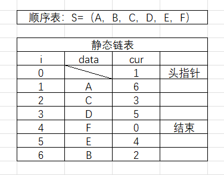

<br/>

### 静态链表的插入删除操作

假设静态链表此时已有6个元素ABCDEF，要在C后面插入G：

> 1.在i=7处写入元素G
> 2.将C原本的后继D的游标i=4写入G的指示域
> 3.将G的游标i=7写入C的指示域


删除元素C：
> 1.将C的前驱B的指示域更新为C的后继D的游标i=4。
> 2.将C的游标i=3指向的元素加入到空闲节点链表的头部。
> 3.将list[0].cur赋值为C的游标i=3。

```c
#define MAXSIZE 10
#define ElemType char

typedef struct{
    ElemType data;
    int cur;
}component, SLinkList[MAXSIZE];

void InitSLinkList(SLinkList list){
    for (int i = 0; i < MAXSIZE - 1; i++) {
        list[i].cur = i + 1;  // 每个节点的指示域指向下一个节点
    }
    list[MAXSIZE - 1].cur = 0;  // 最后一个节点的指示域为0，表示链表结束
}

void PrintSLinkList(SLinkList list, int i){
    // 从第i个元素开始打印
    while(i != 0){
        printf("第%d个元素是%c\n", i, list[i].data);
        i=list[i].cur;
    }
    printf("\n");
}

int GetFreeNode(SLinkList list){
    int freenode = list[0].cur; // 获取空闲节点
    if (freenode != 0){
        list[0].cur = list[freenode].cur; // 更新空闲节点
    }
    return freenode;
}

void InsertSLinkList(SLinkList list, int i, ElemType e){
    if(i < 1 || i >= MAXSIZE) return; // i非法
    // 在list中的第i个元素处插入新的元素（第i-1个元素后方）
    int j = 1, k = 1;
    //j控制循环，k检查i是否合法，链表第一个元素是list[1]
    for(j = 1; j < i; j++){
        k=list[k].cur;
        if (k == 0){
            printf("位置i大于链表长度");
            return;
        }
    }
    
    // 获取空闲节点
    int freenode = GetFreeNode(list);
    if (freenode == 0) {
        printf("Out Of Free Node\n");
        return; // 无空闲节点，插入失败
    }

    // 写入数据，更新指示域
    list[freenode].data = e;
    list[freenode].cur = list[k].cur;
    list[k].cur = freenode;
}

void DeleteElemSLinkList(SLinkList list, int i, ElemType* e){
    if(i < 1 || i >= MAXSIZE) return; // i非法
    // 删除list中的第i个元素，保存到e中
     int j = 1, target = list[1].cur, prev = 1;
    // j控制循环，target检查i是否合法，链表第一个元素是list[1]
    for(j = 1; j < i; j++){
        prev = target;
        target = list[target].cur;
        if (target == 0){
            printf("位置i大于链表长度");
            return;
        }
    }

    // 保存数据，更新指示域
    *e = list[target].data;
    list[prev].cur = list[target].cur;

    // 将被删除的节点加入到空闲节点链表的头部
    list[target].cur = list[0].cur;
    // 将list[0].cur赋值为被删除的节点的游标
    list[0].cur = target;
}

int main(){
    SLinkList list;    // 定义静态链表
    InitSLinkList(list);    // 初始化静态链表

    // 写入数据
    int i;
    int cur = list[0].cur;
    for (i = 1; i <= 6; i++) {
        list[cur].data = 'A' + (i - 1);  // 写入A B C D E F
        cur = list[cur].cur;
        }
    list[cur].cur = 0; // 链表结束
    
    PrintSLinkList(list, 1);    // 打印初始链表

    // 在第三个元素处插入G
    char insertdata = 'G';
    int insertcur = 3;
    InsertSLinkList(list, insertcur, insertdata);
    PrintSLinkList(list, 1);

    ElemType deleteddata;
    int deletecur = 4;
    DeleteElemSLinkList(list, deletecur, &deleteddata);
    PrintSLinkList(list, 1);
}
```

<br/>

## 双向链表 循环列表 双向循环列表
DoubleLinkList CirLinkList DouCirLinkList  

双向链表：
> 前趋指针-数据-后继指针
```c
typedef struct DoubleLinkNode{
    ElemType data;
    struct DoubleLinkNode* prior;
    struct DoubleLinkNode* next;
}DoubleLinkNode, *DoubleLinkList;
```

循环列表：
> 第n个节点：
> 数据-指向第一个节点的指针

<br/>

# 栈 Stack
## 翻译
```
栈 stack  栈顶 top  栈底 bottom  
入栈 push  出栈 pop
```

<br/>

## 栈的抽象数据类型描述
栈是有操作限制的有0个或多个元素的 **有穷线性表** ，仅能在 **栈顶 top** 对数据进行插入和删除  

<br/>

## 卡特兰Catalan数
若有n个元素按固定的顺序入栈，则所有可能的出栈顺序的数量为：
$C_n = \frac{(2n)!}{(n + 1)! n!}$

<br/>

## 栈的顺序存储实现
栈的顺序存储结构由一维数组和记录栈顶元素位置的变量组成的结构体组成  
```c
#define MAXSIZE 100 // 储存数据元素的最大个数
typedef int ELEMTYPE
typedef struct SNode{
    ELEMTYPE data[MAXSIZE];
    int top; // 栈顶元素位置
}*stack;

stack SInit() { // 初始化栈
    stack s = (stack)malloc(sizeof(struct SNode));
    if (s == NULL) {
        printf("Memory allocation failed\n");
        exit(1);
    }
    s->top = -1; // 栈顶指针初始化为-1，表示栈为空
    return s;
}

int SFull(stack s) {
    return (s->top == MAXSIZE - 1);
    //若满则返回1，不满则返回0
}

int SEmpty(stack s) {
    return s->top == -1;
    //若空则返回1，不空则返回0
}

int STop(stack s, ELEMTYPE *item) { //获取栈顶元素
    if (SEmpty(s)) {
        printf("栈空\n");
        return 0;
    }
    *item = s->Data[s->top];
    return 1;
}

int SPush(stack s, ELEMTYPE item){
    if (SFull(s)){
        printf("栈已满\n");
        return 0;
    }
    s->data[++(s->top)] = item; // 先自增后使用
    return 1;
}

int SPop(stack s, ELEMTYPE* item){
    if (SEmpty(s)){
        printf("栈空\n");
        return 0;
    }
    *item = s-data[(s->top)--]; //先使用后自减
    return 1;
}

int main(){
    stack s = SInit();

}
```

<br/>

## 共享栈 使用一个数组实现两个栈
从数组的两头分别向中间入栈
```c
#define MAXSIZE 100 // 储存数据元素的最大个数
typedef srtuct SNode{
    ELEMTYPE data[MAXSIZE];
    int top1;
    int top2;
}*s;
s.top1 = -1;
s.top2 = MAXSIZE;

当top2-top1=1时两个栈同时满
```

<br/>

## 栈的链式存储实现 链栈 LinkStack

栈的链式储存结构链栈是一个单链表，在栈顶进行插入和删除操作
链栈的内存动态分配，不需要指定栈的最大深度

```c
typedef struct Node{
    ELEMTYPE data; // 数据域
    struct Node *next; // 指针域
}Node;

typedef struct Stack{
    Node* top; // 栈顶节点
    int count; // 元素个数
}Stack;

Stack* SInit(){
    Stack* s = (Stack*)malloc(sizeof(Stack));
    // 此时栈为空
    s->top = NULL;
    s->count = 0;
    return s;
}

int SEmpty(Stack* s){
    // 异常处理
    if((s->count == 0 && s->top != NULL) || (s->count != 0 && s->top == NULL)){
        printf("ERROR  无法确定是否为空\n");
        exit(1);
    }
    
    return (s->count == 0);
    //若空则返回1，不空则返回0
}

void SPush(Stack* s, ELEMTYPE item){
    // 压栈操作
    // 创建新节点
    Node* newNode = (Node*)malloc(sizeof(Node));
    if (newNode == NULL){
        printf("分配内存失败\n");
        exit(1);
    }

    // 写入数据
    newNode->data = item;

    // 将原本的top赋给new的next
    newNode->next = s->top;

    //更新top和count
    s->top = newNode;
    s->count++;
}

int SPop(Stack* s, ELEMTYPE* item){
    // 弹栈操作
    if(SEmpty(s)){
        printf("栈空\n");
        return 1;
    }

    // 保存栈顶节点指针用于释放内存
    Node* temp = s->top;

    // 更新栈顶指针
    s->top = s->top->next;

    // 保存被删除数据到item
    *item = temp->data;

    //释放内存
    free(temp);

    //更新栈大小
    s->count--;

    return 0;
}

int main(){
    Stack* stack = SInit();

    SPush(stack, 10);
    SPush(stack, 20);
    SPush(stack, 30);

    ELEMTYPE item;
    if (SPop(stack, &item) == 0) {
        printf("弹栈元素: %d\n", item);
    }

    if (SPop(stack, &item) == 0) {
        printf("弹栈元素: %d\n", item);
    }
}
```

<br/>

## 退格/清空行处理

输入一行字符串，若遇到#则删除#及其前方的一个字符，若遇到@则删除@及当前行@前的所有字符，最后输出处理后的字符串  

核心思路：
```c
//获取输入
char input[100];
gets(input);

//遍历每个字符，进行处理
for(int i = 0; (input[i] != '\0' && input[i] != EOF); i++){
    switch(input[i]){
        case '#':{
            char deleted;
            SPop(s, &deleted);
            break;
        }
        case '@':{
            SClear(s);
            break;
        }
        default: SPush(s,input[i]);
    }
}

SPrint(s);
```

<br/>

## 括号匹配检验

假设表达式中有圆括号()和方括号[]，其有任意嵌套，要求对给定的括号表达式，判断其是否合法  

思路：
> 左括号：push
> 右括号：若括号类型与栈顶元素相同则pop，否则不合法
> 最终空栈

```c
#define MAXSIZE 100

int match(char prev, char temp){
    return ((prev == '(' && temp == ')') || (prev == '[' && temp == ']'));
}

int valid(char input[]){
    stack* s = SInit(); // 初始化顺序存储的栈

    for (int i = 0; input[i] != '\0'; i++){
        char temp = input[i];

        // 判断左右括号
        if (temp == '(' || temp == '['){
            SPush(s, temp); // 入栈
        }
        else {
             // 若不匹配或栈为空则表达式不合法，返回0
            if (!match(SPeek(s), temp) || SEmpty(s)){
                free(s);
                return 0;
            }
            SPop(s); // 出栈
        }
    }

    // 若空栈则返回1
    free(s);
    return (SEmpty(s));
}

main(){
    char input[] = "([[()]])" // 要判断的符号表达式

    if (valid(input)){
        printf("该表达式合法\n");
    }
    else {
        printf("该表达式不合法\n")；
    }
}

```

<br/>

## 汉诺塔问题 递归 

将所有盘子从源柱子移动到目标柱子，且每次只能移动一个盘子，并且不能将较大的盘子放在较小的盘子上面  

有一个盘子：
> 直接移动到目标柱子  

有多个盘子：
> 将前n-1个盘子移动到辅助柱子
> 将第n个盘子移动到目标柱子
> 将前n-1个盘子移动到目标柱子

```c
void move(int n, char from, char to, int* time){
    (*time)++;
    printf("将第%d个盘子从%c移动到%c\n", n, from, to);
}

void hanoi(int n, char from, char to, char aux, int* time){
    if (n == 1){
        move(n, from, to, time);
        return;
    }
    hanoi(n-1, from, aux, to, time);
    move(n, from, to, time);
    hanoi(n-1, aux, to, from, time);
}

int main(){
    int n = 3; // 盘子数
    int time = 0; // 移动次数
    hanoi(n, 'A', 'C', 'B', &time);
    printf("共移动%d次\n", time);
    return 0;
}
```

时间复杂度分析：  
$T(n) = 2T(n-1) + 1$  
$T(n) = 2(2T(n-2) + 1) + 1$  
$\quad\quad = 2^2 \cdot T(n-2) + 2 + 1$  
$\quad\quad = 2^2 \cdot T(n-2) + 2^1 + 2^0$  
$T(n) = 2^3 \cdot T(n-3) + 2^2 + 2^1 + 2^0$  
$\ldots$  
$T(n) = 2^k \cdot T(n-k) + 2^{(k-1)} + \ldots + 2^1 + 2^0$  
$\quad\quad = 2^k \cdot T(n-k) + \sum_{i=0}^{k-1} 2^i$  
$\quad\quad = 2^k \cdot T(n-k) + (2^k - 1)$  
$T(n) = 2^{(n-1)} \cdot T(1) + (2^{(n-1)} - 1)$  
$\text{又因} \ T(1) = 1$  
$\text{故有} \ T(n) = 2^{(n-1)} + 2^{(n-1)} - 1 = 2^n - 1$

<br/>

## 迷宫问题 穷举 递归 栈

定义地图、起点坐标、终点坐标，定义二维数组visited和route，第0个元素为起点坐标

定义递归函数solve(x,y)：  

是终点：
> 返回1，找到了解

不是终点：
> 按照右-下-左-上的顺序向visited中不存在的坐标移动  
>> 若可以移动则向route和visited中添加新坐标  
>> 若失败则移动至route的第n-1个坐标，删除route中第n个坐标  
> 
> 若route下标为1的元素为空则返回0，没有解  
> 递归solve(x,y)  

```c
#define SIZEX 5
#define SIZEY 5

int map[SIZEX][SIZEY] = { // 1表示可以移动的路线
    { 1, 0, 1, 1, 1 },
    { 1, 0, 1, 0, 1 },
    { 1, 1, 1, 0, 1 },
    { 0, 0, 0, 0, 1 },
    { 1, 1, 1, 1, 1 }
};

int start_x = 0, start_y = 0;
int end_x = 4, end_y = 0;

int move[4][2] = { {0,1},{1,0},{0,-1},{-1,0} }; // 右-下-左-上

int visited[SIZEX][SIZEY] = { '\0' }; // 1表示去过
int route[SIZEX * SIZEY][2] = { '\0' };
int routeindex = 0;

void init() {
    visited[0][0] = start_x;
    visited[0][1] = start_y;
    route[0][0] = start_x;
    route[0][1] = start_y;
}

int valid(int x, int y) {
    if (x >= SIZEX || y >= SIZEY || x < 0 || y < 0) return 0;
    if (map[x][y] == 1 && visited[x][y] == 0) return 1;
    return 0;
}

int solve(int x, int y) {
    if (x == end_x && y == end_y) return 1;

    for (int i = 0; ; i++) {
        if (i > 3) {
            route[routeindex--][0] = '\0';
            route[routeindex--][1] = '\0';
            x = route[routeindex][0];
            y = route[routeindex][1];
            break;
        }
        int next_x = x + move[i][0];
        int next_y = y + move[i][1];
        if (valid(next_x, next_y)) {
            visited[next_x][next_y] = 1;
            routeindex++;
            route[routeindex][0] = next_x;
            route[routeindex][1] = next_y;
            x = next_x;
            y = next_y;
            break;
        }
    }

    if (route[1][0] == '\0' && route[1][1] == '\0') return 0;
    return solve(x, y);
}

void print() {
    for (int i = 0;; i++) {
        printf("(%d,%d)", route[i][0], route[i][1]);
        if (i >= routeindex) break;
        printf("->");
    }
    printf("\n");
}


int main() {
    int x = start_x, y = start_y;
    init();
    if (solve(x, y)) {
        printf("解为：");
        print();
    }
    else {
        printf("无解");
    }
}
```

输出：

```
解为：(0,0)->(1,0)->(2,0)->(2,1)->(2,2)->(1,2)->(0,2)->(0,3)->(0,4)->(1,4)->(2,4)->(3,4)->(4,4)->(4,3)->(4,2)->(4,1)->(4,0)
```

<br/>

## 后缀表达式

后缀表达式是一种不需要括号就能明确表达运算顺序的表达方式。在后缀表达式中，操作符位于操作数之后，这样可以避免使用括号来表示优先级。  

### 中缀表达式转换为后缀表达式  

- 创建一个栈存放运算符，一个栈存放后缀表达式。  
- 遍历所有字符：  
   1. 变量名`a b c ...`：添加到后缀表达式栈  
   2. 左括号`(`：添加到运算符栈  
   3. 右括号`)`：将运算符栈中的运算符依次弹出并添加到后缀表达式栈，直到遇到左括号，丢弃左括号  
   4. 运算符`+ - * /`：比较当前运算符和栈顶运算符的优先级：  
      1. 当前运算符优先级高：添加到运算符栈  
      2. 栈顶运算符优先级高或相同：弹出栈顶运算符到后缀表达式并继续比较，直到栈为空或当前运算符优先级高于栈顶运算符，然后将当前运算符入栈  
- 弹出运算符栈的所有元素到后缀表达式栈  

运算符优先级：  

| 运算符 | 优先级 |
|--------|--------|
| `*`    | 2      | 
| `/`    | 2      | 
| `+`    | 1      |
| `-`    | 1      | 
| `(`    | 0      |
| `)`    | 0      |

- 优先级越高的运算符越先执行，乘法和除法优先级高于加法和减法。
- 左括号 `(` 用于表示优先级，而右括号 `)` 用于结束括号内的运算。  

示例：  

```
中缀表达式：(a+b)*c
左括号：添加到运算符栈
a：添加到后缀表达式栈
+：比较优先级，+的优先级大于左括号，当前运算符入栈
b：添加到后缀表达式栈
右括号：弹出运算符栈中的运算符到后缀表达式栈，丢弃左括号
*：比较优先级，*的优先级大于+，当前运算符入栈
c：添加到后缀表达式栈
后缀表达式栈：a b + c *
```

<br/>

### 使用后缀表达式计算

```
后缀表达式：ab+c*
a=3 b=4 c=5

a：入栈
b：入栈
+：弹出两个元素，计算3+4=7，将结果入栈
c：入栈
*：弹出两个元素，计算7*5=35，将结果入栈
结果：35
```

<br/>

### 程序实现

```c

```

<br/>

# 队列 Queue

## 翻译

```
队首 front  队尾 rear
入队 enqueue  出队 dequeue

```

<br/>

## 基本概念

定义：  
- 队列是有操作限制的有0个或多个元素的 **有穷线性表** ，仅能在队尾入队，在队首出队。如食堂打饭。  

存储结构：  
- **顺序队** 和 **链队**，循环顺序队更常见    

双端队列DEQ(Double-ended queue)：  
- 介于栈和队列之间，两端都可以进行插入和删除操作  

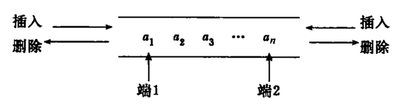

<br/>

## 队列的链式表示 链队列 LinkedQueue

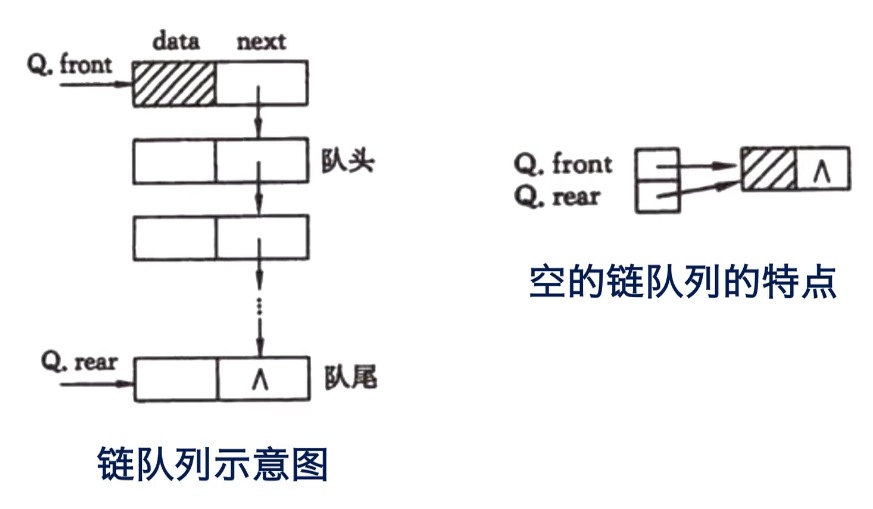

需要两个分别指向队首和队尾的指针（头指针和尾指针）  
front->头结点->首元结点->...->尾结点<-rear  
空队列的front和rear都指向头结点，头节点指向首元结点  

```c
typedef int ELEMTYPE;
typedef struct QNode{
    ELEMTYPE data;
    struct QNode* next;
}QNode;
typedef struct LQueue{
    QNode* front; // 队首
    QNode* rear; // 队尾
    int count; // 计数
}LQueue;

LQueue* InitLQ(){
    LQueue* q = (LQueue*)malloc(sizeof(LQueue));
    QNode* FirstNode = (QNode*)malloc(sizeof(QNode)); // 添加头节点
    // FirstNode的data不需要初始化，因为不用于存储数据
    FirstNode->next = NULL;
    q->front = FirstNode;
    q->rear = FirstNode;
    q->count = 0;
    return q;
}

int LQEmpty(LQueue* q){
    // 异常处理
    if((q->count==0 && q->front != q->rear) || (q->count!=0 && q->front == q->rear)){
        printf("ERROR  无法确定是否为空\n");
        exit(1);
    }

    return (q->count == 0);
}

// 入队
int LQEn(LQueue* q, ELEMTYPE value){
    QNode* NewNode = (QNode*)malloc(sizeof(QNode));
    if(NewNode == NULL) return 1; // 分配空间失败，返回1
    NewNode->data = value;
    NewNode->next = NULL;

    if(LQEmpty(q)){
        q->front->next = NewNode;
        q->rear = NewNode;
    }
    else{
        q->rear->next = NewNode;
        q->rear = NewNode;
    }
    q->count++;
    return 0;
}

// 出队
int LQDe(LQueue* q, ELEMTYPE* value){
    if(LQEmpty(q)) return 1; // 队列为空无法出队，返回1

    // 保存被删除数据，计数减一
    QNode* deleted = q->front->next;
    *value = deleted->data;
    q->count--;

    // 空队列处理
    if(q->count == 0){
        q->rear = q->front;
    }
    else{
        q->front->next = deleted->next;
    }
    
    // 释放内存
    free(deleted);

    return 0;
}

int LQPeek(LQueue* q, ELEMTYPE* value){
    if(LQEmpty(q)){
        printf("队列为空，读取失败\n");
        return 1;
    }
    *value = q->front->next->data;
    return 0;
}

int main() {
    LQueue* q = InitLQ();

    LQEn(q, 10);
    LQEn(q, 20);
    LQEn(q, 30);

    ELEMTYPE value;
    if (LQPeek(q, &value) == 0) {
        printf("Front element is %d\n", value);
    }

    while (!LQEmpty(q)) {
        if (LQDe(q, &value) == 0) {
            printf("Dequeued element is %d\n", value);
        }
    }

    if (LQEmpty(q)) {
        printf("Queue is empty.\n");
    }

    return 0;
}
```

<br/>

## 队列的顺序表示 顺序队 SqQueue
```c
#define MAXSIZE 100

typedef int ELEMTYPE;
typedef struct SqQueue{
    ELEMTYPE data[MAXSIZE];
    int front;
    int rear;
    int count;
}SqQueue;

SqQueue* SQInit(){
    SqQueue* q = (SqQueue*)malloc(sizeof(SqQueue));
    q->front = 0;
    q->rear = 0;
    q->count = 0;
    return q;
}

int SQEmpty(SqQueue* q){
    return (q->count == 0);
}

int SQFull(SqQueue* q){
    return (q->count == MAXSIZE);
}

int SQEn(SqQueue* q, ELEMTYPE value){
    if (SQFull(q)) return 1;
    q->data[q->rear] = value;
    // 环形缓冲区：当rear大于等于MAXSIZE时，rear会回到0，保证循环充分利用数组空间
    // 如：rear = 98 -> 99 -> 0 -> 1 -> ...
    q->rear = (q->rear + 1) % MAXSIZE;
    q->count++;
    return 0;
}

int SQDe(SqQueue* q, ELEMTYPE* value){
    if (SQEmpty(q)) return 1;
    *value = q->data[q->front];
    // 环形缓冲区
    q->front = (q->front + 1) % MAXSIZE;
    q->count--;
    return 0;
}

int SQPeek(SqQueue* q, ELEMTYPE* value){
    if (SQEmpty(q)) return 1;
    *value = q->data[q->front];
    return 0;
}
```

<br/>

## CPU循环调度模拟

> 有n个任务按顺序交给cpu，每个任务执行所需时间为t_i毫秒  
> cpu的一个时间片为q毫秒  
> 若第i个任务执行所需时间t_i小于q，则等待至当前q结束，然后执行下一个任务  
> 若在一个q之内第i个任务未执行完，则将该任务移至队伍末尾，然后执行下一个任务  

如：  
```
q=100ms
A(20)-B(210)-C(50)
B(210)-C(50)
C(50)-B(110)
B(110)
B(10)
```

```c
#include <stdio.h>
#include <stdlib.h>
#include <time.h>

#define MAXTASK 5
#define TIMEPIECE 100
#define TIMEMIN 10
#define TIMEMAX 150

typedef struct task {
    int id;
    int time;
} task;

typedef struct queue {
    task tasks[MAXTASK];
    int front;
    int rear;
    int count;
} queue;

queue* QInit() {
    queue* q = (queue*)malloc(sizeof(queue));
    for (int i = 0; i < MAXTASK; i++) {
        q->tasks[i].id = '\0';
        q->tasks[i].time = '\0';
    }
    q->front = 0;
    q->rear = 0;
    q->count = 0;
    return q;
}

int QEmpty(queue* q) {
    return (q->count == 0);
}

int QFull(queue* q) {
    return (q->count == MAXTASK);
}

int QEn(queue* q, int id, int time) {
    if (QFull(q)) return 1;
    q->tasks[q->rear].id = id;
    q->tasks[q->rear].time = time;
    q->rear = (q->rear + 1) % MAXTASK;
    q->count++;
    return 0;
}

int QDe(queue* q) {
    if (QEmpty(q)) return 1;
    q->front = (q->front + 1) % MAXTASK;
    q->count--;
    return 0;
}

int QPeek(queue* q, int* id, int* time) {
    if (QEmpty(q)) return 1;
    *id = q->tasks[q->front].id;
    *time = q->tasks[q->front].time;
    return 0;
}

void QPrint(queue* q) {
    int i = q->front;
    int count = q->count;
    while (count > 0) {
        printf("[id=%d, time=%d]", q->tasks[i].id, q->tasks[i].time);
        i = (i + 1) % MAXTASK;
        count--;
        if (count > 0) {
            printf(" -> ");
            printf("\n");
        }
    }
    printf("\n\n");
}

int RandomTime() { // 随机任务持续时间
    return (rand() % (TIMEMAX - TIMEMIN + 1) + TIMEMIN);
}

int RandomTaskNum() { // 随机任务数量
    return (rand() % (MAXTASK + 1 - 1) + 1); // 范围为[1,5]
}

void compute(queue* q) {
    int id, time;
    while (1) {
        if (q->count <= 0) break;
        id = q->tasks[q->front].id;
        time = q->tasks[q->front].time;
        time -= TIMEPIECE;
        if (time <= 0) {
            // 当前任务完成
            printf("任务id=%d已完成\n", id);
            QDe(q);
            QPrint(q);
        }
        else {
            // 未完成，更新剩余时间，移动至队尾
            printf("任务id=%d剩余时间%d\n", id, time);
            QDe(q);
            QEn(q, id, time);
            QPrint(q);
        }
    }
    printf("所有任务均已完成\n");
}

int main() {
    srand(time(NULL));  // 初始化随机数生成器
    queue* q = QInit();
    int tasknum = RandomTaskNum();
    for (int i = 0; i < tasknum; i++) {
        QEn(q, i, RandomTime());
    }
    printf("随机生成的任务为：\n");
    QPrint(q);
    compute(q);
    return 0;
}
```
示例输出：  
```
随机生成的任务为：
[id=0, time=112] ->
[id=1, time=148] ->
[id=2, time=111] ->
[id=3, time=91]

任务id=0剩余时间12
[id=1, time=148] ->
[id=2, time=111] ->
[id=3, time=91] ->
[id=0, time=12]

任务id=1剩余时间48
[id=2, time=111] ->
[id=3, time=91] ->
[id=0, time=12] ->
[id=1, time=48]

任务id=2剩余时间11
[id=3, time=91] ->
[id=0, time=12] ->
[id=1, time=48] ->
[id=2, time=11]

任务id=3已完成
[id=0, time=12] ->
[id=1, time=48] ->
[id=2, time=11]

任务id=0已完成
[id=1, time=48] ->
[id=2, time=11]

任务id=1已完成
[id=2, time=11]

任务id=2已完成


所有任务均已完成
```

<br/>

# 串（字符串） String

## 串的表示和实现

顺序存储：
- 静态存储 - 定长顺序存储  
- 动态分配 - 堆分配存储  

链式存储：
- 动态分配链表节点

<br/>

## 定长顺序存储 SString

```c
#define MAXSIZE 255
typedef unsigned char SString[MAXSIZE+1];
SString s;
// unsigned char表示无符号字符，只能表示非负整数值，取值范围为[0,255]。常规char类型范围是[-128,127]。
// s为一个可容纳256个元素的顺序串，s[0]用于存储串长，共有255+1-1=255个空间可用于存放字符
// 串尾加结束符'\0'，不计入串长
// 存入字符串长度超过MAXSIZE的部分会被截断
```

<br/>

## 内存越界 缓存区溢出

对以下代码：

```c
char str[5];
strcpy(str, "hello");
puts(str);
```

程序预期为str分配五个字符的空间，并存入字符串hello。

实际上，字符串hello末尾会自动添加结束符\0，因此总共需要6个字符的空间。strcpy会将6个字符全部写入内存，但由于仅为str分配了5个字符的空间，第六个字符\0超出了str的空间范围。

调用puts输出str时puts从str的首地址开始输出，直到遇到\0。由于结尾的\0不位于给str分配的内存区域中，其可能被其他数据占用，导致\0被覆盖，从而影响str的调用。

<br/>

## 堆分配存储 HString

```c
typedef struct HString{
    char *str; // 指向连续存储的物理空间的首地址，按串长分配空间，若空串则ch=NULL
    int length; // 串长度
}HString;
```

```c
// 建堆
int StrAssign(HString *s, char *chars){
    // 无效输入
    if (s == NULL) return 1;

    //首先释放t的str占用的空间
    if (s->str) free(s->str);
    
    //求chars的串长，分配空间+1用于添加NULL
    s->length = strlen(chars);
    if (s->length != 0){
        s->str = (char*)malloc((s->length + 1) * sizeof(char));
        if (s->str == NULL) exit(1);
        strcpy(s->str, chars);
    }
    else{
        // 空串
        s->str = NULL;
    }
    return 0;
}

int StrInsert(HString *s_dest, HString *s_source, int pos){
    // 无效输入处理
    if (s_dest == NULL || s_source == NULL || s_dest->str == NULL || s_source->str == NULL || pos < 0 || pos > s_dest->length) {
        return 1;
    }

    // 分配新空间，分配空间+1用于添加NULL
    int newlength = s_dest->length + s_source->length;
    s_dest->str = (char*)realloc(s_dest->str, (newlength  + 1)*sizeof(char));
    if (s_dest->str == NULL) exit(1); 

    // 将s_dest中pos后的元素后移s_source->length位
    // 从后向前移动防止覆盖
    for (int i = s_dest->length; i >= pos; i--) {
        s_dest->str[i + s_source->length] = s_dest->str[i];
    }

    // 插入新字符串，添加NULL
    for (int i = 0; i < s_source->length; i++) {
        s_dest->str[pos + i] = s_source->str[i];
    }
    s_dest->str[newLength] = '\0';

    // 更新长度
    s_dest->length = newLength;

    return 0;
}

void StrPrint(HString *s) {
    if (s != NULL && s->str != NULL) {
        printf("%s\n", s->str);
    }
}

int main() {
    // 初始化字符串
    HString dest;
    HString source;

    StrAssign(&dest, "HelloWorld");
    StrAssign(&source, "C");

    printf("原目标字符串：\n");
    StrPrint(&dest);

    printf("源字符串：\n");
    StrPrint(&source);

    // 在"Hello"的后面插入源字符串
    if (StrInsert(&dest, &source, 5) == 0) {
        printf("插入后的字符串：\n");
        printHString(&dest);
    } else {
        printf("插入失败\n");
    }

    return 0;
}
```

<br/>

## 链式存储 LString

块链结构：在一个结点中存储多个数据，数据存储密度为(单个节点中存储的数据数量/单个节点中的元素个数)。  
通过提高数据域的占比可以提高结点的存储密度。 

块链结构定义：
```c
#define BLOCKSIZE 4
typedef struct blocknode{
    ELEMTYPE data[BLOCKSIZE];
    struct blocknode *next;
}blocknode;

typedef struct LString{
    blocknode *head; // 头指针
    blocknode *tail; // 尾指针
    int count; //结点数
}LString;
```

<br/>

## 串的模式匹配算法

用于确定主串中所含字串第一次出现的位置。  
给定主串s，字串t，位置pos，求t在s中第pos个字符后的位置。  

算法类型：
- BF算法
- **KMP算法**

### BF算法

> 将主串的第pos个字符与字串的第1个字符比较
> 若相同，则继续逐个比较后续字符
>> 若全部相同，则匹配成功，返回s与t匹配的第一个字符的位置
>> 若不相同，则继续从t的第一个字符匹配
>
> 若无匹配的字符串则返回-1

时间复杂度：  
设主串长度为m，字串长度为n，则时间复杂度为o(n*m)  

<br/>

### KMP算法

使用LPS数组记录模式串（字串）的每个位置之前的字符串的最大前缀和后缀相同的长度，并用LPS数组决定在匹配失败时模式串向右移动的距离。  

```c
#include <stdio.h>
#include <string.h>

// 构建LPS数组
#include <stdio.h>
#include <string.h>
#include <stdlib.h>

// 构建LPS数组
void BuildLPS(const char* pattern, int length, int* lps) {
    int fixlength = 0; // 最长前后缀长度
    lps[0] = 0; // lps数组的首个元素不使用，初始化为0

    int i = 1; // 从lps的第二个元素开始遍历
    while (i < length) {
        if (pattern[i] == pattern[fixlength]) { // 首尾元素相同
            fixlength++;
            lps[i] = fixlength;
            i++;
        }
        else { //首尾元素不同
            if (fixlength != 0) { // 之前有部分匹配
                fixlength = lps[fixlength - 1];
                //将length更新为lps中length-1处的值以检查更短的前缀
            }
            else { // 没有匹配前后缀
                lps[i] = 0;
                i++;
            }
        }
    }
}

int KMP(const char* text, const char* pattern) {
    int len_text = strlen(text);
    int len_pattern = strlen(pattern);

    // 求LPS数组
    int* lps = (int*)malloc(len_pattern * sizeof(int));
    if (lps == NULL) return 1;
    BuildLPS(pattern, len_pattern, lps);
    printf("LPS数组: ");
    for (int i = 0; i < len_pattern; i++) {
        printf("%d ", lps[i]);
    }
    printf("\n");

    // 进行串的模式匹配
    // 两个索引指向文本串和模式串的起始位置
    int index_text = 0, index_pattern = 0;
    while (index_text < len_text) { // 遍历整个字符串
        if (pattern[index_pattern] == text[index_text]) { // 若第一个元素匹配成功，两个索引就都自增
            index_text++;
            index_pattern++;
        }
        if (index_pattern == len_pattern) { // 当pattern的索引和长度相同时就匹配成功
            printf("第一个相同元素位置：%d\n", index_text - index_pattern + 1);
            free(lps);
            return 0;
        }
        else if (index_text < len_text && pattern[index_pattern] != text[index_text]) { // text索引小于长度且索引处字符不匹配
            if (index_pattern != 0) { // pattern索引不为零说明已有部分字符匹配
                index_pattern = lps[index_pattern - 1]; // 从lps数组中获取跳过字符的数量
            }
            else { // pattern索引为零，无匹配部分
                index_text++; // 仅将text索引+1，继续向后比较
            }
        }
    }

    // 没有在循环内return说明匹配失败
    printf("匹配失败\n");
    free(lps);
    return 1;
}

int main() {
    // 设定主串和模式串
    char text[] = "ABABAABABABABAAC";
    char pattern[] = "ABABABAA";

    // 使用kmp算法实现串的模式匹配
    KMP(text, pattern);

    return 0;
}
```

输出：
```c
LPS数组: 0 0 1 2 3 4 5 1
第一个相同元素位置：8
```

<br/>

# 数组 Array

## 二维数组的存储方式
行优先、列优先  

对数组：  
```c
int array[3][3] = {
    {a11, a12, a13},
    {a21, a22, a23},
    {a31, a32, a33}
};
```

行优先时内存中的排序为：   
$[a_{11}, a_{12}, a_{13}, a_{21}, a_{22}, a_{23}, a_{31}, a_{32}, a_{33}]$  

列优先时内存中的排序为：  
$[a_{11}, a_{21}, a_{31}, a_{12}, a_{22}, a_{32}, a_{13}, a_{23}, a_{33}]$


无论行优先或列优先，只要知道：  
- 首元结点地址  
- 维数、每一维的上下界  
- 每个元素占用空间  

就可以求数组中任一元素的地址。  

<br/>

## N维数组的顺序存储表示

```c
#define MAXDIM 4 //最大维数
typedef struct Array{
    ELEMTYPE* base; // 数组元素基址
    int dim; // 维数
    int* bound; // 每一维的大小
    int* constants; //存储用于地址计算的常量，可以快速计算任意元素的地址。在行优先存储方式下，值依次为每一维后续所有维度大小的乘积。
}Array;

/*
如对于行优先储存的3*4*5的三维数组，dim=3，bound[3]={3,4,5}
constants[2]=1  
constants[1]=constants[2]*bound[2]=5
constants[0]=constants[1]*bound[1]=20
*/


```

对行储存的n维数组，位于$(i_1, i_2, ..., i_n)$处元素的地址为：  
$\text{Address}(i_1, i_2, ..., i_n) = \text{Base} + \text{ElementSize} \times \left( \sum_{k=1}^{n} i_k \cdot \text{constants}[k-1] \right)$  

<br/>

## 数组的链式存储

在高级语言中数组只是顺序结构，在数据结构中数组可以是顺序结构或链式结构。  
~~可以，但没必要。~~  
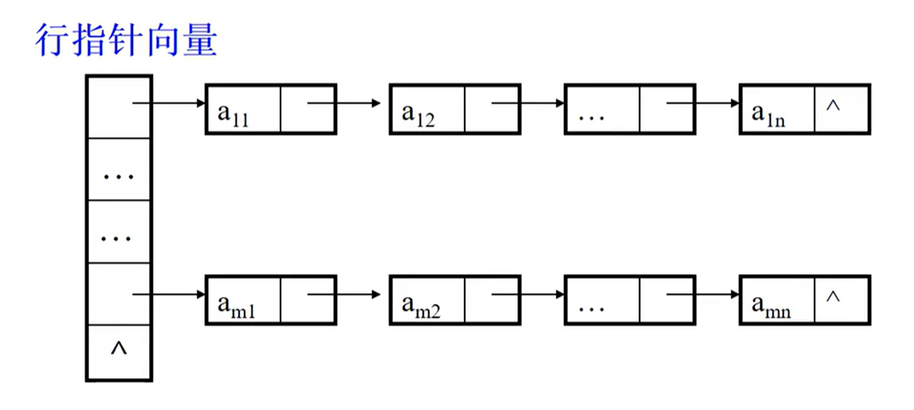

<br/>

## 稀疏矩阵的压缩存储

针对多个元素值相同或有多个零元素的情况，如对称矩阵、对角矩阵、稀疏矩阵（非零元素占比小于5%）  

解决思路：  
增开若干存储单元，存放非零元素的行列数和元素值。  

### 三元组矩阵
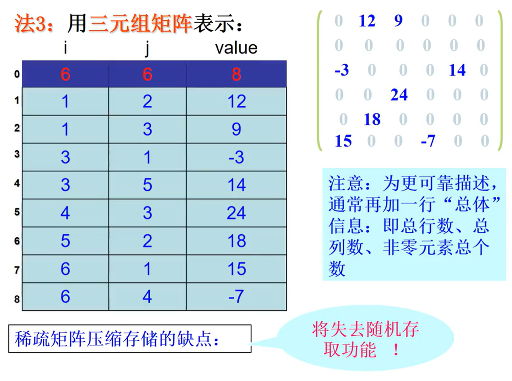
每个非零元素可用$(i, j, a_{ij})$表示，则整个稀疏矩阵可用$(k+1)*3$的二维矩阵表示，其中k为非零元素数，**第零行存储总行数、总列数、非零元素个数**。(缺少行列数将无法从三元组矩阵恢复出原矩阵)  

缺点是相对于直接用索引`array[i][j]`访问的时间复杂度O(1)，三元组矩阵的最差时间复杂度为O(k)，随机存取能力很差，访问时最差需要遍历整个行索引和列索引：  
> 查找行索引i  
>> 查找列索引j  
>>> 匹配成功，返回元素值  
>>
>> 列匹配失败，元素为0  
> 
> 行匹配失败，元素为0  

<br/>

### 扩展的三元组矩阵

常规的三元组矩阵随机存储能力很差，因此额外引入新的向量用于加快随机存储。  
- num：记录每行非零元素的个数。  
- pos：记录稀疏矩阵中每行第一个非零元素在三元组矩阵中的行号。  

假设有稀疏矩阵A：  

```
0 4 3 0
1 0 0 0 
0 0 0 0
0 0 3 5
```

其三元组表示为： 

```
4 4 5
0 1 4
0 2 3
1 0 1
3 2 3
3 3 5
```

易得辅助向量为：  
num = [2, 1, 0, 2]  
pos = [1, 3, 4, 4]   
其中$pos(i)=pos(i-1)+num(i-1)$，适用于计算当前行无非零元素是的pos  

访问元素`A[i][j]`：  
- 通过`num[i]`判断第i行是否有非零元素，若为0则该元素为0  
- 通过`pos[i]`定位第i行第一个非零元素位置  
- 从`pos[i]`开始，检查三元组矩阵中的每一行，直到已遍历的第i行非零元素等于`num[i]`   
- 检查列索引 j，若匹配则返回元素值，反之元素为0  

```c
#include <stdio.h>
#include <math.h>
#include <stdlib.h>
#include <string.h>

// 三元组矩阵
typedef struct {
	int row; // 元素所在行
	int col; // 元素所在列
	int value; // 元素值
} Triple;

// 疏松矩阵
typedef struct {
    int rows; // 矩阵总行数
    int cols; // 矩阵总列数
    int count; // 非零元素总数
    Triple* triples; // 存储所有非零元素的三元组数组
    int* num; // 每行非零元素个数的数组
    int* pos; // 每行第一个非零元素在三元组数组中位置的数组
} SparseMatrix;

SparseMatrix* InitSparseMatrix(int** input, int rows, int cols) {
    // 计算非零元素数
    int count = 0;
    for (int i = 0; i < rows; i++) {
        for (int j = 0; j < cols; j++) {
            if (input[i][j] != 0) {
                count++;
            }
        }
    }

    // 分配空间
    SparseMatrix* matrix = (SparseMatrix*)malloc(sizeof(SparseMatrix));
    Triple* triples = (Triple*)malloc((count + 1) * sizeof(Triple));
    int* num = (int*)malloc(rows * sizeof(int));
    int* pos = (int*)malloc((rows + 1) * sizeof(int));
    if (matrix == NULL || triples == NULL || num == NULL || pos == NULL) exit(1);

    // 初始化稀疏矩阵数据
    matrix->rows = rows;
    matrix->cols = cols;
    matrix->count = count;
    matrix->triples = triples;
    matrix->num = num;
    matrix->pos = pos;

    // 初始化三元组矩阵第一行
    matrix->triples[0].row = rows;
    matrix->triples[0].col = cols;
    matrix->triples[0].value = count;

    // 初始化三元组矩阵内容和num数组
    int k = 1; // 从1开始，triples[0]用于存储基本信息
    for (int i = 0; i < rows; i++) {
        matrix->num[i] = 0; // 初始化当前行的num值
        for (int j = 0; j < cols; j++) { // 遍历当前行的每一个元素
            if (input[i][j] != 0) { // 将非零元素存入三元组矩阵
                matrix->triples[k].row = i;
                matrix->triples[k].col = j;
                matrix->triples[k].value = input[i][j];
                matrix->num[i]++; 
                k++;
            }
        }
    }

    // 初始化 pos 向量
    matrix->pos[0] = 1; // 首个pos值pos[0]一定为1
    for (int i = 0; i < rows; i++) {
        matrix->pos[i + 1] = matrix->pos[i] + matrix->num[i];
        // 利用公式计算，pos[i]=pos[i-1]+num[i-1]
    }

    return matrix;
}   

void freemem(SparseMatrix* matrix, int** origin) {
    for (int i = 0; i < matrix->rows; i++) {
        free(origin[i]);
    }
    free(origin);
    free(matrix->triples);
    free(matrix->num);
    free(matrix->pos);
    free(matrix);
}

int GetValue(SparseMatrix* matrix, int i, int j) {
    // 非法输入
    if (i < 0 || i >= matrix->rows || j < 0 || j >= matrix->cols) return -1;

    // 判断第i行是否有非零元素
    if (matrix->num[i] == 0) return 0;

    // 通过pos[i]定位第i行第一个非零元素的位置
    int start = matrix->pos[i];
    int end = matrix->pos[i + 1];
    
    // 遍历第i行的非零元素
    for (int k = start; k < end; k++) {
        if (matrix->triples[k].col == j) {
            return matrix->triples[k].value;
        }
    }
    return 0;
}

int main() {
    int rows = 4, cols = 4;
    int** matrix = (int**)malloc(rows * sizeof(int*)); // 传递二维数组需要用int**类型
    if (matrix == NULL) exit(1);
    for (int i = 0; i < rows; i++) {
        matrix[i] = (int*)malloc(cols * sizeof(int)); // 分别为行和列分配空间
        if (matrix[i] == NULL) exit(1);
    }

    // 初始化矩阵值
    int values[4][4] = { // 原始矩阵
        {0, 4, 3, 0},
        {1, 0, 0, 0},
        {0, 0, 0, 0},
        {0, 0, 3, 5}
    };
    for (int i = 0; i < rows; i++) {
        for (int j = 0; j < cols; j++) {
            matrix[i][j] = values[i][j]; // 将原始矩阵复制进动态矩阵
        }
    }

    // 获得稀疏矩阵
    // C语言中不能直接推导出动态分配的二维数组的大小，只能明确传递行数和列数
    SparseMatrix* sm = InitSparseMatrix(matrix, rows, cols);

    printf("三元组矩阵为：\n");
    for (int i = 0; i <= sm->count; i++) {
        printf("%d  %d  %d\n", sm->triples[i].row, sm->triples[i].col, sm->triples[i].value);
    }

    // 获取元素
    for (int i = 0; i <= 3; i++) {
        for (int j = 0; j <= 3; j++) {
            printf("第%d行第%d列的元素是%d\n", i, j, GetValue(sm, i, j));
        }
    }
    printf("（从0开始计数）\n");
    freemem(sm, matrix);
    return 0;
}

```
输出：  
```c
三元组矩阵为：
4  4  5
0  1  4
0  2  3
1  0  1
3  2  3
3  3  5
第0行第0列的元素是0
第0行第1列的元素是4
第0行第2列的元素是3
第0行第3列的元素是0
第1行第0列的元素是1
第1行第1列的元素是0
第1行第2列的元素是0
第1行第3列的元素是0
第2行第0列的元素是0
第2行第1列的元素是0
第2行第2列的元素是0
第2行第3列的元素是0
第3行第0列的元素是0
第3行第1列的元素是0
第3行第2列的元素是3
第3行第3列的元素是5
（从0开始计数）
```

<br/>

### 压缩稀疏行存储 CSR

压缩稀疏行存储 CSR 使用三个数组value, index, pos 来存储矩阵信息。  

其 CSR 表示如下：  
- value : 将所有非零元素按行优先存储。  
- index : 每个非零元素对应的列索引。  
- pos : 每行第一个非零元素在 value 中的位置，最后一个元素为 value 的长度。  


设一稀疏矩阵$A$为：  

```
0 0 3 0
4 0 0 6
0 5 0 0
0 0 7 8
```

其 CSR 表示为：  
- value: $[3, 4, 6, 5, 7, 8]$  
- index: $[2, 0, 3, 1, 2, 3]$  
- pos: $[0, 1, 3, 4, 6]$  

访问元素$a_{ij}$：  
> 第$i$行的非零元素在value数组中的范围为：从`pos[i]`到`pos[i+1] - 1`（闭区间，从0开始）  
>> 若范围左右之差小于0则当前行无非零元素，目标元素为0
>>
> 在index范围从`pos[i]`到`pos[i+1] - 1`中查找$j$
>> 若匹配成功则返回$j$在index中的位置对应到value中的值
>
> 匹配失败则目标元素为0

代码实现：

```c
#include <stdio.h>
#include <stdlib.h>

typedef struct {
    int* value;       // 非零元素的值
    int* index;  // 非零元素的列索引
    int* pos;      // 行指针数组
    int rows;      // 矩阵的行数
    int cols;      // 矩阵的列数
    int count;  // 矩阵中的非零元素个数
} CSRMatrix;

CSRMatrix* InitCSR(int** input, int rows, int cols) {
    // 计算非零元素个数
    int count = 0;
    for (int i = 0; i < rows; i++) {
        for (int j = 0; j < cols; j++) {
            if (input[i][j] != 0) {
                count++;
            }
        }
    }

    // 分配内存
    CSRMatrix* csr = (CSRMatrix*)malloc(sizeof(CSRMatrix));
    if (csr == NULL) exit(1);
    csr->value = (int*)malloc(count * sizeof(int));
    csr->index = (int*)malloc(count * sizeof(int));
    csr->pos = (int*)malloc((rows + 1) * sizeof(int));
    if (csr->value == NULL || csr->index == NULL || csr->pos == NULL) exit(1);
    csr->rows = rows;
    csr->cols = cols;
    csr->count = count;

    // 向csr中输入原矩阵的非零元素并记录列向量
    int k = 0; // csr的索引
    csr->pos[0] = 0;
    for (int i = 0; i < rows; i++) {
        for (int j = 0; j < cols; j++) {
            if (input[i][j] != 0) {
                csr->value[k] = input[i][j];
                csr->index[k] = j;
                k++;
            }
        }
        csr->pos[i + 1] = k; 
    }
    return csr;
}

void CsrPrint(CSRMatrix* csr) {
    printf("csr values :\n");
    for (int i = 0; i < csr->count; i++) {
        printf("%d ", csr->value[i]);
    }
    printf("\n");

    printf("csr index :\n");
    for (int i = 0; i < csr->count; i++) {
        printf("%d ", csr->index[i]);
    }
    printf("\n");

    printf("csr pos :\n");
    for (int i = 0; i < csr->rows+1; i++) {
        printf("%d ", csr->pos[i]);
    }
    printf("\n");
}

int GetValue(CSRMatrix* csr, int i, int j) {
    //第i行的非零元素在value数组中位置的上下限
    int limit_low = csr->pos[i], limit_up = csr->pos[i + 1] - 1;

    //若上下限相差小于0则当前行无非零元素
    if (limit_up - limit_low < 0) return 0;

    //在index范围从pos[i]到pos[i+1] - 1中查找j
    for (int k = limit_low; k <= limit_up; k++) {
        if (csr->index[k] == j) return (csr->value[k]);
    }

    // 匹配失败，元素为0
    return 0;
}

void FreeMem(CSRMatrix* csr, int** matrix) {
    for (int i = 0; i < csr->rows; i++) {
        free(matrix[i]);
    }
    free(matrix);
    free(csr->value);
    free(csr->index);
    free(csr->pos);
    free(csr);
}

int main() {
    // 初始化动态二维数组
    int rows = 4, cols = 4;
    int** matrix = (int**)malloc(rows * sizeof(int*)); // 传递二维数组需要用int**类型
    if (matrix == NULL) exit(1);
    for (int i = 0; i < rows; i++) {
        matrix[i] = (int*)malloc(cols * sizeof(int)); // 分别为行和列分配空间
        if (matrix[i] == NULL) exit(1);
    }
    // 初始化原始矩阵值
    int origin[4][4] = { // 原始矩阵
        {1, 0, 0, 0},
        {0, 9, 0, 3},
        {0, 0, 0, 0},
        {0, 0, 2, 6}
    };
    // 将原始矩阵的值复制进动态矩阵
    for (int i = 0; i < rows; i++) {
        for (int j = 0; j < cols; j++) {
            matrix[i][j] = origin[i][j]; // 将原始矩阵复制进动态矩阵
        }
    }

    // 压缩得到csr矩阵
    CSRMatrix* csr = InitCSR(matrix, rows, cols);
    CsrPrint(csr);

    // 获取i行j列元素
    printf("\n矩阵为：\n");
    for (int i = 0; i < rows; i++) {
        for (int j = 0; j < cols; j++) {
            printf("%d  ", GetValue(csr, i, j));
        }
        printf("\n");
    }
    FreeMem(csr, matrix);
}
```
程序输出：
```
csr values :
1 9 3 2 6
csr index :
0 1 3 2 3
csr pos :
0 1 3 3 5

矩阵为：
1  0  0  0
0  9  0  3
0  0  0  0
0  0  2  6
```

<br/>

# 广义表 Generalized lists

## 定义

广义表是线性表的推广，记为$GL=(a_1,a_2,\cdots,a_n)$，其中$a_1$为表头Head，**其余所有元素** $a_2,\cdots,a_n$组成的表为表尾Tail，表长为$n$。   

广义表中的元素可以是原子（不可分割的单个数据元素），也可以是另一个广义表（嵌套）。约定原子用小写字母表示，广义表用大写字母表示。  
当所有元素都是类型相同的原子时，这个广义表就是线性表。     

对任一线性表，其表头即可能是原子也可能是列表，但 **表尾一定是列表**（即使只有一个元素甚至没有元素也是一个列表）。只有第一个元素是表头，**其余全部元素** 组成的列表是表尾。  

如：`GL=(a,(b,c),d)`，其中a、d是原子，(b,c)是子广义表，a是表头，((b,c),d)是表尾。    

<br/>

## 广义表的长度和深度

```
A=(a,b,c)
B=(d,C)
C=(e,D,f)
D=(g,h)
E=(A,B,C,D,i)
 =((a,b,c),(d,(e,(g,h),f),(e,(g,h),f),(g,h),i))
```
对广义表E，E中共有5个元素，E的长度为5；最深的一层为E-C-D-g，深度为4。

<br/>

## 广义表的存储结构

由于广义表的元素有两种（原子或列表），难以用顺序结构表示，故通常为链式结构，每个元素为一个结点。  

结点类型可分为原子结点或子表结点。一个原子结点包含表示域、数值域、表尾指针（可选）。  

```c
typedef struct GLNode{
    int type; // 结点类型，0为原子结点，1为子表结点
    union{
        ELEMTYPE atom; // 原子
        struct GLNode *sublist; // 子表
    }data;
    struct GLNode *tail
}GLNode;

//union（共用体）是一种数据结构，允许在同一块内存中存储不同类型的数据，但在同一时间内仅能存储其中的一种类型，sizeof(union)取决于union中的最大成员。
```

对广义表(a,(b,c),d)，其存储结构为：
```
头指针
├─ a [type=0, atom='a', tail=子表结点(b,c)]
├─ (b,c) [type=1, sublist='A', tail=原子结点d]
│   ├─ b [type=0, atom='b', tail=原子结点c]
│   └─ c [type=0, atom='c', tail=NULL]
└─ d [type=0, atom='d', tail=NULL]
```

代码实现：
```c
#include <stdio.h>
#include <stdlib.h>

typedef char ELEMTYPE;

typedef struct GLNode {
    int type; // 结点类型，0为原子结点，1为子表结点
    union {
        ELEMTYPE atom; // 原子
        struct GLNode* sublist; // 子表
    }data;
    struct GLNode* tail;
}GLNode;

GLNode* AtomNode(ELEMTYPE input) {
    GLNode* node = (GLNode*)malloc(sizeof(GLNode));
    if (node == NULL) exit(1);
    node->type = 0;
    node->data.atom = input;
    node->tail = NULL;
    return node;
}

GLNode* ListNode(GLNode* input) {
    GLNode* node = (GLNode*)malloc(sizeof(GLNode));
    if (node == NULL) exit(1);
    node->type = 1;
    node->data.sublist = input;
    node->tail = NULL;
    return node;
}

void NodePrint(GLNode* node) {
    // 这个函数的括号输出有问题，暂时想不到怎么改
    if (node == NULL) return;

    if (node->type == 0) {
        printf("%c", node->data.atom);
    }
    else {
        printf("(");
        NodePrint(node->data.sublist);
        printf(")");
    }

    if (node->tail != NULL) {
        printf(", ");
        NodePrint(node->tail);
    }
}

void FreeMem(GLNode* node) {
    if (node == NULL) return;

    // 如果当前结点是子列结点则递归释放子表
    if (node->type == 1) {
        FreeMem(node->data.sublist);
    }

    // 递归释放链表的下一个结点
    FreeMem(node->tail);

    // 释放当前结点
    free(node);
}

int main() {
    // 创建广义表(a,(b,c,d),e)
    // 创建原子结点
    GLNode* node_a = AtomNode('a');
    GLNode* node_b = AtomNode('b');
    GLNode* node_c = AtomNode('c');
    GLNode* node_d = AtomNode('d');
    GLNode* node_e = AtomNode('e');

    /// 创建子列结点
    GLNode* node_B = ListNode(node_b);
    node_b->tail = node_c;
    node_c->tail = node_d;

    // 创建广义表
    GLNode* GList = node_a;
    node_a->tail = ListNode(node_B);
    node_a->tail->tail = node_e;

    // 输出广义表
    NodePrint(GList);

    FreeMem(GList);
}
```

# 树和二叉树 (Binary) Tree

## 定义

树是由n个结点组成的有限集合。一个树有且仅有一个结点称为 **根(root)**；除根外，其余的结点分为数个互不相交的有限集合，每个集合称为是根的 **子树** 。   

以如下树举例：  
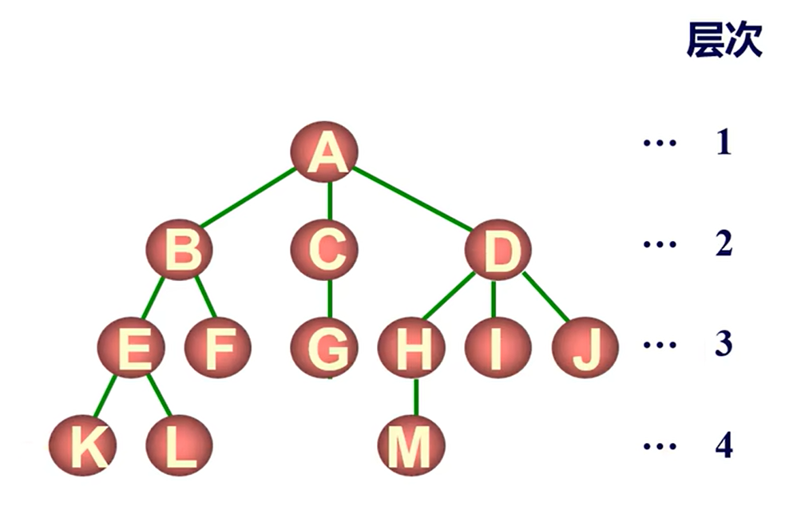

| 术语 | 解释 |
|:---:|:---:|
| 结点的度 | 一个结点的子节点个数 |
| 叶子结点 | 度为0的结点 |
| 父节点/子结点 | 前趋/后继 |
| 兄弟 | 具有共同父节点的多个结点 |
| 祖先 | 从一个结点到达根的路径上所有的结点 |
| 树的度 | 所有结点的度的最大值 |
| 结点的层次 | 第几代 |
| 树的深度 | 结点层次的最大值 |
| 有序树/无序树 | 子节点的顺序是否固定 |
| 森林 | 多个树组成的集合 |

<br/>

## 树的逻辑结构

一个结点可能有多个直接后继，但只有一个直接前趋（根除外），且子树之间互不相交。  

<br/>

## 树的存储结构

使用顺序存储难以表达节点之间的逻辑关系，一般采取链式存储。  

又因为一个结点的子节点数不确定，使用链式存储时难以储存，故一般采用 **二叉树**。

<br/>

## 二叉树

二叉树的每个节点至多有两个子节点，根的子节点按左右分别向下分为左子树和右子树。  

二叉树的基本形态：  
- 空树
- 仅有根节点  
- 根节点和左子树  
- 根节点和右子树  
- 根节点和左子树右子树  

<br/>

## 左孩子-右兄弟算法

树转二叉树：  

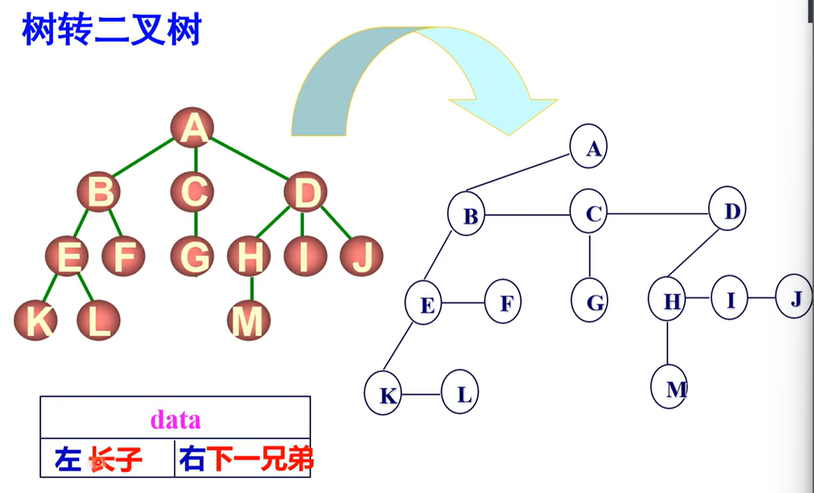

从第一层（根节点）开始，对每一层次从左向右的所有结点，其第一个子节点为本结点的左子节点，右侧的兄弟为本结点的右子节点，以此类推从左向右从上向下连接每个结点。  

举例：  
```
     A            A
   / | \         /
  B  C  D   →   B -- C -- D
 / \    |      /         /
E   F   G     E -- F    G
```

二叉树转树：  

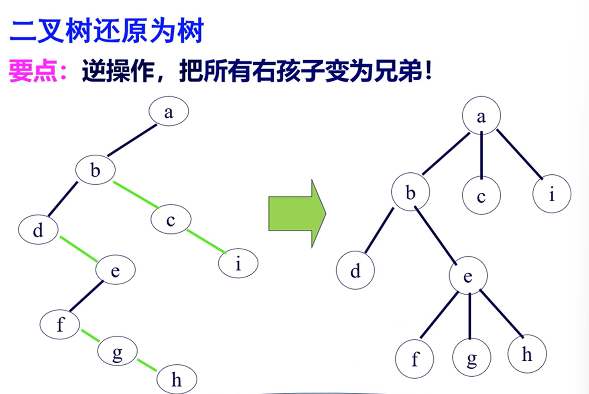

将当前结点下所有右孩子转为兄弟，直到遇到左孩子。

b的右孩子为b-c-i，则把bci都转为a的子结点；  
d的右孩子为d-e，将de转为b的子结点；  
f的右孩子为f-g-h，将fgh转为e的子结点；  

<br/>

## 二叉树的性质

- 二叉树的第$i$层上至多有$2^{i-1}$个结点；  
- 深度为$k$的二叉树至多有$\sum_{i=1}^{k} 2^{i-1} = 2^{k} - 1
$个结点；  
- 对任一二叉树，记终端节点数为$n_0$，度为2的结点数为$n_2$，则有$n_0=n_2+1$；  

<br/>

## 特殊形态的二叉树

满二叉树 Full Binary Tree：
- 深度为$k$且结点数为$2^{k}-1$。  

完全二叉树 Complete Binary Tree：  
- 设二叉树深度为h，第h层从右向左却若干个结点，其余各层结点数为最大值。  

- 当结点数为奇数时，度为1的结点数为0，叶子结点数为$\frac{n+1}{2}$；  
- 结点数为偶数时，度为1的结点数为1，叶子节点数为$\frac{n}{2}$。  
- 结点数为$n$的完全二叉树的深度为$\lfloor \log_2(n) \rfloor + 1
$（向下取整）。  
> 证明：  
> 设结点数$n$和深度$h$
> 对满二叉树有$n=2^{h}-1$，对完全二叉树有$2^{h-1} \leq n < 2^{h}$
> 取对数得$h-1 \leq \log_2(n) < h$
> 向下取整即得深度$h = \lfloor \log_2(n) \rfloor + 1$

## 完全二叉树的顺序存储结构

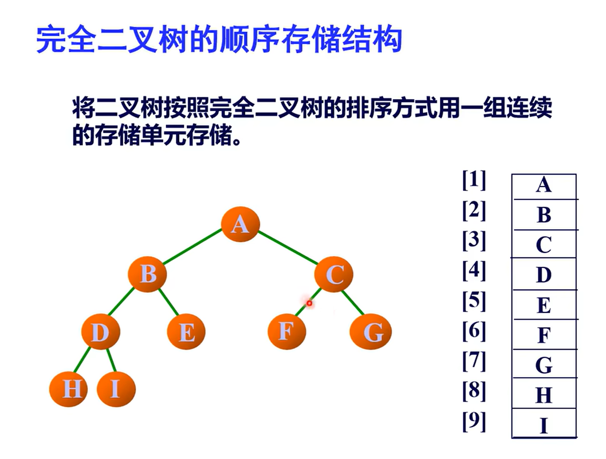

对不完全二叉树，可以将其转为不完全二叉树，在空缺处用虚结点填补。  
缺点：浪费空间，插入删除不便

一般情况下顺序存储仅适用于完全二叉树。  

<br/>

## 二叉树的链式存储

结点结构：left_child - data - right_child  

```c
typedef struct BTNode{
    ELEMTYPE data;
    struct BTNode left_child, right_child;
}BTNode; // 子结点
typedef BTNode BTRoot; // 根结点
```

三叉链表：增加父节点的指针域  
```c
typedef struct BTNode{
    ELEMTYPE data;
    struct BTNode* parent, left_child, right_child;
}BTNode;
```

<br/>

## 二叉树的遍历

指顺着某条路径依次访问二叉树中的所有结点，每个结点均被访问且仅可被访问一次。  

访问：对某个结点做读取、修改等处理。  

遍历的目的是为了得到树中所有结点的线性序列。  

### 完全二叉树 层次遍历 队列辅助

使用队列遍历所有结点：  
首先初始化队列，将根节点放入队列，然后从队列中依次取出结点，分别检查其左右子结点是否为空，若为空则遍历结束，若都非空则将左右子结点分别加入队列，然后取出队列中下一个结点，以此类推。  

<br/>

### 完全二叉树 前序-中序-后续遍历

示例二叉树：
```
     A           
   /   \         
  B     C  
 / \    |   
D   E   F  
```

<br/>

#### 递归遍历

- 前序遍历  

> 访问根节点   
> 递归遍历左子树  
> 递归遍历右子树  

遍历结果：ABDECF  

```c
void preorder(BTNode* root) {
    if (root == NULL) {
        return;
    }
    printf("%c ", root->data);  // 访问根节点
    preorder(root->left);       // 递归遍历左子树
    preorder(root->right);      // 递归遍历右子树
}
```

<br/>

- 中序遍历  

> 递归遍历左子树  
> 访问根节点    
> 递归遍历右子树  

遍历结果：DBEAFC  

```c
void inorder(BTNode* root) {
    if (root == NULL) {
        return;
    }
    inorder(root->left);        // 递归遍历左子树
    printf("%c ", root->data);  // 访问根节点
    inorder(root->right);       // 递归遍历右子树
}
```

<br/>

- 后序遍历  
 
> 递归遍历左子树  
> 递归遍历右子树  
> 访问根节点  

遍历结果：DEBFCA  

```c
void postorder(BTNode* root) {
    if (root == NULL) {
        return;
    }
    postorder(root->left);      // 递归遍历左子树
    postorder(root->right);     // 递归遍历右子树
    printf("%c ", root->data);  // 访问根节点
}
```

<br/>

#### 栈遍历

- 前序遍历  

```c
void preorder(BTNode *root) {
    if (root == NULL) return;

    BTNode *stack[1000];
    int top = -1;
    stack[++top] = root; // 根节点入栈

    while (top != -1) {
        BTNode *node = stack[top--]; 
        printf("%c ", node->data);   // 访问栈顶元素

        // 先右后左入栈，保证左子树先被处理
        if (node->right) {
            stack[++top] = node->right;
        }
        if (node->left) {
            stack[++top] = node->left;
        }
    }
}
```

- 中序遍历

```c
void inorder(BTNode *root) {
    BTNode *stack[1000];
    int top = -1;
    BTNode *current = root;

    while (current != NULL || top != -1) {
        while (current != NULL) { // 将所有左子节点入栈
            stack[++top] = current;
            current = current->left;
        }

        current = stack[top--];  // 弹出栈顶元素
        printf("%c ", current->data); // 访问节点

        current = current->right; // 转向右子树
    }
}

```

- 后序遍历

```c
void postorder(BTNode *root) {
    BTNode *stack[1000], *lastVisited = NULL;
    int top = -1;
    BTNode *current = root;

    while (current != NULL || top != -1) {
        while (current != NULL) {
            stack[++top] = current;
            current = current->left;
        }

        current = stack[top]; // 查看栈顶元素但不弹出

        // 检查是否转向右子树或访问根节点
        if (current->right == NULL || current->right == lastVisited) {
            printf("%c ", current->data); // 访问节点
            lastVisited = current;
            top--;
            current = NULL;
        } else {
            current = current->right;
        }
    }
}

```

<br/>

## 代码实现

创建链式二叉树：  
```c
#include <stdio.h>
#include <stdlib.h>

typedef char ELEMTYPE;
typedef struct BTNode {
    ELEMTYPE data;
    struct BTNode* parent;
    struct BTNode* left_child;
    struct BTNode* right_child;
} BTNode;

BTNode* BTInit(ELEMTYPE data) {
    BTNode* root = (BTNode*)malloc(sizeof(BTNode));
    if (root == NULL) exit(1);

    root->data = data;
    root->parent = NULL;
    root->left_child = NULL;
    root->right_child = NULL;

    return root;
}

BTNode* BTInsert(BTNode* root, ELEMTYPE data) {
    // 创建新的子结点并赋值
    BTNode* newnode = (BTNode*)malloc(sizeof(BTNode));
    if (newnode == NULL) exit(1);

    newnode->data = data;
    newnode->left_child = NULL;
    newnode->right_child = NULL;
    

    // 使用队列遍历根节点下的所有结点，寻找可插入的结点位置
    BTNode* queue[1000]; // 结点队列
    int front = 0, rear = 0; // 队列头尾下标
    queue[rear++] = root; //将根节点存入队列，更新队尾下表

    while (front < rear){ // 队列满时插入失败
        BTNode* current = queue[front++];
        if (current->left_child == NULL) {
            current->left_child = newnode;
            newnode->parent = current;
            return newnode;
        }
        else {
            queue[rear++] = current->left_child;
        }

        if (current->right_child == NULL) {
            current->right_child = newnode;
            newnode->parent = current;
            return newnode;
        }
        else {
            queue[rear++] = current->right_child;
        }
    }
    return NULL; // 队列已满，插入失败
}

void BTPrint(BTNode* root) {
    if (root == NULL) return; // 无效输入

    // 使用队列记录下一步被输出的结点
    BTNode* queue[1000];
    int front = 0, rear = 0;
    queue[rear++] = root;

    while (front < rear) {
        const BTNode* current = queue[front++];
        printf("%c ", current->data);

        if (current->left_child != NULL) {
            queue[rear++] = current->left_child;
        }
        if (current->right_child != NULL) {
            queue[rear++] = current->right_child;
        }
    }
}

void BTFree(BTNode* root) {
    if (root == NULL) {
        return;
    }

    // 递归释放左子树
    BTFree(root->left_child);
    // 递归释放右子树
    BTFree(root->right_child);

    free(root);
}

int main() {
    BTNode* root = BTInit('A'); // 初始化根节点
    BTInsert(root, 'B'); // 插入更多节点
    BTInsert(root, 'C');
    BTInsert(root, 'D');
    BTInsert(root, 'E');

    printf("Binary Tree: ");
    BTPrint(root); // 打印二叉树

    BTFree(root);

    return 0;
}
```

<br/>

## 线索二叉树 Threaded Binary Tree

对有$n$个结点的二叉树，共有$2n$个指针域，但是仅有$n-1$个指针域被使用，有$n+1$个空指针。  

这些空指针根据不同的遍历序列，可用来存放当前节点的直接前趋或直接后继的地址，用于快速得到原遍历序列，并可按原遍历序列进行快速查找。  

- 存放线索的方式：  

左孩子地址/前趋地址复用，右孩子地址/后继地址复用。  

为了区分指针是孩子还是线索，需要加一个标志域L/R Tag，值为0时表示孩子，值为1时表示前趋/后继。  

示例：  
```c
      A
     / \
    B   C
   / \  / \
  D  E F  G
 / \
H  I
```

### 中序线索二叉树

中序遍历结果为：HDIBEAFCG  
将所有的空指针线索化：  
- H的前趋是head，后继是D  
- I的前趋是D，后继是B  
- E的前趋是B，后继是A  
- F的前趋是A，后继是C  
- G的前趋是C，后继是tail  

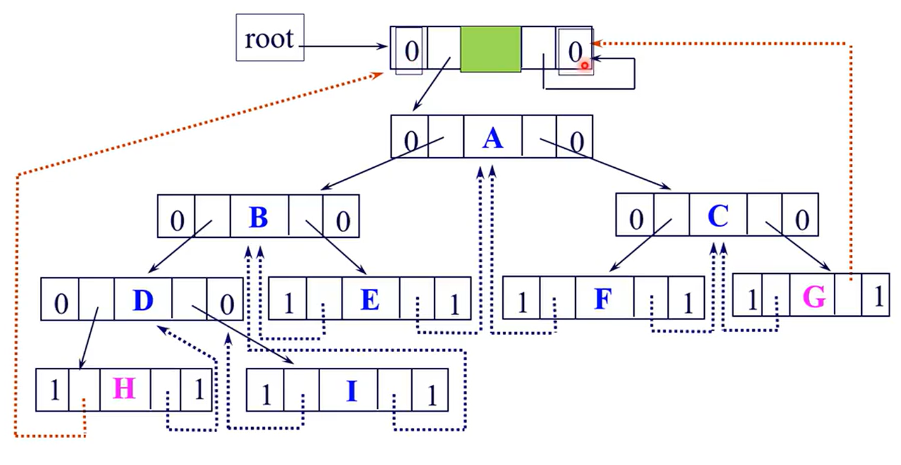
图中实线为孩子，虚线为线索。  

生成线索二叉树：  
```c
typedef char ELEMTYPE;

typedef struct BTNode {
    ELEMTYPE data;
    struct BTNode* parent;
    struct BTNode* left_child;
    struct BTNode* right_child;
    // 使用tag表示指针是线索（1）还是指向子结点（0）
    int lTag;
    int rTag;
} BTNode;

// 初始化树节点
BTNode* BTInit(ELEMTYPE data) {
    BTNode* root = (BTNode*)malloc(sizeof(BTNode));
    if (root == NULL) exit(1);

    // 初始化数据
    root->data = data;
    root->parent = NULL;
    root->left_child = NULL;
    root->right_child = NULL;
    root->lTag = 0;
    root->rTag = 0;

    return root;
}

// 因为要用递归，所以采用全局变量
BTNode* prev = NULL; // 第一次调用prev时是NULL，表示head
void InorderTBT(BTNode* node) {
    if (node != NULL) {
        InorderTBT(node->left_child); // 遍历左子树

        // 处理当前节点的左线索
        if (node->left_child == NULL) {
            node->lTag = 1;
            node->left_child = prev;
        } else {
            node->lTag = 0;
        }

        // 处理前驱节点的右线索
        if (prev != NULL && prev->right_child == NULL) {
            prev->rTag = 1;
            prev->right_child = node;
        }

        prev = node; // 更新 prev 指针

        InorderTBT(node->right_child); // 遍历右子树
    }
}
```

中序线索二叉树的遍历：  
- 找到序列中的第一个节点；  
- 若其rtag为1，则当前节点的rchild指向其直接后继；   
- 若其rtag为0，则直接后继为当前节点右子树最左下方的结点。  

代码实现：  
```c
BTNode* LeftMostNode(BTNode* node){ // 找到当前结点下最左侧的子结点
    if (node == NULL) return NULL; // 异常处理
    while (node->left_child != NULL && node->lTag == 0) { // 持续访问左子结点，直到中序遍历的起点
        node = node->left_child;
    }
    return node;
}

void TBTPrint(BTNode* root){
    BTNode* p = LeftMostNode(root);
    while (p != NULL) {
        printf("%c ", p->data);

        if(p->rTag == 1 && p->right_child != NULL){
            p = p->right_child;
            continue;
        }
        p = LeftMostNode(p->right_child);
    }
}

```

## 树的储存结构

### 双亲表示法

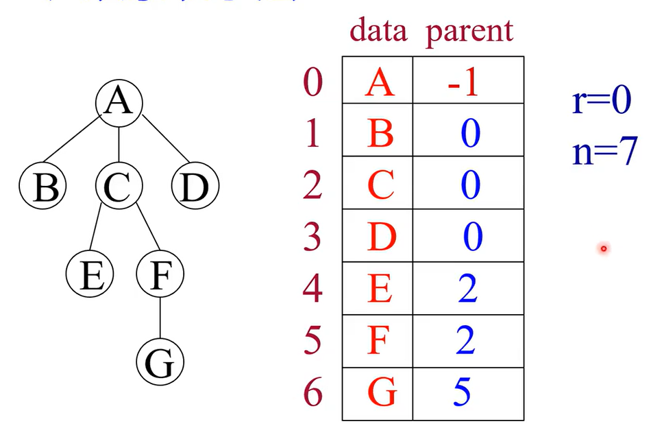

对每一个结点，存储结点的值（数据域）、父节点的序号（指针域），再额外存储根节点的序号和总共的结点数。  

```c
typedef struct PTNode{
    ELEMTYPE data;
    int parent;
} PTNode;

typedef struct PTree{
    PTNode nodes[MAXSIZE];
    int root, count;
} PTree;
```

### 孩子链表表示法

为每个树节点设置两个指针，一个指向第一个子节点，另一个指向下一个兄弟节点，从而将多叉树转换为类似链表的结构。  

```c
typedef char ELEMTYPE;

typedef struct CTNode {
    ELEMTYPE data;
    struct CTree* firstchild;
}CTNode;

typedef struct CTree {
    struct CTNode* child;
    struct CTree* nextbrother;
}CTree;

// 创建一个新的树节点
CTNode* CreateTreeNode(ELEMTYPE data) {
    CTNode* newNode = (CTNode*)malloc(sizeof(CTNode));
    if (newNode == NULL) exit(1);
    newNode->data = data;
    newNode->firstchild = NULL;
    return newNode;
}

// 创建一个新的孩子链表节点
CTree* CreateChildNode(CTNode* child) {
    CTree* newChildNode = (CTree*)malloc(sizeof(CTree));
    if (newChildNode == NULL) exit(1);
    newChildNode->child = child;
    newChildNode->nextbrother = NULL;
    return newChildNode;
}

// 添加子节点
void AddChild(CTNode* parent, CTNode* child) {
    CTree* newChildNode = CreateChildNode(child);
    if (parent->firstchild == NULL) {
        parent->firstchild = newChildNode;
    }
    else {
        CTree* current = parent->firstchild;
        while (current->nextbrother != NULL) {
            current = current->nextbrother;
        }
        current->nextbrother = newChildNode;
    }
}

// 遍历并打印树
void PrintTree(CTNode* root) {
    if (root == NULL) return;
    printf("%c ", root->data);

    CTree* child = root->firstchild;
    while (child != NULL) {
        PrintTree(child->child);
        child = child->nextbrother;
    }
}

int main() {
    // 创建节点
    CTNode* root = CreateTreeNode('A');
    CTNode* nodeB = CreateTreeNode('B');
    CTNode* nodeC = CreateTreeNode('C');
    CTNode* nodeD = CreateTreeNode('D');
    CTNode* nodeE = CreateTreeNode('E');
    CTNode* nodeF = CreateTreeNode('F');

    // 构建树
    AddChild(root, nodeB);
    AddChild(root, nodeC);
    AddChild(root, nodeD);
    AddChild(nodeB, nodeE);
    AddChild(nodeB, nodeF);

    // 打印树
    PrintTree(root);

    return 0;
}
```

### 树的二叉链表（孩子-兄弟）存储表示法

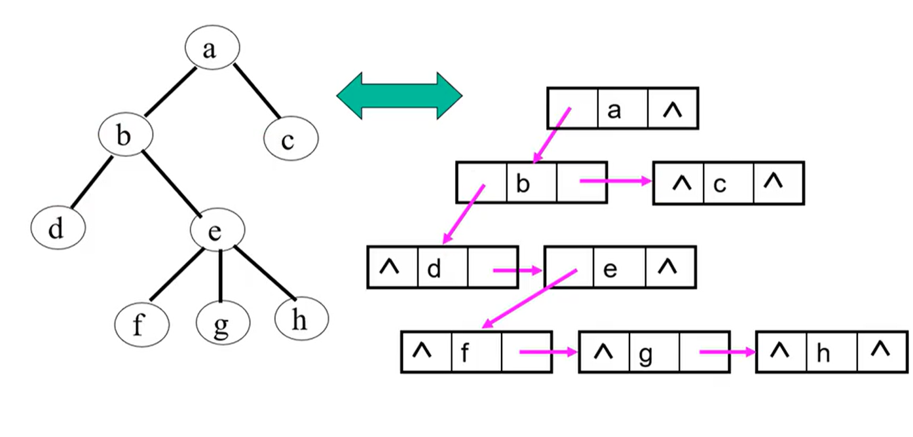

与树与二叉树互化的左孩子右兄弟算法相似。

```c
typedef struct CBNode{
    ELEMTYPE data;
    CBNode *firstchild, nextbrother;
}CBNode;
```

## 树、森林、二者的转换

森林是一个由若干棵不相交的树组成的集合，森林中每一棵树都是独立的，每一棵树的根节点都可以被视为是一个虚拟的根节点的子结点。  

对以下三个树：  
```
 树1:
   A
  / \
 B   C
 
 树2:
   D
  / \
 E   F
  树3:
   G
```
可以被合并为：  
```
   X
  /|\
 A D G
 | \
 B  F
 |
 C
```

## 森林的遍历

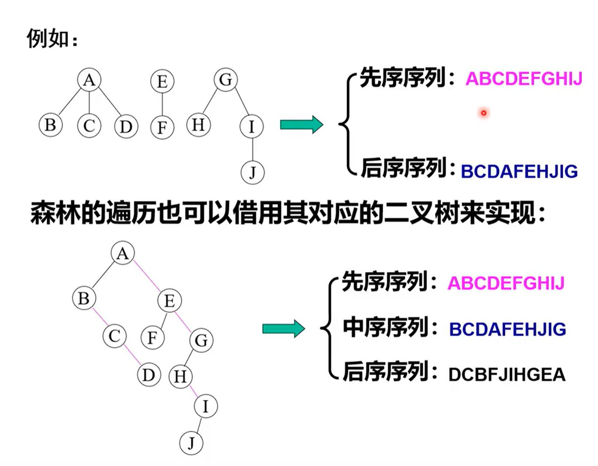

森林先序遍历 = 对应二叉树先序遍历  
森林后序遍历 = 对应二叉树中序遍历  

