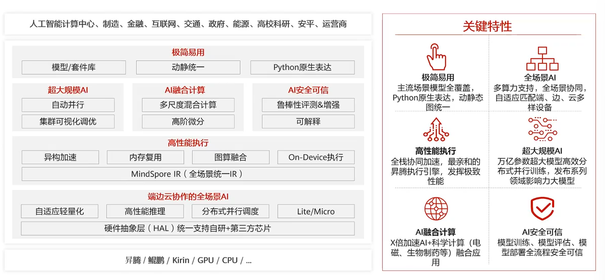
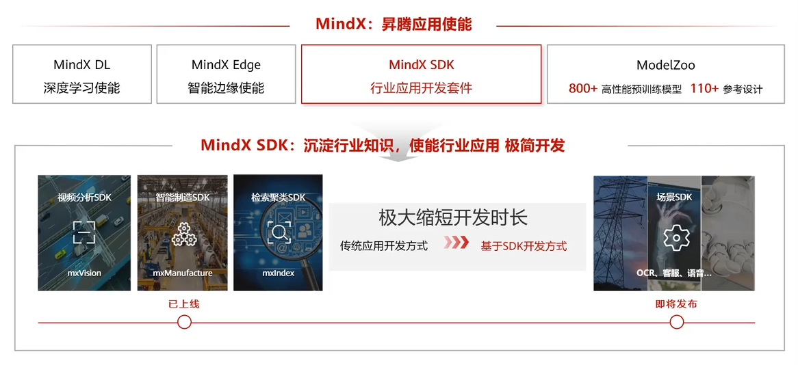

# 第一章 人工智能概览

## 人工智能概述

1950年，艾伦·图灵提出了“机器能否思考”的问题，并提出了图灵测试，即通过对话来判断机器是否具有智能。    

1956年，约翰·麦卡锡在达特茅斯会议上提出“人工智能”这个概念。     

多元智能的八种能力：  
- 语言  
- 逻辑推理  
- 视觉空间 对空间位置的感受  
- 肢体动觉  
- 音乐  
- 人际 与他人沟通时的反应  
- 自我认知 认识自我的优缺点  
- 自然 观察自然的各种形态  

 

人工智能的定义分为两部分：  
- 人工：由人设计，为人创造，服务人类  
- 智能：像人一样行为  

 

1950年人工智能  
- 研究、开发用于模拟人的智能的理论、方法、应用系统的技术科学    

1980年机器学习  
- 基于样本数据构建模型，做出预测或决策  
- 是实现人工智能的主要路径  

2010年深度学习  
- 机器学习的一个领域，源于人工神经网络的研究    
- 基于人工神经网络模型模拟人脑处理信息的方式    

 

### 人工智能主要学派

- 符号主义/逻辑主义/心理学派/计算机学派  
  - 人工智能源于数理逻辑，人类认知的过程是各种符号进行推理运算的过程    
- 连接主义/仿生学派/生理学派  
  - 人工智能源于仿生学，人类的思维基于神经元，而不是符号处理过程    
- 行为主义/进化主义/控制论学派  
  - 人工智能源于控制论，智能取决于感知和行动，不需要知识、表示、推理    

### 人工智能发展简史

- 1956：达特茅斯会议提出人工智能    
- 1959：阿瑟·萨缪尔提出机器学习    
- 1985：决策树模型和多层人工神经网络    
- 2006：Hinton开始研究深度学习  
- 2010：大数据时代  
- 2014：微软Cortana 第一个第一款个人智能助理  
- 2016：AlphaGo战胜李世石   
- 2018：基于Transformer的Bert模型   
- 2020：OpenAI发布GPT-3  
- 2022：Google发布扩散模型  

### 人工智能的分类

- 强人工智能  
  - 真正能推理和解决问题，具有自我意识，能理解、学习、创造    
- 弱人工智能  
  - 只能模拟人类的智能，不能真正理解、学习、创造，没有自主意识  

### 人工智能的产业生态

人工智能四要素：数据、算法、算力、场景  

### 人工智能领域

AI的通用技术方向主要为**计算机视觉**和**自然语言处理**  

## 华为人工智能发展战略

### 华为全栈全场景AI解决方案

### 异构计算架构 CANN

### 全场景AI计算框架 MindSpore

### 一站式AI开发平台 ModelArts

### 昇腾应用使能 Mind X

### 从AI+到+AI

- AI+  
  - 探索人工智能的自身能力  
- +AI   
  - 探索人工智能与行业结合的能力    

# 机器学习

## 机器学习算法

机器学习是研究“学习算法”的学科  

若一个程序在任务T上以性能度量P衡量的性能随经验E而自我完善，则称这个程序在从经验E中学习，以改进在任务T上的性能P  

