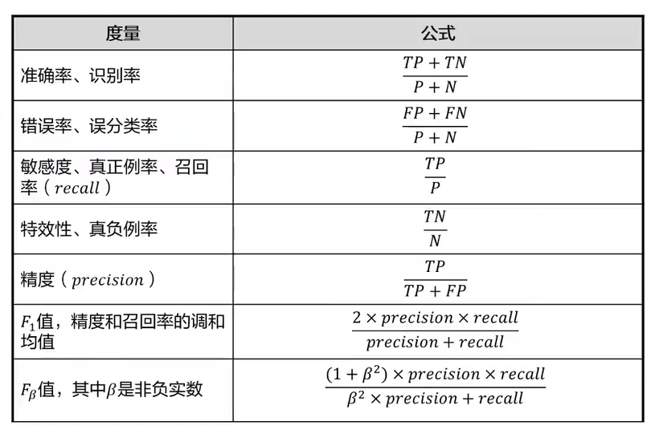

<script type="text/javascript" 
  src="http://cdn.mathjax.org/mathjax/latest/MathJax.js?config=TeX-AMS-MML_HTMLorMML">
</script>
<script type="text/x-mathjax-config">
  MathJax.Hub.Config({ tex2jax: {inlineMath: [['$', '$']]}, messageStyle: "none" });
</script>


<script type="text/javascript" 
  src="http://cdn.mathjax.org/mathjax/latest/MathJax.js?config=TeX-AMS-MML_HTMLorMML">
</script>
<script type="text/x-mathjax-config">
  MathJax.Hub.Config({ tex2jax: {inlineMath: [['$', '$']]}, messageStyle: "none" });
</script>

# 第一章 人工智能概览

## 人工智能概述

1950年，艾伦·图灵提出了“机器能否思考”的问题，并提出了图灵测试，即通过对话来判断机器是否具有智能。    

1956年，约翰·麦卡锡在达特茅斯会议上提出“人工智能”这个概念。     

多元智能的八种能力：  
- 语言  
- 逻辑推理  
- 视觉空间 对空间位置的感受  
- 肢体动觉  
- 音乐  
- 人际 与他人沟通时的反应  
- 自我认知 认识自我的优缺点  
- 自然 观察自然的各种形态  

<br/>

人工智能的定义分为两部分：  
- 人工：由人设计，为人创造，服务人类  
- 智能：像人一样行为  

<br/>

1950年人工智能  
- 研究、开发用于模拟人的智能的理论、方法、应用系统的技术科学    

1980年机器学习  
- 基于样本数据构建模型，做出预测或决策  
- 是实现人工智能的主要路径  

2010年深度学习  
- 机器学习的一个领域，源于人工神经网络的研究    
- 基于人工神经网络模型模拟人脑处理信息的方式    

<br/>

### 人工智能主要学派

- 符号主义/逻辑主义/心理学派/计算机学派  
  - 人工智能源于数理逻辑，人类认知的过程是各种符号进行推理运算的过程    
- 连接主义/仿生学派/生理学派  
  - 人工智能源于仿生学，人类的思维基于神经元，而不是符号处理过程    
- 行为主义/进化主义/控制论学派  
  - 人工智能源于控制论，智能取决于感知和行动，不需要知识、表示、推理    

### 人工智能发展简史

- 1956：达特茅斯会议提出人工智能    
- 1959：阿瑟·萨缪尔提出机器学习    
- 1985：决策树模型和多层人工神经网络    
- 2006：Hinton开始研究深度学习  
- 2010：大数据时代  
- 2014：微软Cortana 第一个第一款个人智能助理  
- 2016：AlphaGo战胜李世石   
- 2018：基于Transformer的Bert模型   
- 2020：OpenAI发布GPT-3  
- 2022：Google发布扩散模型  

### 人工智能的分类

- 强人工智能  
  - 真正能推理和解决问题，具有自我意识，能理解、学习、创造    
- 弱人工智能  
  - 只能模拟人类的智能，不能真正理解、学习、创造，没有自主意识  

### 人工智能的产业生态

人工智能四要素：数据、算法、算力、场景  


### 人工智能领域

AI的通用技术方向主要为**计算机视觉**和**自然语言处理**  

## 华为人工智能发展战略

### 华为全栈全场景AI解决方案


### 异构计算架构 CANN


### 全场景AI计算框架 MindSpore


### 一站式AI开发平台 ModelArts


### 昇腾应用使能 Mind X


### 从AI+到+AI

- AI+  
  - 探索人工智能的自身能力  
- +AI   
  - 探索人工智能与行业结合的能力    

# 机器学习

## 机器学习算法

机器学习是研究“学习算法”的学科  

若一个程序在任务T上以性能度量P衡量的性能随经验E而自我完善，则称这个程序在从经验E中学习，以改进在任务T上的性能P  


### 机器学习算法的理性认识

假设目标方程为$f: X \rightarrow Y$  

根据训练数据$D: \{ (x_1, y_1), \ldots, (x_n, y_n) \}$，通过学习算法，学习到所有的特征参数，使得到的函数 $g$ 尽可能逼近 $f$ ，即 $g \approx f$  

### 机器学习解决的问题类型

- 分类  
  - 根据样本特征，预测一个离散的输出标签    
  - 识别物体类型、垃圾邮件分类  
- 回归  
  - 根据样本特征，预测一个连续的输出值  
  - 预测房价、股票走势  
- 聚类  
  - 根据样本特征，将样本划分为若干个类别  
  - 用户画像、新闻分类  

## 机器学习算法分类

### 监督学习

用**已知类别**（称为标签）的样本，训练学习得到最优模型，再对未知类别的样本进行预测  

回归：反映了样本数据集中样本的属性值的特性，通过函数表达样本映射的关系发现属性值之间的依赖关系  

### 无监督学习

对**未知类别**的样本，学习算法将其划分为若干个类别，或学习样本之间的内在联系，然后对未知样本进行预测  

聚类：将**无标签**的样本基于**数据内在相似度**进行分类，使得同一组内的样本相似度高，而不同组之间的样本相似度低，可以帮助发现数据的内在价值    

### 半监督学习

从用少量有标记的数据和大量无标记的数据中学习

### 强化学习
 
感知**环境**，做出行动，根据状态和**奖惩**做出调整，寻找什么样的行为是最佳的    

## 机器学习的整体流程

### 数据收集

数据集：机器学习中使用的一组数据，每个数据称为一个样本，每个样本包含若干个特征，反映样本的属性    

训练集：训练过程中所使用的数据集，其中每个样本称为训练样本    

测试集：训练过程中所使用的数据集，其中每个样本称为测试样本  

数据集要划分为训练集与测试集，二者**不可以有交集**  

数据质量决定了模型能力的上限  

### 数据预处理

- 数据清理  
  - 填充缺失值、删除异常值、去重  
- 数据降维  
  - 简化数据属性，降低训练复杂度，避免维度爆炸  
- 数据标准化  
  - 减小噪声，提高模型准确性  
- 合并多个数据源的数据  
  - 将来自多个数据源的数据进行合并，形成一个完整的数据集，使数据“没有歧视”，不存在偏见   

脏数据：数据属性不完整，有异常值，数据不一致/有矛盾，无效重复，格式错误  

数据的转换：将预处理后的数据转换为适合机器学习模型的表示形式  

- 分类问题中，将类别数据编码为对应的数值表示   
  - 独热编码（One-Hot Encoding）  
    - 对每一个类别，创建一个新的二进制特征，每个类别用一个独立的二进制特征表示，类别之间没有顺序关系  
    - 红：[1, 0, 0]，绿：[0, 1, 0]，蓝：[0, 0, 1]  
  - 哑编码（Dummy Encoding）  
    - 与独热编码相似，但减少了一个类别的特征，通常将其中一个类别作为基准，其编码为全0  
    - 红：[1, 0]，绿：[0, 1]，蓝：[0, 0]  
- 将数值数据转换为类别数据以减少变量的值（分段）  
- 从文本数据中提取数据  
- 将图像数据转换为数值数据  

### 特征提取与选择

特征选择的必要性：  

- 简化模型，使模型更容易被使用者所解释  
- 降低训练难度，降低时间成本  
- 避免维度爆炸  
- 提高模型泛化性，避免过拟合  

特征工程：对特征进行归一化、标准化，保证同一模型不同输入变量的值域都相同   

特征扩充：对现有特征进行组合/转换以生成新的特征   

特征选择的方法：  

- 过滤法 Filter  
  - 遍历所有特征，评估每个特征与目标属性之间的相关性，保留高相关性的特征  
  - 过滤法选择特征时与模型本身无关  
  - 适用于选择冗余的变量，不考虑特征之间的关系  
- 包装器法 Wapper   
  - 遍历所有特征，生成数个特征子集，根据**模型**的准确性对特征子集评分，选择，准确性更高的特征子集作为结果  
  - 计算量特别大  
  - 对**特定类型**的模型性能好，但是泛化能力弱  
- 嵌入法 Embedded 
  - 将特征选择作为模型构建的一部分  
  - 遍历所有特征，生成一个特征子集，用学习算法对其进行效果评估，若效果不佳则重复生成特征子集  
  - 最常见的嵌入式特征选择方法是**正则化方法**    

### 模型训练


### 模型评估

- 泛化能力（最重要）  
  - 能否在实际的应用中获得较好的效果  
- 可解释性  
  - 预测的结果是否容易被解释  
  - 提高模型的可信度，解释整个模型的思路  
- 预测速率  
  - 每一次预测需要多长时间  

模型的有效性：  

- 泛化能力（鲁棒性）  
  - 模型是否适用于新的样本  
- 误差：预测值与实际值之间的差异  
  - 训练误差：模型在训练集上的误差  
  - 泛化误差：模型在测试集上的误差，实际希望泛化误差更小    
  - $预测总误差 = \text{偏差}^2 + 方差 + 不可消除的误差$  
    - 方差：模型的预测结果在**均值**附近的波动程度  
    - 偏差：预测值与**实际值**之间的差异
- 欠拟合：训练误差较大  
- 过拟合：训练误差较小但泛化误差较大  


模型的容量（复杂度）：拟合各种函数的能力  
- 容量小的模型不适用于复杂任务，容易欠拟合  
- 容量大的模型适用于复杂任务，但容量高于任务所需时容易过拟合  

#### 对回归问题的评估方法  

- 平均绝对误差 $\text{MAE} = \frac{1}{m} \sum_{i=1}^{m} |y_i - \hat{y}_i|$  
- 平均方差 $\text{MSE} = \frac{1}{m} \sum_{i=1}^{m} (y_i - \hat{y}_i)^2$  
- $R^2 = 1 - \frac{\text{RSS}}{\text{TSS}} = 1 - \frac{\sum_{i=1}^{m} (y_i - \hat{y}_i)^2}{\sum_{i=1}^{m} (y_i - \bar{y})^2}$，其中RSS为预测值与样本值的差异情况，TSS为样本之间的差异    

#### 对分类模型的评估方法

使用**混淆矩阵**  





混淆矩阵至少是一个m*m的表，理想情况下主对角线上的数字越大越好，其余数字趋于0  


## 机器学习的重要方法

### 梯度下降法

将当前位置的负梯度方向，即斜率为负的最大值，作为搜索方向。越接近目标值，梯度越小。  

$w_{k+1} = w_k - \eta \nabla f_{w_k}(x^i)$，其中 $\eta$ 为学习率，$i$ 表示第i个数据，权重参数 $w$ 表示每次迭代变化的大小  

- BGD 批量梯度下降  
  - 每次迭代使用数据集中的所有样本在当前点的梯度之和对权重参数更新  
  - 效果最好，最稳定，但是资源和时间成本高  
- SGD 随机梯度下降  
  - 每次迭代随机使用数据集中的一个样本的梯度对权重参数更新  
  - 样本选取是随机的，导致不稳定性  
- MBGD 小批量梯度下降 
  - 每次迭代随机使用数据集中的一部分样本（称为**Batch**）的梯度对权重参数更新  
  - 平衡BGD和SGD    

### 参数与超参数

参数：模型中本身所需的权重，由模型**自动学习**  

超参数：**人为设定**的参数，用于控制训练  

在训练集上根据性能指标对**参数**进行优化  
在验证集上根据性能指标对**超参数**进行优化   

超参数的搜索方法：  

- 网格搜索  
  - 穷举所有可能的超参数组合  
  - 成本高，耗时长，仅适用于超参数数目较少的机器学习算法  
- 随即搜索  
  - 随机选择超参数组合，试图找到最佳超参数子集    

交叉验证：原始数据除了分为训练集和测试集，还有验证集，使用训练集训练模型，使用验证集评估模型用于调节超参数，使用测试集评估模型性能  

- k折交叉验证（K-CV）   
  - 将原始数据（平均）分为k组   
  - 将其中一组作为验证集，其余k-1组作为训练集训练模型，重复k次，得到k个模型   
  - 用k个模型最终的验证集的准确度的平均数作为次K-CV下分类器的性能指标   

## 机器学习常见算法


### 线性回归 

用数理统计中的回归分析，确定两个或以上变量间相互依赖的定量关系的一种统计分析方法  

模型函数： $h_w(x) = w^T x + b$  
误差 $\epsilon = \text{真实值} y - w^T \cdot x$  
损失函数： $J(w) = \frac{1}{2m} \sum (h_w(x) - y)^2$  

只要损失值最小，即可得到最优的模型  

使用已有的库实现：  

```python
from sklearn.linear_model import LinearRegression  # 常用机器学习算法工具包
import matplotlib.pyplot as plt  # 绘图
import numpy as np

x = np.array([121, 125, 131, 141, 152, 161])  # 房屋面积
y = np.array([300, 350, 425, 405, 496, 517])  # 房屋价格

lr = LinearRegression()  # 用导入的类直接实例化为对象
x = x.reshape(-1, 1)  # 将x重塑为二维数组
lr.fit(x, y)  # 用x和y训练线性回归的模型
k = lr.coef_
b = lr.intercept_
print("斜率：", k, "，截距：", b)
plt.scatter(x, y)
plt.xlabel("area")
plt.ylabel("price")
# plt.plot([x1, x2], [y1, y2]) 从x1y1到x2y2画直线
plt.plot([x[0], x[-1]], [k * x[0] + b, k * x[-1] + b])
plt.show()

testdata = np.array([130])
testdata = testdata.reshape(-1, 1)
print("对", testdata, "的预测结果是:：", lr.predict(testdata))
```

```
斜率： [4.98467124] ，截距： -274.8769665187576
对 [[130]] 的预测结果是:： [373.13029447]
```

手动实现：  

```python
import matplotlib.pyplot as plt  # 绘图
import numpy as np

# 使用外部数据，内容为房屋的面积与价格
'''
文件格式如下：
1.000000	0.635975	4.093119
1.000000	0.552438	3.804358
1.000000	0.855922	4.456531
1.000000	0.083386	3.187049
1.000000	0.975802	4.506176
'''


# 定义读取数据函数

def get_raw_data(file_path):
    raw_data = np.loadtxt(file_path, skiprows=1)
    cols = raw_data.shape[1]
    return (raw_data, raw_data[:, :cols - 1], raw_data[:, cols - 1:])
    # 返回rawdata、rawdata除最后一列、rawdata最后一列


# 定义梯度计算函数
'''
计算给定模型参数 theta 对应的梯度（即损失函数相对于 theta 的偏导数），以便可以在梯度下降算法中更新 theta，逐步找到最优的参数
1/m * X^T * (X * theta - y)
X.dot(theta)：特征矩阵X与模型参数theta的矩阵乘法，即预测值
X.dot(theta) - y：预测值-实际值，即残差
X.T.dot(X.dot(theta) - y)：将X转置后与残差相乘，得到每个特征在所有样本上的误差总和，即损失函数对每个theta的偏导数
X.shape[0]：X的第一个维度中的元素数，即样本数
将结果除以样本数得到平均梯度
'''


def get_gradient(X, theta, y):
    return (1 / X.shape[0]) * X.T.dot(X.dot(theta) - y)


# 初始化theta

def init_theta(y_count):
    return np.ones(y_count).reshape(y_count, 1)
    # 创建一个长度为y_count的一维数组，填充为1
    # 然后将他转化为y_count行1列的矩阵，即列向量


# 定义梯度下降函数
'''
Jtheta = (X.dot(theta) - y).T.dot(X.dot(theta) - y)
计算Jtheta的过程：
X.dot(theta) - y：预测值与实际值之差，即残差
转置后再乘，即平方
Jtheta即为均方误差
'''


def gradient_descending(X, y, theta, alpha):
    # 输入值X，真实值y，权重theta，学习率alpha
    Jthetas = []  # 存储损失函数的变化趋势，验证是否正常进行梯度下降
    Jtheta = (X.dot(theta) - y).T.dot(X.dot(theta) - y)
    index = 0  # 记录训练步数
    gradient = get_gradient(X, theta, y)  # 计算梯度
    while not np.all(np.absolute(gradient) <= 1e-5):  # 循环计算直到梯度小于1e-5
        theta = theta - alpha * gradient  # 用学习率确定权重大小
        gradient = get_gradient(X, theta, y)  # 计算新梯度
        Jtheta = (X.dot(theta) - y).T.dot(X.dot(theta) - y)  # 计算损失函数
        if (index + 1) % 10 == 0:
            Jthetas.append((index, Jtheta[0]))  # 每10次存储一次损失函数值
        index += 1
    return theta, Jthetas


# 绘图展示Jtheta

def show_Jtheta(diff_value):
    x = []
    y = []
    for (index, sum) in diff_value:
        x.append(index)
        y.append(sum)
    plt.plot(x, y, color='b')
    plt.xlabel("steps")
    plt.ylabel("loss")
    plt.title("loss function")
    plt.show()


def show_fitting(theta, training_set):
    # theta包含训练得到的截距和斜率
    x, y = training_set[:, 1], training_set[:, 2]
    z = theta[0] + theta[1] * x  # 计算预测值
    # 绘制散点图
    plt.scatter(x, y, color='b', marker='x', label='sample data')
    # 绘制回归曲线
    plt.plot(x, z, color='r', label='regression curve')
    plt.xlabel('x')
    plt.ylabel('y')
    plt.title('linear regression curve')
    plt.legend()
    plt.show()


def main():
    file_path = "lr2_data.txt"
    raw_data, raw_data_x, raw_data_y = get_raw_data(file_path)
    x_count, y_count = raw_data_x.shape
    alpha = 0.01  # 学习步长
    theta = init_theta(y_count)
    final_theta, Jthetas = gradient_descending(raw_data_x, raw_data_y, theta, alpha)
    print("拟合得到的截距=", theta[0][0], "，斜率=", theta[1][0])
    show_Jtheta(Jthetas)
    show_fitting(final_theta, raw_data)


if __name__ == "__main__":
    main()
```

### 线性回归的扩展-多项式回归

模型函数： $h_w(x) = w_1x + w_2x^2 + \dots + w_nx^n + b$   

多项式回归仍是线性回归，因为权重参数 $w$ 之间的关系是线性的  

为了防止过拟合可以向损失函数中加入**正则项**：   

- L1：Lasso回归，$\lambda \sum |w|$    
  - $J(w) = \frac{1}{2} \sum \left( h_w(x) - y \right)^2 + \lambda \sum |w|$   
- L2：Rigde回归，$\lambda \sum w^2$      
  - $J(w) = \frac{1}{2} \sum \left( h_w(x) - y \right)^2 + \lambda \sum w^2$  
- 对模型的复杂度进行约束，使得模型参数不会过度地拟合训练数据中的噪声，鼓励模型选择更简单、更平滑的解  

### 逻辑回归

一种分类模型，解决分类问题。  

**Sigmoid激活函数**将线性回归的输出值映射到0-1之间，表示属于某一类的概率，取概率更大的类别作为预测结果  

$P(Y = 1 | x) = \frac{e^{wx + b}}{1 + e^{wx + b}}$   

$P(Y = 0 | x) = \frac{1}{1 + e^{wx + b}}$   


用最大似然估计计算得到的逻辑回归损失函数：  
$J(w) = \frac{1}{m} \sum \left( y \log h_w(x) + (1 - y) \log (1 - h_w(x)) \right)$  
其中 $w$ 为权重参数，$m$ 为样本数量，$x$ 为样本，$y$ 为真实值，$h_w(x)$ 为预测值

代码实现：  

```python
from sklearn.preprocessing import StandardScaler
from sklearn.linear_model import LogisticRegression
import numpy as np

x = [
    [2200, 15], [2750, 20], [5000, 40], [4000, 20], [3300, 20],
    [2000, 10], [2500, 12], [12000, 80], [2880, 10], [2300, 15],
    [1500, 10], [3000, 8], [2000, 14], [2000, 10], [2150, 8],
    [3400, 20],  [5000, 20], [4000, 10], [3300, 15], [2000, 12],
    [2500, 14], [10000, 100], [3150, 10], [2950, 15], [1500, 5],
    [3000, 18], [8000, 12], [2220, 14], [6000, 100], [3050, 10]
]

y = [
    1, 1, 0, 0, 1,
    1, 1, 1, 0, 1,
    1, 0, 1, 1, 0,
    1, 1, 0, 1, 1,
    1, 0, 1, 1, 0,
    1, 1, 0, 1, 0
]

ss = StandardScaler()
x_train = ss.fit_transform(x)  # 标准化数据

lr = LogisticRegression()
lr.fit(x_train, y)

test_data = np.array([2000, 8]).reshape(1, -1)
test_data = ss.transform(test_data)
test_result = lr.predict(test_data)
test_result_proba = lr.predict_proba(test_data)
print("对", test_data, "的预测结果为：", test_result, "准确率为：", test_result_proba)
```

```
对 [[-0.68911581 -0.57680534]] 的预测结果为： [1] 准确率为： [[0.32438363 0.67561637]]
```

### 逻辑回归的扩展-Softmax回归

将Sigmoid的二分类扩展为多分类   

$p(y = k \mid x; w) = \frac{e^{w_k^T x}}{\sum_{l=1}^{K} e^{w_l^T x}}, k = 1, 2, \dots, K$

- 首先计算每个类别的概率：$e^{w_k^T x}$  
- 然后计算所有类别的概率之和：$\sum_{l=1}^{K} e^{w_l^T x}$  
- 对每个类别的概率除以概率之和，得到输出概率  
- 输出概率最大的类别为预测类别  

### 决策树

决策树是一个树结构（可能是二叉或非二叉），每个非叶子节点表示一个特征属性上的测试，每个分支表示这个特征属性在某个值上的输出，每个叶子节点表示一个类别。  

即对每个特征属性进行分支，直到可能的一个结果  

对特征属性的分类依据：  
- 信息熵 $H(X)= -\sum_{k=1}^{K} p_k \log_2(p_k)$，其中 $p_k$ 表示样本属于类别k的概率  
- Gini系数 $Gini = 1 - \sum_{k=1}^{K} p_k^2$，    
- 由信息熵和Gini系数来量化划分操作的“纯度”，选择“纯度”最高的属性作为分割数据集的数据点  
- 分割前后的纯度差异越大，决策树越好  

### SVM 支持向量机

一种二分类模型，是定义在特征空间上的**间隔最大**的**线性**分类器。  

支持向量机的学习算法是求解凸二次规划的最优化算法    


核心思路：  
- 取离直线较近的点，称为**支持向量**，使支持向量到直线的距离最大  
- 在二维空间中用**直线**分割，在三维空间用**平面**分割，在高维空间用**超平面**分割  

非线性支持向量机：  
- 使用**核函数**将数据映射到高维空间，从而用线性平面或超平面进行分割    
- 常用核函数：线性、多项式、**高斯**、Sigmoid  


### KNN K最邻近算法

理论上成熟且最简单的机器学习的分类算法  

给定空间中一个点和K值（属于超参数），在空间中找出离该点最近的K个点，这K个点中数量最多的类别即为该点的预测类别   

- 近朱者赤 近墨者黑   
- 分类预测时采用多数表决法，回归预测时采用平均值法  
- 计算量很大  

K值的选择：  
- K值过小时分割过于细腻，容易过拟合   
- K值过大时分割边界趋于平滑，容易欠拟合  


### 朴素贝叶斯

基于贝叶斯定理的简单的多分类算法  

假设**特征之间是独立**的，给定岩本特征X，则样本属于类别H的概率为：  

$P(C_k | X_1, ..., X_n) = \frac{P(X_1, .. ., X_n | C_k) P(C_k)}{P(X_1, ..., X_n)}$  


即在知道先验概率的情况下，计算后验概率  

如已知下雨和下雨时打伞的概率，求打伞时下雨的概率    

### 集成学习

将多个学习器组合起来解决同一个问题  

多个弱分类器组合起来，形成一个强分类器  

集成学习的分类：  

- Bagging   
  - 构建多个基本学习器，平均其预测  
- Boosting  
  - 按顺序的方式构建多个基本学习器，逐步减少学习器的误差  

随机森林：Bagging + 决策树  
每一个决策树的数据集都是原数据集的一个子集  


### K-means

最基础的无监督学习算法  

输入n个数据对象和聚类的最终个数k，使得同一聚类中的对象相似度较高，不同聚类中的对象相似度较低  

### 层次聚类

无监督学习算法  

在不同层次上对数据集进行划分，形成树形的聚类结构  

# 深度学习

## 深度学习概览

神经网络：由多个简单的处理单元按某种方式彼此相互连接形成的计算机系统，该系统依靠其状态对外部输入信息的动态响应来处理信息    

深度学习是一种基于**无监督特征学习**的模型，即传入数据后，神经网络会自己完成对特征的学习，不需要人为干预，这也称为“端到端的学习”    

深度学习需要GPU对矩阵进行大量的并行运算   

### 单层感知器

输入层由多个结点组成，每个结点表示一个特征，每个结点都有一个对应的权重，表示这个结点的重要程度  

将一个输入向量 $X = [x_0, x_1, \ldots, x_n]^T$ 与权重 $W = [\omega_0, \omega_1, \ldots, \omega_n]^T$ 相乘，然后加上偏置 $b$，得到输出 $z$，再将其传入激活函数，即得运算的结果，即：   

$z = \sum_{i=0}^{n} \omega_i x_i + b$  
$y = f(z)$

单层感知器实现了二分类任务，即将多个输入向量映射到两个类别上         

### 前馈神经网络


前馈神经网络由多个单层感知器组成，每个单层感知器中有多个结点。每个单层感知器称为一个神经元，每个神经元都接受前一层神经元的输出作为自己的输入，然后将输出传递给下一层神经元，直到最后一层。  

每一层神经元中的所有结点都与前后神经元的所有结点相连接  

前馈神经网络的第一层称为 **输入层**，最后一层称为 **输出层**，中间称为 **全连接层**，其中有多个 **隐藏层**    

若没有隐藏层，则只能解决线性的简单问题  

## 训练法则

### 损失函数

在训练深度学习网络时，需要使用 **损失函数** 来反映预测值与实际值的误差  

不同任务常用的损失函数类型：  

- 回归任务：二次损失函数    
  - $C(W) = \frac{1}{2} \sum_{d \in D} (t_d - o_d)^2$  
  - $D$ 为所有的神经元，$d$ 为某一个神经元，$t_d$ 为实际值，$o_d$ 为预测值  
  - 添加 $\frac{1}{2}$ 的系数是为了中和求导得到的2倍，方便计算  
- 分类任务：交叉熵损失函数  
  - $C(W) = -\frac{1}{n} \sum_{x} \sum_{d \in D} [t_d \ln o_d]$  
  - 刻画了两个概率分布之间的距离  
  - $n$ 为样本总数，最前方的负号用于抵消$\ln o_d$ 产生的负值  

### 损失函数的极值

当损失函数很大时，需要根据损失函数的极值反向调节神经网络中的参数  

方法：沿着损失函数**负梯度方向**进行搜索，更新参数$W$，使得损失函数最小化   


以交叉熵损失函数 $C(W) = -\frac{1}{n} \sum_{x} \sum_{d \in D} [t_d \ln o_d]$ 为例：  

- 计算损失函数 $C(W)$ 对参数 $W$ 的梯度 $\nabla C(W)$，即损失函数在参数空间中的变化率   
- 由于 $o_d$ 是通过模型输出计算的，故需要使用链式法则来计算梯度：   
  - $\nabla C(W) = \frac{\partial C(W)}{\partial W} = \frac{\partial C(W)}{\partial o_d} \cdot \frac{\partial o_d}{\partial W}$
  - 其中 $\frac{\partial C(W)}{\partial o_d} = -\frac{1}{n} \left( \frac{t_d}{o_d} \right)$，$\frac{\partial o_d}{\partial W}$的计算依赖于具体的模型结构    
- 获得梯度后，我们可以使用梯度下降法更新参数 $W$：  
  - $W \leftarrow W - \eta \nabla C(W)$  

## 梯度下降的算法

### GGD 全局梯度下降算法

在整个训练数据集上计算梯度，即在每次迭代中使用**所有**可用的数据来更新模型参数  

- 优点：  
  - 更准确地反映损失函数的真实形状  
  - 收敛到全局最优解的可能性更高  
- 缺点：  
  - 计算成本和内存消耗巨大  
  - 计算耗时长，收敛速度慢  

### SGD 随机梯度下降算法

每次更新参数时只随机选择一个样本，计算该样本的梯度并进行更新

- 优点：  
  - 样本量小，计算速度快  
  - 内存和算力需求低    
  - 可能会跳过局部最优解，有利于寻求全局最优解    
- 缺点：    
  - 损失函数的变化可能会非常剧烈，导致收敛过程不稳定  
  - 可能需要更多的迭代才能收敛到最优解  
  - 全局最优解可能被跳过  
  - 受异常数据影响大  

### MBGD 小批量梯度下降算法

实际工作中**最常用**   

每次都使用整个数据集的一个小子集（称为Mini-Batch，他的大小记为BatchSize）进行训练，然后对这个子集计算梯度并更新模型参数  

## 神经网络训练的流程

- 初始化所有神经元的参数$\omega_i$   
- 前向传播  
  - 将特征向量 $X$ 传递给神经网络的输入层  
  - $X$ 与 $\omega_i$ 相乘并与偏置 $b$ 相加后传入激活函数，得到输出 $z$，作为下一层的输入值   
  - 最终在输出层，得到预测值 $o_d$  
- 反向传播  
  - 根据损失函数计算预测值与真实值的差距  
  - 将损失函数对各层神经元的参数求导，得到梯度 $\nabla C(W)$  
  - 沿梯度的负方向更新各层神经元的参数 $\omega_i$  
  - $\nabla \omega_i = \frac{d C}{d \omega_1} = \frac{\partial C}{\partial a_3} \cdot \frac{\partial a_3}{\partial z_3} \cdot \frac{\partial z_3}{\partial a_2} \cdot \frac{\partial a_2}{\partial z_2} \cdot \frac{\partial z_2}{\partial \omega_1}$
  - 根据学习率更新参数：  
  - $\omega_i \leftarrow \omega_i - \eta \nabla \omega_i$

## 反向传播

### EBP 误差反向传播

使用链式求导法则将预测的误差逐层反向传播给每一个神经元，用于更新参数

### 反向传播常见问题

#### 梯度消失

在反向传播过程中，梯度逐渐变得非常小，以至于几乎无法更新网络的权重，常见于深层的神经网络中，会导致网络难以学习，尤其是底层特征的学习速度极慢    

解决方法：  

- 梯度裁剪，即当梯度超过一定阈值时，对其进行削弱    
- 更换ReLU激活函数  
- 重新初始化模型参数  
- 使用LSTM神经网络

#### 梯度爆炸

在反向传播过程中，梯度变得非常大，导致权重更新过大，从而使得模型不稳定，常见于深层的神经网络中，也可能因为模型参数初值不合适  

## 激活函数

### Sigmoid


### tanhx


### ReLU


ReLU函数在一定程度上解决了深层神经网络中常出现的梯度爆炸和梯度消失的问题，但是可能导致神经元永远不能被训练（输入小于零时输出为零，求导也为零），称为**dead ReLU**现象  

### Leaky ReLU


其中 $\alpha \in (0,1)$，只要 $\alpha \neq 1$ 即可实现一个非线性的作用  

### Softplus


解决了函数在$x = 0$处不可导的问题，但是实际不常用，因为对数和指数的求导运算量过大  

### Softmax

$\sigma(z)_j = \frac{e^{z_j}}{\sum_k e^{z_k}}$  

主要用于多分类问题，将输出转换为概率分布，使得每个类别的预测值都在 $[0, 1]$ 之间，并且所有预测值加起来等于1。

## 正则化

减少泛化误差，避免模型过拟合  

常用技术：  

- 约束参数  
  - 参数添加约束，如$L_1，L_2$范数  
  - 训练集扩充，如添加噪声  
- 约束训练过程    
  - Dropout（随机失活）   
  - 提前停止训练  

### 参数惩罚

向目标函数 $J$ 添加一个惩罚函数 $\Omega(\theta)$，限制模型的学习能力。正则化的目标函数记为：      

$\tilde{J}(\theta; X, y) = J(\theta; X, y) + \alpha \Omega(\theta)$

其中 $\alpha \in [0, \infin)$ 是**惩罚因子超参数**，用于控制惩罚项对目标函数的影响。数值越大对应的正则化惩罚越大，等于零表示没有正则化    

- L1正则  
  - $\tilde{J}(w; X, y) = J(w; X, y) + \alpha \|w\|_1$  
  - 其中 $\|w\|$ 为所有 $w$ 的绝对值之和  
  - 使用梯度方法求解时，参数梯度为   
    - $\nabla \tilde{J}(w) = \alpha \text{sign}(w) + \nabla J(w)$  
  - 更新模型参数时，公式为：  
    - $w = \left( w - \epsilon \alpha \text{sign}(w) \right) - \epsilon \nabla J(w)$   
    - 其中$\text{sign}(w)$为符号函数，值域为 $(-1, 0, 1)$   
    - $\epsilon$ 为学习率  
  - $\epsilon \alpha \text{sign}(w)$ 实现了对参数 $w$ 的约束    

- L2正则  
  - $\bar{J}(w; X, y) = J(w; X, y) + \frac{1}{2} \alpha \|w\|_2^2$  
  - 其中 $\|w\|_2^2$ 表示所有参数的平方和，即 $\|w\|_2^2 = \Sigma w_i^2$，添加系数 $\frac{1}{2}$ 是为了抵消求导得到的二倍，便于计算        
  - 更新模型参数时，公式为：    
    - $w = (1 - \epsilon \alpha) w - \epsilon \nabla J(w)$  
    - 即给参数 $w$ 添加了一个衰减项，起到**参数衰减**的作用，且产生的参数不会变的稀疏，因此实际中更常用   
     
- L1与L2的对比    
  - L1正则化可以产生比L2更**稀疏**的模型，且参数$w$可以直接缩小为0，起到特征选择的作用    

### 参数增强

防止过拟合最简单的方法就是扩充训练集，训练集越大越不容易出现过拟合    

- 图像识别  
  - 图像旋转、缩放、增加噪声    
- 语音识别  
  - 增加噪声    
- NLP（自然语言处理）   
  - 近义词替换    

### 提前停止训练


当发现模型对验证集的loss值上升时就停止训练，防止过拟合    

### Dropout 随机失活

在训练过程中，根据超参数**失活率**随机地使一部分结点失活，不参与向前和向后的传播，且其参数不会被更新，减少神经元之间的相互依赖，促使网络学习更为Robust的特征    

不同结点失活会产生不同的神经网络，对同一个输入会产生多个结果，选择概率最大的预测结果作为这个模型对这个输入的预测结果

### 数据不平衡问题

在多分类任务中，对某些类别的训练数据极少，导致模型无法准确学习到该类别的特征，在测试集中的表现不佳    

解决措施：  

- 随机欠采样    
  - 删除类别中样本特别多的样本，使各个分类的样本数量接近  
  - 但是不适用于样本量过少的情况，会导致整个模型的泛化能力降低    
- 随机过采样    
  - 把样本数量少的类别中的数据进行拷贝，以扩充数据集    
- 合成采样  
  - 提取样本中的特征，并使用提取出的特征取重新组合生成新的数据    

## 优化器

梯度下降算法有各种改进版本。在面向对象的编程语言中，通常把不同的算法封装为一个对象，称为**优化器**  

改进算法的目的：  

- 加快算法收敛速度（对梯度的优化）    
- 尽可能避开局部极小值点，寻求全局最小值（对学习率的优化）  
- 降低设定超参数的难度，如学习率  

常用优化器  

- **动量优化器**、**Adagrad**、Nesterov、普通GD优化器、Adadelta、RMSprop、Adam、Adamax、Nadam  

### 动量优化器

为 $\Delta w_{ji}$ 增加动量项 $\alpha \Delta w_{ji}^{l}(n - 1)$ ，即上一次的修正量与动量系数 $\alpha \in [0, 1)$ 的乘积

$\Delta w_{ji}^{l}(n) = -\eta \delta_{i}^{l+1} x_{j}^{l}(n) + \alpha \Delta w_{ji}^{l}(n - 1)$  

其中 $\Delta w_n$ 是第n次对权重 $w$ 的修正量，正常情况下等于负的学习率与梯度的乘积    

动量项的添加使得模型的参数更新有一种**惯性**，每次模型参数的更新都依赖于前一次的更新，模型参数的更新方向更加稳定    

- 梯度较大时  
  - 动量项更新较大，加速收敛  
- 震荡或不稳定时  
  - 动量项更新较小，抑制震荡，平滑参数更新  

但是学习率和动量系数这两个超参数不易选择，需要多次实验    

### Adagrad优化器

随机梯度下降、小批量梯度下降、动量优化器这些方法在训练过程中对每一个参数都采用固定的学习率，但Adagrad优化器可以针对不同的学习阶段设定**不同的学习率**  

Adagrad优化器为每个参数分配一个独特的学习率，学习率会根据参数的历史梯度进行调整：  

- 参数的梯度在过去的更新中较大：学习率减小  
- 参数的梯度在过去的更新中较小：学习率增大  

实现过程：  
- 通过损失函数计算第t次的梯度  
  - $g_t = \frac{\partial C(t, o)}{\partial w_t}$  
- 设置参数：累计平方梯度  
  - $r_t = r_{t-1} + g_t^2 = r_{t-2} + g_{t-1}^2 + g_t^2 = \cdots$       
- 第t次权重w的修正量  
  - $\Delta w_t = -\frac{\eta}{\epsilon + \sqrt{r_t}} g_t$   
  - 常数$\epsilon$通常取$10^{-7}$，用于防止r开始时为0，导致除0错误   
  - 即**学习率会随梯度的累加而不断减小**    
- 更新模型参数  
  - $w_{t+1} = w_t + \Delta w_t$  

- 优点  
  - 随学习次数增加，学习率自动减低  
- 缺点  
  - 梯度不断累积，最终学习率趋于零，模型参数无法进行更新    

### RMSprop优化器

是Adagrad优化器的改进版本，引入了一个衰减系数，使梯度累积值能够随着时间而衰减，从而避免学习率过早的衰减为零  

实现过程与Adagrad相同，不同处在于累计平方梯度的计算：  

$r_t = \beta r_{t-1} + (1 - \beta) g_t^2$  

其中$\beta$是衰减因子   

### Adam优化器

Adam优化器结合了动量优化器和RMSprop优化器的优点，同时考虑了梯度的历史和平方梯度的历史，并引入了偏差修正项，使学习率更加稳定    

Adam优化器为每个待训变量维护了两个附加的变量：  

$m_t = \beta_1 m_{t-1} + (1 - \beta_1) g_t$
$v_t = \beta_2 v_{t-1} + (1 - \beta_2) g_t^2$

$m_t$ 即为引入了衰减因子的梯度的累加，$r_t$ 即为引入了衰减因子的梯度平方的累加  

$m_t$ 用于优化梯度，$v_t$ 用于优化学习率  

但是若以零向量初始化 $m_1$ 和 $v_1$，特别是$\beta_1$ 和 $\beta_2$ 都接近1时，会导致 $m_t$ 和 $v_t$ 趋于0，导致学习率趋于0，因此引入：  

$m_t' = \frac{m_t}{1 - \beta_1^t}$
$v_t' = \frac{v_t}{1 - \beta_2^t}$

通过除以 $1 - \beta^t$ 来减缓前面训练过程中梯度变化的偏差   

最后更新模型参数：

$w_{t+1} = w_t - \frac{\eta}{\sqrt{v_t'} + \epsilon} m_t'$

超参数通常取值：  
- 全局学习率 $\eta = 0.001$  
- 衰减因子 $\beta_1 = 0.99，\beta_2 = 0.999$  
- $\epsilon = 10^{-8}$   

## CNN 卷积神经网络

### CNN的核心思想

- 局部感知  
  - 图像的空间联系是：局部的像素联系较为紧密，而距离较远的像素相关性较弱  
  - 每个神经元没有必要对整个图像进行感知，只需要对局部进行感知，然后在更高层将局部的信息汇总得到全局的信息  
- 参数共享    
  - 每一个卷积核在扫描图像时，使用的参数都是一样的，即一个卷积核只提取一个特征    

### CNN架构


- 卷积层：一个图像经过卷积核扫描形成特征图，保存在后一层神经元中  
- 池化层：对上一个卷积层形成的（多个）特征图进行最大池化，得到新的特征图  
- 重复卷积和池化  
- 全连接层：将特征图拉伸为向量，进行全连接，并输出对本张图的预测  

### 单卷积核计算

卷积的主要作用是**特征提取**  


卷积核从图像左上角开始，与图像中对应位置的元素相乘后求和，存入特征图的对应位置，当卷积核碰到图像最右端时，卷积核移动到最左端并下移一行，重复卷积操作，直到最右下角处   

设图像的大小是P（长=宽=P），卷积核大小为f（ 必须为奇数），特征图大小为M，步长为S，填充值为T，则有：  

$M = \frac{P-f+2T}{S} +1$  

### 卷积层

卷积神经网络的基本结构是由多个单卷积构成的多通道卷积。  

上一层的输出或输入的原始图像作为本层的输入，与本层的卷积核卷积后与偏置相加，再经过激活函数，就作为本层的输出。  

### 池化层


> 最大池化，池化尺寸为2  

将池化区域内的值合并为一个值，减少特征图的维度  

池化区域移动的步幅与池化区域的尺寸相同    

- **最大池化**（更常用）    
  - 取池化区域内的最大值作为池化结果    
- 平均池化  
  - 取池化区域内的平均值作为池化结果  

### 全连接层

本质上是分类器，将图像经过卷积层和池化层提取出的特征拉伸为向量后，输入全连接层，输出预测结果  

通常使用Softmax激活函数，把所有局部特征结合为全局特征，用来计算每一类的概率  

$\sigma(z)_j = \frac{e^{z_j}}{\sum_k e^{z_k}} \in [0, 1]$  

> Softmax激活函数  

## RNN 循环神经网络

一种用于处理序列数据的神经网络架构，核心特点是具有**记忆**能力，可以保存上下文的状态   

在网络中引入**循环连接**，使得每次输出不仅依赖当前输入，还依赖于前一时刻的输出或隐藏状态，适合用于处理**序列数据**  

### RNN的网络架构


- $X_t$：在t时刻的输入  
- $X_t$ 与权重矩阵 $U$ 相乘，再与偏置相加，作为隐藏层 $S_t$ 的输入   
- $S_t$ 的输出是当时时刻输入与权重矩阵的乘积再加先前时刻与权重矩阵的乘积，经过激活函数所得  
- $S_t = \delta (UX_t + W S_{t-1})$  
- $S_t$ 的输出再经过全连接层 $V$ 即得时刻t的输出$O_t = softmax(S_t V)$  


> 每一个时刻向后传递，依次连接  

### RNN的类型


- one to one  
  - 同一时刻一个输入对应一个输出  
  - 适用于静态任务或者不涉及时间序列关系的任务  
  - 预测股票涨跌  
- one to many  
  - 同一时刻一个输入对应多个输出  
  - 适用于需要生成多个输出的任务  
  - 描述一个图像的内容（图像经过CNN提取特征，然后通过RNN生成描述）  
- many to one 
  - 多个时刻的输入对应一个输出  
  - 适用于需要从整个输入序列中提取信息并总结成一个输出的任务，如分类、回归问题    
  - 判断一段文字/语言中的情感   
- many to many  
  - 多个时刻的输入对应多个输出  
  - 适用于需要在输入和输出之间建立复杂的时序关系的任务    
  - 语音转文字、对话生成、机器翻译  

### RNN的学习 

**BPTT 时序反向传播**是普通的方向传播的扩展，可以计算损失函数在不同时间对模型参数的梯度  

反向传播时要对RNN的两个误差优化：t时序的误差 $C_t$ 对记忆单元的偏微分，t+1时序的误差对t时序记忆单元的偏微分  

BPTT的过程：  

- 前向计算每个神经元的输出值，并求损失函数  
- 反向计算每个神经元的误差值  
- 计算每个权重的梯度  
- 使用随机梯度下降算法更新权重    

### RNN的缺点

时序越长，最后一个时序的损失函数对第一个时序中w的梯度越容易出现梯度消失和梯度爆炸的问题  

长时序时，多个sigmoid函数累乘会导致早些时刻的信息丢失，即长时间记忆的信息会衰减   

记忆单元容量有限时会丢失信息  

记忆单元无法有选择地记忆重要的信息  

## LSTM 长短记忆性网络  


> LSTM的整体结构  

### 遗忘门


LSTM的第一步是决定丢弃什么信息  

$C_{t-1}$ 表示先前时刻中保存下来的信息，$C_t$表示当前时刻连同先前时刻保存下来的信息；$h_{t-1}$ 表示上一个时刻的输出，$h_t$ 表示当前时刻的输出   

- 将上一时刻的输出与当前时刻输出合并（**不是数值相加，而且拼接到一起**）  
- 将合并的数据与权重W相乘，然后与偏置b相加，再经过sigmoid激活函数，得到$f_t$  
- 将 $f_t$ 与 $C_{t-1}$ 相乘，得到 $P_t$ ，即可知道对于 $C_{t-1}$ 应该保留、抛弃哪些数值  
- 即根据当前的信息判断应该保留丢弃之前的哪些信息  

### 输入门


决定什么信息应该被记忆  

- 将上一时刻的输出与当前时刻输出合并  
- 将合并的数据与权重W相乘，然后与偏置b相加，再经过**sigmoid激活函数**，得到$i_t$    
- 将合并的数据复制一份，与权重W相乘，然后与偏置b相加，再经过**tanh函数**，得到$\hat{C_t}$  
- 将 $i_t$ 与 $\hat{C_t}$ 相乘，即使用 $i_t$ 来筛选 $\hat{C_t}$ 中的信息  
- 将筛选后的 $\hat{C_t}$ 与 $P_t$ 相加，得到 $C_t = f_t * C_{t-1} + i_t * \hat{C_t}$   
- 将 $C_t$ 输出，作为下一时刻的输入，即在时序上积累下来的要记忆的信息   

### 输出门

决定将那些信息输出  

- 将上一时刻的输出与当前时刻输出合并  
- 将合并的数据与权重W相乘，然后与偏置b相加，再经过**sigmoid激活函数**，得到$O_t$   
- 将 $C_t$ 经过**tanh函数**与 $O_t$ 相乘，得到 $h_t$  
- 将 $h_t$ 输出，作为当前时刻的输出  


#


