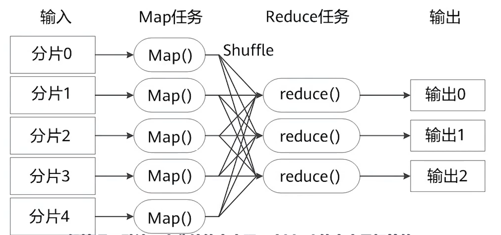

# HDFS Zookeeper

## 文件系统

一种存储和组织计算机数据的方法，使对数据的访问和查找变得容易  

- 文件名  
  - 用于定位存储位置      
- 元数据 Metadata  
  - 保存文件属性的数据  
  - 文件名、文件长度、文件权限、etc     
- 数据块 Block  
  - 存储文件的最小单元      

## HDFS

HDFS（Hadoop Distributed File System），Hadoop分布式文件系统，在**商品硬件**（商用服务器）上运行的分布式文件系统  

### 特性        

- 高容错能力，可部署于低成本硬件上   
- 提供对数据的高吞吐访问，适用于有大数据集的应用程序        
- 通过数据块机制可以提高客户端访问吞吐量        
- 放宽对Linux Posix的要求，实现对文件系统数据的**流式访问**，提高访问效率     
- HDFS最早是Apache Nutch Web搜索引擎项目的基础结构，现在是Apache Hadoop的核心部分       

### 应用场景  

- 存储网站数据      
- 存储交通电子眼数据    
- 存储气象传感器采集的数据  
- 不适用于需要实时响应的场景    
- 不适用于存储大量小文件        
- 不适用于多用户写和随机写  

### 计算机集群结构

- 分布式文件系统把文件分布存储到多个计算机节点上，这些节点构成计算机集群      
- 目前分布式文件系统采用的计算机集群使用普通硬件，降低硬件开销        

### 基本系统架构

- Client 客户端    
  - HDFS接口，用于访问文件      
- NameNode  
  - 存储文件名和元数据，数据块与DataNode的对应关系    
  - 管理Namespace（包含FSimage和editslog）      
    - FSimage负责维护文件系统树，以及文件树中的文件和元数据 
    - editslog负责记录对文件的修改操作  
- DataNode      
  - 负责文件的存储和读取        
- 在一个HDFS中，可以有多个Client和多个DataNode，但是只能有一个NameNode      

HDFS基本存储单位：Block 块  

- 默认大小128M，远大于普通文件系统，降低寻址开销      
- 一个文件被分为多个块进行存储      
- 块存储好处        
  - 支持大规模文件存储  
  - 简化系统设计    
  - 适合数据备份    

### 体系架构

### 命名空间管理

HDFS的命名空间包括**目录、文件、块**  

HDFS使用传统的分级文件体系，用户可以像使用传统文件系统一样创建删除目录和文件等      

由NameNode维护文件系统命名空间，对命名空间及其属性的更改由NameNode的editslog记录    

### 通信协议

所有HDFS通信协议都是构建在**TCP/IP**协议之上  

- Client通过可配置的端口向NameNode发起TCP连接，使用客户端协议与NameNode交互   
- NameNode和DataNode之间使用数据节点协议进行交互    
- Client与DataNode之间通过RPC进行交互       

客户端：  

- Client是用户操作HDFS最常用的方式，但严格来说Client不属于HDFS的一部分      

### 单NameNode的局限性      

- NameNode保存在内存中，HDFS的容量受限于内存大小        
- 整个HDFS的吞吐量受限于单个NameNode的吞吐量    
- 集群中只有一个NameNode，一个Namespace，无法对不同应用程序进行隔离     
- 一旦唯一的NameNode发生故障将导致整个集群不可用  

### 关键特性

- HA 高可用性（Hadoop 2.0）  
  -   
  - 有两个NameNode：Active（主节点）和Stand By（备份节点）    
  - 正常情况下仅由主节点提供服务，备份节点用于备份元数据信息        
  - 使用Zookeeper监控NameNode状态，当主节点故障时，使用备份节点接管服务，保证服务不中断     
- 元数据持久化（Hadoop 1.0）     
  -   
  - 通过Secondary NameNode实现   
  - 对editlog中的日志进行合并，减少editlog的大小，减少NameNode故障恢复时间      
- HDFS联邦（Hadoop 2.0）    
  - 
  - 用多个NameNode存储元数据，各个NameNode存储的Namespace的元数据 互不相交  
- 数据副本机制（Hadoop 1.0）  
  - 将同一个数据块复制到多个DataNode上，提高数据的可靠性和读取数据的吞吐量      
- 数据完整性保障    
  - 重建失效数据盘的副本数据        
    - DataNode故障时，NameNode发起副本重建动作，恢复丢失副本  
  - 集群数据均衡        
    - 保证数据库在DataNode上的分布是均衡的  
  - 元数据可靠性保证    
    - 采用日志机制操作元数据，同时将元数据存储于主备NameNode上  
    - 快照机制在误操作时可以及时恢复    
  - 安全模式    
    - 发现数据节点或硬盘故障时，禁止客户端对数据的**写操作**，防止故障扩散  

### HDFS 3.0 新特性

- 支持纠删码Erasure Coding      
  - 检错码：仅可以检测错码        
  - 纠错码：可以检测错码并对其纠正  
  - 纠删码：具备纠错码的功能，且可以在一定范围内数据出错的情况下恢复数据        
  - 3.0使用纠删码代替副本机制，提供了相同的容错能力，但存储占用小很多   
- 支持多NameNode    
  - 运行运行多个备用NameNode    
  - 但是只有一个Active NameNode提供服务，其余的都是Stand By     
- 基于HDFS路由器的联合      
  - 添加RPC路由层       
  - 简化HDFS客户端对联合集群的访问  
- DataNode新增负载均衡Disk Balancer     
  - 可以对节点内部磁盘间的数据进行平衡      

### 常用shell命令       

- dfs  
  - `-cat`：查看文件内容    
  - `-ls`：显示目录列表     
  - `-rm`：删除文件     
  - `-put`：上传目录/文件到HDFS      
  - `-get`：从HDFS下载文件/目录      
  - `-mkdir`：创建目录  
  - `-chmod`：改变文件属性      
- dfsadmin      
  - `-safemode`：安全模式操作   
  - `-report`：报告服务状态  

### 数据读写流程        

- 写入  
  - Client通过`Distribute File System`向NameNode发起创建文件的请求    
  - NameNode接收到请求后将可写入数据块的DataNode返回给Client    
  - Client通过`FSData OutputStream`写入数据    
    - 向第一个DataNode写入第一个副本    
    - 写入40%时将写入操作传给第二个DataNode，写入第二个副本     
    - 同理写入第三个副本    
    - 写完后反馈给Client    
  - 客户端关闭写操作    
- 读取  
  - Client通过`Distribute FileSystem`向NameNode发起读取文件的请求   
  - NameNode获取目标文件的元数据信息，即需要从哪些DataNode上读取Block  
  -  Client通过`FSData InputStream`读取数据    
    -  找到对应DataNode，读取所需Block    
  - 关闭输入流  

## Zookeeper

Zookeeper，分布式服务框架，用于解决数据一致性等分布式应用的数据管理问题，提供分布式、高可用性的协调服务能力  

### 体系架构

Zookeeper集群由一组Server节点组成，启动时选举其中一个为Leader节点（获得半数以上投票），其余为Follower节点  

Leader节点收到数据变更请求后，先写硬盘后写内存      

### 容灾能力

对有n个服务器的集群：  

- n为奇数，$n=2x+1$         
  - leader节点需要 $x+1$ 票，容灾能力为 $x$  
- n为偶数，$n=2x+2$         
  - leader节点需要 $x+2$ 票，容灾能力为 $x$   

### 关键特性

- 最终一致性    
  - 任一server所提供的数据是一致的   
- 实时性    
  - Client可以在一定时间范围内获得服务器的更新信息或失效信息    
- 可靠性    
  - 一条消息被一个server接收等同于被所有server接收  
- 等待无关性    
  - 低速或失效的client不会干预快速的client的请求，使得每个client都可以有效地等待    
- 原子性    
  - 更新要么成功，要么失败  
- 顺序一致性    
  - 客户端所发送的更新按照被发送的顺序执行      

### 读特性 

读操作可以在任意节点完成

### 写特性

对一个节点的写请求会自动发送给其余所有节点，最后一个节点逐层返回写入成功信息给客户端        

### 常用命令

| 命令 | 功能 |
| :---: | :---: |
| `zkCli.sh -server [ip:port]` | 连接Zookeeper服务器 |
| `create /node` | 创建节点 |
| `delete /node` | 删除节点 |
| `ls /node` | 列出节点子节点 |
| `get /node` | 获取节点数据 |
| `set /node data` | 设置节点数据 |

# Hive分布式数据仓库

## 概述

Hive是Apache的一个开源大数据组件，是基于Hadoop的数据仓库软件们可以查询管理PB级别的分布式数据    

### 特性 

- 灵活方便的ETL（extract transform load），可以将传统关系型数据库中的数据导入至大数据平台上   
- 支持Tez，Spark等多种计算引擎  
- 可直接访问HDFS文件和HBase 
- 易用易编程    

### 应用场景

- 数据挖掘  
  - 用户行为分析  
  - 兴趣分区  
- 非实时分析  
  - 日志、文本分析  
- 数据汇总  
  - 每日用户点击数  
  - 流量统计  
- 数据仓库  
  - 数据的抽取、加载、转换  

### 与传统数据库的比较

### 优点

- 高科高，高容错  
  - 集群式架构    
  - 双metastore存储元数据   
  - 超时重试机制  
- 类SQL语法   
- 可扩展  
  - 自定义存储格式和函数  
- 多接口  

## 功能与架构

Hive运行流程  

- Client提交HQL命令   
- Tez执行查询   
- Yarn为集群中的应用程序分配资源，为Yarn队列中的Hive作业启用授权  
- Hive根据表类型更新HDFS或Hive仓库中的数据  
- Hive通过JDBC返回查询结果  

### Hive数据存储模型

- 分区  
  - 数据包可以按照某个字段的值划分分区  
  - 每个分区是一个目录  
  - 分区数量不固定  
  - 分区下可以再有分区和桶  
- 桶  
  - 根据桶的方式将不同数据放入不同桶中  
  - 每个桶是一个文件  
  - 建表时可以指定桶的个数，桶内可排序  
  - 数据根据字段的Hash存入桶中    

分区和分桶都是为了加速Hive的查询而采用的数据模型  

- 托管表（内部表）  
  - 默认创建托管表  
  - Hive将数据存放于Hive所在HDFS所属的数据仓库的目录  
  - 所有数据处理均由Hive完成时使用托管表   
- 外部表  
  - 创建外部表需要关键字`external`  
  - Hive将数据存放于数据仓库之外，目录可以是HDFS上的任意目录  
  - Hive和其他程序处理数据使用外部表  

| 命令 | 托管表 | 外部表 |
| :-: | :-: | :-: |
| CREATE/LOAD | 数据移动到仓库目录 | 数据位置不移动 |
| DROP | 删除数据和元数据 | 仅删除元数据 |

### 常用函数

- 数学函数  
  - `round`, `floor`, `rand`, `abs`  
- 日期函数  
  - `to_date`, `mouth`, `day`  
- 字符串函数  
  - `trim`, `length`, `substr`  

自定义函数 UDF(User-Defined Function)

## 基本操作

打开Hive服务HiveServer2：  

打开Hcatalog，向其他大数据组件提供元数据：  

打开WebHcat，提供https的restful api服务：  

### Hive SQL

- DDL 数据定义语言   
  - 建表，修改表，删表，分区，数据类型  
- DML 数据管理语言   
  - 数据导入导出    
- DQL 数据查询语言    

# HBase技术原理

HBase是一种非关系型的分布式数据库，可以满足对海量数据的实时响应需求   

## 基本介绍

HBase是谷歌bigTable的开源实现，是高可靠、高性能、面向列、可伸缩的分部署存储系统，适用于存储大型表数据（数十亿行和数百万列），对其读写可达到实时级别，可**同时处理结构化和非结构化**的数据   

使用Hadoop HDFS作为其文件存储系统，使用Zookeeper作为协同服务    

HBase与RDB的区别    

- 数据索引  
  - 传统关系型数据库有复杂的多个索引，HBase仅有**行键**一个索引 
- 数据维护    
  - HBase的数据更新不会覆盖原版本，而是增加新版本   
- 可伸缩性  
  - RDB很难实现横纵向的扩展，HBase可以实现灵活的水平扩展  

## 相关概念

### 数据模型

原有程序以表的形式在HBase中存储数据，表由行和列组成，所有列从属于某一个列族  

行和列的交叉点称为cell，cell是版本化的，其内容是不可分割的字节数组    

表的行键是**字节数组**，任何东西（字符串或数字）都可以保存进去    

HBase所有表都必须有主键-key，HBase的表按字节的Key排序

### HBase表结构

- 表：由行和列组成  
- 行：每行由行键row key标识   
- 列族：表被分组成多个列族column family，是基本的访问控制单元   
- 列限定符：列族中的元素通过列限定符或列来定位  
- 单元格cell：行和列的交汇处，存储的数据没有数据类型，都被视为字节数组byte[]  
- 时间戳：cell中保存的数据的多个版本用时间戳索引  

这个表有两个列族：`contents`和`anchor`，anchor中有两个列`aachor:aa.com`和`aachor:bb.com`，contents中有一个列`contents:html`  

不同的行键、时间戳、列限定符构成一行数据  

HBase存储表示具有稀疏性，部分cell不存储数据  

### 行存储

数据按行存储在底层文件系统中，每一行分配固定的空间  

优点：利于对整行记录进行操作  
缺点：单列查询效率低，会读取不必要的数据    

### 列存储

HBase采用列存储，数据以列为存储单位   

优点：利于面向单列数据的读取统计  
缺点：整行读取需要多次IO    

## 架构

HBase中的文件最终存储于HDFS，文件需要转为DataNode中的block  

HBase架构包含三个功能组件：   

- 库函数  
  - 连接到Client    
- HMaster主服务器   
  - 是主控节点，负责维护HBase表的分区信息，维护其slaver节点HRegionServer服务器列表，分配Region负载均衡   
- HRegionServer服务器
  - 存储数据，维护分配给自己的Region，处理Client的请求  

Client通过**Zookeeper**获取Region的存储位置，然后从HRegionServer读取数据    

Client**不依赖于HMaster**，但是创建表需要与HMaster通信  

### 表和Region

HBase表最开始仅有一个Region，后来不断分裂  

Region分为Meta Region和User Region，Meta Region存储所有User Region的地址，User Region存储用户数据   

读取Region数据的过程：  

- 寻找Meta Region地址 
- 由Meta Region寻找User Region地址  

MetaRegion存储于内存中，每行占用1kb，每个Region最多占用128mb，即最多储存2^17个Region  

### HMaster高可用

Zookeeper帮助选举出一个Master作为集群的总管，保证同一时刻仅有一个Master在运行，避免Master单点失效   

Master负责：  

- 管理用户对表的增删改查  
- 实现不同Region服务器之间的负载均衡  
- 在Region分裂或合并后调整Region分布  
- 对失效的Region进行迁移    

### Region Server

HBase中最核心的模块，负责维护分配给自己的Region并相应Client请求，并定期报告自身心跳给Zookeeper   
 
## 关键流程

### 写入数据

- 访问Zookeeper，找到要访问的Region，然后找到相应的服务器写入数据    
- 数据先写入HLog，然后返回给客户端    
- 写入Memstore    

### 读取数据

- Region服务器访问Memstore（缓存）    
- 若MemStore中没有则去StoreFile中查找   

### MemStore缓存的刷新

- 系统周期性地把MemStore中的内容写入StoreFile并清空缓存，然后在HLog中写入标记   
- 每次刷写都会生成新的StoreFile文件，每个Store包中包含多个StoreFile文件  
- 每个HRegionServer都有一个HLog文件，每次启动时检查该文件，确认最近一次刷新后是否产生了新的写入操作   
  - 若有则先写入MemStore，然后刷写到StoreFile，再开始为Client服务   

大量的StoreFile会影响查找速度，需要调用`Store.compact`将多个StoreFile合并为一个   
但是合并比较耗费资源，只有到一定阈值才会进行合并    

### Store工作原理

Store是Region服务器的核心   

StoreFile过多时会合并为一个大StoreFile，StoreFile过大时会将Region分裂为两个子Region   

如，4个64m的StoreFile合并为1个256m的StoreFile，然后再分裂为2个128m的StoreFile  

### HLog工作原理

HBase使用HLog保证系统恢复  

每个Region Server都有一个HLog文件，是一种预写式日志  

Client更新数据后先写入HLog，当改日志写入磁盘后，将更新的数据写入MemStore    

当一个Region Server故障时：  

- Zookeeper通知HMaster  
- HMaster处理故障Region Server上的HLog    
  - 根据Region的记录和HLog的对应关系对HLog进行拆分    
  - 把HLog放在相应的Region下  
- Region Server接收相应的Region和HLog  
- Region Server重做HLog中的数据操作，写入MemStore，刷写到StoreFile  

## 突出特点

### 多HFile影响 Compaction

随HFile文件数的增加，读取时延越来越大   

为了降低时延，会采用压缩Compaction，减少同一个Region下同一个列族的小文件HFile数量  

Compaction的分类   

- Minor：小范围的Compaction，有最少最大文件数量限制，通常选一段连续时间内的小文件进行合并   
- Major：对该Region该ColumnFamily下的所有HFile进行合并    

### OpenScanner

采用OpenScanner进一步提升读写性能   

创建两个Scanner来读取HFile和MemStore中的数据：  

- MemStoreScanner：读取MemStore中的数据   
- StoreFileScanner：读取HFile中的数据

### BloomFilter

用于优化随机读取的场景（Get），可以快速判断一条数据是否在一个大的数据集合中  

对于“不存在”的结果可信，但是对“存在”有一定误判率    

BloomFilter的索引存储于HFile中    

## 性能优化

### 行键 Row Key

HBase仅通过row key进行索引，因此需要将经常一起读取的数据存储在同一行    

### 构建二级索引

访问行的三种方式：  

- 通过一个row key访问   
- 通过一个row key的区间访问   
- 全表扫描    

为了提高访问速度可以通过`coprocessor`特性构建二级索引：  

- `HIndex`：对多个表、多个列、部分列值索引   
- `Redis`、`Solor`二级索引  

## 常用shell命令 

| 命令 | 用途 |
|:---:|:---:|
| create | 创建表 |
| list | 列出HBase中所有表信息 |
| put | 向表、行、列指定的cell添加数据 |
| get | 通过表、行、列、时间戳查询数据 |
| scan | 浏览表的相关信息 |
| drop | 删除表 |
| disable/enable | 启用/禁用表 |

删除表需要先disable然后再drop  

# MapReduce和Yarn

## 基本介绍

MapReduce是大数据领域中著名的分布式计算处理框架，Yarn是Hadoop集群中负责资源管理与调度的组件   

### MapReduce

MapReduce基于谷歌的论文开源实现，用于对大规模数据集的并行和离线计算   

特点：  

- 编程思想高度抽象  
  - 程序员仅考虑做什么，如何实现交给框架    
- 良好的扩展性  
  - 可以添加节点以扩展集群能力  
- 高容错性    
  - 通过计算迁移或数据迁移提高集群的可用性与容错性    

### 资源调度与分配  

在Hadoop1.0中，仅有HDFS和Map Reduce，资源调度通过MapReduce自带的资源调度管理器MRv1实现  

缺点：  

- 单点master，故障恢复依赖于周期性的checkpoint，故障时由用户决定是否重新计算    
- 不区分作业调度和资源调度  
- 没有资源隔离和安全性    

在Hadoop2.0中引入Yarn，负责资源调度与分配，MapReduce仅负责计算，两者解耦    

### Yarn

Apache Hadoop YARN(Yet Another Resource Negotiator)是新的Hadoop资源管理器，是一个通用资源管理系统，可以为上层应用提供统一的资源调度  

## 功能与架构

### MapReduce过程

- Map阶段   
  - 解析杂乱无章的数据，提取出key和value，即数据的特征    
  - 先将待处理的任务进行分片Split，默认将一个block作为一个分片，可以自定义    
  - 将数据写入环形内存缓冲区，占用达到80%时进行溢写Spill，将缓冲区中的数据进行分区、排序、合并、归并，最后写入磁盘  
- Reduce阶段    
  - 对key和value重新组织，使其有相关性    

