# 第一章 云计算基础

## 基础知识

### 背景

传统IT面临的挑战：  

- 业务上线慢  
- 扩展困难  
  - 集中式架构扩展性低于分布式架构  
- 可靠性低  
- 生命周期管理复杂  
- IO瓶颈导致延迟  
- TCO居高不下  
  - Total Cost of Ownership：某项资产的全部成本，一般称为使用成本

企业IT基础设施架构演变：  

- 传统企业IT架构  
  - 服务器直接安装操作系统，软硬件存在强耦合关系，硬件资源利用率低，运维复杂  
- 虚拟化架构  
  - 软硬件解耦，资源利用率高  
- 企业云化IT架构  
  - 强调资源的整合与统一调度，架构从集中式转向分布式  

### 定义

云：  
- 互联网与建立互联网所需的底层基础设施的抽象体，即资源都在云端  

计算：  
- 性能强大的计算机提供的计算服务，包括资源、存储等  

云计算：  
- 用户通过互联网可以使用一台强大的计算器为自己服务，这种服务的使用量可以用统一的单位来描述。  

### 示例

云相册、云盘、视频会议、政务网上办事  

### 模式

部署模式：  
- 公有云  
  - 由云服务提供商搭建云基础设施，提供给个人或企业使用，有统一的架构、API、生态   
- 私有云  
  - 云数据中心部署于企业内部，所有数据保存于企业自己的云数据中心内。对所有数据的访问都需要经过数据中心的防火墙  
- 混合云
  - 公有云和私有云协同使用  

服务模式：  

IaaS (Infrastructure as a Service)：基础设施即服务  
- 由云平台提供基础设施及其维护，用户仅需关系基础设施资源之上的内容，如应用及其运行环境  
- ECS弹性云服务器、EVS云硬盘等  

PaaS (Platform as a Service)：平台即服务  
- 由云平台提供基础设施和平台资源，用户仅需关注应用及其运行环境   

SaaS (Software as a Service)：软件即服务  
- 由云平台提供全部资源及其维护，用户可以直接使用  
- 人脸识别、语音转文本等  

|   种类   | 传统IT | IaaS | PaaS | SaaS |
|:------:|:------:|:----:|:----:|:----:|
|   应用   |   ×    |  ×   |  ×   |  √   |
|   数据   |   ×    |  ×   |  ×   |  √   |
| 运行环境 |   ×    |  ×   |  √   |  √   |
|  中间件  |   ×    |  ×   |  √   |  √   |
| 操作系统 |   ×    |  ×   |  √   |  √   |
|  虚拟化  |   ×    |  √   |  √   |  √   |
|  服务器  |   ×    |  √   |  √   |  √   |
|   存储   |   ×    |  √   |  √   |  √   |
|   网络   |   ×    |  √   |  √   |  √   |

> 用户侧管理：×   
> 云平台管理：√  

### 价值

- 按需自助服务  
- 广泛网络接入  
  - 无论何时何地，只要有网络就可以接入  
- 资源池化   
  - 资源池：云服务提供商将计算、存储和网络等资源集中管理，形成一个共享的资源库，供多个用户按需使用  
  - 资源池化：将这些资源虚拟化，使其能够动态分配和弹性伸缩，提高资源利用率和灵活性   
- 快速部署，弹性扩容  
- 可计量服务  
  - 使用的所有资源都可以被监控和计量并计费的  

### 通用点  

- 大规模  
- 同质化（标准化）  
- 虚拟化  
- 弹性计算  
  - 资源的快速供应和释放  
- 低成本软件  
- 先进安全技术  
- 地理分布  
- 面向服务  

## 基础技术

### 计算类技术

#### 虚拟化

将单台物理服务器虚拟为多台虚拟机，共享同一个物理服务器的硬件资源  

虚拟化的本质是将原先的物理设备逻辑化，转化为一个文件夹或文件，实现软硬件的解耦  

- 虚拟机由**磁盘文件**和**描述文件**组成，封装于同一个文件夹中  
- 多个虚拟机各自封装，互相隔离  

虚拟化是云计算的**核心技术**

虚拟化的特点：  

- 分区  
  - 虚拟化可以对资源进行划分，根据虚拟机的规格大小给虚拟机分配资源  
- 隔离  
  - 虚拟机和虚拟机之间是互相隔离的  
- 封装  
  - 虚拟机是以文件的形式存在的  
- 独立  
  - 即相对于硬件独立（软硬件解耦）  
  - 虚拟机跟硬件不存在绑定关系  

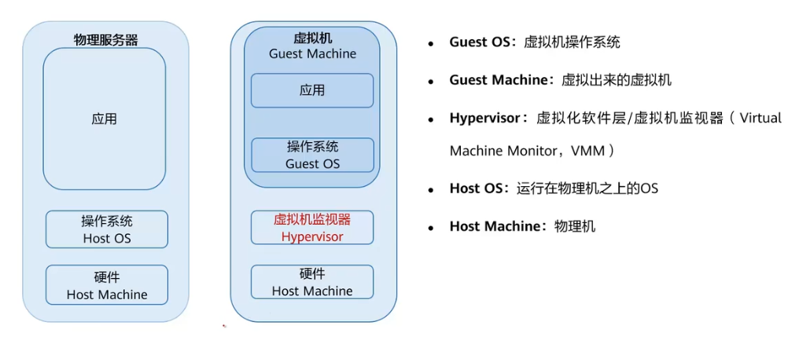

Hypervisor（Virtual Machine Monitor）：虚拟化软件层（虚拟机监视器）  

- 对下：将底层物理硬件虚拟化为虚拟硬件VHM（Virtual Hardware）  
- 对上：基于虚拟硬件创建虚拟机并对其管理监控  

身边的计算资源：CPU、GPU、内存、etc.  

计算在云服务中的服务形态：  

- ECS 弹性服务器  
- AS 弹性伸缩  
- IMS 镜像服务  

#### 容器

一种操作系统级的虚拟化，是一个轻量级、可移植的软件打包技术，可以将**软件本体**及其**相关依赖**打包，使软件可以在任何计算介质中运行。  

容器技术的发展：  

- 1979：Chroot  
  - 修改进程的根目录，使进程只能看到其根目录下的文件，从而实现进程的隔离  
- 2008：LXC(Linux Containers)  
  - 基于Chroot技术，通过Cgroup、Namespace等技术实现进程、网络、文件系统等的隔离  
- 2013：Docker（容器引擎）  
  - 基于LXC，通过Dockerfile、Docker镜像、Docker容器等技术实现软件的打包和分发  

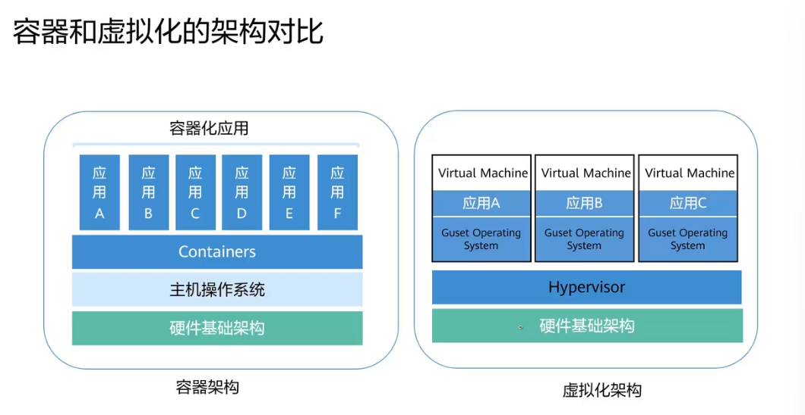
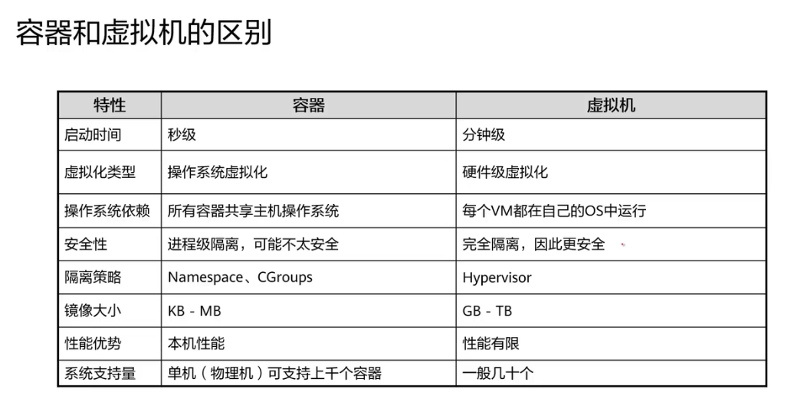

容器和容器之间共享同一个操作系统，虚拟机和虚拟机之间是独立的操作系统   

容器在云计算中的服务形态：  

- CCE 云容器引擎  
- CCI 云容器实例   
  - 无服务器的容器服务，用户不需要创建和管理服务器集群就可以直接运行容器  
- 容器镜像服务  
  - 为容器实例提供镜像  

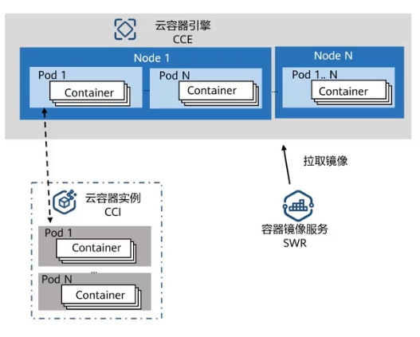

### 网络类技术

#### 传统网络的基本概念

- 广播和单播  
  - 一台虚拟机将消息发送给网络中的所有虚拟器/对网络中的某一个特定的虚拟机进行一对一通信  
- 路由  
  - 即路由器，负责分析数据包的目标地址，决定最佳的传输路径，并将数据包转发到下一个网络节点  
- 网关  
  - 用于链接不同网络和协议的设备，允许局域网内的设备与外部网络（如互联网）进行通信  
  - 同一局域网内的通信可以使用MAC地址，不需要借助路由和网关  
  - 在有多个子网的大型局域网中仅需要路由器在不同子网中转发数据包，而不需要网关（前提是这些子网使用相同的网络协议）  
  - 访问外部网络时，需要网关转发数据包  
  - 路由器可以作为网关使用  
- VLAN 虚拟局域网   
  - 将不同的网络设备划分到不同的虚拟局域网（逻辑子网）中，实现逻辑隔离。即使它们共享同一物理网络，它们之间的通信是隔离的   
  - VLAN跟地理位置无关，无论设备位于物理网络的哪个地方，只要它们被配置为同一VLAN，便可以相互通信  
  - 在同一VLAN中的通信不需要路由和网关，不同VLAN间的通信需要路由  

网络的七层协议：OSI模型  

- 物理层  
  - 负责用物理信号传输比特流，如电信号、光信号、电磁波     
  - 电缆、光纤、无线信号、网络适配器   
- 数据链路层  
  - 将来自网络层的数据包封装成帧，并添加必要的头部和尾部信息；让交换机根据**MAC地址**定位设备  
  - 在物理层的基础上建立可靠的传输通道，对数据进行封装、校验、纠错，控制网络层和物理层之间的通信  
  - 以太网Ethernet、无线局域网WiFi  
- 网络层  
  - 确定数据包的最佳转发路径；使用**IP地址**进行标识，允许不同网络中的设备相互通信  
  - IP寻址和路由选择  
- 传输层  
  - 建立TCP或UDP连接；给数据报文打上**端口号**，标记数据属于哪个应用  
  - 提供端到端的通信，建立、维护、管理端到端连接  
  - TCP：可靠性高，速度慢延迟高  
  - UDP：速度快延迟低，可靠性低  
- 会话层  
  - 两个程序之间的接口  
  - 建立、维护、管理会话连接  
  - RPC、NFS、淘宝调用支付宝  
- 表示层  
  - 计算机用自己的编码方式对用户的数据进行编码  
  - 数据的表示、加解密、压缩、格式转换  
  - SSL、TLS  
- 应用层  
  - 为用户提供网络服务  
  - HTTP、FTP、SMTP、文字、图片、视频  

简化后的模型：TCP/IP对等模型  

- 将OSI中的应用层、表示层、会话层合并为一个**大的应用层**，由软件开发者负责  
- 应用层-传输层-网络层-数据链路层-物理层  

在TCP/IP标准模型中，会将数据链路层和物理层进一步合并为**网络接入层**  

各层的常见协议：  

- 应用层  
  - HTTP：超文本传输协议，网页浏览  
  - Telnet：远程登陆协议，远程管理  
  - FTP：文件传输协议，互联网文件资源共享  
  - SMTP：简单邮件传输协议，互联网电子邮件服务  
- 传输层  
  - TCP：传输控制协议，可靠传输，对每个数据包有确认机制  
  - UDP：用户数据报协议，不可靠传输  
- 网络层  
  - IP：互联网协议，将传输层的数据封装成IP数据包  
  - ICMP：互联网控制报文协议，用于检测网络故障   
  - IGMP：互联网组管理协议，用于多播  
- 数据链路层：  
  - Ethernet：以太网协议，将网络层的数据封装成帧并转发给目的地  
  - PPP：点对点协议，在两节点间建立直接的连接  
  - PPPoE：以太网上的点对点协议，用于互联网接入，如宽带拨号上网   

#### 传统网络包含的设备

- 路由器  
  - 在网络层工作，连接多个网络，基于IP地址进行数据包路由转发  
- 二层交换机  
  - 在数据链路层工作，根据MAC地址转发数据帧  
- 三层交换机  
  - 同时在数据链路层和网络层工作，结合了路由器和二层交换机的功能  
- 服务器网卡   
  - 在物理层和数据链路层工作  
  - 负责数字信号与物理信号之间的转换；负责生成接收数据帧，使用MAC地址进行帧的封装解封装

对于多个局域网内的多个设备，实现跨子网的通信有两种方式：  

- 二层交换机和路由器  
  - 每个局域网内的设备都连接到各自的二层交换机，二层交换机负责在局域网内部根据MAC地址转发数据帧  
  - 所有二层交换机连接到一个路由器，路由器负责根据IP地址进行数据包的路由转发  
- 使用三层交换机  
  - 所有设备均连接到三层交换机  
  - 三层交换机进行局域网内的MAC地址转发，并根据IP地址处理跨子网的通信  

#### 虚拟网络的基本概念

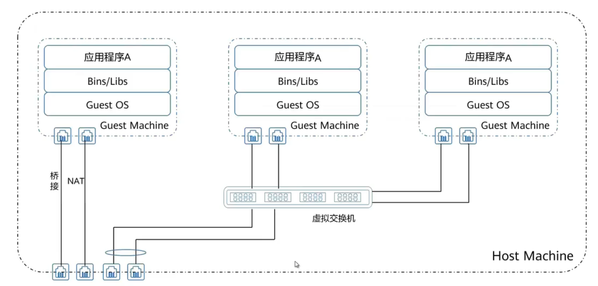

虚拟机与虚拟机或外部网络进行通信的方法：  

- 桥接  
  - 将虚拟机的网络接口直接连接到物理网络的同一网段，像物理设备一样获取IP地址，与外部网络及其他虚拟机直接通信  
- NAT  
  - 将虚拟机的私有IP地址转换为宿主机的公共IP地址  
- 虚拟交换机  
  - 在虚拟环境中创建一个逻辑交换机，允许虚拟机之间和虚拟机与外部网络的流量交换  
  - OVS标准虚拟交换机、EVS增强型虚拟交换机、DVS分布式虚拟交换机（可以跨服务器分布）  

#### 网络在云计算中的服务形态  

- VPC 虚拟私有云  
  - 云上的隔离的虚拟网络环境  
- NAT 网关  
  - 网络地址转换服务，允许私有网络中的资源安全地访问公共网络  
- IP EIP 弹性公网  
  - 为ECS提供互联网访问的IP地址  

### 储存类技术

企业存储领域主流的存储类型  

- 块存储  
  - 将磁盘阵列中的多块硬盘通过raid使其形成LUN，将其挂载映射给服务器，**服务器**对LUN进行**格式化并创建文件系统**后才可以存放数据（不可以直接存放数据）   
  - 传统块存储：硬盘通过服务器本地的总线连接，总容量和带宽受限于服务器总线  
  - 现代块存储（存储阵列）：控制框+硬盘框，存储阵列和服务器通过光纤或以太网连接   
- 文件存储  
  - 即共享文件系统，可以将一个目录共享给多个主机进行访问，适用于协同办公  
  - 在**存储侧**中建立文件系统，主机端可以通过文件共享协议直接访问共享文件目录  
  - 常见的文件共享协议：NFS、CIFS   
- 对象存储  
  - 支持HTTP(S)协议，允许终端设备通过公网访问数据  
  - 不使用磁盘阵列，而是使用服务器的本地硬盘，通过**分布式存储软件**对每一个服务器节点的资源进行整合，形成**分布式存储池**  

企业存储的发展过程  

- 硬盘在服务器内部  
  - 服务器通过内部总线使用磁盘资源  
  - 磁盘槽位有限，空间利用率低，性能瓶颈  
- DAS 外部磁盘阵列  
  - 磁盘阵列通过SCSI卡连接到服务器，在逻辑上把多个物理磁盘串联到一起  
- SAN/NAS 存储区域网络  
  - 服务器通过网络连接存储资源  
  - 易于提升磁盘阵列的性能和容量  

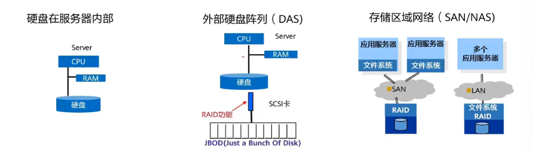

分布式存储技术  

- 与磁盘阵列（集中式存储）相对，通过分布式存储软件，可以将多个节点（服务器的本地硬盘）的资源整合形成一个分布式存储资源池  
- 可以分散存储系统的性能和容量压力，同时保障数据的安全性  

存储在云服务中的服务形态  

- EVS 弹性云硬盘  
  - 为ECS提供块存储资源  
- SFS 弹性文件服务  
  - 为ECS提供文件共享访问服务  
- OBS 对象存储服务  
  - 为ECS提供对象存储服务  

# 第二章 华为云   

## 简介

华为云是面向所有用户的**公有云**，提供200余中云服务  

华为云提供全球化的连接和服务，连接全球20余个地理区域  

硬件创新：处理器、网卡、SSD、安全芯片  

**云擎天架构**：自研的**云基础设施方案**，是华为云、华为云Stack、华为云边缘统一的技术底座  
 
- 实现了裸金属、虚拟机、容器共存于同一台虚拟机中，共享资源池，允许资源百分百利用  
- 双零损耗容器允许擎天卡负责容器的功能，提升网络性能，节约成本  

**云瑶光**：面向云、AI、5G的，运行于基础设施底座（擎天）上的**分布式云操作系统**   

- 全域调度：支持十万数量级别分布式节点的调度协同和全域的资源供给  
  - 中心与边缘调度：就近接入性能最优的节点  
  - 边缘自治与协同调度：边缘可以独立进行数据预处理和推理；在不同层次之间协调资源分配，以达到全局最优的效果  
  - 服务按需调度
- 多样性算力智能匹配：对CPU、GPU等算例的需求进行智能匹配  
- 动态协商与治理：实时调整云平台内部各个组件之间的协作关系，以应对不断变化的工作负载需求  

## 应用场景

- 企业上云中心  
  - 对用户企业从初创到营销、管理、业务扩展的全套上云解决方案，助力用户业务快速发展  
- 行业解决方案  
  - 为不同行业的用户提供特定行业的解决方案  
- 通用解决方案  
  - 基于丰富的云基础服务，提供适用于各行业的、预集成的产品和能力的组合，满足业务上云的需求    
- 组织解决方案  
  - 针对企业、公益、非盈利机构、HMS生态伙伴提供的定向解决方案，助力快捷上云  

## 交付模式  

- 公有云  
  - 为用户提供IT基础设施服务，使用华为云相关的云服务给用户使用   
- 华为云Stack  
  - 针对政企客户，云基础设施部署于客户本地的数据中心，可以满足数据本地化存储、设备物理隔离。属于混合云模式  
- 边缘云  
  - 部署于距离企业和热点用户更近的边远地区，可降低时延  

## 技术支持  

为用户提供服务保障、服务支持计划，以及上云全流程的技术服务  

- 新手入门  
  - 云产品入门、沙箱实验室、在线课程
- 客户支持  
- 增值服务  
  - 提供专业服务知识  

## 生态

华为云合作伙伴体系  

- 资讯类伙伴   
- 技术类伙伴  

共创共享共赢

## 快速入门

### 计费模式  

- 按需计费  
  - 后付费模式，根据使用时间**按小时**实时计费  
- 包月包年  
  - 先付费模式  
- 竞价计费
  - 后付费模式，设定最高出价，根据实际使用量进行扣费，当市场价格高于设定的最高出价时自动中断服务并回收  

### 区域 Region  

- 不同区域的时延和价格不同  

### 可用区 AZ  

- 一个或多个物理数据中心的集合，有独立的供电、消防、制冷等基础设施  
- 在AZ内将计算、存储等资源在逻辑上划分为多个集群  
- 一个Region中包含多个AZ，互相使用光纤相连  

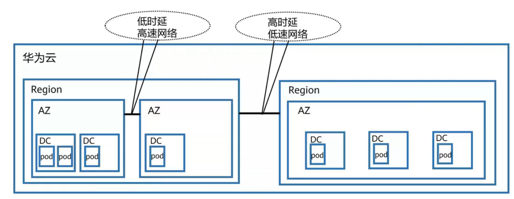

华为云有多个Region，每个Region有多个AZ  

### 统一身份认证管理服务 IAM

提供给用户的用户资源管控服务，适用于用户在不共享自己账号的情况下向他人共享自己的资源  

IAM还可以通过**IAM项目**实现资源的分组与**物理隔离**，不同IAM项目中的资源不可以迁移，只能删除后重建  

**企业项目**是IAM项目的升级版，针对于企业不同项目间资源的管理与**逻辑分组**。企业项目可以包含多个Region的资源，项目的资源可以在不同项目间迁移   

# 第四章 计算云服务

计算类的服务是唯一一种可以承载客户的业务端实体的服务  

计算服务总览  

- ECS 弹性云服务器  
  - 虚拟机  
- BMS 裸金属服务器  
  - 物理机    
- AS 弹性伸缩  
  - 用于动态扩缩容的策略服务    
- CCE 云容器引擎    
  - 下一代的轻量级虚拟化服务  
- IMS 镜像服务  
- CPH 云手机  
- FACS FPGA加速云服务器  
- GACS GPU加速云服务器  
- DeH 专属主机  
- FGS 函数工作流服务  

## ECS 弹性云服务器

ECS是所有公有云服务中**最重要、最基础、用户量最大**的云服务，是由CPU、内存、云硬盘、操作系统组成，由**计算虚拟化技术**实现的的基础计算组件   

ECS在技术层面就是物理服务器通过**Hypervisor**创建的虚拟机  

### ECS的优势  

- 弹性伸缩  
  - 灵活调整分配的资源  
  - 灵活的计费模式  
- 稳定可靠  
  - 企业级软硬件  
  - 云服务器和云硬盘的备份与恢复  
  - 高数据可靠性  
- 安全保障  
  - 多种安全保护服务  
- 软硬结合  

### ECS的应用  

- 通用型ECS  
  - 网站应用、小型数据库  
- 内存优化型ECS  
  - 提供大内存、高IO速度、低读写延时，适用于数据量大，要求高速数据处理  
  - 电商平台  
- GPU图形加速型ECS  
  - 图形渲染、工程制图  
- 硬盘增强型ECS  
  - 处理大容量数据，提供高IO性能，适用于对大量数据的高性能读写  
  - 数据分析  
- 高性能计算型ECS  
  - 提供高性能CPU和内存，有较高的计算性能  
  - 科学计算、基因工程、生物制药  

### ECS的购买与配置  

- 基础配置  
  - 计费模式、区域、可用区、CPU架构（x86、鲲鹏）、规格（CPU、内存、硬盘、etc）、镜像、主机安全、系统盘  
- 网络配置  
  - 安全组、弹性公网IP  
- 高级配置  
  - 名称、登陆凭证、云备份、云服务器组  
- 确认并购买  

### ECS的访问方式  

- 控制台  
- API   
  - 在第三方系统中二次开发   

### ECS的使用

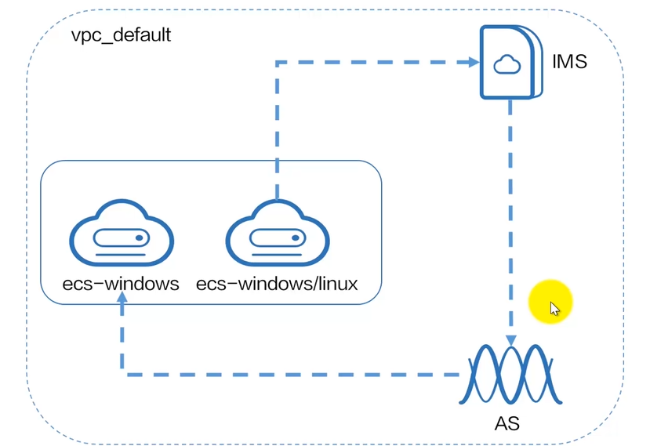

在购买ECS前需要先创建VPC用于配置网络  

## BMS 裸金属服务器

兼具虚拟机弹性和物理机性能的计算类服务，是一种本质为物理机服务的云服务    

适用于高交换速率、高计算速率的业务，避免虚拟化带来的性能损耗  

### BMS的优点  

- 安全可靠  
  - 物理机专属于用户，支持VPC、安全组隔离  
- 敏捷的部署效率  
  - 与ECS相似  
- 性能高  
  - 无虚拟化的性能损耗
- 云服务和解决方案快速集成  
- 避免购买物理硬件的成本  

### BMS的应用  

- 核心数据库  
  - 对性能、安全要求高  
- 高性能计算  
  - 数据吞吐量大，稳定性要求高   

### BMS网络  

BMS有五种网络类型，互相之间隔离不互通  

- VPC虚拟私有云  
  - 公有云的子服务  
- 高速网络  
  - BMS的内部网络，与VPC在同一物理平面，是**同一可用区**内的**BMS间**提供**无带宽限制**的网络，BMS之间通过高速网卡连接  
- 增强高速网络  
  - 通过云数据中心实现内网互联，BMS之间通过VPC连接   
- 自定义VLAN网络  
  - 自由划分VLAN子网来分隔流量  
- IB（InfiniBand）网络   
  - 低延时高带宽无阻塞，适用于高性能计算场景  

## IMS 镜像服务

为云主机提供镜像，并提供镜像的**生命周期管理**(对一个对象的创建、删除、更新等操作)能力，允许用户灵活使用公共镜像和私有镜像   

### IMS的优点  

- 安全  
  - 覆盖多种正版操作系统  
  - 多份冗余备份  
- 便捷  
  - 可选多种镜像批量创建服务器  
  - 镜像迁移  
- 统一  
  - 提供统一的自助管理平台  
  - 遵循业界统一规范，便于在不同平台间的迁移  
- 灵活  
  - 使用私有镜像    

### IMS的产品类型

- 公共镜像    
  - 对所有人可见
- 私有镜像    
  - 仅用户自己可见  
  -  为了保证使用私有镜像创建的Windows服务器可以自定义配置，建议用户在创建私有镜像前安装Cloud-init工具。**（这个是错误的！！）**
- 共享镜像    
  - 对私有镜像的共享  
- 市场镜像  
  - 华为官方提供的优质第三方镜像  

### IMS的应用场景  

- 服务器迁移  
- 部署特定软件环境   
- 服务器运行环境备份  

## AS 弹性伸缩  

AS是一种非实体的策略性公有云服务，类根据业务需求，通过策略自动调整业务资源，实现资源的自动伸缩，节约资源使用成本  

### AS的优势

- 自动调整资源  
  - 根据目标按需自动调整资源
- 加强成本管理  
  - 对资源动态扩缩容，降低成本  
- 提高容错能力  
  - 根据实时情况动态分配资源，保证服务正常允许  
- 提高可用性  
  - 保证应用系统始终有足够的资源满足需求      

### AS的应用场景

- 电商平台  
  - 有明显的（周期性）流量波峰波谷  

### AS的相关概念

- 伸缩组  
  - 绑定要应用AS策略的对象  
  - 是启停伸缩策略和进行伸缩活动的基本单位  
- 伸缩配置  
  - 系统提供的模板  
- 伸缩策略  
  - 告警策略  
  - 规则和条件  
  - 执行伸缩动作  
- 伸缩活动  
  - 对资源的扩缩容操作  
- 冷却时间  
  - 告警策略执行的最小间隔时间  
- 伸缩带宽  
  - 对弹性公网IP带宽的伸缩  

### AS创建流程

1. 创建伸缩配置   
 - 使用新模板或以现有云服务器规格为模板
2. 创建伸缩组   
3. 创建伸缩策略   

## CCE 云容器引擎

通过web界面便捷创建容器集群并部署容器应用

### CCE的优势

- 高性能  
  - 物理服务器规格高  
  - 高性能云容器引擎  
- 简单易用  
  - web界面一键操作 
  - 开箱即用  
  - 自动化部署  
- 开放兼容  
  - 使用开源的k8s架构 
- 安全可靠  
  - 私有集群，完全由用户掌控  

### CCE的应用场景

- DevOps  
  - 对代码源自动完成代码编译、镜像构建、容器化部署流程  
  - 对接已有CI/CD 

### CCE的相关概念

- Cluster 集群  
  - 底层物理机或虚拟机的集群  
- Pod 实例  
  - 由相关的一个或多个容器组成，这些容器共享相同的存储和网络  
- Node 节点   
  - 一个节点对应一个集群中的服务器，容器运行在节点上  
- Service 服务  
  - 由Pod和访问Pod的规则组成  
- Container 容器  
  - 通过镜像创建的实例，一个节点可以运行多个容器   
- Image 镜像  
  - 可以用于部署的模板    

# 第五章 网络云服务

## VPC 虚拟私有云

VPC是用户在华为云上申请的**隔离的、私密的**虚拟网络环境，VPC之间相互隔离  

用户可以自由配置VPC内的IP地址段、子网、安全组等，进而被其他计算类服务使用  

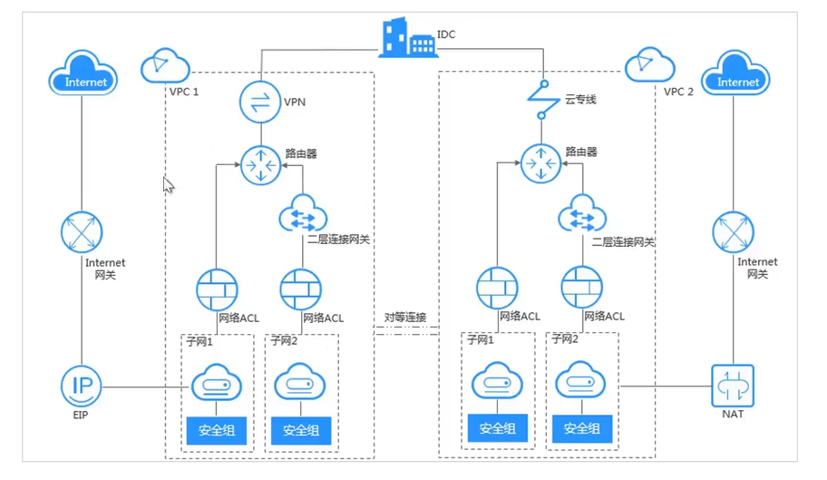

### VPC应用场景

- 云端专属网络  
  - 多个业务各自使用独立的VPC，VPC之间相互隔离  
- Web应用或网站托管 
  - 不同网站部署于不同的ECS，在同一VPC下绑定不同的子网  
  - 在ELB弹性负载均衡的作用下，用户访问的同一服务器分配到不同云主机上，减轻单链路压力   
- Web应用访问控制   
  - VPC的ACL和安全组可以实现访问控制，自定义出入方向的规则  
  - 将Web服务器和数据库服务器划分到不同安全组中，数据库服务器仅允许内网访问，保护数据库安全   
- 云上VPC互联 
  - 在**同一Region**内，VPC之间通过**对等连接**互联   
  - 在**不同Region**内，VPC之间通过**云连接**互联   
  - 华为云线上云数据中心与用户线下云数据中心连接使用**VPN**   

### VPC相关概念

- 子网  
  - VPC内是IP地址块，VPC中所有云资源都必须部署于子网内  
  - 子网创建成功后网段无法更改，同一VPC下子网网段不可重复   
- 弹性公网IP  
  - 提供独立的公网IP资源，可以与ECS、BMS等资源绑定  
  - 一个弹性公网IP只能绑定一个云资源使用    
- 路由表  
  - 由一系列路由规则组成，用于控制VPC内子网的出流量走向   
  - VPC中每个子网都必须且只能关联一个路由表，一个路由表可以关联多个子网   
- ACL 访问控制列表  
  - 通过规则判断流量是否能进出关联子网  
  - ACL应用于子网   
- SG 安全组  
  - 为了保护云主机而设置的一种逻辑上的规则式服务  
  - 控制云主机出入方向、端口、协议等  
  - 安全组应用于实例，精度高于ACL  
- 对等连接  
  - **同一Region**内，VPC之间通过对等连接互联   
  - 使用私有IP地址    
- 虚拟IP  
  - 与公网IP不同，虚拟IP是私有IP，但是通过NAT做地址转换后有同样的网络接入能力  
  - 可以用于云服务器的主备切换，实现高可用  
- 二层连接网关  
  - 一种虚拟隧道网关，基于云专线网络建立云上与云下之间的二层网络连接  
  - 允许企业的现有业务在不更改其IP地址的情况下迁移至云端  

## ELB 弹性负载均衡

一种将用户收到的流量根据策略转发到某一台服务器，以实现高压状态下的流量分担和容灾备份的策略性服务  

### ELB的优点 

- 高性能  
  - 华为ELB服务支持超过一亿次的并发连接   
- 高可用  
  - 支持跨区域部署  
  - 支持双活容灾，无缝实时切换  
- 简单易用  
  - 快速部署，实时生效  
  - 多种预设的调度算法  
- 灵活扩展  

### ELB的产品架构

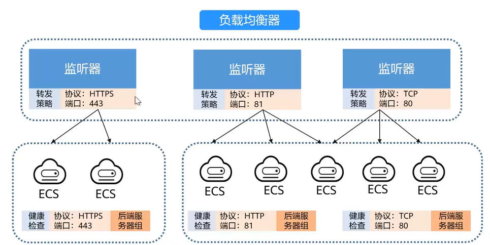

- 负载均衡器  
  - 将外界流入的流量分发到不同监听器  
  - 分外公网负载均衡和私网负载均衡  
- 监听器  
  - 监听负载均衡器上的请求，根据请求和设定好的协议和端口分发流量到后端服务器  
- 后端服务器组  
  - 承载用户业务的服务器   

### ELB的应用场景

- 对高访问量业务进行流量分发  
  - 大型门户网站、移动应用市场、电商平台  
- 对潮汐业务弹性分发流量  
  - 与AS结合，根据业务需求自动调整后端服务器数量，再由ELB灵活使用实例资源  
- 消除单点故障  
  - 当负载均衡器发现某个后端服务器故障时会将其自动屏蔽，然后将流量分发到其他健康的服务器上，保证业务不中断  
- 业务跨可用区容灾部署  
  - 某个可用区网络故障时，负载均衡器可将流量跨可用区分发  

## VPN 虚拟专用网络

在远端用户和VPC之间建立安全加密的公网通信隧道  

### VPN的优势

- 高安全  
- 无缝扩展  
  - 可以与单个或多个用户的本地DC进行连接
- 低成本  
- 即开即用  

### VPN的组网 

- VPN网关   
  - 首先基于VPC创建VPN网关，提供VPC的公网出口，用于与组合本地DC出口的三层网关对应
- VPN连接   
  - 将VPN网关和远端网关相关联，构建安全快速的**混合云**环境   

### VPN的相关概念 

- IPSec 
  - 一种加密协议

## NAT网关

为VPC内的计算实例提供网络地址转换服务，使多个计算实例共享弹性IP访问公网   

NAT网关分为公网NAT网关和私网NAT网关  

### NAT网关的优点 

- 降低成本    
  - 多个云主机共享使用同一弹性公网IP  
- 灵活部署    
  - 支持跨可用区部署  
  - 规格和公网IP可随时调整  
- 多样易用  
  - 配置简单，即开即用  

### NAT网关的产品架构

- 公网NAT   

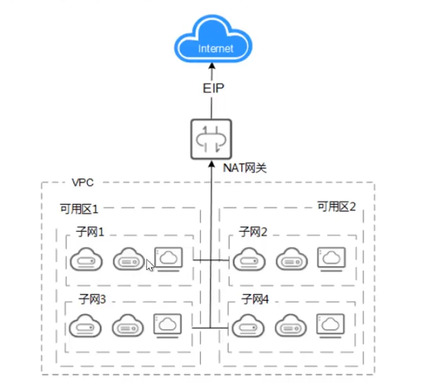

把VPC中所有的私网IP都转换为EIP，与公网进行通信  

- 私网NAT   

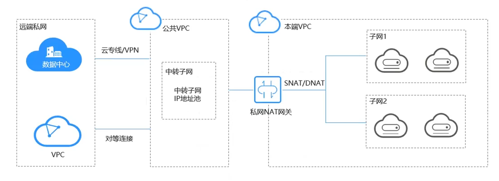

为虚拟私有云内的云主机提供地址转换服务，使多个云主机共享私网IP访问本地DC或其他VPC   

### NAT网关的应用场景

- SNAT 源网络地址转换  
  - 将VPC内的资源访问公网时，将私有IP转换为一个或多个EIP，适用于出站流量   
- DNAT 目的网络地址转换    
  - 外部网络访问VPC内部资源时，将访问的EIP地址转换为私网IP，适用于入站流量     
  - 即：SNAT是内到外，DNAT是外到内  

# 第六章 储存云服务

## EVS 弹性卷服务（云硬盘）

为云服务去提供高可靠高性能可弹性扩展的**块存储**服务  

### EVS的优点 

- 规格丰富  
  - 提供多种规格的云硬盘，满足不同业务场景的需求  
- 弹性扩展  
  - 支持按需扩容，平滑扩容，无需暂停业务  
- 实时监控  
- 安全可靠  
  - 数据持久性高，支持加密、备份  

### EVS的产品架构

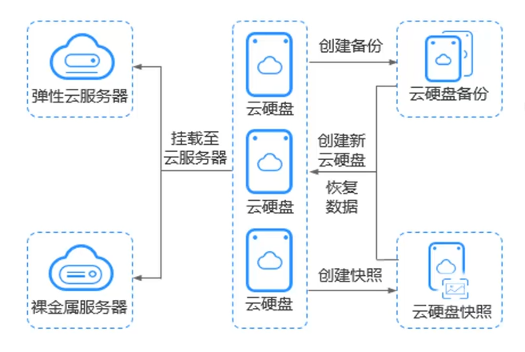

EVS可以单对单或单对多地挂载给ECS或BMS   

备份是对所有文件的拷贝，快照是对文件变化周期性的记录    

### EVS的性能指标

- IOPS
  - 每秒读写操作的次数    
- 吞吐量 
  - 每秒读取写入的数据量  
- IO读写时延 
  - 连续两次读写操作所需的最小时间间隔  

|参数|极速型SSD|超高IO|通用型SSD|高IO|
|:---:|:---:|:---:|:---:|:---:|
|最大IOPS|128000|50000|20000|5000|
|最大吞吐量|1000 mb/s|350 mb/s|250 mb/s|150 mb/s|
|单队列访问时延|0.2 ms|1 ms|1 ms|1-3 ms|
|典型应用场景|数据库 AI|读写密集型场景 IO密集型场景 时延敏感型场景|企业办公 开发测试|办公应用 一般工作负载|

### EVS的磁盘模式

- VBD 虚拟块存储设备   
  - EVS的默认磁盘类型  
  - 只支持简单的SCSI读写命令  
  - 一般用于ECS  
- SCSI 小型计算机系统接口    
  - 支持简单和高级的SCSI命令，允许云服务器操作系统直接访问底层存储介质  
  - BMS只能使用SCSI模式   

### 共享云硬盘  

一个硬盘可以挂载于多个云服务器（一般上限16个）并发读写访问，

### EVS的备份与快照

| 特性     | 快照                           | 备份                            |
|:------:|:----------------------------:|:----------------------------:|
| 定义     | 记录特定时间点的系统或数据状态 | 完整复制数据，用于长期存储和恢复 |
| 数据类型 | 增量数据（只记录变化部分）       | 通常是全量数据（完整复制）        |
| 存储空间 | 占用空间较小                   | 占用空间较大                    |
| 使用场景 | 短期保护、快速回滚              | 长期存储、灾难恢复               |
| 容灾范围 | 与云硬盘位于同一AZ内 | 与云硬盘位于同一AZ内，云服务器备份支持跨Region复制 |
| 存储方案 | 与云硬盘数据存储在一起 | 与云硬盘数据分开存储 |

### 云硬盘三副本机制

对所有数据，将其分为**1 mb**的数据块，每一个数据库都复制为三个副本，按**分布式存储算法**分别将其存储于不同服务器的不同物理磁盘上  

存储系统保证三个副本的**数据强一致性**  

## OBS 对象储存服务

基于对象的高可靠、低成本存储服务  

### OBS的产品架构 

- Bucket 桶   
  - 存储对象的容器  
  - 使用**扁平化**存储方式，所有对象处于**同一逻辑层级**  
- Object 对象   
  - 数据存储的基本单位  
  - 一个对象包含Key、Metadata、Data三部分   
  - 所有数据以对象的形式保存在Bucket中  

### AK/SK鉴权

OBS支持通过AK(Acess Key ID)/SK(Secret Access Key)认证方式进行鉴权，验证请求者的身份   

- 永久AK/SK   
  - 一次鉴权长期使用  
- 临时AK/SK   
  - 临时访问令牌，有效期15min-24h   

### OBS的应用场景 

- 大数据分析  
  - 对海量数据友好，低成本、高性能、自动扩容    
- 企业网盘  
  - 高并发、低时延、高可靠  
- 备份归档  

### OBS的访问方式

- OBS Browser+  
- 控制台  
- API & SDK   
- obsutil   
- obsfs   

### OBS的生命周期管理

通过配置规则，定时删除某些对象或转换对象的存储类别  

- 如周期性上传的日志文件，保留一个月自动删除  
- 访问量少的资源转为低频访问存储、归档存储或删除  

### OBS的权限管理   

- IAM权限   
  - 作用与云资源  
- 桶策略/对象策略   
  - 作用域于桶或对象  

## SFS 弹性文件服务

高性能的文件存储服务，允许用户按需扩展文件存储容量，在云服务去中通过网络协议挂载使用  

### SFS的优势

- 弹性扩展  
  - 不中断应用  
  - 按需伸缩容量  
- 操作简单    
- 高性能高可靠  
- 无缝集成  
  - 支持NFS   
  - 适配主流应用程序  

 
