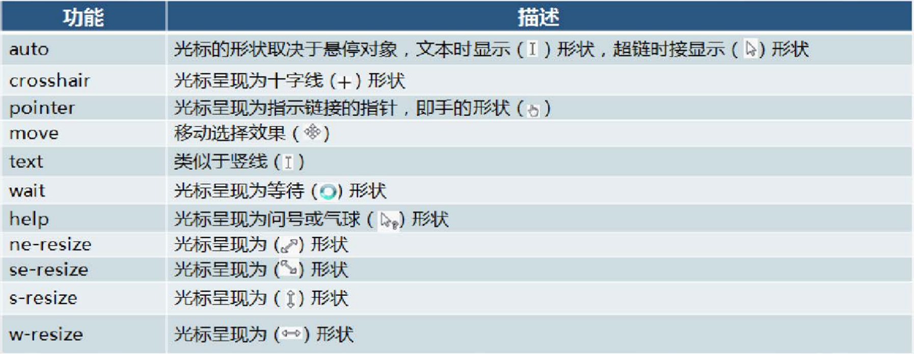
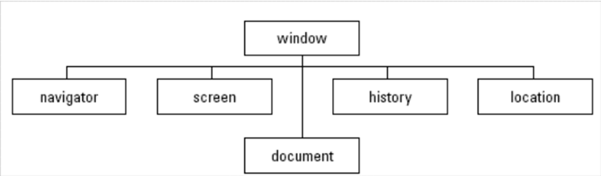

<!-- markdownlint-disable -->

# Web标准  

组成部分：  

- HTML：结构  
  - 页面元素和内容  
- CSS：表现  
  - 元素的外观、位置等  
- JavaScript：行为      
  - 交互效果    

# HTML

文件格式：  

```HTML
<!DOCTYPE html>  // 声明文档类型为html
<html lang="zh-CN">  // 声明文档语言为简体中文
<head>  // 头部
    <meta charset="UTF-8">  // 指定字符集
    <title>这是一个测试文件</title>
</head>
<body>  // 主体
    <h1>  // 一级标题
        Hello World
    </h1>
</body>
</html>
```

浏览器对html文件 **从上到下逐行解析**  

每个html元素都有四个属性：  

- id：唯一标识符  
- class：类名  
- title：鼠标悬停时显示的文本  
- style：行内样式  

# Body

## 全局属性

适用于所有html元素的属性

| 属性名   | 作用 |
|---------|------|
| `id` | 元素的唯一标识符 |
| `class` | 为元素指定一个或多个 CSS 类名 |
| `style` | 行内样式定义 |
| `title` | 鼠标悬停时显示的提示文本 |
| `hidden` | 隐藏元素 |

<h4 id="main-title">全局属性示例</h2>
<div id="content-section" class="container">
  <p class="paragraph-text highlight-text" style="color: blue;">
    这是一个段落，使用了 <span title="元素的唯一标识符">id</span>,
    <span title="为元素指定一个或多个 CSS 类名">class</span>,
    <span title="行内样式定义">style</span> 和 <span title="鼠标悬停时显示的提示文本">title</span> 属性。
  </p>
</div>

## 标题

```HTML
<h1>一级标题</h1>
<h2>二级标题</h2>
<h3>三级标题</h3>
<h4>四级标题</h4>
<h5>五级标题</h5>
<h6>六级标题</h6>
```

## 超链接

<a href="https://www.baidu.com">百度</a>

```HTML
<a href="https://www.baidu.com">百度</a>
```

- `herf`：指向的地址    
- `target` 为打开方式   
  - `_blank`：新窗口打开    
  - `_self`：本窗口打开（默认值）  

与 `锚点` 结合，可以实现页面内跳转    

```html
<h2 id="test">这是一个标题</h2>
<a href="#test">跳转到 test</a>
<a href="/path/to/htmlfile/index.html#test">跳转到 test</a>
```

在html中 `href` 的值可以为绝对路径或相对路径：  

| **路径类型** | **示例** | **解释** |
|:-----------:|:--------:|:--------:|
| **绝对路径** | `https://example.com/page.html` | 指向外部网站或完整 URL |
| **同级目录** | `index.html` | 访问当前目录下的 `index.html` |
| **子目录** | `pages/contact.html` | 访问 `pages` 目录下的 `contact.html` |
| **上级目录** | `../index.html` | 访问上一级目录中的 `index.html` |
| **根目录** | `/products/list.html` | 从网站根目录访问 `products/list.html` |

## 图片 视频 音频


```HTML

```

- `src`：图片地址   
- `alt`：对图像的文本描述     
  - 在图片加载失败时显示    
- `width`：宽度  
- `height`：高度  
  - 宽度和高度建议仅设置一个，另一个会被自动等比例缩放  
  - 若同时设置宽度和高度则会导致白边  
  - 单位：px，%（相对于父元素的百分比）

```html
<video src="http://i.fxgpt.site/i/2025/02/18/ndy2zr.mp4" controls></video>
```

- `src`：视频地址   
- `controls`：显示播放控件    
- `autoplay`：自动播放  
- `width`：宽度  
- `height`：高度      

```html
<audio src="http://i.fxgpt.site/i/2025/02/18/ndy2zr.mp3" controls></audio>
```

- `src`：音频地址   
- `controls`：显示控制条  

## 列表

### 无序列表 

<ul>
    <li>列表项1</li>
    <li>列表项2</li>
    <li>列表项3</li>
</ul>

```HTML
<ul>
    <li>列表项1</li>
    <li>列表项2</li>
    <li>列表项3</li>
</ul>
```

- `ul`：无序列表，`ol`：有序列表   
- `li`：列表项  

### 有序列表

<ol>
    <li>列表项1</li>
    <li>列表项2</li>
    <li>列表项3</li>
</ol>

```HTML
<ol>
    <li>列表项1</li>
    <li>列表项2</li>
    <li>列表项3</li>
</ol>
```

- `ol`：有序列表   
- `li`：列表项  
- `type`：设置列表项的序号类型，如 `1`、`A`、`a`、`I`、`i` 等  
- `start`：设置列表项的起始序号  

### 定义列表

<dl>
    <dt>列表项1</dt>
    <dd>列表项1的描述</dd>
    <dt>列表项2</dt>
    <dd>列表项2的描述1</dd>
    <dd>列表项2的描述2</dd>
</dl>

```HTML
<dl>
    <dt>列表项1</dt>
    <dd>列表项1的描述</dd>
    <dt>列表项2</dt>
    <dd>列表项2的描述1</dd>
    <dd>列表项2的描述2</dd>
</dl>
```

- `dl`：定义列表   
- `dt`：列表项

## 段落

<p>这是一个段落</p>

```HTML
<p>这是一个段落</p>
```

## 注释

```HTML
<!-- 这是一个注释 -->
```

## 文本格式化

<font face="Arial" size="4" color="red">Red Text</font>
<b>加粗1</b>
<strong>加粗2</strong>
<i>斜体</i>
<u>下划线</u>
<s>删除线</s>
文字的<sup>上标</sup>
文字的<sub>下标</sub>
<hr>  <!-- 水平线 -->

```HTML
<font face="Arial" size="4" color="red">Example here</font>
<b>加粗</b>
<i>斜体</i>
<u>下划线</u>
<s>删除线</s>
<sup>上标</sup>
<sub>下标</sub>
<hr>  <!-- 水平线 -->
```

## 特殊符号

| 符号 | HTML实体   |
|------|------------|
| <    | \&lt;      |
| >    | \&gt;      |
| &    | \&amp;     |
| "    | \&quot;    |
| '    | \&apos;    |
| ©    | \&copy;    |
| ±    | \&plusmn;  |
| ×    | \&times;   |
| ÷    | \&divide;  |
| ≠    | \&ne;      |
| ≤    | \&le;      |
| ≥    | \&ge;      |
| ∞    | \&infin;   |
| π    | \&pi;      |
| ≈    | \&asymp;   |
| ≠    | \&ne;      |
| ≠    | \&ne;      |

## div 和 span

`<div>` 是一个 **块级元素**，它作为一种容器，用于 **对元素进行编组**，以便于添加样式。    

每个 `<div>` 会独占一行，在末尾自动换行     

<div>
    <h4>这是一个标题</h4>
    <p>这是一个段落</p>
</div>

```HTML
<div>
    <h4>这是一个标题</h4>
    <p>这是一个段落</p>
</div>
```

- `style`：用于设置元素的样式   
  - `color`：文字颜色   
  - `background-color`：背景颜色  
- `class`：用于设置元素的类名，用于在 CSS 中设置样式    
- `align`：用于设置元素的对齐方式  
  - `left`：左对齐  
  - `center`：居中对齐  
  - `right`：右对齐   

`<span>` 是一个 **行内元素**，与 `<div>` 类似，是一种容器  

<span>
    <h4>这是一个标题</h4>
    <p>这是一个段落</p>
</span>

```HTML
<span>
    <h4>这是一个标题</h4>
    <p>这是一个段落</p>
</span>
```

## 表格

<table>
  <caption>
  <!-- 标题 -->
    这里是标题
  </caption>
  <!-- tr是一行，即table row -->
  <tr>
    <!-- th是表头，即table header -->
    <th>姓名</th>
    <th>年龄</th>
    <th>城市</th>
  </tr>
  <tr>
    <!-- td是一个单元格，即table data -->
    <td>张三</td>
    <td>30</td>
    <td>北京</td>
  </tr>
  <tr>
    <td>李四</td>
    <td>25</td>
    <td>上海</td>
  </tr>
  <tr>
    <td>王五</td>
    <td>35</td>
    <td>广州</td>
  </tr>
  <tr>
      <td>赵六</td>
      <td>28</td>
      <td>深圳</td>
  </tr>
</table>

```html
<table>
  <caption>
  <!-- 标题 -->
    这里是标题
  </caption>
  <!-- tr是一行，即table row -->
  <tr>
    <!-- th是表头，即table header -->
    <th>姓名</th>
    <th>年龄</th>
    <th>城市</th>
  </tr>
  <tr>
    <!-- td是一个单元格，即table data -->
    <td>张三</td>
    <td>30</td>
    <td>北京</td>
  </tr>
  <tr>
    <td>李四</td>
    <td>25</td>
    <td>上海</td>
  </tr>
  <tr>
    <td>王五</td>
    <td>35</td>
    <td>广州</td>
  </tr>
  <tr>
      <td>赵六</td>
      <td>28</td>
      <td>深圳</td>
  </tr>
</table>
```

### 基本属性

- `align`, `valign`：表格相对周围元素的水平、垂直对齐方式  
  - left, left, right  
- `bgcolor`：背景颜色   
  - 取值参考 [颜色表示形式](#颜色的表示形式)  
- `border`：边框宽度  
- `cellpadding`：单元格内容与单元格边框之间的距离   
- `cellspacing`：单元格之间的距离   
- `height`, `width`：表格的高度和宽度   

### 单元格合并 跨行跨列

表格从上向下，从左向右解析，使用 `colspan` 和 `rowspan` 可以实现合并单元格，解析时若该单元格被其他合并的单元格占用会跳过该单元格的解析：  

<table>
  <tr>
    <td colspan ="2">单元格占两列</td>
    <td width="90">&nbsp;</td>
    <!-- 三个单元格已经被解析完了 -->
  </tr>
  <tr>
    <td width="75">&nbsp;</td>
    <td width="90">&nbsp;</td>
    <td rowspan="2"> 单元格占两行</td>
  </tr>
  <tr>
    <td>&nbsp;</td>
    <td>&nbsp;</td>
    <!-- 接下来这个单元格不解析 -->
  </tr>
</table>

```html
<table>
  <tr>
    <td colspan ="2">单元格占两列</td>
    <td width="90">&nbsp;</td>
    <!-- 使用 &nbsp; 创建一个空白实体引用，防止单元格被跳过 -->
    <!-- 三个单元格已经被解析完了 -->
  </tr>
  <tr>
    <td width="75">&nbsp;</td>
    <td width="90">&nbsp;</td>
    <td rowspan="2"> 单元格占两行</td>
  </tr>
  <tr>
    <td>&nbsp;</td>
    <td>&nbsp;</td>
    <!-- 接下来这个单元格不解析 -->
  </tr>
</table>
```

### 单元格分组

- 行分组  
  - `<caption>`：表格标题
  - `<thead>`, `<tfoot>`：表头、表尾   
    - 仅可出现一次
  - `<tbody>`：表的主体   
    - 可以出现多次，用于将表格分为多个部分    

<table>
  <caption>企业员工薪水绩效表</caption>
  <thead>
    <tr>
      <th>员工编号</th>
      <th>员工岗位</th>
      <th>基本工资</th>
      <th>本月绩效</th>
    </tr>
  </thead>
  <tbody>
    <tr>
      <td>YF0016</td>
      <td>Java高级工程师</td>
      <td>6000</td>
      <td>3000</td>
    </tr>
    <tr>
      <td>YF0021</td>
      <td>Java程序员</td>
      <td>3000</td>
      <td>2500</td>
    </tr>
  </tbody>
  <tbody>
    <tr>
      <td>YF0016</td>
      <td>WEB前端工程师</td>
      <td>5000</td>
      <td>2500</td>
    </tr>
    <tr>
      <td>YF0021</td>
      <td>软件测试工程师</td>
      <td>3000</td>
      <td>2000</td>
    </tr>
  </tbody>
  <tfoot>
    <tr>
      <td colspan="3">总计</td>
      <td>10W</td>
    </tr>
  </tfoot>
</table>

```html
<table>
  <caption>企业员工薪水绩效表</caption>
  <thead>
    <tr>
      <th>员工编号</th>
      <th>员工岗位</th>
      <th>基本工资</th>
      <th>本月绩效</th>
    </tr>
  </thead>
  <tbody>
    <tr>
      <td>YF0016</td>
      <td>Java高级工程师</td>
      <td>6000</td>
      <td>3000</td>
    </tr>
    <tr>
      <td>YF0021</td>
      <td>Java程序员</td>
      <td>3000</td>
      <td>2500</td>
    </tr>
  </tbody>
  <tbody>
    <tr>
      <td>YF0016</td>
      <td>WEB前端工程师</td>
      <td>5000</td>
      <td>2500</td>
    </tr>
    <tr>
      <td>YF0021</td>
      <td>软件测试工程师</td>
      <td>3000</td>
      <td>2000</td>
    </tr>
  </tbody>
  <tfoot>
    <tr>
      <td colspan="3">总计</td>
      <td>10W</td>
    </tr>
  </tfoot>
</table>
```

## 颜色的表示形式

- 关键字  
  - red, green, blue, etc.  
- rgb 
  - `rgb(r, g, b)`，红绿蓝三色的强度，取值范围0-255   
- rgba  
  - `rgba(r, g, b, a)`，红绿蓝三色的强度和**不透明度**，取值范围0-1（1表示完全不透明）  
- 十六进制  
  - `#rrggbb`，红绿蓝三色的强度，取值范围00-FF    

## 表单

用于采集和提交用户输入，包括表单域和按钮两部分  

<form action="http://www.baidu.com">
  <label for="username">用户名：</label>
  <input type="text" name="username" id="username">
  <br>
  <label for="password">密码：</label>
  <input type="password" name="password" id="password">
  <br>
  <input type="submit" value="提交">
</form>

```html
<form action="http://www.baidu.com">
  <label for="username">用户名：</label>
  <input type="text" name="username" id="username">
  <br>
  <label for="password">密码：</label>
  <input type="password" name="password" id="password">
  <br>
  <input type="submit" value="提交">
</form>
```
- `<form>` 表单
  - `action`：表单提交的地址  
  - `method`：表单提交的方式，默认为 `get`    
    - get, post, put, delete, etc.    
    - 传输的url中，域名和数据之间用`?`分隔，数据之间用`&`分隔   
  - `name`：表单域的名称，用于提交时识别，现在多用`id`替代     
  - `enctype`：表单数据的编码方式  
    - `application/x-www-form-urlencoded`：**默认方式**，将数据编码为 `key=value` 的形式，并所有字符用`unicode`编码，并对特殊字符进行处理（空格替换为`+`，其他字符替换为百分号加十六进制值）      
    - `multipart/form-data`：将数据编码为二进制格式，用于上传文件   

### 常见表单域

- `<input>` 表单域   
  - `type`：表单域的类型，默认为 `text`    
    - text, password, radio, checkbox, submit, reset, button, file, hidden, etc.    
    - 值为`password`，显示的输入值为`***`   
    - 值为`radio`，需要设置相同的`name`属性，表示一组单选按钮，提交时只提交被选中的那个按钮的值   
    - 值为`checkbox`，需要设置相同的`name`属性，表示一组复选框，提交时提交所有被选中的复选框的值   
    - 值为`hidden`，会在页面中隐藏，但还是会传递给服务器。但是可以在源码中查看，因为不可用于存储敏感数据  
    - 
  - `value`：表单域的默认值，默认为空字符串    
  - `size`：表单域显示的宽度，默认为20个字符宽度  
  - `disabled`：是否禁用，默认为不禁用  

可以使用`<fieldset>`以**边框环绕**的形式实现表单的分组：  

<form>
  <fieldset>
    <legend>用户信息</legend>
    <label for="username">用户名：</label>
    <input type="text" name="username" id="username">
  </fieldset>
  <fieldset>
    <label for="password">密码：</label>
    <input type="password" name="password" id="password">
    <input type="submit" value="提交">
  </fieldset>
</form>

```html
<form>
  <fieldset>
    <legend>用户信息</legend>
    <label for="username">用户名：</label>
    <input type="text" name="username" id="username">
  </fieldset>
  <fieldset>
    <label for="password">密码：</label>
    <input type="password" name="password" id="password">
    <input type="submit" value="提交">
  </fieldset>
</form>
```


### 多行文本框

<textarea name="content" id="content" cols="30" rows="4">
这里是
多行
文本
可以
翻动</textarea>

```html
<textarea name="content" id="content" cols="30" rows="4">
这里是
多行
文本
可以翻动</textarea>
```

- `wrap`：自动换行的效果  
  - `off`：默认值，不自动换行，超出的部分用滚动条查看  
  - `virtual`：在用户视角自动换行，但实际换行以回车为准   
  - `physical`：在用户视角和实际都自动换行  

### 列表选择框

<select name="city" id="city">
  <option value="bj">北京</option>
  <option value="sh">上海</option>
  <option value="gz">广州</option>
  <option value="sz">深圳</option>
</select>

```html
<select name="city" id="city">
  <option value="bj">北京</option>
  <option value="sh">上海</option>
  <option value="gz">广州</option>
  <option value="sz">深圳</option>
</select>
```

- `<select>` 列表选择框   
  - `size`：列表选择框显示的行数，默认为1   
  - `multiple`：是否可多选，默认为单选  
  - `disabled`：是否禁用，默认为不禁用  
    - 禁用后，无法选择，也无法提交  
- `<option>` 列表选项   
  - `selected`：默认选中的选项    
  - `value`：选项的值，默认为选项的文本内容   

可以使用`optgroup`来将选项分组：  

<select>
    <optgroup label="水果">
        <option value="apple">苹果</option>
        <option value="banana">香蕉</option>
    </optgroup>
    <optgroup label="蔬菜">
        <option value="carrot">胡萝卜</option>
        <option value="tomato">番茄</option>
    </optgroup>
</select>


```html
<select>
    <optgroup label="水果">
        <option value="apple">苹果</option>
        <option value="banana">香蕉</option>
    </optgroup>
    <optgroup label="蔬菜">
        <option value="carrot">胡萝卜</option>
        <option value="tomato">番茄</option>
    </optgroup>
</select>
```

### 按钮控件

<input type="submit" value="提交">

```html
<input type="submit | reset | button" value="提交">
```

- `type`：按钮的类型，默认为 `submit`  
  - `submit`：提交按钮，点击后会提交表单  
  - `reset`：重置按钮，点击后会重置表单  
  - `button`：普通按钮，点击后不会提交表单，需要通过JavaScript来处理   
- `value`：按钮的文本内容，默认为空字符串     
- `disabled`：是否禁用，默认（不写disabled）为不禁用    


# CSS

## 简介

CSS（Cascading Style Sheets，层叠样式表）是一种用于描述HTML文档样式的语言，可以控制HTML元素的布局、颜色、字体、背景等样式。   

**样式** 是CSS的基本单元，每个样式包含：  

- 选择器：用于选择要应用样式的HTML元素    
- 声明：包含一个或多个属性和值，用于定义样式  

CSS的基本格式：  

```css
选择器 {
    属性1: 值1;
    属性2: 值2;
    ...
}
```

## 选择器

### 元素选择器

选择所有的`<p>`元素   

```css
p { ... }
```

### 类选择器

选择所有类名为`highlight`的元素   

```css
.highlight { ... }
```

### ID选择器

选择所有ID为`unique-title`的元素    

```css
#unique-title { ... }
```

### 组合选择器

选择所有`<p>`元素和类名为`highlight`的元素   

```css
p, .highlight { ... }
```

选择所有`<p>`元素和类名为`highlight`的元素   

```css
p.highlight { ... }
```

选择所有`<h1>`元素和`<h2>`元素   

```css
h1, h2 { ... }
```

选择所有`<h1>`和id为`subtitle`的`<h2>`元素
```css
h1, h2#subtitle { ... }
```

### 属性选择器

选择所有具有`<type>`属性的`<input>`元素  

```css
input[type] { ... }
```

选择所有`<type>`属性值为`text`的`<input>`元素

```css
input[type="text"] { ... }
```

选择所有`<class>`属性值以`icon`开头的`<a>`元素

```css
a[class^="icon"] { ... }
```

选择所有`<herf>`属性值中包含`example.com`的`<a>`元素    

```css
a[href*="example.com"] { ... }
```

### 后代选择器

选择所有`<p>`元素中的`<span>`元素   

```css
p span { ... }
```

选择所有id为`content`的元素中有`kaiti`类的`p`元素

```css
#content p.kaiti { ... }
```

### 选择器优先级  
- id > 类 > 元素  
- 即根据id选择来添加的样式会覆盖其他的样式  

示例：  

```html
<!DOCTYPE html>
<html lang="zh-CN">
<head>
    <meta charset="UTF-8">
    <title>这是一个测试文件</title>
    <style>
        span{
            color: red;
        }
        .cls{
            color: green;
        }
        #time{
            color: blue;
        }
    </style>
</head>
<body>
    <span>红色</span>
    <span class="cls">绿色</span>
    <span class="cls" id="time">蓝色</span>
</body>
</html>
```

效果：   

<span style="color:red;"> 红色</span> <span style="color:green;">绿色</span> <span style="color:blue;"> 蓝色</span>


## CSS引入方式

### 行内/内嵌  
- 写在标签的 `style` 属性中  
- `<h4 style="color: red;">Hello World</h1>`  
- `<span style="color: gray;">2025年1月1日</span>`  
- 注意，`<span>` 可以用于给元素添加样式，但是 `<span>` 本身没有特殊含义  

### 内部  
- 写在 `<head>` 标签中的 `<style>` 标签中  

```html
<head>
  <meta charset="UTF-8">
  <title>内部 CSS 示例</title>
  <style>
    /* 元素选择器 */
    p {
      color: blue; /* 所有段落文字蓝色 */
    }

    /* 类选择器 */
    .highlight {
      background-color: lightgreen; /* 类名为 highlight 的元素背景浅绿色 */
    }

    /* ID 选择器 */
    #unique-title {
      font-size: 24px; /* ID 为 unique-title 的元素字体 24px */
      color: red; /* ID 为 unique-title 的元素文字红色 */
    }
  </style>
</head>
```

### 外部  
- 写在单独的 `.css` 文件中，通过 `<link>` 标签引入  

/css/style.css  

```css
span {
  color: red;
}
```

/index.html  

```html
<head>
    <meta charset="UTF-8">
    <title>这是一个测试文件</title>
    <!-- 在这一行中引入css文件 -->
    <link rel="stylesheet" href="css/style.css">
</head>
<body>
    <span>外部引入的css</span>
    </body>
</html>
```

## CSS布局

CSS布局用于控制网页元素在页面上排列方式。  

### 盒模型

**盒模型** 描述了HTML元素周围的空间是如何构成的。每个HTML元素都可以看作一个矩形的盒子，这个盒子由以下几个部分组成：

- **内容 Content**：盒子的核心，显示元素的内容，例如文本、图片等。
- **内边距 Padding**：内容区域与边框之间的空间，用于增加内容与边框的距离。
- **边框 Border**：包围内容和内边距的线条，可以设置样式、宽度和颜色。
- **外边距 Margin**：边框以外的空间，用于控制元素与周围元素之间的距离。


网页元素自身位于矩形区域，也与其它元素共同位于另一个更大的矩形区域，这些矩形区域就称为“盒子”，规范着内部元素的排版和样式。  

### 边框样式

- 边框样式 `border-style`  
  - none/dotted/dashed/solid/double/  
  - groove（凹槽线边框）  
  - ridge（凸槽线）  
  - Outset（突起效果的边框）  
  - inset（凹进效果的边框）   
- 边框宽度 `border-width`  
  - 1个值：全部边框  
  - 2个值：上下、左右      
  - 3个值：上、左右、下  
  - 4个值：上右下左  
  - `border-top-width`  
  - `border-bottom-width`  
  - `border-left-width`  
  - `border-right-width`  
- 边距 `margin`  
  - 1-4个值 同上  
  - `margin-left`  
  - `margin-right`  
  - `margin-top`  
  - `margin-bottom`  
- 填充距 `padding`
  - 1-4个值 同上  
  - `padding-left`  
  - `padding-right`  
  - `padding-top`  
  - `padding-bottom`  

### 元素类型

HTML 元素本身具有 `block` (块级) 属性或 `inline` (内联) 属性。 CSS 中可以通过 `display: inline` 和 `display: block` 来设置元素为内联元素和块级元素。

**1. 块级元素 (block)**

- **独占一行**：默认情况下，每个块级元素都会另起一行，并占据一整行空间。
- **宽度默认填满父元素**：默认宽度会自动填满父元素的宽度。
- **可以设置 `width` 和 `height`**：可以显式地设置元素的宽度和高度。
- **可以设置 `margin` 和 `padding`**：可以设置所有方向的内外边距。
- **常见的块级元素**：`div`、`ul`、`ol`、`p`、`h1~h6`、`table` 等。

**2. 内联元素 (inline)**

- **不独占一行**：多个内联元素会在同一行从左到右水平排列。
- **宽度由内容决定**：宽度由元素自身内容决定，无法通过 `width` 和 `height` 设置有效宽度和高度。
- **设置 `width` 和 `height` 无效**：`width` 和 `height` 属性对内联元素不起作用。
- **可以设置水平方向的 `margin` 和 `padding`**：可以设置水平方向 (左右) 的 `margin` 和 `padding` (例如 `padding-left`, `margin-left` 等)，垂直方向的 `margin` 和 `padding` 可能效果有限或不明显。
- **常见的内联元素**：`a` (链接元素)、`img` (图像元素)、`em` (强调元素)、`input` (输入元素)、`span` (文本内区块元素)、`br` (换行元素) 等。

**3. 行内块元素 (inline-block)**

- **兼具块级和内联元素的特点**： 既可以像内联元素一样水平排列，又可以像块级元素一样设置宽度、高度、内外边距。
- **需要通过 `display: inline-block` 设置**： 默认情况下不是行内块元素，需要通过 CSS `display: inline-block` 属性来设置。


### 元素嵌套规则

- **块级元素可以包含块级元素和内联元素。**
- **特殊：块级元素 `<p>` 只能包含内联元素。**  `p` 元素中不能嵌套块级元素，这是一个HTML规范的限制。
- **内联元素只能包含内联元素。**  虽然技术上可能允许，但不建议内联元素嵌套块级元素，会破坏布局结构。

## CSS长度单位

### 绝对长度

- cm  
- mm  
- ln（英寸）  
- px  

### 相对长度

| 单位 | 描述 |
| :-: | --- |
| em | 相对于元素的字体大小 (font-size) (2em 表示当前字体大小的 2 倍) |
| ex | 相对于当前字体的 x-height (极少使用) |
| ch | 相对于 "0" (零) 的宽度 |
| rem | 相对于根元素的字体大小 (font-size) |
| vw | 相对于视口*宽度的 1% |
| vh | 相对于视口*高度的 1% |
| vmin | 相对于视口*较小尺寸的 1% |
| vmax | 相对于视口*较大尺寸的 1% |
| % | 相对于父元素 |

## 字体属性

| 属性 |  CSS 属性 | 描述 |
|---|---|---|
| 字体名称 | `font-family` | 多个字体用逗号分隔，不止一个单词的字体用双引号包围 |
| 字体大小 | `font-size` | 值可取small、medium、large或使用单位px、cm |
| 字体风格 | `font-style` | normal、italic（斜体）、oblique（略斜）|
| 字体粗细 | `font-weight` | normal、bold |
| 字体颜色 | `color` | 详见`Body-颜色的表示形式` |
| 字体大写转换 | `font-variant` | normal、small-caps（小写转为大写） |
| 字体复合属性 | `font: font-style属性值 font-size属性值 ...` | 上述属性以空格分隔 |

全部字体属性 <https://www.w3school.com.cn/css/css_font.asp>

示例：  

```html
p.mix3 {
  font-style: oblique;
  font-family: 宋体,"Times New Roman",Arial
  font-size: 20px;
  font-weight: normal;
  color: #03C;
}
```

## 文本属性

| 功能  | 属性名 | 描述 |
|---|---|---|
| 缩进文本 | `text-indent` | 设置行的缩进大小，值可以为正值或负值，单位可以用 em, px 或% |
| 水平对齐 | `text-align` | 设置文本的水平对齐方式，取值 left, right, center, justify |
| 垂直对齐 | `vertical-align` | 设置文本的垂直对齐方式，取值 bottom, top, middle, baseline |
| 字间距 | `word-spacing` | 设置字 (单词) 之间的标准间隔，默认 normal (或 0) |
| 字母间隔 | `letter-spacing` | 设置字符或字母之间的间隔 |
| 字符转换 | `text-transform` | 设置文本中字母的大小写，取值 none, uppercase, lowercase, capitalize |
| 文本修饰 | `text-decoration` | 设置段落中需要强调的文字，取值 none, underline (下划线), overline (上划线), line-through (删除线), blink (闪烁) |
| 空白字符 | `white-space` | 设置源文档中的多余的空白，取值 normal (忽略多余), pre (正常显示), nowrap (文本不换行，除非遇到 <br/> 标签) |

## 背景属性

| 功能 | CSS 属性 | 描述 |
|---|---|---|
| 背景颜色 | `background-color` |  |
| 背景图片 | `background-image` |  |
| 背景图片重复属性 | `background-repeat` | 取值：repeat、no-repeat、repeat-x、repeat-y |
| 背景图片滚动属性 | `background-attachment` | 取值：fixed、scroll |
| 背景图片位置属性 | `background-position` | 相对于左上角,取值为数字或 top、left、right、center、bottom |
| 背景复合属性 | `background` | 上述各种属性以空格分隔 |

## 定位布局属性

### 定位方式 `position`

一般情况下，页面由页面流构成，页面元素在页面流中的位置由该元素在HTML文档中的位置决定。  

块级元素从上向下排列(每个块元素单独成行)，内联元素从左向右排列，元素在页面中的位置会随外层容器的改变而改变。  

使用`position`可以将元素从页面流中偏移或分离出来以设定其具体位置，从而实现更精确的定位。  

`position`的取值：   

- `static`：正常流  
  - 元素作为页面流的一部分在页面流中正常出现  
  - 取值为static时，left、top、right、bottom 等值会被忽略  
- `relative`：相对正常位置定位  
  - 通过设置left、right、top、bottom进行重新定位  
  - 不影响其他元素的位置
- `absolute`：相对于浏览器窗口定位
  - 设置absolute后元素脱离文档流，若元素不设置宽度则为内容的宽度，原本在页面中的位置会被下一个元素占用    
  - 浏览器滚动时元素随着滚动    
- `fixed`：固定定位   
  - 浏览器滚动时元素位置不变  

示例：  

```css
.relativeBlock{
width: 600px;
height: 300px;
background-color: blue;
position: relative;
margin-top: 200px;
}

.absoluteBlock{
width: 20px;
height: 20px;
background-color: green;
position: absolute;
top: 100px;
left: 200px;
}

.fixedBlock{
width: 20px;
height: 100px;
background-color: red;
position: fixed;
top: 0;
left: 0;
}
```

### 层叠顺序 `z-index`

`z-index`，即元素在z轴上的层叠顺序值，可取值为`auto`或整数值（可为负数）。值较大的元素会覆盖在值较小的元素上方

示例：

```css
.box {
  position: absolute; /* 必须是定位元素，才能使用 z-index */
  width: 150px;
  height: 150px;
  text-align: center;
  line-height: 150px;
  color: white;
  font-weight: bold;
  top: 50%;
  left: 50%;
  transform: translate(-50%, -50%); /* 居中盒子 */
}

.box-red {
  background-color: red;
  z-index: 1; /* 红色盒子 z-index 设置为 1 */
}

.box-blue {
  background-color: blue;
  z-index: 2; /* 蓝色盒子 z-index 设置为 2 */
}

.box-green {
  background-color: green;
  z-index: 0; /* 绿色盒子 z-index 设置为 0 */
}
```

在html中：

```html
<div class="container">
  <div class="box box-red">红色盒子 (z-index: 1)</div>
  <div class="box box-blue">蓝色盒子 (z-index: 2)</div>
  <div class="box box-green">绿色盒子 (z-index: 0)</div>
</div>
```

### 浮动属性 `float`

使用`float`属性可以控制元素在其父容器内的水平方向上的位置，并允许周围的文本和内联元素环绕它。  

可取值为`left`和`right`。即让元素浮动到父元素的左侧或右侧，其他内容环绕在其右侧/左侧。  

示例：  

```css
.float-left {
  float: left; /* 图片向左浮动 */
  margin-right: 15px; /* 为了让文本和图片之间有间距 */
  margin-bottom: 10px; /* 为了下方如果还有元素，可以有间距 */
}
```

## 超链接样式

`<a>` 标签的伪类

| 伪类        | 描述             |
|-------------|------------------|
| `a:link`    | 未访问链接         |
| `a:hover`   | 鼠标光标在链接上时   |
| `a:active`  | 鼠标点击时         |
| `a:visited` | 已访问链接         |

`text-decoration` 的值

| 值                     | 描述      |
|-------------------------|-----------|
| `text-decoration: none` | 无装饰线    |
| `underline`             | 下划线     |
| `line-through`          | 删除线     |
| `overline`              | 上划线     |

## cursor属性 鼠标样式



eg.  

```css
<span style="cursor:move">移动</span>
```

## display属性 

可以强制元素以某种方式显示，或使其消失。  

| 值            | 描述                                                         |
|---------------|--------------------------------------------------------------|
| `none`        | 此元素不会被显示，且不会占用对应的空间。                                             |
| `block`       | 此元素将显示为块级元素，此元素前后会带有换行符。               |
| `inline`      | 默认。此元素会被显示为内联元素，元素前后没有换行符。           |  

eg.  

```css
p {
  display: inline;
}
div {
  display: block;
}
span {
  display: none;
}
```

## visibility属性

`visibility`属性可以控制元素是否可见，取值为`visible`或`hidden`（不显示但是占用空间）。  

# JavaScript

JavaScript是一种**通用的、跨平台的、基于对象和事件驱动并具有安全性**的客户端脚本语言，可以直接嵌入HTML页面之中。当用户在浏览器中预览该页面时，浏览器会解释并执行其中的JavaScript脚本。  

## 基础知识

特点：  

- 解释性  
- 嵌套在HTML中  
- 弱数据类型  
- 跨平台  
- 基于对象  
- 基于事件驱动  

编写规范：  

- 忽略运算符与标识符之间的空白字符  
- 每条语句独占一行，以分号结束  

在页面中使用js脚本的方法：行内、内部、外部（与CSS一样）  

行内：  

```html
<body>
  <h1>校园评选活动</h1>
  
  
  
  <a href="javascript:alert('请等待评选结果');">查看评选结果</a>
</body>
```

内部：  

```html
<head>
  <!-- 首先解析head中的内容并执行这里的js代码 -->
  <script type="text/javascript">
    alert("head中的JavaScript");
    // 弹窗显示文字
  </script>
</head>
<body>
  <!-- 然后解析body中的js代码 -->
  <script type="text/javascript">
    alert("body中的JavaScript");
  </script>
</body>
```

外部：   

- `example.js`  

```javascript
alert ("外部JavaScript脚本，导入成功。");
```

- `example.html`    

```html
<head>
  <script type="text/javascript" src="js/test.js"></script>
</head>
```

解析到html的head中script的部分时，会先下载js文件，然后立即执行。  

## 语法基础

### 数据类型

**基本数据类型**

Javascript 是一种动态类型语言，这意味着不需要在声明变量时显式指定其数据类型，Javascript 会在运行时自动确定。

| 类型名称      | 描述                                                                 | 示例                                     |
| ----------- | -------------------------------------------------------------------- | ---------------------------------------- |
| **String**  | 用于表示文本。                                                        | `"Hello, world!"`, `'Javascript is fun'` |
| **Number**  | 用于表示数值，包括整数和浮点数。                                                | `10`, `3.14`, `-5`, `Infinity`, `NaN`     |
| **Boolean** | 只有两个值：`true` (真) 和 `false` (假)，常用于条件判断。                       | `true`, `false`                           |
| **Null**    | 表示一个空值或不存在的对象。                                                     | `null`                                   |
| **Undefined**| 表示已声明但尚未赋值（初始化）的变量，或对象属性不存在。                                         | `undefined`                              |


**引用数据类型**

| 类型名称      | 描述                                                                 | 示例                                     |
| ----------- | -------------------------------------------------------------------- | ---------------------------------------- |
| **Object**  | 用于表示复杂的数据结构，由键值对组成。数组、函数等也属于对象。                       | `{ name: "Alice", age: 30 }`, `[1, 2, 3]` |
| **Array**   | 一种特殊的对象，用于存储有序的数据集合。                                            | `[1, "apple", true]`                     |
| **Function**| 也是对象，用于封装可重复使用的代码块。                                              | `function(){}`                           |
| **Date**    | 用于表示日期和时间。                                                        | `new Date()`                             |
| **RegExp**  | 用于进行模式匹配和文本搜索。                                                    | `/pattern/flags/`                       |


### 对象

**对象** 用于表示现实世界中的实体或概念，由属性和方法组成。
- **属性：** 对象的特征或状态，以键值对形式存储。
- **方法：** 对象可以执行的操作，本质上是存储在对象属性中的函数。

```javascript
// 对象字面量
let person = {
  name: "Bob",
  age: 25,
  city: "New York",
  greet: function() { // 方法
    console.log("Hello, my name is " + this.name);
  }
};

// 构造函数
function Person(name, age, city) {
  this.name = name;
  this.age = age;
  this.city = city;
  this.greet = function() {
    console.log("Hello, my name is " + this.name);
  };
}

let person1 = new Person("Alice", 30, "London");
let person2 = new Person("Charlie", 28, "Paris");

// Object.create() 方法
let parentObject = {
  greet: function() {
    console.log("Greetings!");
  }
};

let childObject = Object.create(parentObject);
childObject.name = "David";
childObject.greet(); // childObject 也会继承 parentObject 的 greet 方法
```
* **访问对象属性:**
    * **点号表示法 (Dot Notation):** 使用点 `.` 访问属性。
        ```javascript
        console.log(person.name); // "Bob"
        person.greet();         // 调用 greet 方法
        ```
    * **方括号表示法 (Bracket Notation):** 使用方括号 `[]` 和属性名字符串访问属性。
        ```javascript
        console.log(person["age"]); // 25
        let propertyName = "city";
        console.log(person[propertyName]); // "New York"  // 可以使用变量
      ```
* **修改和添加属性:**
    * 直接赋值即可修改或添加属性。
        ```javascript
        person.age = 26;      // 修改 age 属性
        person.job = "Engineer"; // 添加 job 属性
        ```

* **删除属性:**
    * 使用 `delete` 运算符删除属性。
        ```javascript
        delete person.city;
        console.log(person.city); // undefined
        ```

* **`this` 关键字:** 在对象的方法中，`this` 关键字指向当前对象。

### 变量与常量，驼峰命名，保留字

* **变量 (Variables):** 用于存储数据的容器。
    * **声明变量:** 使用 `var`, `let`, 或 `const` 关键字声明变量。
        * **`var`:** 较早期的变量声明方式，存在一些作用域和变量提升方面的问题，现在通常**不推荐**使用。
        * **`let`:** ES6 新增的变量声明方式，**推荐使用**。具有块级作用域，不会变量提升，更符合现代 Javascript 编程习惯。
        * **`const`:** ES6 新增的常量声明方式，**推荐使用**于声明值不会被修改的变量。也具有块级作用域，声明时必须赋值，且赋值后不能重新赋值。
    * **变量命名规则:**
        * 可以包含字母、数字、下划线 `_` 和美元符号 `$`.
        * 不能以数字开头.
        * 区分大小写 (`myVar` 和 `myvar` 是不同的变量).

* **常量 (Constants):** 值在声明后不能被修改的变量。
    * 使用 `const` 关键字声明常量。
    * 声明时必须赋值。
    * 尝试重新赋值常量会报错。

* **驼峰命名 (Camel Case):** 一种常用的命名约定，用于提高代码可读性。
    * **小驼峰命名法 (lowerCamelCase):** 第一个单词首字母小写，后续单词首字母大写，常用于变量名和函数名。
        * 例如: `firstName`, `userAge`, `calculateTotalPrice`
    * **大驼峰命名法 (UpperCamelCase 或 PascalCase):** 每个单词首字母都大写，常用于构造函数和类名。
        * 例如: `Person`, `ShoppingCart`, `MyComponent`

* **保留字 (Reserved Words):** Javascript 语言预先定义的具有特殊含义的单词，不能用作变量名、函数名等标识符。
    * 例如: `var`, `let`, `const`, `function`, `if`, `else`, `for`, `while`, `return`, `class`, `this`, `new`, `true`, `false`, `null`, `undefined` 等。  

### 运算符

运算符用于对一个或多个值 (操作数) 执行运算，并返回一个结果值。

* **运算符表格:**

1. 算术运算符

| 运算符 | 名称     | 描述                     | 示例       |
| ------ | -------- | ------------------------ | -------- |
| `+`    | 加法     | 两个数相加，或字符串连接     | `3 + 4`, `"Hello" + " " + "World"` |
| `-`    | 减法     | 两个数相减                 | `7 - 2`  |
| `*`    | 乘法     | 两个数相乘                 | `5 * 6`  |
| `/`    | 除法     | 两个数相除                 | `10 / 2` |
| `%`    | 取模     | 返回除法的余数             | `10 % 3` |
| `**`   | 幂运算   | 返回底数的指数次幂         | `2 ** 3` |
| `++`   | 自增     | 将变量的值加 1             | `x++`, `++x` |
| `--`   | 自减     | 将变量的值减 1             | `y--`, `--y` |

2. 赋值运算符

| 运算符  | 名称       | 描述                 | 示例      | 等价于   |
| ------- | ---------- | -------------------- | -------- | ------- |
| `=`     | 赋值       | 将右侧的值赋给左侧变量   | `x = 5`  |         |
| `+=`    | 加法赋值   | `x = x + y`          | `x += y` | `x = x + y` |
| `-=`    | 减法赋值   | `x = x - y`          | `x -= y` | `x = x - y` |
| `*=`    | 乘法赋值   | `x = x * y`          | `x *= y` | `x = x * y` |
| `/=`    | 除法赋值   | `x = x / y`          | `x /= y` | `x = x / y` |
| `%=`    | 取模赋值   | `x = x % y`          | `x %= y` | `x = x % y` |
| `**=`   | 幂运算赋值 | `x = x ** y`         | `x **= y`| `x = x ** y`|

3. 比较运算符

| 运算符  | 名称       | 描述                               | 返回值类型 | 示例          |
| ------- | ---------- | ---------------------------------- | -------- | ------------- |
| `==`    | 相等       | 检查值是否相等 (会进行类型转换)        | Boolean  | `5 == "5"` (true) |
| `!=`    | 不等       | 检查值是否不等 (会进行类型转换)        | Boolean  | `5 != "5"` (false)|
| `===`   | 严格相等，即等值等型   | 检查值和类型是否都相等 (不进行类型转换) | Boolean  | `5 === "5"` (false)|
| `!==`   | 严格不等   | 检查值或类型是否不等 (不进行类型转换) | Boolean  | `5 !== "5"` (true) |
| `>`     | 大于       | 检查左侧值是否大于右侧值             | Boolean  | `10 > 5` (true)  |
| `<`     | 小于       | 检查左侧值是否小于右侧值             | Boolean  | `5 < 10` (true)  |
| `>=`    | 大于等于   | 检查左侧值是否大于或等于右侧值         | Boolean  | `10 >= 10` (true)|
| `<=`    | 小于等于   | 检查左侧值是否小于或等于右侧值         | Boolean  | `5 <= 5` (true)  |

4. 逻辑运算符

| 运算符  | 名称     | 描述                               | 操作数类型 | 返回值类型 | 示例                     |
| ------- | -------- | ---------------------------------- | -------- | -------- | ------------------------ |
| `&&`    | 逻辑与   | 两个操作数都为 `true` 时返回 `true`   | Boolean  | Boolean  | `true && false` (false)   |
| `\|\|` | 逻辑或   | 两个操作数至少有一个为 `true` 时返回 `true` | Boolean  | Boolean  | `true \|\| false` (true)    |
| `!`     | 逻辑非   | 对操作数取反，`true` 变为 `false`，`false` 变为 `true` | Boolean  | Boolean  | `!true` (false)          |

5. 字符串运算符

| 运算符 | 名称       | 描述               | 示例                      |
| ------ | ---------- | ------------------ | ------------------------- |
| `+`    | 字符串连接 | 连接两个字符串       | `"Hello" + " " + "World"` |
| `+=`   | 连接赋值   | 将字符串连接并赋值   | `str += " World"`          |

6. 条件 (三元) 运算符

| 运算符 | 语法                                  | 描述                                             | 示例                               |
| ------ | ------------------------------------- | ------------------------------------------------ | ---------------------------------- |
| `?:`   | `condition ? exprIfTrue : exprIfFalse` | 根据 `condition` 的真假，返回 `exprIfTrue` 或 `exprIfFalse` | `age >= 18 ? "成年人" : "未成年人"` |

7. 逗号运算符

| 运算符 | 语法         | 描述                                     | 示例               | 返回值           |
| ------ | ------------ | ---------------------------------------- | ------------------ | --------------- |
| `,`    | `expr1, expr2, expr3` | 依次执行多个表达式，并返回最后一个表达式的值 | `let a = (1, 2, 3);` | `a` 的值为 `3` |

8. 位运算符

| 运算符  | 名称       | 描述               |
| ------- | ---------- | ------------------ |
| `&`     | 按位与     | 对二进制位进行与操作 |
| `\|`    | 按位或     | 对二进制位进行或操作 |
| `^`     | 按位异或   | 对二进制位进行异或操作 |
| `~`     | 按位非     | 对二进制位取反       |
| `<<`    | 左移       | 将二进制位左移       |
| `>>`    | 右移       | 将二进制位右移       |
| `>>>`   | 无符号右移 | 无符号右移           |

9. 类型运算符

| 运算符     | 名称         | 描述                                  | 返回值                               | 示例                      |
| -------- | ------------ | ------------------------------------- | ------------------------------------ | ------------------------- |
| `typeof` | 类型检测     | 返回操作数的数据类型字符串              | 字符串，表示数据类型                   | `typeof 123` // "number" |
| `instanceof` | 实例检测   | 检测对象是否是某个构造函数的实例       | Boolean，`true` 或 `false`             | `[] instanceof Array` // true|

10. `void` 运算符

| 运算符  | 语法       | 描述                   | 返回值      | 示例                     |
| ------- | ---------- | ---------------------- | --------- | ------------------------ |
| `void` | `void expression` | 计算表达式并返回 `undefined` | `undefined` | `void(0)`, `void myFunc()` |

### 注释

* **单行注释 (Single-line Comments):** 使用双斜线 `//` 开头，注释内容直到行末。
```javascript
// 这是一个单行注释
let x = 10; // 这是对变量 x 的注释
```

* **多行注释 (Multi-line Comments):** 使用 `/*` 开头，`*/` 结尾，可以跨越多行。
```javascript
/*
这是一个
多行注释
可以写很多行解释说明
*/
function myFunction() {
  // ... 函数代码 ...
}
```

### 函数

* **函数定义**
    * **函数声明：** 使用 `function` 关键字声明函数。
        ```javascript
        function greet(name) {
          console.log("Hello, " + name + "!");
        }
        ```
    * **函数表达式：** 将函数赋值给一个变量。
        ```javascript
        let greet = function(name) {
          console.log("Hello, " + name + "!");
        };
        ```
    * **箭头函数:** 更简洁的函数表达式语法。
        ```javascript
        let greet = (name) => {
          console.log("Hello, " + name + "!");
        };
        // 如果函数体只有一行 return 语句，可以省略花括号和 return 关键字
        let square = (number) => number * number;
        ```

* **函数调用:** 使用函数名后加括号 `()` 调用函数。
    ```javascript
    greet("Alice"); // 调用 greet 函数，输出 "Hello, Alice!"
    let result = square(5); // 调用 square 函数，返回值赋值给 result
    console.log(result);    // 输出 25
    ```

* **函数参数 (Parameters) 和 参数 (Arguments):**
    * **参数 (Parameters):** 函数定义时，括号内的变量名，用于接收调用函数时传递的值。
    * **参数 (Arguments):** 调用函数时，实际传递给函数的值。
    * 函数可以没有参数，也可以有一个或多个参数。
    * 参数在函数内部可以像变量一样使用。

* **返回值 (Return Value):**
    * 函数可以使用 `return` 语句返回一个值。
    * 如果函数没有 `return` 语句，或 `return` 语句后没有值，则函数默认返回 `undefined`。

### 句块

* **概述:** 句块 (也称为代码块) 是由一对花括号 `{}` 包裹的一组 Javascript 语句。句块用于将多个语句组合成一个逻辑单元。

* **句块的作用:**
    * **分组语句:** 将多个语句组合在一起，形成一个代码块，例如函数体、循环体、条件语句块等。
    * **控制作用域 (块级作用域):** 使用 `let` 和 `const` 声明的变量具有块级作用域，只在声明它们的代码块内部有效。 (`var` 声明的变量是函数作用域，不受块级作用域限制)

* **常见的句块应用场景:**
    * **函数体:** 函数的主体代码，定义函数的功能。
        ```javascript
        function myFunction() { // 函数体的句块开始
          let localVar = "inside function";
          console.log(localVar);
        } // 函数体的句块结束
        ```
    * **条件语句块 (if, else if, else):** 根据条件执行不同的代码块。
        ```javascript
        if (age >= 18) { // if 语句的句块开始
          console.log("成年人");
        } else {        // else 语句的句块开始
          console.log("未成年人");
        } // else 语句的句块结束
        ```
    * **循环语句块 (for, while, do...while):** 重复执行代码块。
        ```javascript
        for (let i = 0; i < 5; i++) { // for 循环的句块开始
          console.log(i);
        } // for 循环的句块结束
        ```
    * **独立的代码块:** 可以使用花括号 `{}` 创建独立的块级作用域，用于限制变量的作用范围。
        ```javascript
        { // 独立代码块开始
          let blockVar = "inside block";
          console.log(blockVar);
        } // 独立代码块结束
        // console.log(blockVar); // 报错，blockVar 在块外部不可见
        ```

* **注意:** 句块本身不是语句，不需要以分号 `;` 结尾 (除非句块内的语句需要分号)。

## 基于事件驱动

在 HTML 的标签中，绝大部分都可以触发一些事件，例如鼠标单击、双击、鼠标经过、鼠标离开等。JavaScript 最主要的功能就是与用户的交互，而用户只能在表单中提交输入内容，所以表单的所有输入标签都可以触发鼠标事件、键盘事件等 JavaScript 所能响应的常见事件。  

**HTML DOM 事件** 允许Javascript在HTML文档元素中注册不同事件处理程序。

### 鼠标事件

| 事件名称 | 触发时机 | 描述 |
|---|---|---|
| `onclick` | 鼠标单击元素时 | 最常用的事件，用于响应用户的点击操作，例如按钮点击、链接跳转等。 |
| `onmousedown` | 鼠标按钮在元素上按下时 | 当鼠标按钮被按下时触发，不区分左右键。 |
| `onmouseup` | 鼠标按钮在元素上释放时 | 当鼠标按钮被释放时触发，与 `onmousedown` 配对使用。 |
| `onmousemove` | 鼠标指针在元素上移动时 | 鼠标在元素范围内移动时持续触发，可以用于实现鼠标跟随效果、拖拽等。 |
| `onmouseover` | 鼠标指针移入元素时 | 当鼠标指针首次进入元素边界时触发一次。 |
| `onmouseout` | 鼠标指针移出元素时 | 当鼠标指针离开元素边界时触发一次。 |
| `onmouseenter` | 鼠标指针移入元素时 | 类似于 `onmouseover`，但不冒泡，只在鼠标指针直接进入元素时触发。 |
| `onmouseleave` | 鼠标指针移出元素时 | 类似于 `onmouseout`，但不冒泡，只在鼠标指针直接离开元素时触发。 |
| `ondblclick` | 鼠标双击元素时 | 用于响应用户的双击操作，例如双击选中文字、双击放大图片等。 |
| `oncontextmenu` | 用户尝试打开上下文菜单时 | 通常是鼠标右键点击触发，可以用于自定义右键菜单。 |

### 键盘事件

| 事件名称 | 触发时机 | 描述 |
|---|---|---|
| `onkeydown` | 键盘按键被按下时 | 当任何按键被按下时触发，持续按下会持续触发（直到松开）。 |
| `onkeyup` | 键盘按键被释放时 | 当任何按键被释放时触发。 |
| `onkeypress` | 键盘按键被按下并释放时 (字符键) |  当按下字符键（字母、数字、符号）时触发，不包括功能键 (如 Shift, Ctrl, Alt, Esc)。 `onkeypress` 事件已被弃用，推荐使用 `onkeydown` 和 `onkeyup`。 |

### 表单事件

| 事件名称 | 触发时机 | 描述 |
|---|---|---|
| `onsubmit` | 表单被提交时 | 当用户点击提交按钮或以其他方式提交表单时触发。 |
| `onreset` | 表单被重置时 | 当用户点击重置按钮或以其他方式重置表单时触发。 |
| `onfocus` | 元素获得焦点时 | 当元素（如输入框、按钮等）获得焦点时触发。 |
| `onblur` | 元素失去焦点时 | 当元素失去焦点时触发。 |
| `onchange` | 表单元素的值发生改变且失去焦点时 | 通常用于 `<input>`, `<select>`, `<textarea>` 等元素，当值改变并且元素失去焦点时触发。 |
| `oninput` | `<input>`, `<textarea>` 元素的值发生改变时 | 当 `<input>` 或 `<textarea>` 元素的值发生任何改变时立即触发，包括输入、删除等。 |

### 窗口/文档事件

| 事件名称 | 触发时机 | 描述 |
|---|---|---|
| `onload` | 页面 (或图片、框架等) 完成加载时 | 当整个页面（包括所有资源，如图片、CSS、JavaScript）加载完成后触发。 |
| `onDOMContentLoaded` | HTML 文档被完全加载和解析完成时 | 当 HTML 文档被完全加载和解析完成，但外部资源（如图片、CSS、JavaScript）可能尚未加载完成时触发。比 `onload` 事件更早触发。 |
| `onresize` | 浏览器窗口大小被调整时 | 当浏览器窗口大小被用户调整时触发。 |
| `onscroll` | 文档或元素滚动条被滚动时 | 当文档或元素（如设置了 `overflow: scroll` 的 `div`）的滚动条被滚动时触发。 |
| `onerror` | 在加载外部资源 (如图片、脚本) 或 JavaScript 运行时发生错误时 | 用于捕获页面加载或 JavaScript 执行过程中的错误。 |

### 焦点事件

| 事件名称 | 触发时机 | 描述 |
|---|---|---|
| `onfocus` | 元素获得焦点时 | 当元素获得焦点时触发。 |
| `onblur` | 元素失去焦点时 | 当元素失去焦点时触发。 |
| `onfocusin` | 元素或其后代元素获得焦点时 | 类似于 `onfocus`，但会冒泡，可以捕获后代元素的焦点事件。 |
| `onfocusout` | 元素或其后代元素失去焦点时 | 类似于 `onblur`，但会冒泡，可以捕获后代元素的失焦事件。 |

### 拖拽事件

| 事件名称 | 触发时机 | 描述 |
|---|---|---|
| `ondragstart` | 开始拖动元素时 | 当用户开始拖动一个元素时触发。 |
| `ondragover` | 被拖动的元素在目标区域上方移动时 | 当被拖动的元素在目标区域上方移动时持续触发。 |
| `ondrop` | 被拖动的元素在目标区域释放时 | 当被拖动的元素在目标区域被释放时触发。 |
| `ondragend` | 拖动操作完成时 (无论成功或取消) | 当拖动操作结束时触发，无论拖动是否成功完成。 |
| `ondrag` | 元素正在被拖动时 | 当元素被拖动时持续触发。 |
| `ondragenter` | 被拖动的元素进入目标区域时 | 当被拖动的元素进入目标区域时触发。 |
| `ondragleave` | 被拖动的元素离开目标区域时 | 当被拖动的元素离开目标区域时触发。 |

### 剪贴板事件

| 事件名称 | 触发时机 | 描述 |
|---|---|---|
| `oncopy` | 用户复制内容时 | 当用户复制选中文本或元素内容时触发。 |
| `oncut` | 用户剪切内容时 | 当用户剪切选中文本或元素内容时触发。 |
| `onpaste` | 用户粘贴内容时 | 当用户粘贴内容到元素中时触发。 |

### 触摸事件 (移动设备)

| 事件名称 | 触发时机 | 描述 |
|---|---|---|
| `ontouchstart` | 手指触摸屏幕时 | 当手指触摸屏幕时触发。 |
| `ontouchmove` | 手指在屏幕上移动时 | 当手指在屏幕上移动时持续触发。 |
| `ontouchend` | 手指离开屏幕时 | 当手指离开屏幕时触发。 |
| `ontouchcancel` | 触摸事件被中断时 | 当触摸事件被系统中断时触发，例如来电、系统提示等。 |

### 动画事件 (CSS 动画)

| 事件名称 | 触发时机 | 描述 |
|---|---|---|
| `onanimationstart` | CSS 动画开始播放时 | 当 CSS 动画开始播放时触发。 |
| `onanimationiteration` | CSS 动画完成一次迭代时 | 当 CSS 动画完成一次迭代（循环）时触发。 |
| `onanimationend` | CSS 动画播放结束时 | 当 CSS 动画播放结束时触发。 |

### 过渡事件 (CSS 过渡)

| 事件名称 | 触发时机 | 描述 |
|---|---|---|
| `ontransitionstart` | CSS 过渡效果开始时 | 当 CSS 过渡效果开始时触发。 |
| `ontransitionend` | CSS 过渡效果完成时 | 当 CSS 过渡效果完成时触发。 |

## 基于对象

在JavaScript中，**对象** 是构成语言的基本单元。可以把对象看作是 **属性** (properties) 和 **方法** (methods) 的集合，用来描述和操作数据。

* **属性 (Properties):** 对象的特性或状态，相当于对象的“名词”。例如，一个 `person` 对象可能拥有 `name`，`age`，`gender` 等属性。
* **方法 (Methods):** 对象可以执行的操作或行为，相当于对象的“动词”。例如，一个 `person` 对象可能拥有 `sayHello()`，`walk()` 等方法。

**创建对象的方式 (简单示例):**

```javascript
// 使用对象字面量 (Object Literal) 创建对象
let person = {
  name: "张三",
  age: 30,
  gender: "男",
  sayHello: function() {
    console.log("你好，我叫" + this.name);
  }
};

// 访问对象属性
console.log(person.name); // 输出: 张三
console.log(person.age);  // 输出: 30

// 调用对象方法
person.sayHello(); // 输出: 你好，我叫张三
```

**总结:** JavaScript中的对象是键值对的集合，使用 `.` 运算符访问属性和方法。理解对象是学习JavaScript和DOM的基础。

### 文档对象模型 DOM

**DOM**，即 **文档对象模型** (Document Object Model)，将 **HTML文档** 表示成一个 **树状结构** (DOM树)，树的每个节点都代表 HTML 文档中的一部分 (例如，元素、属性、文本等)，并且 **每个节点都是一个对象**。

**DOM 的核心思想:**  将整个 HTML 文档视为一个由各种对象组成的 **模型**，JavaScript 可以通过这个模型来 **访问和操作 HTML 文档的内容、结构和样式**。

**DOM 树结构:**

* **Document Object:**  DOM 树的根节点是 `document` 对象，它代表整个 HTML 文档。
* **Element Nodes:**  HTML 标签 (例如 `<html>`, `<body>`, `<p>`, `<div>` 等) 在 DOM 树中被表示为 **元素节点** (Element Nodes)。
* **Text Nodes:**  HTML 元素中的文本内容被表示为 **文本节点** (Text Nodes)。
* **Attribute Nodes:**  HTML 元素的属性 (例如 `<p id="para">`) 被表示为 **属性节点** (Attribute Nodes)。 *(注意: 属性节点通常被认为是元素节点的一部分，而不是独立的子节点)*

**简单 DOM 树示例 (对应简单的HTML结构):**

**HTML:**

```html
<!DOCTYPE html>
<html lang="zh">
<head>
  <meta charset="UTF-8">
  <title>DOM 结构示例</title>
</head>
<body>
  <div id="container">
    <h1 class="title">欢迎访问我的网站</h1>
    <p>这是一个 <strong>加粗</strong> 的段落。</p>
    <ul>
      <li>第一项</li>
      <li>第二项</li>
    </ul>
  </div>
</body>
</html>

```

**DOM 树 (简化表示):**

```
document (Document)
├── <!DOCTYPE html> (Document Type)
├── <html lang="zh"> (Element)
│   ├── <head> (Element)
│   │   ├── <meta charset="UTF-8"> (Element)
│   │   └── <title> (Element)
│   │       └── "DOM 结构示例" (Text)
│   └── <body> (Element)
│       └── <div id="container"> (Element)
│           ├── <h1 class="title"> (Element)
│           │   └── "欢迎访问我的网站" (Text)
│           ├── <p> (Element)
│           │   ├── "这是一个 " (Text)
│           │   └── <strong> (Element)
│           │       └── "加粗" (Text)
│           ├── <ul> (Element)
│           │   ├── <li> (Element)
│           │   │   └── "第一项" (Text)
│           │   └── <li> (Element)
│           │       └── "第二项" (Text)

```

**总结:** DOM 将 HTML 文档结构化为对象树，使得 JavaScript 可以方便地操作网页内容。 `document` 对象是访问 DOM 的入口。

### window 对象

**`window` 对象** 是 **浏览器窗口的全局对象**。 在浏览器环境中，**所有全局变量、函数和对象都默认成为 `window` 对象的属性和方法**。  `window` 对象代表了浏览器窗口本身，它包含了与浏览器窗口相关的信息和功能。



**`windows` 对象的成员：**  

* **window：**  最顶层的对象，打开一个浏览器窗口时就在内存中定义了一个window对象  
* **document：**  每个HTML文档被加载后都会在内存中初始化一个document对象  
* **location：**  用于控制页面的跳转  
* **history：**  用于控制页面的前进和后退  
* **navigator：**  用于获取浏览器的信息   
* **screen：**  用于获取屏幕的信息    

**`window` 对象的主要作用:**

* **全局作用域:**  提供全局作用域，所有全局定义的变量和函数都属于 `window` 对象。
* **浏览器窗口信息:**  包含浏览器窗口的大小、位置、历史记录、导航信息等。
* **浏览器内置功能:**  提供浏览器内置的功能，例如弹窗、定时器、滚动等。
* **DOM 的入口:**  DOM树是 `document` 的结构，`document` 是 `window` 的一个属性 (`window.document`)，因此 `window` 对象也是访问 DOM 的入口   

**总结:** `window` 对象是浏览器环境中的全局对象，是理解浏览器 JavaScript 环境的关键，也是访问 DOM 和使用浏览器内置功能的重要入口。

### 示例

#### 写入html文档流  

```html
<body>
  <script>
    document.write("Hello World");
  </script>
  <h2>你好，世界</h2>
</body>
```

当浏览器解析这段 HTML 代码时，会执行 `<script>` 标签内的 JavaScript 代码。 `document.write("Hello World");`  会在 HTML 文档流中写入 "Hello World" 这个字符串。最终，在网页上你将会看到：
*   **Hello World** (由 `document.write()` 输出)
*   **你好，世界** (由 `<h2>` 标签输出)

#### 访问表单元素的值

```html
<head>
  <script type="text/javascript">
    function clk() {
      var a = document.login.upwd.value;
      alert("Your password is " + a);
    }
  </script>
</head>
<body>
  <form name="login">
    用户名: <input type="text" name="uname"><br>
    密码: <input type="password" name="upwd"><br>
    <input type="submit" value="查看密码" onclick="clk()">
  </form>
</body>
```

* 当网页加载时，HTML 结构被解析，JavaScript 代码被加载但 **函数 `clk()` 此时不会立即执行**，它只是被定义。
* 当用户在 "密码" 输入框中输入一些内容，然后 **点击 "查看密码" 按钮** 时，按钮的 `onclick="clk()"` 属性会触发，浏览器会 **执行 `clk()` 函数**。
* 在 `clk()` 函数内部，`document.login.upwd.value`  会获取到用户在密码框中输入的密码。
* `alert("Your password is " + a);`  会弹出一个警告对话框，显示类似 "Your password is your_entered_password" 的消息。

#### 操作浏览器窗口

```html
<!DOCTYPE html>
<html>
<head>
  <title>窗口的创建和关闭示例</title>
  <script type="text/javascript">
    var win; // 声明一个全局变量 win 用于存储新窗口的引用

    function createWin() {
      // 使用 window.open() 方法创建新窗口
      win = window.open("", "", "width=300,height=200");
      // "" 第一个参数是 URL，为空表示空白页
      // "" 第二个参数是窗口名称，为空表示新窗口
      // "width=300,height=200" 第三个参数是窗口特性，设置宽度和高度
    }

    function closeWin() {
      // 使用 window.close() 方法关闭窗口
      if (win) { // 检查 win 变量是否引用了一个窗口对象
        win.close(); // 关闭 win 变量引用的窗口
      }
    }
  </script>
</head>
<body>
  <form>
    <input type="button" value="创建新窗口" onclick="createWin()">
    <input type="button" value="关闭新窗口" onclick="closeWin()">
  </form>
</body>
</html>
```

* `var win;`:  在 `<script>` 标签的开始处声明了全局变量 `win`，用来存储新创建的窗口对象的引用。
* `win = window.open("", "", "width=300,height=200");`:  这是创建新窗口的关键代码。
    * `window.open()`:  是 `window` 对象的一个方法，用于打开一个新的浏览器窗口。
    * 第一个参数 `""`:  是新窗口要加载的 URL。这里传入空字符串 `""` 表示打开一个空白页。
    * 第二个参数 `""`:  是新窗口的名称或目标。传入空字符串 `""` 表示创建一个新的未命名的窗口。
    * 第三个参数 `"width=300,height=200"`:  设置窗口的宽度为 300 像素，高度为 200 像素。可以设置多个特性，用逗号分隔。
* `if (win) { ... }`:  在关闭窗口之前，首先检查 `win` 变量是否为真值 (truthy)，避免在 `win` 为 `null` 或 `undefined` 时尝试关闭窗口而导致错误。
* `win.close();`:  关闭这个窗口。

#### 常用的三种对话框

```html
<!DOCTYPE html>
<html>
<head>
  <title>三种常用的对话框</title>
  <script type="text/javascript">
    function alertDialog() {
      alert("您成功执行了这个操作。 "); // 显示警告对话框
    }

    function confirmDialog() {
      // 显示确认对话框，用户点击 "确定" 返回 true，点击 "取消" 返回 false
      if (window.confirm("您确认要进行这个操作吗？ ")) {
        alert("您选择了确定！ "); // 用户点击了 "确定"
      } else {
        alert("您选择了取消");   // 用户点击了 "取消"
      }
    }

    function promptDialog() {
      // 显示输入对话框，用户输入内容后点击 "确定" 返回输入值，点击 "取消" 或为空时返回 null
      var input = window.prompt("请输入内容： ", ""); // 第二个参数是输入框的默认值
      if (input != null) { // 检查用户是否输入了内容 (点击了 "确定" 且有输入)
        window.alert("您输入的内容为：" + input); // 显示用户输入的内容
      }
    }
  </script>
</head>
<body>
  <form>
    <input type="button" value="警告对话框" onclick="alertDialog()">
    <input type="button" value="确认对话框" onclick="confirmDialog()">
    <input type="button" value="输入对话框" onclick="promptDialog()">
  </form>
</body>
</html>
```

这段代码演示了 JavaScript 中 `window` 对象提供的三种常用对话框：**警告对话框 (alert)**, **确认对话框 (confirm)**, 和 **输入对话框 (prompt)**。

* `window.alert()` 方法显示一个 **警告对话框**。它只有一个 "确定" 按钮，用于向用户显示一些信息，用户只能点击 "确定" 来关闭对话框。
* `window.confirm()` 方法显示一个 **确认对话框**，它包含 "确定" 和 "取消" 两个按钮。
    * 如果用户点击 **"确定"** 按钮，`window.confirm()` 返回 `true`， `if` 代码块中的代码会被执行 (`alert("您选择了确定！ ");`)。
    * 如果用户点击 **"取消"** 按钮，`window.confirm()` 返回 `false`， `else` 代码块中的代码会被执行 (`alert("您选择了取消");`)。
* `window.prompt()` 方法显示一个 **输入对话框**，它包含一个文本输入框、"确定" 按钮和 "取消" 按钮。
    * 第一个参数 `"请输入内容： "` 是对话框中显示的提示文本。
    * 第二个参数 `""` 是输入框的 **默认值**，这里设置为空字符串。
    * `window.prompt()` 方法的返回值会赋给变量 `input`。
        * 如果用户在输入框中输入内容并点击 **"确定"** 按钮，`window.prompt()` 返回用户输入的 **字符串**。
        * 如果用户点击 **"取消"** 按钮，或者 **没有输入任何内容** 就点击 "确定"，`window.prompt()` 返回 `null`。
    * `if (input != null) { ... }`:  检查 `input` 变量是否为 `null`。
        * `if (input != null)` 条件成立，表示用户点击了 "确定" 按钮，并且可能输入了内容 (即使输入为空字符串也仍然不是 `null`)。  `window.alert("您输入的内容为：" + input);`  会弹出一个警告框显示用户输入的内容。
        * 如果 `input == null`，表示用户点击了 "取消" 按钮，或者在没有输入任何内容的情况下点击了 "确定" (在某些浏览器中，没有输入内容直接确定也可能返回 `null`)，`if` 条件不成立，不会执行 `alert` 语句。

#### 页面跳转

```javascript
window.location.href = "http://www.baidu.com";
```

这段代码演示了如何使用 `window.location` 对象的 `href` 属性来实现网页的重定向（跳转）。

* **概念:**
    * **`window.location` 对象:**  `window.location` 是 `window` 对象的一个属性，它本身也是一个对象，代表了 **当前窗口中加载的文档的 URL 信息**。  通过 `window.location` 对象，你可以获取当前页面的 URL 的各个部分（例如，主机名、路径、查询参数等），也可以 **修改 URL 来实现页面跳转**。

    * **`href` 属性:**  `window.location` 对象有很多属性，其中 `href` 属性是最常用的之一。  `href` 属性 **完整地表示了当前页面的 URL**。  **修改 `window.location.href` 的值，会使浏览器立即加载新的 URL，从而实现页面跳转**。

* **代码解释:**
    * `window.location.href = "http://www.baidu.com";`:  这行代码将 `window.location.href` 属性的值设置为 `"http://www.baidu.com"` 这个字符串。
        * 当 JavaScript 引擎执行到这行代码时，浏览器会立即开始加载 `"http://www.baidu.com"` 这个 URL 指向的页面。
        * 效果就如同用户在浏览器的地址栏中输入 `"http://www.baidu.com"` 并按下回车键一样，或者点击了一个 `<a href="http://www.baidu.com">` 超链接。
        * 当前页面会被卸载，浏览器会导航到 `http://www.baidu.com`，并加载新的页面内容。

* **与 HTML 超链接 `<a>` 标签的对比:**
    * 在 HTML 中，我们通常使用 `<a>` 标签来创建超链接，实现页面之间的跳转：
      ```html
      <a href="http://www.baidu.com">点击跳转到搜狐</a>
      ```
    * `window.location.href`  在 JavaScript 中的作用与 HTML `<a>` 标签类似，都是用来实现页面跳转。
    * 使用 `window.location.href` 的优势在于，它 **允许你在 JavaScript 代码中动态地控制页面跳转**。 你可以根据用户的操作、程序逻辑或者其他条件，来决定跳转到哪个 URL。 例如，可以根据表单验证的结果来决定是否跳转到成功页面或错误页面。

**总结:**

`window.location.href = "URL"` 是 JavaScript 中实现页面跳转的最简单和常用的方法。 它通过修改当前窗口的 `location` 对象的 `href` 属性，使得浏览器加载新的 URL，从而达到页面重定向的效果，功能类似于 HTML 中的 `<a>` 超链接标签，但更加灵活，可以在 JavaScript 代码中动态控制跳转行为。

### window 对象常用属性和方法

**常用属性**


| 属性        | 描述                                                    |
| :-------------------- | :--------------------------------------------------------------------- |
| closed              | 返回窗口是否已被关闭。                                                 |
| defaultStatus       | 设置或返回窗口状态栏中的默认文本。                                         |
| document            | 对 Document 对象的只读引用。      |
| frames              | 返回窗口中所有命名的框架。该集合是 Window 对象的数组，每个 Window 对象在窗口中含有一个框架。 |
| history             | 对 History 对象的只读引用。               |
| innerHeight         | 返回窗口的文档显示区的高度。                                             |
| innerWidth          | 返回窗口的文档显示区的宽度。                                             |
| localStorage        | 在浏览器中存储 key/value 对。没有过期时间。                                |
| length              | 设置或返回窗口中的框架数目。                                             |
| location            | 用于窗口或框架的 Location 对象。 |
| name                | 设置或返回窗口的名称。                                                   |
| Navigator           | 对 Navigator 对象的只读引用。        |
| opener              | 对创建此窗口的窗口的引用。                                               |
| outerHeight         | 返回窗口的外部高度，包含工具条与滚动条。                                   |
| outerWidth          | 返回窗口的外部宽度，包含工具条与滚动条。                                   |
| pageXOffset         | 设置或返回当前页面相对于窗口显示区左上角的 X 位置。                         |
| pageYOffset         | 设置或返回当前页面相对于窗口显示区左上角的 Y 位置。                         |
| parent              | 返回父窗口。                                                             |
| screen              | 对 Screen 对象的只读引用。                 |
| screenLeft          | 返回相对于屏幕窗口的X坐标                                                |
| screenTop           | 返回相对于屏幕窗口的Y坐标                                                |
| screenX             | 返回相对于屏幕窗口的X坐标                                                |
| sessionStorage      | 在浏览器中存储 key/value 对。在关闭窗口或标签页之后将会删除这些数据。           |
| screenY             | 返回相对于屏幕窗口的Y坐标                                                |
| self                | 返回当前窗口。 等价于 Window 属性。                                        |
| status              | 设置状态栏的文本。                                                       |
| top                 | 返回最顶层的父窗口。                                                     |


**常用方法：**

| 方法        | 描述                                                     |
| :--------------------- | :--------------------------------------------------------------------- |
| alert()               | 显示带有一定消息和一个确认按钮的警告框。                                   |
| atob()                | 解码一个 base-64 编码的字符串。                                         |
| btoa()                | 创建一个 base-64 编码的字符串。                                         |
| blur()                | 把键盘焦点从顶层窗口移开。                                               |
| clearInterval()       | 取消由 setInterval() 设置的 timeout。                                   |
| clearTimeout()        | 取消由 setTimeout() 方法设置的 timeout。                                  |
| close()               | 关闭浏览器窗口。                                                         |
| confirm()             | 显示带有一定消息以及确认按钮和取消按钮的对话框。                             |
| createPopup()         | 创建一个 pop-up 窗口。                                                    |
| focus()               | 把键盘焦点给予一个窗口。                                                 |
| getSelection()        | 返回一个 Selection 对象，表示用户选择的文本范围或光标的当前位置。             |
| getComputedStyle()    | 获取指定元素的 CSS 样式。                                                 |
| matchMedia()          | 该方法用来检查 media query 语句，它返回一个 MediaQueryList 对象。          |
| moveBy()              | 可相对窗口的当前坐标把窗口移动指定的像素。                                 |
| moveTo()              | 把窗口的左上角移动到一个指定的坐标。                                       |
| open()                | 打开一个新的浏览器窗口或查找一个已命名的窗口。                             |
| print()               | 打印当前窗口的内容。                                                     |
| prompt()              | 显示可提示用户输入的对话框。                                             |
| resizeBy()            | 按照指定的像素调整窗口的大小。                                           |
| resizeTo()            | 把窗口的大小调整到指定的宽度和高度。                                       |
| scroll()              | **已废弃。** 该方法已经使用了 `scrollTo()` 方法来替代。                       |
| scrollBy(x,y)         | 按照指定的像素值来滚动内容。                                             |
| scrollTo()            | 把内容滚动到指定的坐标。                                                 |
| setInterval()         | 按照指定的时间周期 (以毫秒计) 来调用函数或计算表达式。                       |
| setTimeout(timer)     | 在指定的毫秒数后调用函数或计算表达式。                                   |
| stop()                | 停止页面载入。                                                           |
| postMessage()         | 安全地实现跨源通信。                                                     |

### document 对象常用API

#### 获取元素

`document` 对象提供了多种方法来选取 HTML 文档中的元素，这些方法是 DOM 操作的基础。以下是为列出的常用 API，用于获取任意 HTML 元素：

| 方法                                  | 作用                               | 返回值/特点                                                                 |
| :------------------------------------ | :--------------------------------- | :-------------------------------------------------------------------------- |
| `document.getElementById('id')`       | 通过 **ID** 获取 **单个元素**        | 返回元素对象或 `null` (ID 唯一)                                             |
| `document.getElementsByTagName('tag')[0]` | 通过 **标签名** 获取 **元素集合**     | 返回 HTMLCollection (类数组)，`[0]` 取第一个元素                                |
| `document.getElementsByClassName('class')[0]` | 通过 **类名** 获取 **元素集合**     | 返回 HTMLCollection (类数组)，`[0]` 取第一个元素，匹配 class 属性包含类名的元素                         |
| `document.querySelector('selector')`    | CSS **选择器** 获取 **首个元素**     | 返回匹配选择器的第一个元素或 `null`                                        |
| `document.querySelectorAll('selector')[0]` | CSS **选择器** 获取 **所有元素集合** | 返回 NodeList (类数组)，`[0]` 取第一个元素，返回所有匹配选择器的元素集合的第一个元素（通常只有一个或零个，因为ID唯一） |

**总结 - 元素获取方法:**

* `getElementById`:  通过 ID 快速获取 **单个** 元素 (最高效，如果知道 ID)。
* `getElementsByTagName`, `getElementsByClassName`:  通过标签名或类名获取 **一组** 元素 (返回 HTMLCollection，动态集合)。
* `querySelector`: 使用 **CSS 选择器** 获取 **第一个** 匹配的元素 (更灵活的选择器，但性能可能略低于 `getElementById`)。
* `querySelectorAll`: 使用 **CSS 选择器** 获取 **所有** 匹配的元素 (返回 NodeList，静态集合)。

示例：  

```javascript
function show(menu) {
  var submenus = document.getElementsByClassName("submenu"); // 获取所有 class 为 "submenu" 的元素集合
  for (var i = 0; i < submenus.length; i++) { // 遍历 submenus 集合中的每个元素
    if (submenus[i].id == menu) { // 检查当前元素的 id 是否与传入的 'menu' 参数相同
      submenus[i].style.visibility = "visible"; // 如果 id 匹配，设置元素的 visibility 样式为 "visible" (显示元素)
    } else {
      submenus[i].style.visibility = "hidden";  // 如果 id 不匹配，设置元素的 visibility 样式为 "hidden" (隐藏元素)
    }
  }
}
```

* **`function show(menu) { ... }`**: 定义了一个名为 `show` 的 JavaScript 函数，它接受一个参数 `menu`。  `menu` 参数预期是一个字符串，代表要显示的子菜单的 ID。

* **`var submenus = document.getElementsByClassName("submenu");`**:
   * 使用 `document.getElementsByClassName("submenu")` 方法获取 **所有** HTML 元素，它们的 `class` 属性值中包含了 "submenu"。
   * 返回的结果是一个 **HTMLCollection** (类数组对象)，存储在变量 `submenus` 中。 假设这些元素代表网页上的所有子菜单。

* **`for (var i = 0; i < submenus.length; i++) { ... }`**:
   * 使用 `for` 循环遍历 `submenus` HTMLCollection 中的每一个元素。
   * `i` 从 0 循环到 `submenus.length - 1`，`submenus.length` 表示 `submenus` 集合中元素的数量。

* **`if (submenus[i].id == menu) { ... } else { ... }`**:
   * 在循环的每次迭代中，`submenus[i]` 代表当前遍历到的子菜单元素。
   * `submenus[i].id`:  获取当前子菜单元素的 `id` 属性值。
   * `submenus[i].id == menu`:  将当前子菜单元素的 `id` 与函数参数 `menu` 进行比较。
     * 如果 **相等** ( `id` 匹配传入的 `menu` 参数)，说明当前子菜单是要显示的子菜单，执行 `if` 代码块。
     * 如果 **不相等** ( `id` 不匹配)，说明当前子菜单不是要显示的子菜单，执行 `else` 代码块。

* **`submenus[i].style.visibility = "visible";` (if 代码块)**:
   * 如果 `id` 匹配，将当前子菜单元素的 `style.visibility` 属性设置为 `"visible"`。
   * `style.visibility = "visible"`  会 **显示** HTML 元素 (使其可见)。

* **`submenus[i].style.visibility = "hidden";` (else 代码块)**:
   * 如果 `id` 不匹配，将当前子菜单元素的 `style.visibility` 属性设置为 `"hidden"`。
   * `style.visibility = "hidden"` 会 **隐藏** HTML 元素 (使其不可见，但元素仍然占据页面空间)。

```html
<table>
  <tr bgcolor="#9999FF">
    <td width="80" onMouseMove="show('menu1')">蒸菜菜单</td>
    <td width="80" onMouseMove="show('menu2')">烧制菜单</td>
    <td width="80" onMouseMove="show('menu3')">馏制菜单</td>
  </tr>
</table>
```

* **`<table> ... </table>`**:  定义一个 HTML 表格。
* **`<tr bgcolor="#9999FF"> ... </tr>`**: 定义表格中的一行 (`<tr>` - table row)，并设置背景颜色 `bgcolor` 为 `#9999FF`。
* **`<td width="80" onMouseMove="show('menu1')">蒸菜菜单</td>`**: 定义表格中的一个单元格 (`<td>` - table data cell)。
    * `width="80"`: 设置单元格宽度为 80 像素。
    * `onMouseMove="show('menu1')"`:  **事件处理属性**。 当 **鼠标指针移动到这个单元格上方时**，会触发 `onMouseMove` 事件，并执行 JavaScript 代码 `show('menu1')`。
        * `show('menu1')`:  调用之前定义的 `show` 函数，并传递字符串 `'menu1'` 作为参数。
    * `蒸菜菜单`:  单元格中显示的文本内容。

* **`<td width="80" onMouseMove="show('menu2')">烧制菜单</td>`**:  第二个单元格，与第一个类似，鼠标移动到上方时调用 `show('menu2')`。
* **`<td width="80" onMouseMove="show('menu3')">馏制菜单</td>`**:  第三个单元格，鼠标移动到上方时调用 `show('menu3')`。

**代码整体行为:**

这段 HTML 和 JavaScript 代码实现了一个简单的 **鼠标悬停显示子菜单** 的效果。

1.  **假设存在一些 HTML 元素，它们的 `class` 属性都设置为 `"submenu"`，并且每个子菜单元素都有一个唯一的 `id` (例如 "menu1", "menu2", "menu3" 等)。**  *(这段 HTML 代码片段中没有子菜单的具体 HTML 结构，需要假设存在)*
2.  当鼠标指针移动到 "蒸菜菜单"、"烧制菜单" 或 "馏制菜单" 这些表格单元格上方时，会分别调用 `show('menu1')`, `show('menu2')`, `show('menu3')` 函数。
3.  `show(menu)` 函数会遍历所有 `class="submenu"` 的元素，然后：
    * **显示**  `id` 与传入的 `menu` 参数 (例如 'menu1') **匹配** 的子菜单元素 (`visibility = "visible"`)。
    * **隐藏**  `id` 与传入的 `menu` 参数 **不匹配** 的所有其他子菜单元素 (`visibility = "hidden"`)。


#### 创建节点

| API                                 | 作用                       | 示例                                  |
| :---------------------------------- | :------------------------- | :------------------------------------ |
| `document.createElement('tagName')`  | 创建 **元素节点**           | `document.createElement('div')`       |
| `document.createTextNode('text')`   | 创建 **文本节点**           | `document.createTextNode('你好')`    |
| `element.appendChild(childNode)`    | 将节点 **添加为子节点**     | `div1.appendChild(text1)`             |
| `element.innerText = 'text'`       | 设置/获取 **元素文本内容**  | `div1.innerText = '你好'`            |
| `element.textContent = 'text'`     | 设置/获取 **元素文本内容** (推荐) | `div1.textContent = '你好'`          |

#### 删除节点

| API                                 | 作用                       | 示例                                   |
| :---------------------------------- | :------------------------- | :------------------------------------- |
| `parentNode.removeChild(childNode)` | 从父节点 **删除子节点**     | `div1.parentNode.removeChild(div1)`   |
| `element.remove()`                  | **移除元素自身**           | `div2.remove()`                        |
| `element = null`                    | **解除引用，利于垃圾回收**   | `div2 = null`                          |

#### 修改 HTML 属性 & CSS 样式

| API                             | 作用                         | 示例                                     |
| :------------------------------ | :--------------------------- | :--------------------------------------- |
| `element.className = 'className'` | 修改 **`class` 属性**         | `div1.className = 'red'`                 |
| `element.style.styleProperty = 'value'` | 修改 **`style` 属性 (CSS)** | `div1.style.width = '200px'; div1.style.color = 'blue'` |

#### 获取 HTML 元素父代和子代

| API                       | 作用                 | 示例                                |
| :------------------------ | :------------------- | :---------------------------------- |
| `node.parentNode`         | 获取 **父元素节点**   | `div1.parentNode`                   |
| `node.parentElement`      | 获取 **父元素节点** (推荐) | `div1.parentElement`                |
| `node.children`           | 获取 **子元素节点集合** | `div0.children`                     |

#### 获取特殊子代及兄弟节点

| API                     | 作用                     |
| :---------------------- | :----------------------- |
| `node.firstChild`       | 获取 **第一个子节点** (可能包含文本节点) |
| `node.lastChild`        | 获取 **最后一个子节点** (可能包含文本节点) |
| `node.previousSibling`  | 获取 **前一个兄弟节点** (可能包含文本节点) |
| `node.nextSibling`      | 获取 **后一个兄弟节点** (可能包含文本节点) |

# Vue.js

## 概述

Vue.js 是一个用于**构建用户界面**的 JavaScript 框架，提供了一套**声明式**、**组件化**的编程模型，用于高效开发用户界面。

### 环境配置

1. 安装node.js
2. 创建项目
   - cmd进入工作目录
   - `npm create vue@latest`  
   - 或 `npm init vue@latest`
3. 安装依赖
   - `cd <project-name>`
   - `npm install`
4. 启动项目  
   - `npm run dev`

### 项目结构

```
vue-project           // 项目根目录
├─node_modules        // 第三方库依赖库
├─public              // 静态资源
├─src                 // 源代码
│   ├─assets          // 静态资源，如图片、字体、CSS预处理器文件
│   ├─components      // Vue组件
│   ├─router          // 路由配置
│   ├─App.vue         // 应用的入口组件
│   └─main.js         // 项目的入口文件
├── index.html        // HTML入口文件模板
├── jsconfig.json     // JavaScript 项目配置文件
├── package.json      // 项目包管理文件
├── package-lock.json // 锁定项目依赖的版本
└── vue.config.js     // Vue CLI 项目的可选配置文件
```

## 模板语法

Vue.js 使用基于 HTML 的模板语法，可以将组件实例的数据绑定到 DOM 中。

### 文本插值

文本插值是最基本的数据绑定形式，使用 `Mustache` 语法。

`Mustache` 语法用于将数据填充到预定义的模板中，其中使用 `{{}}` 来表示被替换的变量。  

#### Mustache 语法

```html
<template>
  <p>{{msg}}</p>
</template>

<script>
export default {
  data() {
    return { msg: 'Hello, Vue!' }
  }
}
</script>
```

1. 基本文本插值

模板：

```mustache
Hello, {{name}}!
Your message is: {{message}}
```

数据：

```json
{
  "name": "John",
  "message": "Hello, Vue!"
}
```

输出：

```html
Hello, World!
Your message is: &lt;b&gt;Bold Text&lt;/b&gt;
```

注意，`{{variable_name}}` 会对插入的值进行 HTML 转义。即值中的 HTML 特殊字符，如 `<` `>`, `&`, `"`, `'`，会被转换成相应的 HTML 实体，如 `&lt;`, `&gt;`, `&amp;`, `&quot;`, `&apos;`。

2. 不转义的文本插值

使用 `{{{variable_name}}}` 或 `{{& variable_name}}` 以插入原始的 HTML 或者其他不希望被转义的内容。

模板：

```mustache
Hello, {{{name}}}!
Your message is: {{& message}}
```

数据：

```json
{
  "name": "<b>Alice</b>",
  "message": "<i>Italic Text</i>"
}
```

输出：

```html
Hello, <b>Alice</b>!
Your message is: <i>Italic Text</i>
```

3. 访问嵌套数据

使用点号 `.` 访问嵌套数据。

模板：

```mustache
User Name: {{user.name}}
User Age: {{user.details.age}}
```

数据：

```json
{
  "user": {
    "name": "Bob",
    "details": {
      "age": 25
    }
  }
}
```

输出：

```html
User Name: Bob
User Age: 25
```

#### JavaScript 表达式

```html
<template>
  <p>{{ num + 1 }}</p>
  <p>{{ isActive ? 'Active' : 'Inactive' }}</p>
  <p>{{ message.split('').reverse().join('') }}</p>
</template>

<script>
export default {
  data() {
    return { 
      num: 1, 
      isActive: true, 
      message: 'Hello, Vue!' 
    }
  }
}
</script>
```

注意，其中必须为一个**可求值的单一表达式**，即可以return结果的表达式，并且不可以使用 `if` `for` `while` 等控制语句。  

`<template>` 中只应该实现内容的赋值，具体计算的复杂逻辑应该在 `<script>` 中实现。

#### 原始html值

插入原始 HTML 值可以通过 `v-html`。

```html
<template>
  <p><span v-html='rawHtml'></span></p>
</template>

<script>
export default {
  data() {
    return { 
      rawHtml: "<a href='https://www.baidu.com'>百度</a>" 
    }
  }
}
</script>
```

### 属性绑定

在html attributes中不能使用mustache语法实现文本插值，而是需要使用 `v-bind` 实现：  

```html
<template>
  <div v-bind:class="dynamicClass" v-bind:id="dynamicId">
    测试
  </div>
</template>

<script>
export default {
  data() {
    return { 
      dynamicClass: 'class1',
      dynamicId: 'id1'
    }
  }
}
</script>
```

```html
<div class="class1" id="id1">测试</div>
```

也可以省略 `v-bind`，仅保留引号，如：

```html
<template>
  <div :class="dynamicClass" :id="dynamicId">
    测试
  </div>
</template>
```

可以通过对象一次性绑定多个属性，如：  

```html
<template>
  <div v-bind="ObjAttrs">测试</div>
</template>

<script>
export default {
  data() {
    return { 
      ObjAttrs: {
        id: 'id1',
        class: 'class1'
      }
    }
  }
}
</script>
```

```html
<div id="id1" class="class1">测试</div>
```


注意，若通过 `v-bind` 传入的值为 `null` 或 `undefined`，则该属性会被移除，如：

```html
<template>
  <div v-bind:class="dynamicClass" v-bind:id="dynamicId" v-bind:title="dynamicTitle">测试</div>
</template>

<script>
export default {
  data() {
    return { 
      dynamicClass: 'class1',
      dynamicId: undefined,
      dynamicTitle: null
    }
  }
}
</script>
```

```html
<div class="class1">测试</div>
```

### 条件渲染

- `v-if`，仅当值为真值时才被渲染  
- `v-else`，当 `v-if` 的值为假值时，渲染 `v-else` 的内容  
- `v-else-if`，字面意思的else if    
- `v-show`，仅当值为真值时才被显示

示例：

```html
<template>
  <div v-if="type === 'A'">A</div>
  <div v-else-if="type === 'B'">B</div>
  <div v-else-if="type === 'C'">C</div>
  <div v-else>Not A/B/C</div>
</template>

<script>
export default {
  data() {
    return { 
      type: 'A'
    }
  }
}
</script>
```

注意：虽然 `v-if` 和 `v-show` 都可以实现条件渲染，但是 `v-if` 是真正的“条件渲染”，仅当值首次为真值时才会进行渲染，且切换值时，条件区块内事件监听器和子组件会被销毁并重建，而 `v-show` 无论取值如何都会渲染指定元素，值的真假只会影响是否显示。

- 频繁切换状态：使用 `v-show`  
- 条件不经常改变：使用 `v-if`  

### 列表渲染

可以使用 `v-for` 指令基于数组来渲染列表。

```html
<template>
  <div>
    <p v-for="item in items">{{ item }}</p>
  </div>
</template>

<script>
export default {
  data() {
    return { 
      items: ['A', 'B', 'C']
    }
  }
}
</script>
```

```html
<div>
  <p>A</p>
  <p>B</p>
  <p>C</p>
</div>
```

对于复杂的json格式：  

```html
<template>
  <div v-for="result in results">
    <p>{{ result.title }}</p>    
    
  </div>
</template>

<script>
export default {
  data() {
    return { 
      results: [
        {
          "id": 1234567,
          "title": "京都之秋 | 漫步在红叶纷飞的哲学之道，感受宁静之美",
          "avatar": "https://pic.example.com/avatar/001/23/45/67/200?v=1623456789"
        },
        {
          "id": 1234568,
          "title": "冰岛奇遇 | 极光下的露营之夜，体验极地的浪漫和神秘",
          "avatar": "https://pic.example.com/avatar/008/99/77/66/200?v=1629876543"
        },
        {
          "id": 1234569,
          "title": "摩洛哥色彩 | 穿梭于马拉喀什老城的巷弄之间，感受异域魅力",
          "avatar": "https://pic.example.com/avatar/004/56/78/90/200?v=1634567890"
        }
      ]
    }
  }
}
</script>
```

```html
<div id="app" data-v-app="">
  <div>
    <p>京都之秋 | 漫步在红叶纷飞的哲学之道，感受宁静之美</p>
    </div>
  <div>
    <p>冰岛奇遇 | 极光下的露营之夜，体验极地的浪漫和神秘</p>
    </div>
  <div>
    <p>摩洛哥色彩 | 穿梭于马拉喀什老城的巷弄之间，感受异域魅力</p>
    </div>
</div>
```

也可以遍历对象属性：  

```html
<template>
  <div>
    <p v-for="info in userInfo">{{ info }}</p>
  </div>
</template>

<script>
export default {
  data() {
    return { 
      userInfo: {
        name: '张三',
        age: 20,
        gender: '男'
      }
    }
  }
}
</script>
```

```html
<div>
  <p>张三</p>
  <p>20</p>
  <p>男</p>
</div>
```

遍历时，除了可以显示每个键的值，还可以显示索引和键名：  

```html
<template>
  <div>
    <p v-for="(value, key, index) in userInfo">{{ index }} - {{ key }} - {{ value }}</p>
  </div>
</template>

<script>
export default {
  data() {
    return { 
      userInfo: {
        name: '张三',
        age: 20,
        gender: '男'
      }
    }
  }
}
</script>
```

```html
<div>
  <p>0 - name - 张三</p>
  <p>1 - age - 20</p>
  <p>2 - gender - 男</p>
</div>
```

#### 使用 `key` 管理可复用的元素

不使用 `key` 时，vue会**按位置**复用已有的元素。此时如果实际元素不变，只是位置变化，vue会认为元素没有变化，从而不会重新渲染，导致内容错位、动画/状态异常等。

可以使用唯一标识 `key` 来追踪并移动元素：  

```html
<template>
  <div>
    <p v-for="result in results" v-bind:key="result.id">{{ result.title }}</p>
  </div>
</template>

<script>
export default {
  data() {
    return { 
      results: [
        {
          "id": 1234567,
          "title": "京都之秋 | 漫步在红叶纷飞的哲学之道，感受宁静之美",
          "avatar": "https://pic.example.com/avatar/001/23/45/67/200?v=1623456789"
        },
        {
          "id": 1234568,
          "title": "冰岛奇遇 | 极光下的露营之夜，体验极地的浪漫和神秘",
          "avatar": "https://pic.example.com/avatar/008/99/77/66/200?v=1629876543"
        },
        {
          "id": 1234569,
          "title": "摩洛哥色彩 | 穿梭于马拉喀什老城的巷弄之间，感受异域魅力",
          "avatar": "https://pic.example.com/avatar/004/56/78/90/200?v=1634567890"
        }
      ]
    }
  }
}
</script>
```

**注意**：不应该使用 `index` 作为 `key`，因为 `index` 在列表变化时会发生变化，导致元素被错误地复用。

## 事件

### 事件处理

使用 `v-on` 或 `@` 来监听DOM事件，并在事件触发时执行指定的JavaScript  

```html
<template>
  <button @click="handleClick">+1</button>
  <button v-on:click="count--">-1</button>
  <p>count={{ count }}</p>
</template>

<script>
export default {
  data() {
    return { 
      count: 0
    }
  },
  methods: {
    handleClick() {
      this.count++
    }
  }
}
</script>
```

### 事件传参

在触发事件时可以传递参数：  

```html
<template>
  <div>
    <p @click="getNameHandler(item)" v-for="(item, index) in items">{{ item }}</p>
  </div>
</template>

<script>
export default {
  data() {
    return { 
      items: ['A', 'B', 'C']
    }
  },
  methods: {
    getNameHandler(item) {
      // 输出被点击的元素名到控制台
      console.log(item)
    }
  }
}
</script>
```

不传递参数时会默认传递一个 `event` 对象：  

```html
<template>
  <div>
    <button @click="handleClick">点击</button>
  </div>
</template>

<script>
export default {
  methods: {
    handleClick(event) {
      console.log(event)
    }
  }
}
</script>
```

若已经传入了其他参数，就必须用 `$event` 显式传递：  

```html
<template>
  <div>
    <p @click="getNameHandler(item, $event)" v-for="(item, index) in items">{{ item }}</p>
  </div>
</template>

<script>
export default {
  data() {
    return { 
      items: ['A', 'B', 'C']
    }
  },
  methods: {
    getNameHandler(item, e) {
      // 输出被点击的元素名到控制台
      console.log(item)
      console.log(e)
    }
  }
}
</script>
```

### 事件修饰符

用于简化代码，详见 <https://cn.vuejs.org/guide/essentials/event-handling.html#event-modifiers>

直接使用event阻止默认事件：

```html
<template>
  <div>
    <a href="https://www.baidu.com" @click="handleClick">百度</a>
  </div>
</template>

<script>
export default {
  methods: {
    handleClick(e) {
      e.preventDefault()
      console.log('点击了')
    }
  }
}
</script>
```

使用事件修饰符：

```html
<template>
  <div>
    <a href="https://www.baidu.com" @click.prevent="handleClick">百度</a>
  </div>
</template>

<script>
export default {
  methods: {
    handleClick() {
      console.log('点击了')
    }
  }
}
</script>
```

### 数组变化侦测

vue能侦听响应式数组的并更方法，在被调用时自动更新UI，包括：  

- `push()`
- `pop()`
- `shift()`
- `unshift()`
- `splice()`
- `sort()`
- `reverse()`

```html
<template>
  <button @click="addListHandler">增加名字</button>
  <ul>
    <li v-for="name in names" :key="name">{{ name }}</li>
  </ul>
</template>

<script>
export default {
  data() {
    return {
      names: ['chara', 'tom', 'jerry']
    }
  },
  methods: {
    addListHandler() {
      this.names.push("frisk")
    }
  }
}
</script>
```

但是下面的方法不会触发界面更新：

- `filter()`
- `concat()`
- `slice()`

> 这些方法不会修改原数组，会返回一个新的数组，应该把这个新的数组赋值给原先的变量才会更新UI

需要使用新数组替换旧数组：

```html
<template>
  <button @click="addListHandler">增加名字</button>
  <ul>
    <li v-for="name in names" :key="name">{{ name }}</li>
  </ul>
</template>

<script>
export default {
  data() {
    return {
      names: ['chara', 'tom', 'jerry']
    }
  },
  methods: {
    addListHandler() {
      this.names = this.names.concat(["frisk"])
    }
  }
}
</script>
```

## 计算属性

将模板中表达式的计算移动到计算属性中，简化模板代码

模板中的表达式：

```html
<template>
  <p>{{ names.length > 0 ? "Yes" : "No" }}</p>
</template>

<script>
export default {
  data() {
    return {
      names: ['chara', 'tom', 'jerry']
    }
  }
}
</script>
```

移动到计算属性 `computed` 中：  

```html
<template>
  <p>{{ namesLength }}</p>
  <!-- 这里不加括号，因为他是一个值 -->
</template>

<script>
export default {
  data() {
    return {
      names: ['chara', 'tom', 'jerry']
    }
  },
  computed: {
    namesLength() {
      return this.names.length > 0 ? "Yes" : "No"
    }
  }
}
</script>
```

同理也可以移动到方法中：  

```html
<template>
  <p>{{ namesLength() }}</p>
  <!-- 这里需要加括号，因为这是个函数 -->
</template>

<script>
export default {
  data() {
    return {
      names: ['chara', 'tom', 'jerry']
    }
  },
  methods: {
    namesLength() {
      return this.names.length > 0 ? "Yes" : "No"
    }
  }
}
</script>
```

但是计算属性的结果会基于其响应式依赖被**缓存**，仅当依赖更新时才重新计算，而方法则每次调用都会执行。

## 绑定

### Class绑定

做class的属性绑定时，除了传入一个属性，也可以传入数组：  

```html
 <template>
  <p :class="{ 'active': isActive, 'text-danger': isError}">class属性绑定</p>
</template>

<script>
export default {
  data() {
    return {
      isActive: true,
      isError: true,
    }
  }
}
</script>

<style>
.active {
  font-size: 30px;
}

.text-danger {
  color: red;
}
</style>
```

```html
<p class="active text-danger">
  class属性绑定
</p>
```

也可以改成传入一个对象：

```html
 <template>
  <p :class="ClassObject">class属性绑定</p>
</template>

<script>
export default {
  data() {
    return {
      ClassObject:{
        isActive: true,
        isError: true
      }
    }
  }
}
</script>

<style>
.active {
  font-size: 30px;
}

.text-danger {
  color: red;
}
</style>
```

也可以传入数组：

```html
 <template>
  <p :class="[arrActive, arrHasError]">class属性绑定</p>
</template>

<script>
export default {
  data() {
    return {
      arrActive: "active",
      arrHasError: "text-danger"
    }
  }
}
</script>

<style>
.active {
  font-size: 30px;
}

.text-danger {
  color: red;
}
</style>
```

还有三元运算符：

```html
 <template>
  <p :class="[isActive ? 'active' : 'text-danger']">class属性绑定</p>
</template>

<script>
export default {
  data() {
    return {
      isActive: false,
      arrActive: "active",
      arrHasError: "text-danger"
    }
  }
}
</script>

<style>
.active {
  font-size: 30px;
}

.text-danger {
  color: red;
}
</style>
```

### Style绑定

与class绑定类似，  

```html
<template>
  <p :style="{ color: activeColor, fontSize: fontSize + 'px' }">
    Style绑定
  </p>
  <p :style="styleObject">
    对象
  </p>
</template>

<script>
export default {
  data() {
    return {
      activeColor: "red",
      fontSize: 30,
      styleObject:{
        color: 'green',
        fontSize: '20px'
      }
    }
  }
}
</script>

<style>
.active {
  font-size: 30px;
}

.text-danger {
  color: red;
}
</style>
```

## 侦听器

用于监听页面中的数据变化，当数据变化时执行指定的操作。  

```html
<template>
  <h3>这个写死的监听不了，下面这个使用双大括号插值的，也称为响应式数据，可以监听</h3>
  <p>{{ message }}</p>
  <button @click="updateHandler">修改数据</button>
</template>

<script>
export default {
  data() {
    return {
      message: "Hello World!"
    }
  },
  methods: {
    updateHandler() {
      this.message = "message updated"
    }
  },
  watch:{
    message(newValue, oldValue) {
      // 函数名称为要监听的属性名
      // 会传入两个默认的参数：newValue, oldValue
      // message发生变化时自动执行这个函数
      console.log("new:", newValue, "\nold:", oldValue)
    }
  }
}
</script>
```

## 表单输入绑定

使用 `v-model` 指令实现表单输入框中内容与数据的绑定同步  

```html
<template>
  <form>
    <input type="text" v-model="message">
    <!-- input中的值更新时，v-model自动更新到message中 -->
    <p>{{message}}</p>
    <input type="checkbox" id="checkbox" v-model="checked">
    <label for="checkbox">{{checked}}</label>
  </form>
</template>

<script>
export default {
  data() {
    return {
      message: '',
      checked: false
    }
  }
}
</script>
```

`v-model` 也提供了修饰符：

- `.lazy`：仅在失去焦点或按回车时更新  
- `.number`：将输入值转换为数字类型  
- `.trim`：去除值两端的空白字符  

## 模板引用

虽然Vue的声明式渲染使得我们不需要直接操作DOM，但是某些情况下还是需要直接访问DOM元素，此时可以使用 `ref` attribute

引用会被暴露在 `this.$refs` 中

```html
<template>
<div ref="containerRef" class="container">{{content}}</div>
<input type="text" ref="username">
<button @click="getElemHandler">获取元素</button>
</template>

<script>
export default {
  data() {
    return {
      content: 'Hello Vue'
    }
  },
  methods: {
    getElemHandler() {
      console.log(this.$refs.containerRef.innerHTML = 'updated')
    //   innerHTML是原生js的属性
      console.log(this.$refs.username.value);
    }
  }
}
</script>
```

## 组件组成

vue中所有内容由 `组件` 组成，具有可复用性，每个组件都定义在一个 `.vue` 文件中，称为 `单文件组件` 或 `SFC`

### 组件的结构

```html
<template>
<!-- 承载htmk标签 -->
</template>

<script>
// 承载业务逻辑
</script>

<style>
/* 承载样式 */
</style>
```

### 在App.vue中引用组件

假设有目录结构

```
vuetest
└─src
    ├─assets
    ├─components
    │  └─subComp.vue
    └─App.vue
```

在 `App.vue` 中引用 `subComp.vue` 组件：

```html
<template>
<!--第三步：显示组件-->
  <subComp />
</template>

<script>
// 第一步：引入组件
import subComp from "./components/subComp.vue"

export default {
  // 第二步：注入组件
  components: {
    subComp
  }
}
</script>

<style scoped>
/* scoped属性表示样式只作用于当前组件 */
</style>
```


 

## template

```html
<template>

</template>

<script>
export default {
  data() {
    return {

    }
  },
  methods: {

  },
  watch: {
    
  }
}
</script>

<style>

</style>
```


好的，我们进入最后也是最关键的Vue和Element Plus部分。这部分内容是现代前端开发的核心，我会为你整理得非常系统和详尽。

---

### **Web期末复习 - 第四部分：Vue.js 知识点详解**

#### **一、 Vue 概述与核心概念**

##### **1. 概述**
Vue (发音 /vjuː/，类似于 view) 是一套用于构建用户界面的**渐进式框架**。

- **渐进式 (Progressive)**: 你可以只用Vue的核心库来做简单的页面渲染，也可以配合官方的路由、状态管理等插件来构建复杂的单页面应用 (SPA)。
- **核心思想**:
  - **声明式渲染**: 你只需要告诉Vue你想要什么样的DOM状态，Vue会根据你的数据自动高效地更新DOM。
  - **组件化开发**: 将UI拆分成一个个独立、可复用的组件，像搭积木一样构建整个应用。

##### **2. 环境准备**
现代Vue开发依赖于Node.js环境。
- **安装Node.js**: 从官网下载并安装。安装后，会自动包含 `npm` (Node Package Manager)。
- **创建项目 (Vite)**: Vue官方推荐使用Vite作为构建工具。
  ```bash
  # 使用 npm 创建一个新的Vue项目 (会有一个交互式引导)
  npm create vue@latest
  ```
- **启动项目**:
  ```bash
  cd <your-project-name>
  npm install   # 安装依赖
  npm run dev   # 启动开发服务器
  ```

##### **3. 单文件组件 (Single File Component - SFC)**
这是Vue的标志性特性。一个 `.vue` 文件就是一个完整的组件，它将组件的 **HTML结构、JS逻辑、CSS样式** 封装在一起。

- **结构**:
  ```vue
  <template>
    <!-- HTML 结构 -->
    <div class="greeting">{{ message }}</div>
  </template>

  <script setup>
    // JS 逻辑 (Composition API)
    import { ref } from 'vue';
    const message = ref('Hello, Vue!');
  </script>

  <style scoped>
    /* CSS 样式 */
    .greeting {
      color: red;
    }
  </style>
  ```
- **`<template>`**: 组件的模板，定义了DOM结构。
- **`<script>`**: 组件的逻辑。可以是**选项式API**或**组合式API**。
- **`<script setup>`**: 一个语法糖，让使用**组合式API**更简洁。是目前推荐的写法。
- **`<style scoped>`**: 组件的样式。`scoped`属性确保这里的样式**只对当前组件生效**，不会污染全局样式。

##### **4. 选项式API (Options API) vs 组合式API (Composition API)**

| 特性 | 选项式 API (Vue 2 风格) | 组合式 API (Vue 3 推荐) |
| :--- | :--- | :--- |
| **组织方式** | 通过`data`, `methods`, `computed`等选项来组织代码。 | 围绕**逻辑功能**来组织代码，相关代码可以写在一起。 |
| **代码复用** | 主要通过 Mixins，但有命名冲突、数据来源不清晰等问题。 | 通过**组合式函数 (Composables)**，代码逻辑更清晰、灵活、无冲突。 |
| **写法** | 在一个 `<script>` 标签内 `export default { ... }` | 通常在 `<script setup>` 标签内直接编写。 |

- **选项式 API 示例**:
  ```vue
  <script>
  export default {
    data() {
      return {
        count: 0
      }
    },
    methods: {
      increment() {
        this.count++;
      }
    },
    mounted() {
      console.log('组件已挂载');
    }
  }
  </script>
  ```
- **组合式 API (`<script setup>`) 示例**:
  ```vue
  <script setup>
  import { ref, onMounted } from 'vue';

  // 响应式状态
  const count = ref(0);

  // 方法
  function increment() {
    count.value++; // ref创建的变量需要通过 .value 访问
  }

  // 生命周期钩子
  onMounted(() => {
    console.log('组件已挂载');
  });
  </script>
  ```
**结论**: **组合式API (`<script setup>`) 是未来的趋势，也是官方推荐的写法**，它在大型项目中代码组织和逻辑复用方面优势明显。

---

#### **二、 模板语法与核心指令**

##### **1. 文本插值 (Mustache 语法)**
使用双大括号 `{{ }}` 将数据显示在模板中。
- **格式**: `{{ javascript表达式 }}`
- **示例**:
  ```vue
  <template>
    <p>Message: {{ message }}</p>
    <p>Calculation: {{ 1 + 1 }}</p>
  </template>
  <script setup>
    const message = 'Hello Vue!';
  </script>
  ```

##### **2. 属性绑定 (`v-bind`)**
用于动态地绑定一个或多个HTML属性。
- **完整语法**: `v-bind:href="url"`
- **简写 (常用)**: `:href="url"`
- **示例**:
  ```vue
  <template>
    <a :href="linkUrl">Visit my site</a>
    
    <!-- 动态绑定class -->
    <div :class="{ active: isActive, 'text-danger': hasError }"></div>
  </template>
  <script setup>
    const linkUrl = 'https://vuejs.org';
    const imagePath = './logo.png';
    const imageDesc = 'Vue Logo';
    const isActive = true;
    const hasError = false;
  </script>
  ```

##### **3. 条件渲染 (`v-if` vs `v-show`)**
- **`v-if`, `v-else-if`, `v-else`**:
  - **作用**: 根据表达式的真假值，**真正地创建或销毁**DOM元素。
  - **适用场景**: 条件不经常改变时，因为它有更高的切换开销。
- **`v-show`**:
  - **作用**: 根据表达式的真假值，通过CSS的 `display` 属性来**显示或隐藏**元素。元素始终存在于DOM中。
  - **适用场景**: 需要非常频繁地切换显示/隐藏状态时，因为它有更高的初始渲染开销。
- **示例**:
  ```vue
  <template>
    <button @click="toggle">Toggle</button>
    <h1 v-if="isVisible">This is v-if</h1>
    <h1 v-show="isVisible">This is v-show</h1>
  </template>
  <script setup>
    import { ref } from 'vue';
    const isVisible = ref(true);
    const toggle = () => isVisible.value = !isVisible.value;
  </script>
  ```

##### **4. 列表渲染 (`v-for`)**
用于基于一个数组来渲染一个列表。
- **格式**: `v-for="(item, index) in items"`
- **`key`**: 必须为 `v-for` 提供一个唯一的 `key` 属性（通常是 `item.id`）。这能帮助Vue高效地更新DOM，避免不必要的重新渲染。
- **示例**:
  ```vue
  <template>
    <ul>
      <li v-for="todo in todos" :key="todo.id">
        {{ todo.text }}
      </li>
    </ul>
  </template>
  <script setup>
    import { ref } from 'vue';
    const todos = ref([
      { id: 1, text: '学习HTML' },
      { id: 2, text: '学习CSS' },
      { id: 3, text: '学习JavaScript' }
    ]);
  </script>
  ```

##### **5. 事件处理 (`v-on`)**
用于监听DOM事件，并在事件触发时执行一些JavaScript代码。
- **完整语法**: `v-on:click="handler"`
- **简写 (常用)**: `@click="handler"`
- **事件参数**:
  - 如果不传参数，默认第一个参数是原生的 `event` 对象。
  - 如果需要传递自定义参数，同时又需要 `event` 对象，可以使用特殊变量 `$event`。
- **事件修饰符**:
  - `.stop`: 阻止事件冒泡。
  - `.prevent`: 阻止元素的默认行为 (如 `<a>` 的跳转)。
  - `.once`: 事件只触发一次。
  - `.self`: 只有当事件是从侦听器绑定的元素本身触发时才触发。
- **示例**:
  ```vue
  <template>
    <button @click="count++">Add 1</button>
    <p>Count is: {{ count }}</p>
    
    <!-- 带参数和$event -->
    <button @click="greet('Hello', $event)">Greet</button>

    <!-- 使用修饰符 -->
    <a @click.prevent="doSomething" href="/foo">Link with prevent</a>
  </template>
  <script setup>
    import { ref } from 'vue';
    const count = ref(0);
    function greet(message, event) {
      alert(message);
      console.log(event.target.tagName); // "BUTTON"
    }
    function doSomething() {
      // ...
    }
  </script>
  ```

##### **6. 计算属性 (`computed`)**
用于声明一个依赖其他响应式数据计算得来的新数据。
- **特点**:
  - **缓存**: 结果会被缓存。只要依赖的数据没有改变，多次访问计算属性会立即返回之前缓存的结果，而不会重新执行计算。
  - **依赖性**: 当依赖的响应式数据改变时，它会自动重新计算。
- **适用场景**: 对于任何包含响应式数据的复杂逻辑，都应该使用计算属性。
- **示例**:
  ```vue
  <template>
    <p>Has published books: {{ publishedBooksMessage }}</p>
  </template>
  <script setup>
    import { ref, computed } from 'vue';
    const author = ref({
      name: 'John Doe',
      books: ['Vue 2', 'Vue 3']
    });

    const publishedBooksMessage = computed(() => {
      // 当 author.value.books 改变时，这里会自动重新计算
      return author.value.books.length > 0 ? 'Yes' : 'No';
    });
  </script>
  ```

##### **7. 侦听器 (`watch`)**
用于“侦听”一个或多个响应式数据源，并在数据源变化时执行一个**副作用**（如发起网络请求、操作DOM等）。
- **`watch` vs `computed`**:
  - `computed`: 计算并返回一个新值（有返回值，同步）。
  - `watch`: 观察数据变化并执行操作（无返回值，可以执行异步操作）。
- **示例**:
  ```vue
  <template>
    <input v-model="question" />
    <p>{{ answer }}</p>
  </template>
  <script setup>
    import { ref, watch } from 'vue';
    const question = ref('');
    const answer = ref('Questions usually contain a question mark. ;-)');

    // 侦听 question 的变化
    watch(question, async (newQuestion, oldQuestion) => {
      if (newQuestion.includes('?')) {
        answer.value = 'Thinking...';
        // 模拟API调用
        await new Promise(res => setTimeout(res, 1000));
        answer.value = 'This is a mock answer.';
      }
    });
  </script>
  ```

##### **8. 表单输入绑定 (`v-model`)**
用于在表单的 `<input>`, `<textarea>`, `<select>` 元素上创建双向数据绑定。
- **原理**: 它是 `v-bind:value` 和 `v-on:input` 的语法糖。
- **示例**:
  ```vue
  <template>
    <!-- 文本输入 -->
    <input v-model="text" />
    <p>{{ text }}</p>

    <!-- 复选框 -->
    <input type="checkbox" id="checkbox" v-model="checked" />
    <label for="checkbox">{{ checked }}</label>

    <!-- 单选按钮 -->
    <input type="radio" id="one" value="One" v-model="picked" />
    <input type="radio" id="two" value="Two" v-model="picked" />
    <p>Picked: {{ picked }}</p>

    <!-- 下拉列表 -->
    <select v-model="selected">
      <option>A</option>
      <option>B</option>
    </select>
  </template>
  <script setup>
    import { ref } from 'vue';
    const text = ref('');
    const checked = ref(true);
    const picked = ref('One');
    const selected = ref('A');
  </script>
  ```

##### **9. 模板引用 (`ref`)**
用于获取对DOM元素或子组件实例的直接引用。
- **用法**:
  1.  在 `<script setup>` 中声明一个 `ref`，初始值为 `null`。
  2.  在模板中，给元素添加 `ref="你声明的ref名字"` 属性。
- **示例**:
  ```vue
  <template>
    <input ref="inputRef" />
  </template>
  <script setup>
    import { ref, onMounted } from 'vue';
    
    // 1. 声明一个 ref 来存放该元素的引用
    const inputRef = ref(null);

    onMounted(() => {
      // DOM 渲染后，ref 会被赋值为该 DOM 元素
      inputRef.value.focus();
    });
  </script>
  ```

---

#### **三、 组件化开发**

##### **1. 组件组成与嵌套**
一个Vue应用由一个根组件和若干个嵌套的子组件构成。

##### **2. 组件注册**
- **全局注册 (不常用)**: 在 `main.js` 中使用 `app.component()`。
- **局部注册 (推荐)**: 在父组件的 `<script setup>` 中直接 `import` 即可使用。
  ```vue
  <!-- ParentComponent.vue -->
  <template>
    <ChildComponent />
  </template>
  <script setup>
    import ChildComponent from './ChildComponent.vue';
  </script>
  ```

##### **3. 父子组件通信**

- **`props`: 父 -> 子**
  父组件通过 `props` 向子组件传递数据。
  - **父组件 (`Parent.vue`)**:
    ```vue
    <template>
      <ChildComponent :message="greeting" :user-age="age" />
    </template>
    <script setup>
      import { ref } from 'vue';
      import ChildComponent from './Child.vue';
      const greeting = ref('Hello from parent');
      const age = ref(20);
    </script>
    ```
  - **子组件 (`Child.vue`)**:
    ```vue
    <template>
      <p>{{ message }}</p>
      <p>Age: {{ userAge }}</p>
    </template>
    <script setup>
      // 使用 defineProps 宏来声明 props
      const props = defineProps({
        message: String, // 定义类型
        userAge: {       // 详细定义
          type: Number,
          required: true // 设为必填项
        }
      });
    </script>
    ```

- **`$emit`: 子 -> 父**
  子组件通过触发（`emit`）一个自定义事件来向父组件发送消息。
  - **子组件 (`Child.vue`)**:
    ```vue
    <template>
      <button @click="sendDataToParent">Send Data</button>
    </template>
    <script setup>
      // 使用 defineEmits 宏来声明要触发的事件
      const emit = defineEmits(['response']);

      function sendDataToParent() {
        // 触发 response 事件，并附带数据
        emit('response', 'This is a message from child!');
      }
    </script>
    ```
  - **父组件 (`Parent.vue`)**:
    ```vue
    <template>
      <!-- 监听子组件的 response 事件 -->
      <ChildComponent @response="handleResponse" />
      <p>Message from child: {{ childMessage }}</p>
    </template>
    <script setup>
      import { ref } from 'vue';
      import ChildComponent from './Child.vue';
      const childMessage = ref('');
      
      function handleResponse(payload) {
        childMessage.value = payload;
      }
    </script>
    ```

##### **4. 透传属性 (Fallthrough Attributes)**
一个未被子组件声明为 `props` 或 `emits` 的属性，会默认被添加到子组件的根元素上。

##### **5. 插槽 (`<slot>`)**
允许父组件向子组件的特定区域**插入内容**。
- **默认插槽**:
  - **子组件 (`Card.vue`)**:
    ```vue
    <template>
      <div class="card">
        <slot></slot> <!-- 默认插槽出口 -->
      </div>
    </template>
    ```
  - **父组件 (`Parent.vue`)**:
    ```vue
    <Card>
      <!-- 这部分内容会插入到 Card 组件的 <slot> 位置 -->
      <h1>This is the card content</h1>
    </Card>
    ```
- **具名插槽**:
  - **子组件 (`BaseLayout.vue`)**:
    ```vue
    <template>
      <header><slot name="header"></slot></header>
      <main><slot></slot></main> <!-- 默认插槽 -->
      <footer><slot name="footer"></slot></footer>
    </template>
    ```
  - **父组件 (`Parent.vue`)**:
    ```vue
    <BaseLayout>
      <template v-slot:header> <!-- 简写 #header -->
        <h1>My Page Title</h1>
      </template>
      <p>Main content here.</p>
      <template #footer> <!-- v-slot 的简写是 # -->
        <p>Copyright info</p>
      </template>
    </BaseLayout>
    ```
- **作用域插槽 (插槽数据传递)**:
  子组件可以在插槽上绑定属性，让父组件可以访问这些数据。
  - **子组件 (`SlotDemo.vue`)**:
    ```vue
    <template>
      <slot :user="userData"></slot>
    </template>
    <script setup>
      import { reactive } from 'vue';
      const userData = reactive({ name: 'Alice', age: 30 });
    </script>
    ```
  - **父组件 (`Parent.vue`)**:
    ```vue
    <SlotDemo>
      <!-- 使用 v-slot 接收子组件传来的数据 -->
      <template v-slot:default="slotProps">
        User Name: {{ slotProps.user.name }}
      </template>
    </SlotDemo>
    ```

##### **6. 组件生命周期**
组件从创建到销毁的整个过程中会触发的一系列函数，称为生命周期钩子。
- **常用钩子 (Composition API)**:
  - `onMounted()`: 组件挂载到DOM后调用。常用于发起网络请求、初始化第三方库。
  - `onUpdated()`: 组件因响应式数据变化而更新DOM后调用。
  - `onUnmounted()`: 组件从DOM中卸载后调用。常用于清理定时器、解绑事件监听器。
- **示例**:
  ```vue
  <script setup>
  import { onMounted, onUnmounted } from 'vue';
  
  let intervalId;
  onMounted(() => {
    console.log('Component is mounted!');
    intervalId = setInterval(() => { /* ... */ }, 1000);
  });

  onUnmounted(() => {
    console.log('Component is unmounted!');
    clearInterval(intervalId); // 清理定时器
  });
  </script>
  ```

---

#### **四、 Vue Router**

Vue Router 是 Vue.js 的官方路由管理器。

##### **1. 导入和使用**
- **安装**: `npm install vue-router`
- **配置 (`src/router/index.js`)**:
  ```javascript
  import { createRouter, createWebHistory } from 'vue-router';
  import HomeView from '../views/HomeView.vue';

  const routes = [
    {
      path: '/',
      name: 'home',
      component: HomeView
    },
    // ... 其他路由
  ];

  const router = createRouter({
    history: createWebHistory(), // 使用 History 模式
    routes
  });

  export default router;
  ```
- **在 `main.js` 中注册**:
  ```javascript
  import { createApp } from 'vue';
  import App from './App.vue';
  import router from './router'; // 引入路由

  const app = createApp(App);
  app.use(router); // 使用路由
  app.mount('#app');
  ```
- **在组件中使用**:
  - `<router-link>`: 用于声明式导航，会被渲染成 `<a>` 标签。
  - `<router-view>`: 路由匹配到的组件将在这里被渲染。
  ```vue
  <router-link to="/">Home</router-link>
  <router-link to="/about">About</router-link>
  <router-view></router-view>
  ```

##### **2. 参数传递**
- **动态路由参数 (Params)**:
  - **路由配置**: `/user/:id`
  - **导航**: `<router-link :to="'/user/123'">User 123</router-link>`
  - **获取参数**: 在目标组件中，使用 `useRoute`。
    ```javascript
    import { useRoute } from 'vue-router';
    const route = useRoute();
    const userId = route.params.id; // '123'
    ```
- **查询参数 (Query)**:
  - **导航**: `<router-link to="/search?q=vue">Search</router-link>`
  - **获取参数**:
    ```javascript
    import { useRoute } from 'vue-router';
    const route = useRoute();
    const query = route.query.q; // 'vue'
    ```

##### **3. 嵌套路由**
通过 `children` 属性实现路由的嵌套。
```javascript
const routes = [
  {
    path: '/user/:id',
    component: User,
    children: [
      {
        path: 'profile', // 匹配 /user/:id/profile
        component: UserProfile,
      },
    ],
  },
];
```
父组件 `User.vue` 中必须包含一个 `<router-view>` 来显示子路由组件。

##### **4. 命名路由 & 命名视图**
- **命名路由**: 给路由一个 `name`，可以通过名字来导航，避免硬编码URL。
  `router.push({ name: 'user', params: { id: 123 } })`
- **命名视图**: 如果你想在同一级显示多个视图，而不是嵌套显示，可以使用命名视图。
  - **路由配置**:
    ```javascript
    {
      path: '/',
      components: { // 注意是 components (复数)
        default: Home,
        sidebar: Sidebar,
        header: Header
      }
    }
    ```
  - **模板**:
    ```vue
    <router-view name="header"></router-view>
    <router-view></router-view> <!-- 默认视图 -->
    <router-view name="sidebar"></router-view>
    ```

##### **5. 路由守卫**
用于在导航发生时执行逻辑，如权限检查。
- **全局前置守卫 (`router.beforeEach`)**: 最常用，在每次路由切换前调用。
- **参数**: `to` (目标路由), `from` (来源路由), `next` (一个必须被调用的函数)。
- **示例：登录验证**:
  ```javascript
  // 在 src/router/index.js 中
  router.beforeEach((to, from, next) => {
    const isAuthenticated = localStorage.getItem('token'); // 假设token存在表示已登录
    
    if (to.name !== 'Login' && !isAuthenticated) {
      // 如果用户未登录且访问的不是登录页，则重定向到登录页
      next({ name: 'Login' });
    } else {
      // 否则，正常放行
      next();
    }
  });
  ```

---

### **五、 Element Plus**

Element Plus 是一套为 Vue 3 准备的桌面端组件库。

#### **1. 安装与使用**
- **安装**:
  ```bash
  npm install element-plus --save
  ```
- **完整引入 (在 `main.js`)**:
  ```javascript
  import { createApp } from 'vue';
  import App from './App.vue';
  import ElementPlus from 'element-plus';
  import 'element-plus/dist/index.css'; // 引入样式

  const app = createApp(App);
  app.use(ElementPlus);
  app.mount('#app');
  ```

#### **2. 常用组件示例**

##### **基础组件 (Layout, Button)**
```vue
<template>
  <el-row :gutter="20">
    <el-col :span="12"><div>col-12</div></el-col>
    <el-col :span="12"><div>col-12</div></el-col>
  </el-row>
  <el-button type="primary">Primary Button</el-button>
  <el-button type="success" :icon="Check">Success</el-button>
</template>
<script setup>
  import { Check } from '@element-plus/icons-vue'
</script>
```

##### **表单组件 (Form, Input, Select)**
```vue
<template>
  <el-form :model="form" label-width="120px">
    <el-form-item label="Activity name">
      <el-input v-model="form.name" />
    </el-form-item>
    <el-form-item label="Activity zone">
      <el-select v-model="form.region" placeholder="please select your zone">
        <el-option label="Zone one" value="shanghai" />
        <el-option label="Zone two" value="beijing" />
      </el-select>
    </el-form-item>
    <el-form-item>
      <el-button type="primary" @click="onSubmit">Create</el-button>
    </el-form-item>
  </el-form>
</template>
<script setup>
  import { reactive } from 'vue'
  const form = reactive({ name: '', region: '' });
  const onSubmit = () => { console.log('submit!', form) };
</script>
```

##### **表格组件 (Table)**
```vue
<template>
  <el-table :data="tableData" style="width: 100%">
    <el-table-column prop="date" label="Date" width="180" />
    <el-table-column prop="name" label="Name" width="180" />
    <el-table-column prop="address" label="Address" />
  </el-table>
</template>
<script setup>
const tableData = [
  { date: '2023-01-01', name: 'Tom', address: 'No. 189, Grove St, Los Angeles' },
  { date: '2023-01-02', name: 'Jack', address: 'No. 189, Grove St, Los Angeles' },
]
</script>
```

##### **反馈组件 (Dialog, Message)**
```vue
<template>
  <!-- Dialog -->
  <el-button @click="dialogVisible = true">Open Dialog</el-button>
  <el-dialog v-model="dialogVisible" title="Tips" width="30%">
    <span>This is a message</span>
    <template #footer>
      <el-button @click="dialogVisible = false">Cancel</el-button>
      <el-button type="primary" @click="dialogVisible = false">Confirm</el-button>
    </template>
  </el-dialog>

  <!-- Message -->
  <el-button @click="openMessage">Show Message</el-button>
</template>
<script setup>
  import { ref } from 'vue';
  import { ElMessage } from 'element-plus';
  const dialogVisible = ref(false);
  const openMessage = () => { ElMessage.success('This is a success message.') };
</script>
```

##### **导航组件 (Menu, Tabs)**
```vue
<template>
  <el-tabs v-model="activeName" class="demo-tabs">
    <el-tab-pane label="User" name="first">User Content</el-tab-pane>
    <el-tab-pane label="Config" name="second">Config Content</el-tab-pane>
  </el-tabs>
</template>
<script setup>
  import { ref } from 'vue'
  const activeName = ref('first')
</script>
```

---

**复习建议：**
1.  **动手实践是王道**：Vue和Element Plus的学习，看再多不如自己动手写。用`npm create vue@latest`创建一个新项目，把上面的例子一个个实现一遍。
2.  **理解API设计思想**：重点理解 **Props向下传递，Events向上传递** 这一核心组件通信原则。
3.  **区分`computed`和`watch`**: 这是面试和考试的高频考点，务必搞清楚它们的适用场景。
4.  **熟悉官方文档**：Vue和Element Plus的官方文档写得非常好，是你最好的学习资料。

这份详尽的复习资料应该能覆盖你期末考试的绝大部分内容了。祝你复习顺利，取得优异的成绩！


