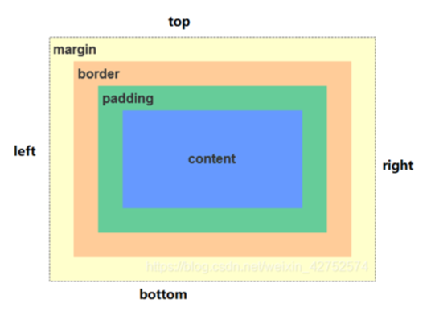

# Web标准  

组成部分：  

- HTML：结构  
  - 页面元素和内容  
- CSS：表现  
  - 元素的外观、位置等  
- JavaScript：行为      
  - 交互效果    

# HTML

文件格式：  

```HTML
<!DOCTYPE html>  // 声明文档类型为html
<html lang="zh-CN">  // 声明文档语言为简体中文
<head>  // 头部
    <meta charset="UTF-8">  // 指定字符集
    <title>这是一个测试文件</title>
</head>
<body>  // 主体
    <h1>  // 一级标题
        Hello World
    </h1>
</body>
</html>
```

浏览器对html文件 **从上到下逐行解析**  

每个html元素都有四个属性：  

- id：唯一标识符  
- class：类名  
- title：鼠标悬停时显示的文本  
- style：行内样式  


# Head

## title

## meta

## base

## link

## style

## script

# Body

## 全局属性

适用于所有html元素的属性

| 属性名   | 作用 |
|---------|------|
| `id` | 元素的唯一标识符 |
| `class` | 为元素指定一个或多个 CSS 类名 |
| `style` | 行内样式定义 |
| `title` | 鼠标悬停时显示的提示文本 |
| `hidden` | 隐藏元素 |

<h4 id="main-title">全局属性示例</h2>
<div id="content-section" class="container">
  <p class="paragraph-text highlight-text" style="color: blue;">
    这是一个段落，使用了 <span title="元素的唯一标识符">id</span>,
    <span title="为元素指定一个或多个 CSS 类名">class</span>,
    <span title="行内样式定义">style</span> 和 <span title="鼠标悬停时显示的提示文本">title</span> 属性。
  </p>
</div>

## 标题

```HTML
<h1>一级标题</h1>
<h2>二级标题</h2>
<h3>三级标题</h3>
<h4>四级标题</h4>
<h5>五级标题</h5>
<h6>六级标题</h6>
```

## 超链接

<a href="https://www.baidu.com">百度</a>

```HTML
<a href="https://www.baidu.com">百度</a>
```

- `herf`：指向的地址    
- `target` 为打开方式   
  - `_blank`：新窗口打开    
  - `_self`：本窗口打开（默认值）  

与 `锚点` 结合，可以实现页面内跳转    

```html
<h2 id="test">这是一个标题</h2>
<a href="#test">跳转到 test</a>
<a href="/path/to/htmlfile/index.html#test">跳转到 test</a>
```

在html中 `href` 的值可以为绝对路径或相对路径：  

| **路径类型** | **示例** | **解释** |
|:-----------:|:--------:|:--------:|
| **绝对路径** | `https://example.com/page.html` | 指向外部网站或完整 URL |
| **同级目录** | `index.html` | 访问当前目录下的 `index.html` |
| **子目录** | `pages/contact.html` | 访问 `pages` 目录下的 `contact.html` |
| **上级目录** | `../index.html` | 访问上一级目录中的 `index.html` |
| **根目录** | `/products/list.html` | 从网站根目录访问 `products/list.html` |

## 图片 视频 音频


```HTML

```

- `src`：图片地址   
- `alt`：对图像的文本描述     
  - 在图片加载失败时显示    
- `width`：宽度  
- `height`：高度  
  - 宽度和高度建议仅设置一个，另一个会被自动等比例缩放  
  - 若同时设置宽度和高度则会导致白边  
  - 单位：px，%（相对于父元素的百分比）

```html
<video src="http://i.fxgpt.site/i/2025/02/18/ndy2zr.mp4" controls></video>
```

- `src`：视频地址   
- `controls`：显示播放控件    
- `autoplay`：自动播放  
- `width`：宽度  
- `height`：高度      

```html
<audio src="http://i.fxgpt.site/i/2025/02/18/ndy2zr.mp3" controls></audio>
```

- `src`：音频地址   
- `controls`：显示控制条  

## 列表

### 无序列表 

<ul>
    <li>列表项1</li>
    <li>列表项2</li>
    <li>列表项3</li>
</ul>

```HTML
<ul>
    <li>列表项1</li>
    <li>列表项2</li>
    <li>列表项3</li>
</ul>
```

- `ul`：无序列表，`ol`：有序列表   
- `li`：列表项  

### 有序列表

<ol>
    <li>列表项1</li>
    <li>列表项2</li>
    <li>列表项3</li>
</ol>

```HTML
<ol>
    <li>列表项1</li>
    <li>列表项2</li>
    <li>列表项3</li>
</ol>
```

- `ol`：有序列表   
- `li`：列表项  
- `type`：设置列表项的序号类型，如 `1`、`A`、`a`、`I`、`i` 等  
- `start`：设置列表项的起始序号  

### 定义列表

<dl>
    <dt>列表项1</dt>
    <dd>列表项1的描述</dd>
    <dt>列表项2</dt>
    <dd>列表项2的描述1</dd>
    <dd>列表项2的描述2</dd>
</dl>

```HTML
<dl>
    <dt>列表项1</dt>
    <dd>列表项1的描述</dd>
    <dt>列表项2</dt>
    <dd>列表项2的描述1</dd>
    <dd>列表项2的描述2</dd>
</dl>
```

- `dl`：定义列表   
- `dt`：列表项

## 段落

<p>这是一个段落</p>

```HTML
<p>这是一个段落</p>
```

## 注释

```HTML
<!-- 这是一个注释 -->
```

## 文本格式化

<font face="Arial" size="4" color="red">Red Text</font>
<b>加粗1</b>
<strong>加粗2</strong>
<i>斜体</i>
<u>下划线</u>
<s>删除线</s>
文字的<sup>上标</sup>
文字的<sub>下标</sub>
<hr>  <!-- 水平线 -->

```HTML
<font face="Arial" size="4" color="red">Example here</font>
<b>加粗</b>
<i>斜体</i>
<u>下划线</u>
<s>删除线</s>
<sup>上标</sup>
<sub>下标</sub>
<hr>  <!-- 水平线 -->
```

## 特殊符号

| 符号 | HTML实体   |
|------|------------|
| <    | \&lt;      |
| >    | \&gt;      |
| &    | \&amp;     |
| "    | \&quot;    |
| '    | \&apos;    |
| ©    | \&copy;    |
| ±    | \&plusmn;  |
| ×    | \&times;   |
| ÷    | \&divide;  |
| ≠    | \&ne;      |
| ≤    | \&le;      |
| ≥    | \&ge;      |
| ∞    | \&infin;   |
| π    | \&pi;      |
| ≈    | \&asymp;   |
| ≠    | \&ne;      |
| ≠    | \&ne;      |

## div 和 span

`<div>` 是一个 **块级元素**，它作为一种容器，用于 **对元素进行编组**，以便于添加样式。    

每个 `<div>` 会独占一行，在末尾自动换行     

<div>
    <h4>这是一个标题</h4>
    <p>这是一个段落</p>
</div>

```HTML
<div>
    <h4>这是一个标题</h4>
    <p>这是一个段落</p>
</div>
```

- `style`：用于设置元素的样式   
  - `color`：文字颜色   
  - `background-color`：背景颜色  
- `class`：用于设置元素的类名，用于在 CSS 中设置样式    
- `align`：用于设置元素的对齐方式  
  - `left`：左对齐  
  - `center`：居中对齐  
  - `right`：右对齐   

`<span>` 是一个 **行内元素**，与 `<div>` 类似，是一种容器  

<span>
    <h4>这是一个标题</h4>
    <p>这是一个段落</p>
</span>

```HTML
<span>
    <h4>这是一个标题</h4>
    <p>这是一个段落</p>
</span>
```

## 表格

<table>
  <caption>
  <!-- 标题 -->
    这里是标题
  </caption>
  <!-- tr是一行，即table row -->
  <tr>
    <!-- th是表头，即table header -->
    <th>姓名</th>
    <th>年龄</th>
    <th>城市</th>
  </tr>
  <tr>
    <!-- td是一个单元格，即table data -->
    <td>张三</td>
    <td>30</td>
    <td>北京</td>
  </tr>
  <tr>
    <td>李四</td>
    <td>25</td>
    <td>上海</td>
  </tr>
  <tr>
    <td>王五</td>
    <td>35</td>
    <td>广州</td>
  </tr>
  <tr>
      <td>赵六</td>
      <td>28</td>
      <td>深圳</td>
  </tr>
</table>

```html
<table>
  <caption>
  <!-- 标题 -->
    这里是标题
  </caption>
  <!-- tr是一行，即table row -->
  <tr>
    <!-- th是表头，即table header -->
    <th>姓名</th>
    <th>年龄</th>
    <th>城市</th>
  </tr>
  <tr>
    <!-- td是一个单元格，即table data -->
    <td>张三</td>
    <td>30</td>
    <td>北京</td>
  </tr>
  <tr>
    <td>李四</td>
    <td>25</td>
    <td>上海</td>
  </tr>
  <tr>
    <td>王五</td>
    <td>35</td>
    <td>广州</td>
  </tr>
  <tr>
      <td>赵六</td>
      <td>28</td>
      <td>深圳</td>
  </tr>
</table>
```

### 基本属性

- `align`, `valign`：表格相对周围元素的水平、垂直对齐方式  
  - left, left, right  
- `bgcolor`：背景颜色   
  - 取值参考 [颜色表示形式](#颜色的表示形式)  
- `border`：边框宽度  
- `cellpadding`：单元格内容与单元格边框之间的距离   
- `cellspacing`：单元格之间的距离   
- `height`, `width`：表格的高度和宽度   

### 单元格合并 跨行跨列

表格从上向下，从左向右解析，使用 `colspan` 和 `rowspan` 可以实现合并单元格，解析时若该单元格被其他合并的单元格占用会跳过该单元格的解析：  

<table>
  <tr>
    <td colspan ="2">单元格占两列</td>
    <td width="90">&nbsp;</td>
    <!-- 三个单元格已经被解析完了 -->
  </tr>
  <tr>
    <td width="75">&nbsp;</td>
    <td width="90">&nbsp;</td>
    <td rowspan="2"> 单元格占两行</td>
  </tr>
  <tr>
    <td>&nbsp;</td>
    <td>&nbsp;</td>
    <!-- 接下来这个单元格不解析 -->
  </tr>
</table>

```html
<table>
  <tr>
    <td colspan ="2">单元格占两列</td>
    <td width="90">&nbsp;</td>
    <!-- 使用 &nbsp; 创建一个空白实体引用，防止单元格被跳过 -->
    <!-- 三个单元格已经被解析完了 -->
  </tr>
  <tr>
    <td width="75">&nbsp;</td>
    <td width="90">&nbsp;</td>
    <td rowspan="2"> 单元格占两行</td>
  </tr>
  <tr>
    <td>&nbsp;</td>
    <td>&nbsp;</td>
    <!-- 接下来这个单元格不解析 -->
  </tr>
</table>
```

### 单元格分组

- 行分组  
  - `<caption>`：表格标题
  - `<thead>`, `<tfoot>`：表头、表尾   
    - 仅可出现一次
  - `<tbody>`：表的主体   
    - 可以出现多次，用于将表格分为多个部分    

<table>
  <caption>企业员工薪水绩效表</caption>
  <thead>
    <tr>
      <th>员工编号</th>
      <th>员工岗位</th>
      <th>基本工资</th>
      <th>本月绩效</th>
    </tr>
  </thead>
  <tbody>
    <tr>
      <td>YF0016</td>
      <td>Java高级工程师</td>
      <td>6000</td>
      <td>3000</td>
    </tr>
    <tr>
      <td>YF0021</td>
      <td>Java程序员</td>
      <td>3000</td>
      <td>2500</td>
    </tr>
  </tbody>
  <tbody>
    <tr>
      <td>YF0016</td>
      <td>WEB前端工程师</td>
      <td>5000</td>
      <td>2500</td>
    </tr>
    <tr>
      <td>YF0021</td>
      <td>软件测试工程师</td>
      <td>3000</td>
      <td>2000</td>
    </tr>
  </tbody>
  <tfoot>
    <tr>
      <td colspan="3">总计</td>
      <td>10W</td>
    </tr>
  </tfoot>
</table>

```html
<table>
  <caption>企业员工薪水绩效表</caption>
  <thead>
    <tr>
      <th>员工编号</th>
      <th>员工岗位</th>
      <th>基本工资</th>
      <th>本月绩效</th>
    </tr>
  </thead>
  <tbody>
    <tr>
      <td>YF0016</td>
      <td>Java高级工程师</td>
      <td>6000</td>
      <td>3000</td>
    </tr>
    <tr>
      <td>YF0021</td>
      <td>Java程序员</td>
      <td>3000</td>
      <td>2500</td>
    </tr>
  </tbody>
  <tbody>
    <tr>
      <td>YF0016</td>
      <td>WEB前端工程师</td>
      <td>5000</td>
      <td>2500</td>
    </tr>
    <tr>
      <td>YF0021</td>
      <td>软件测试工程师</td>
      <td>3000</td>
      <td>2000</td>
    </tr>
  </tbody>
  <tfoot>
    <tr>
      <td colspan="3">总计</td>
      <td>10W</td>
    </tr>
  </tfoot>
</table>
```

## 颜色的表示形式

- 关键字  
  - red, green, blue, etc.  
- rgb 
  - `rgb(r, g, b)`，红绿蓝三色的强度，取值范围0-255   
- rgba  
  - `rgba(r, g, b, a)`，红绿蓝三色的强度和**不透明度**，取值范围0-1（1表示完全不透明）  
- 十六进制  
  - `#rrggbb`，红绿蓝三色的强度，取值范围00-FF    

## 表单

用于采集和提交用户输入，包括表单域和按钮两部分  

<form action="http://www.baidu.com">
  <label for="username">用户名：</label>
  <input type="text" name="username" id="username">
  <br>
  <label for="password">密码：</label>
  <input type="password" name="password" id="password">
  <br>
  <input type="submit" value="提交">
</form>

```html
<form action="http://www.baidu.com">
  <label for="username">用户名：</label>
  <input type="text" name="username" id="username">
  <br>
  <label for="password">密码：</label>
  <input type="password" name="password" id="password">
  <br>
  <input type="submit" value="提交">
</form>
```
- `<form>` 表单
  - `action`：表单提交的地址  
  - `method`：表单提交的方式，默认为 `get`    
    - get, post, put, delete, etc.    
    - 传输的url中，域名和数据之间用`?`分隔，数据之间用`&`分隔   
  - `name`：表单域的名称，用于提交时识别，现在多用`id`替代     
  - `enctype`：表单数据的编码方式  
    - `application/x-www-form-urlencoded`：**默认方式**，将数据编码为 `key=value` 的形式，并所有字符用`unicode`编码，并对特殊字符进行处理（空格替换为`+`，其他字符替换为百分号加十六进制值）      
    - `multipart/form-data`：将数据编码为二进制格式，用于上传文件   

### 常见表单域

- `<input>` 表单域   
  - `type`：表单域的类型，默认为 `text`    
    - text, password, radio, checkbox, submit, reset, button, file, hidden, etc.    
    - 值为`password`，显示的输入值为`***`   
    - 值为`radio`，需要设置相同的`name`属性，表示一组单选按钮，提交时只提交被选中的那个按钮的值   
    - 值为`checkbox`，需要设置相同的`name`属性，表示一组复选框，提交时提交所有被选中的复选框的值   
    - 值为`hidden`，会在页面中隐藏，但还是会传递给服务器。但是可以在源码中查看，因为不可用于存储敏感数据  
    - 
  - `value`：表单域的默认值，默认为空字符串    
  - `size`：表单域显示的宽度，默认为20个字符宽度  
  - `disabled`：是否禁用，默认为不禁用  

可以使用`<fieldset>`以**边框环绕**的形式实现表单的分组：  

<form>
  <fieldset>
    <legend>用户信息</legend>
    <label for="username">用户名：</label>
    <input type="text" name="username" id="username">
  </fieldset>
  <fieldset>
    <label for="password">密码：</label>
    <input type="password" name="password" id="password">
    <input type="submit" value="提交">
  </fieldset>
</form>

```html
<form>
  <fieldset>
    <legend>用户信息</legend>
    <label for="username">用户名：</label>
    <input type="text" name="username" id="username">
  </fieldset>
  <fieldset>
    <label for="password">密码：</label>
    <input type="password" name="password" id="password">
    <input type="submit" value="提交">
  </fieldset>
</form>
```


### 多行文本框

<textarea name="content" id="content" cols="30" rows="4">
这里是
多行
文本
可以
翻动</textarea>

```html
<textarea name="content" id="content" cols="30" rows="4">
这里是
多行
文本
可以翻动</textarea>
```

- `wrap`：自动换行的效果  
  - `off`：默认值，不自动换行，超出的部分用滚动条查看  
  - `virtual`：在用户视角自动换行，但实际换行以回车为准   
  - `physical`：在用户视角和实际都自动换行  

### 列表选择框

<select name="city" id="city">
  <option value="bj">北京</option>
  <option value="sh">上海</option>
  <option value="gz">广州</option>
  <option value="sz">深圳</option>
</select>

```html
<select name="city" id="city">
  <option value="bj">北京</option>
  <option value="sh">上海</option>
  <option value="gz">广州</option>
  <option value="sz">深圳</option>
</select>
```

- `<select>` 列表选择框   
  - `size`：列表选择框显示的行数，默认为1   
  - `multiple`：是否可多选，默认为单选  
  - `disabled`：是否禁用，默认为不禁用  
    - 禁用后，无法选择，也无法提交  
- `<option>` 列表选项   
  - `selected`：默认选中的选项    
  - `value`：选项的值，默认为选项的文本内容   

可以使用`optgroup`来将选项分组：  

<select>
    <optgroup label="水果">
        <option value="apple">苹果</option>
        <option value="banana">香蕉</option>
    </optgroup>
    <optgroup label="蔬菜">
        <option value="carrot">胡萝卜</option>
        <option value="tomato">番茄</option>
    </optgroup>
</select>


```html
<select>
    <optgroup label="水果">
        <option value="apple">苹果</option>
        <option value="banana">香蕉</option>
    </optgroup>
    <optgroup label="蔬菜">
        <option value="carrot">胡萝卜</option>
        <option value="tomato">番茄</option>
    </optgroup>
</select>
```

### 按钮控件

<input type="submit" value="提交">

```html
<input type="submit | reset | button" value="提交">
```

- `type`：按钮的类型，默认为 `submit`  
  - `submit`：提交按钮，点击后会提交表单  
  - `reset`：重置按钮，点击后会重置表单  
  - `button`：普通按钮，点击后不会提交表单，需要通过JavaScript来处理   
- `value`：按钮的文本内容，默认为空字符串     
- `disabled`：是否禁用，默认（不写disabled）为不禁用    


# CSS

## 简介

CSS（Cascading Style Sheets，层叠样式表）是一种用于描述HTML文档样式的语言，可以控制HTML元素的布局、颜色、字体、背景等样式。   

**样式** 是CSS的基本单元，每个样式包含：  

- 选择器：用于选择要应用样式的HTML元素    
- 声明：包含一个或多个属性和值，用于定义样式  

CSS的基本格式：  

```css
选择器 {
    属性1: 值1;
    属性2: 值2;
    ...
}
```

## 选择器

### 元素选择器

选择所有的`<p>`元素   

```css
p { ... }
```

### 类选择器

选择所有类名为`highlight`的元素   

```css
.highlight { ... }
```

### ID选择器

选择所有ID为`unique-title`的元素    

```css
#unique-title { ... }
```

### 组合选择器

选择所有`<p>`元素和类名为`highlight`的元素   

```css
p, .highlight { ... }
```

选择所有`<p>`元素和类名为`highlight`的元素   

```css
p.highlight { ... }
```

选择所有`<h1>`元素和`<h2>`元素   

```css
h1, h2 { ... }
```

选择所有`<h1>`和id为`subtitle`的`<h2>`元素
```css
h1, h2#subtitle { ... }
```

### 属性选择器

选择所有具有`<type>`属性的`<input>`元素  

```css
input[type] { ... }
```

选择所有`<type>`属性值为`text`的`<input>`元素

```css
input[type="text"] { ... }
```

选择所有`<class>`属性值以`icon`开头的`<a>`元素

```css
a[class^="icon"] { ... }
```

选择所有`<herf>`属性值中包含`example.com`的`<a>`元素    

```css
a[href*="example.com"] { ... }
```

### 后代选择器

选择所有`<p>`元素中的`<span>`元素   

```css
p span { ... }
```

选择所有id为`content`的元素中有`kaiti`类的`p`元素

```css
#content p.kaiti { ... }
```

### 选择器优先级  
- id > 类 > 元素  
- 即根据id选择来添加的样式会覆盖其他的样式  

示例：  

```html
<!DOCTYPE html>
<html lang="zh-CN">
<head>
    <meta charset="UTF-8">
    <title>这是一个测试文件</title>
    <style>
        span{
            color: red;
        }
        .cls{
            color: green;
        }
        #time{
            color: blue;
        }
    </style>
</head>
<body>
    <span>红色</span>
    <span class="cls">绿色</span>
    <span class="cls" id="time">蓝色</span>
</body>
</html>
```

效果：   

<span style="color:red;"> 红色</span> <span style="color:green;">绿色</span> <span style="color:blue;"> 蓝色</span>


## CSS引入方式

### 行内/内嵌  
- 写在标签的 `style` 属性中  
- <h4 style="color: red;">Hello World</h1>  
- <span style="color: gray;">2025年1月1日</span>  
- 注意，`<span>` 可以用于给元素添加样式，但是 `<span>` 本身没有特殊含义  

### 内部  
- 写在 `<head>` 标签中的 `<style>` 标签中  

```html
<head>
  <meta charset="UTF-8">
  <title>内部 CSS 示例</title>
  <style>
    /* 元素选择器 */
    p {
      color: blue; /* 所有段落文字蓝色 */
    }

    /* 类选择器 */
    .highlight {
      background-color: lightgreen; /* 类名为 highlight 的元素背景浅绿色 */
    }

    /* ID 选择器 */
    #unique-title {
      font-size: 24px; /* ID 为 unique-title 的元素字体 24px */
      color: red; /* ID 为 unique-title 的元素文字红色 */
    }
  </style>
</head>
```

### 外部  
- 写在单独的 `.css` 文件中，通过 `<link>` 标签引入  

/css/style.css  

```css
span {
  color: red;
}
```

/index.html  

```html
<head>
    <meta charset="UTF-8">
    <title>这是一个测试文件</title>
    <!-- 在这一行中引入css文件 -->
    <link rel="stylesheet" href="css/style.css">
</head>
<body>
    <span>外部引入的css</span>
    </body>
</html>
```

## CSS布局

CSS布局用于控制网页元素在页面上排列方式。  

### 盒模型

**盒模型** 描述了HTML元素周围的空间是如何构成的。每个HTML元素都可以看作一个矩形的盒子，这个盒子由以下几个部分组成：

- **内容 Content**：盒子的核心，显示元素的内容，例如文本、图片等。
- **内边距 Padding**：内容区域与边框之间的空间，用于增加内容与边框的距离。
- **边框 Border**：包围内容和内边距的线条，可以设置样式、宽度和颜色。
- **外边距 Margin**：边框以外的空间，用于控制元素与周围元素之间的距离。



网页元素自身位于矩形区域，也与其它元素共同位于另一个更大的矩形区域，这些矩形区域就称为“盒子”，规范着内部元素的排版和样式。  

### 边框样式

- 边框样式 `border-style`  
  - none/dotted/dashed/solid/double/  
  - groove（凹槽线边框）  
  - ridge（凸槽线）  
  - Outset（突起效果的边框）  
  - inset（凹进效果的边框）   
- 边框宽度 `border-width`  
  - 1个值：全部边框  
  - 2个值：上下、左右      
  - 3个值：上、左右、下  
  - 4个值：上右下左  
  - `border-top-width`  
  - `border-bottom-width`  
  - `border-left-width`  
  - `border-right-width`  
- 边距 `margin`  
  - 1-4个值 同上  
  - `margin-left`  
  - `margin-right`  
  - `margin-top`  
  - `margin-bottom`  
- 填充距 `padding`
  - 1-4个值 同上  
  - `padding-left`  
  - `padding-right`  
  - `padding-top`  
  - `padding-bottom`  

### 元素类型

HTML 元素本身具有 `block` (块级) 属性或 `inline` (内联) 属性。 CSS 中可以通过 `display: inline` 和 `display: block` 来设置元素为内联元素和块级元素。

**1. 块级元素 (block)**

- **独占一行**：默认情况下，每个块级元素都会另起一行，并占据一整行空间。
- **宽度默认填满父元素**：默认宽度会自动填满父元素的宽度。
- **可以设置 `width` 和 `height`**：可以显式地设置元素的宽度和高度。
- **可以设置 `margin` 和 `padding`**：可以设置所有方向的内外边距。
- **常见的块级元素**：`div`、`ul`、`ol`、`p`、`h1~h6`、`table` 等。

**2. 内联元素 (inline)**

- **不独占一行**：多个内联元素会在同一行从左到右水平排列。
- **宽度由内容决定**：宽度由元素自身内容决定，无法通过 `width` 和 `height` 设置有效宽度和高度。
- **设置 `width` 和 `height` 无效**：`width` 和 `height` 属性对内联元素不起作用。
- **可以设置水平方向的 `margin` 和 `padding`**：可以设置水平方向 (左右) 的 `margin` 和 `padding` (例如 `padding-left`, `margin-left` 等)，垂直方向的 `margin` 和 `padding` 可能效果有限或不明显。
- **常见的内联元素**：`a` (链接元素)、`img` (图像元素)、`em` (强调元素)、`input` (输入元素)、`span` (文本内区块元素)、`br` (换行元素) 等。

**3. 行内块元素 (inline-block)**

- **兼具块级和内联元素的特点**： 既可以像内联元素一样水平排列，又可以像块级元素一样设置宽度、高度、内外边距。
- **需要通过 `display: inline-block` 设置**： 默认情况下不是行内块元素，需要通过 CSS `display: inline-block` 属性来设置。


### 元素嵌套规则

- **块级元素可以包含块级元素和内联元素。**
- **特殊：块级元素 `<p>` 只能包含内联元素。**  `p` 元素中不能嵌套块级元素，这是一个HTML规范的限制。
- **内联元素只能包含内联元素。**  虽然技术上可能允许，但不建议内联元素嵌套块级元素，会破坏布局结构。

## CSS长度单位

### 绝对长度

- cm  
- mm  
- ln（英寸）  
- px  

### 相对长度

| 单位 | 描述 |
| :-: | --- |
| em | 相对于元素的字体大小 (font-size) (2em 表示当前字体大小的 2 倍) |
| ex | 相对于当前字体的 x-height (极少使用) |
| ch | 相对于 "0" (零) 的宽度 |
| rem | 相对于根元素的字体大小 (font-size) |
| vw | 相对于视口*宽度的 1% |
| vh | 相对于视口*高度的 1% |
| vmin | 相对于视口*较小尺寸的 1% |
| vmax | 相对于视口*较大尺寸的 1% |
| % | 相对于父元素 |

## 字体属性

| 属性 |  CSS 属性 | 描述 |
|---|---|---|
| 字体名称 | `font-family` | 多个字体用逗号分隔，不止一个单词的字体用双引号包围 |
| 字体大小 | `font-size` | 值可取small、medium、large或使用单位px、cm |
| 字体风格 | `font-style` | normal、italic（斜体）、oblique（略斜）|
| 字体粗细 | `font-weight` | normal、bold |
| 字体颜色 | `color` | 详见`Body-颜色的表示形式` |
| 字体大写转换 | `font-variant` | normal、small-caps（小写转为大写） |
| 字体复合属性 | `font: font-style属性值 font-size属性值 ...` | 上述属性以空格分隔 |

全部字体属性 <https://www.w3school.com.cn/css/css_font.asp>

示例：  

```html
p.mix3 {
  font-style: oblique;
  font-family: 宋体,"Times New Roman",Arial
  font-size: 20px;
  font-weight: normal;
  color: #03C;
}
```

## 文本属性

| 功能  | 属性名 | 描述 |
|---|---|---|
| 缩进文本 | `text-indent` | 设置行的缩进大小，值可以为正值或负值，单位可以用 em, px 或% |
| 水平对齐 | `text-align` | 设置文本的水平对齐方式，取值 left, right, center, justify |
| 垂直对齐 | `vertical-align` | 设置文本的垂直对齐方式，取值 bottom, top, middle, baseline |
| 字间距 | `word-spacing` | 设置字 (单词) 之间的标准间隔，默认 normal (或 0) |
| 字母间隔 | `letter-spacing` | 设置字符或字母之间的间隔 |
| 字符转换 | `text-transform` | 设置文本中字母的大小写，取值 none, uppercase, lowercase, capitalize |
| 文本修饰 | `text-decoration` | 设置段落中需要强调的文字，取值 none, underline (下划线), overline (上划线), line-through (删除线), blink (闪烁) |
| 空白字符 | `white-space` | 设置源文档中的多余的空白，取值 normal (忽略多余), pre (正常显示), nowrap (文本不换行，除非遇到 <br/> 标签) |

## 背景属性

| 功能 | CSS 属性 | 描述 |
|---|---|---|
| 背景颜色 | `background-color` |  |
| 背景图片 | `background-image` |  |
| 背景图片重复属性 | `background-repeat` | 取值：repeat、no-repeat、repeat-x、repeat-y |
| 背景图片滚动属性 | `background-attachment` | 取值：fixed、scroll |
| 背景图片位置属性 | `background-position` | 相对于左上角,取值为数字或 top、left、right、center、bottom |
| 背景复合属性 | `background` | 上述各种属性以空格分隔 |

## 定位布局属性

### 定位方式 `position`

一般情况下，页面由页面流构成，页面元素在页面流中的位置由该元素在HTML文档中的位置决定。  

块级元素从上向下排列(每个块元素单独成行)，内联元素从左向右排列，元素在页面中的位置会随外层容器的改变而改变。  

使用`position`可以将元素从页面流中偏移或分离出来以设定其具体位置，从而实现更精确的定位。  

`position`的取值：   

- `static`：正常流  
  - 元素作为页面流的一部分在页面流中正常出现  
  - 取值为static时，left、top、right、bottom 等值会被忽略  
- `relative`：相对正常位置定位  
  - 通过设置left、right、top、bottom进行重新定位  
  - 不影响其他元素的位置
- `absolute`：相对于浏览器窗口定位
  - 设置absolute后元素脱离文档流，若元素不设置宽度则为内容的宽度，原本在页面中的位置会被下一个元素占用    
  - 浏览器滚动时元素随着滚动    
- `fixed`：固定定位   
  - 浏览器滚动时元素位置不变  

示例：  

```css
.relativeBlock{
width: 600px;
height: 300px;
background-color: blue;
position: relative;
margin-top: 200px;
}

.absoluteBlock{
width: 20px;
height: 20px;
background-color: green;
position: absolute;
top: 100px;
left: 200px;
}

.fixedBlock{
width: 20px;
height: 100px;
background-color: red;
position: fixed;
top: 0;
left: 0;
}
```

### 层叠顺序 `z-index`

`z-index`，即元素在z轴上的层叠顺序值，可取值为`auto`或整数值（可为负数）。值较大的元素会覆盖在值较小的元素上方

示例：

```css
.box {
  position: absolute; /* 必须是定位元素，才能使用 z-index */
  width: 150px;
  height: 150px;
  text-align: center;
  line-height: 150px;
  color: white;
  font-weight: bold;
  top: 50%;
  left: 50%;
  transform: translate(-50%, -50%); /* 居中盒子 */
}

.box-red {
  background-color: red;
  z-index: 1; /* 红色盒子 z-index 设置为 1 */
}

.box-blue {
  background-color: blue;
  z-index: 2; /* 蓝色盒子 z-index 设置为 2 */
}

.box-green {
  background-color: green;
  z-index: 0; /* 绿色盒子 z-index 设置为 0 */
}
```

在html中：

```html
<div class="container">
  <div class="box box-red">红色盒子 (z-index: 1)</div>
  <div class="box box-blue">蓝色盒子 (z-index: 2)</div>
  <div class="box box-green">绿色盒子 (z-index: 0)</div>
</div>
```

### 浮动属性 `float`

使用`float`属性可以控制元素在其父容器内的水平方向上的位置，并允许周围的文本和内联元素环绕它。  

可取值为`left`和`right`。即让元素浮动到父元素的左侧或右侧，其他内容环绕在其右侧/左侧。  

示例：  

```css
.float-left {
  float: left; /* 图片向左浮动 */
  margin-right: 15px; /* 为了让文本和图片之间有间距 */
  margin-bottom: 10px; /* 为了下方如果还有元素，可以有间距 */
}
```

## 超链接样式

`<a>` 标签的伪类

| 伪类        | 描述             |
|-------------|------------------|
| `a:link`    | 未访问链接         |
| `a:hover`   | 鼠标光标在链接上时   |
| `a:active`  | 鼠标点击时         |
| `a:visited` | 已访问链接         |

`text-decoration` 的值

| 值                     | 描述      |
|-------------------------|-----------|
| `text-decoration: none` | 无装饰线    |
| `underline`             | 下划线     |
| `line-through`          | 删除线     |
| `overline`              | 上划线     |


