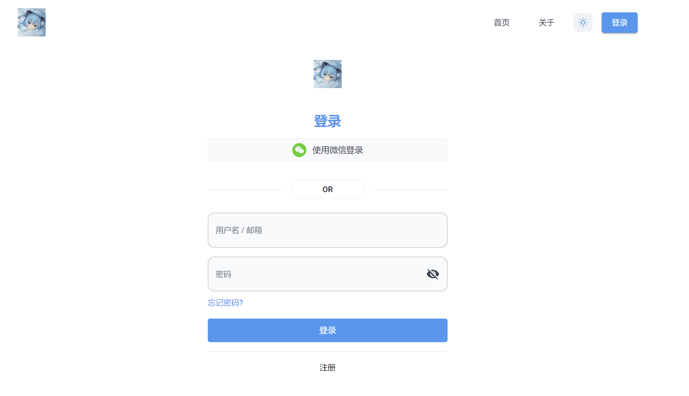
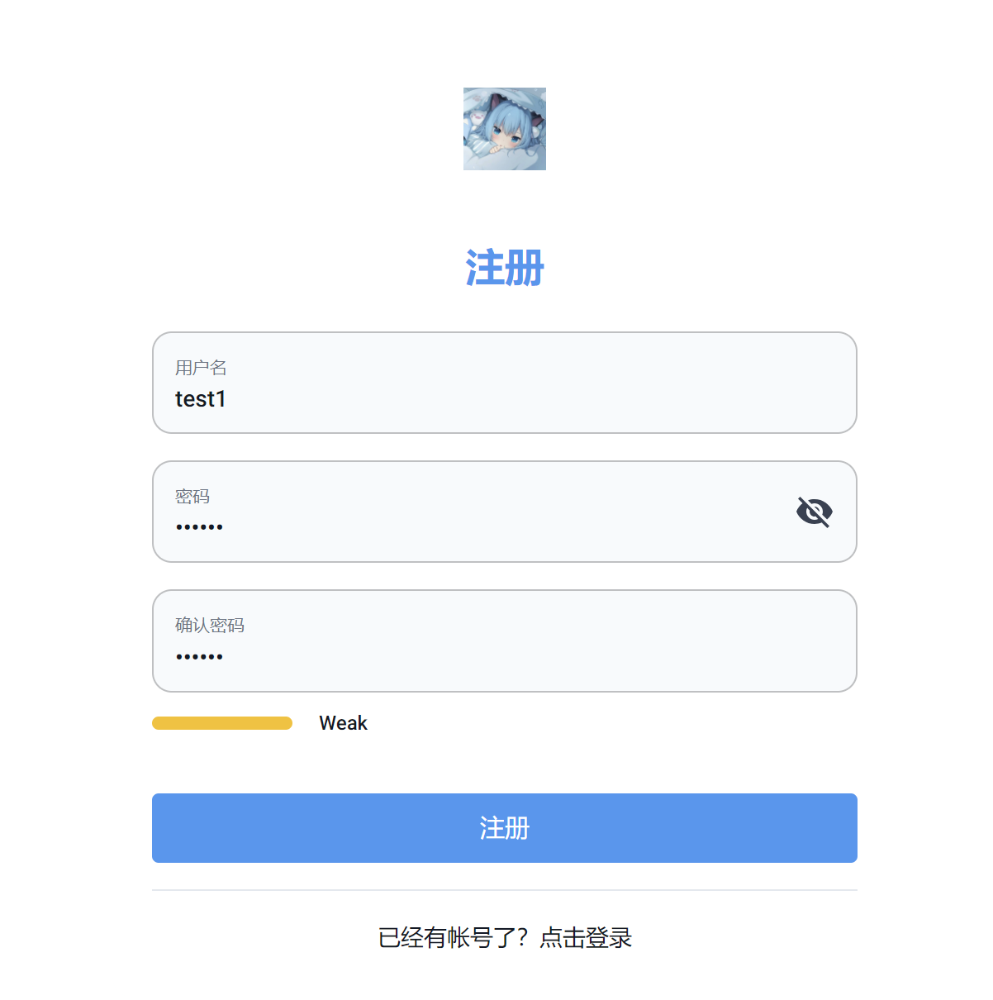
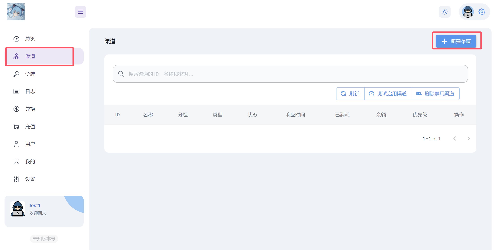
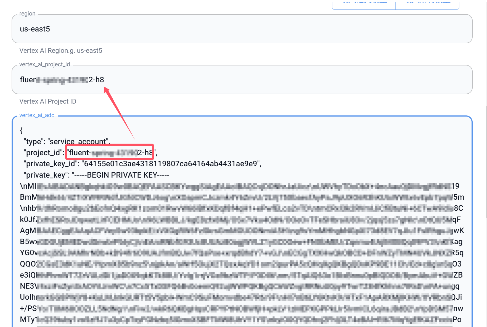
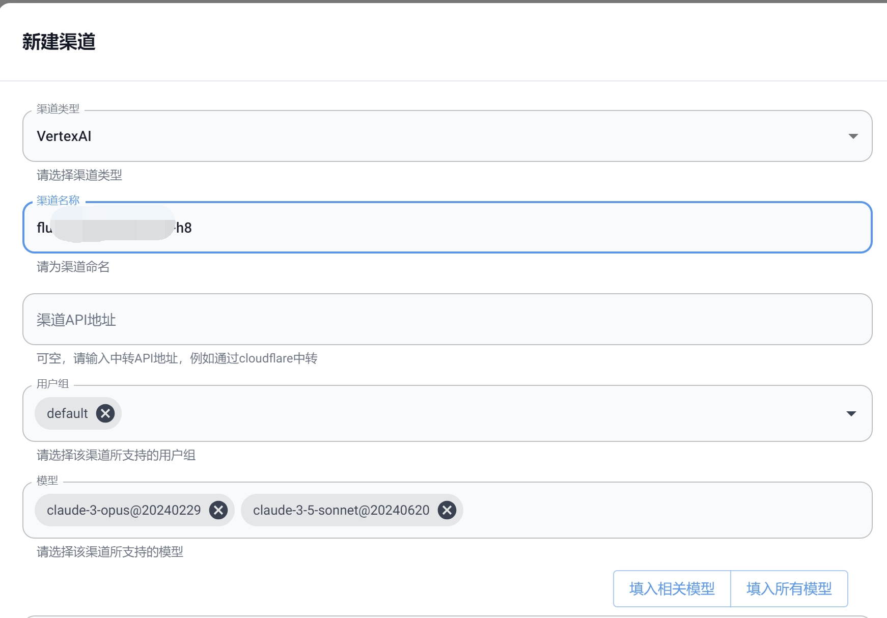

# gcp添加教程

## 注册账号

打开管理网址：<https://api.fxgpt.site>  
点击右上角登录，然后点击下方注册，填写账号密码，然后登录。  
确认可以登录后找管理员，向他提供你的账号，管理员会给你管理权限。  

## 添加gcp

正常获得管理权限后左侧会有“渠道”选项。  
点击左侧渠道-右上角添加渠道。

`渠道类型`选择VertexAI。  

然后划到最下边：   

将获取到的gcp json文件打开，将json文件中的全部内容复制，粘贴进`vertex_ai_adc`中，然后从json中复制`project_id`的值，粘贴进`vertex_ai_project_id`和`渠道名称`中。  

`region`：us-east5  
`渠道api地址`：留空  
`用户组`：保持默认  
`模型`：仅保留`claude-3-opus@20240229`和`claude-3-5-sonnet@20240620`  

最后点击右下角提交即可。