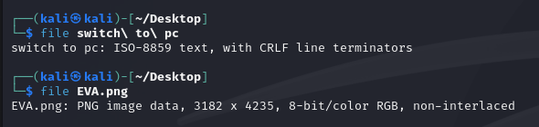
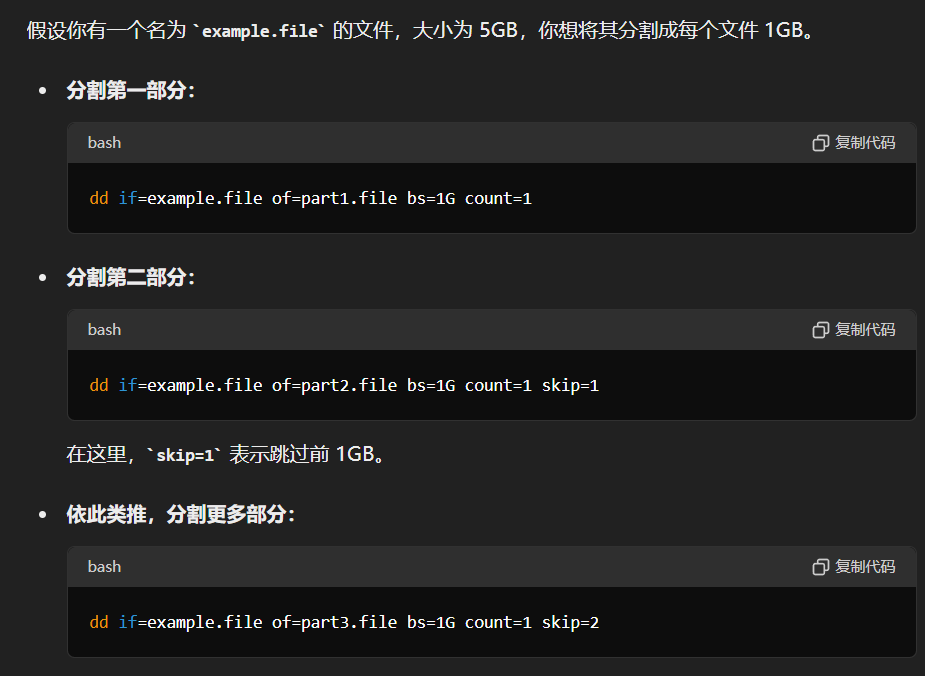

# 识别文件类型
## linux-file
判断文件的类型  
```
file 文件名
```   

  
若显示  `data`  则说明文件头被破坏，需要用010editor在文件最前端手动加上文件头来修复  

## 文件头
使用notepad++、010editor等工具查看文件的16进制文件头来判断文件类型
|文件类型|文件头|
|:-:|:-:|
|jpg|FF D8 FF E1/E0|
|png|89 50 4E 47|
|gif|47 49 46 38|
|bmp|42 4D|
|tif|49 49 2A 00|
|psd|38 42 50 53|
|mp3|49 44 33|
|mp4|00 00 00 14 66 74 79 70|
|pdf|25 50 44 46 2D 31 2E|
|zip|50 4B 03 04|
|rar|52 61 72 21 1A 07 00|
|7z|37 7A BC AF 27 1C|
|exe|4D 5A|
|html|3C 21 44 4F 43 54 59 50|
|iso|43 44 30 30 31|

# 文件分离
## linux-binwalk
分析文件：`binwalk 文件名`  
分离文件：`binwalk -e 文件名`  

## linux-foremost
```
foremost 文件名 -o 输出目录
```

## linux-dd
无法自动分离时使用dd手动分离
```
dd if=输入文件名 of=输出文件名 bs=块大小 count=总块数 skip=跳过块数
```


# 文件合并
## linux-cat
```
cat 要合并的文件名 > 输出文件名
eg.
cat file1 file2 file3 > file
cat file* > file
```
完整性检测(求md5)：`md5sum 文件名`

## windows-copy /b
```
copy /b 合并的文件名(多个用加号连接) 输出文件名
eg.
copy /b file1+file2+file3 file
copy /b file* file
```
完整性检测(求md5)：`certutil -hashfile 文件名 md5`
