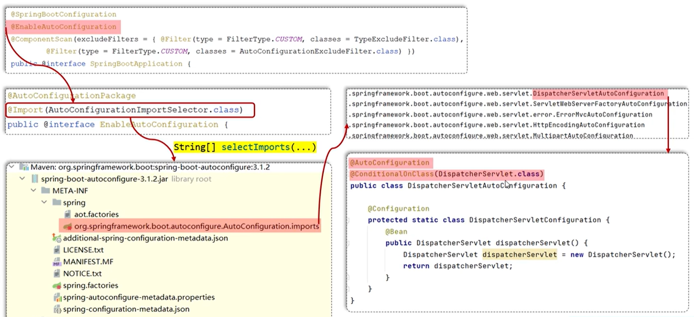

# SpringBoot

## 分层交互逻辑

- Controller：控制层  
  - 接收前端请求，调用Service层方法，将Service返回的数据封装为http相应
- Service：服务层       
  - 定义业务接口  
- ServiceImpl ：服务层实现  
  - 实现具体业务逻辑，调用DAO层方法访问数据库   
- DAO(Data Access Object)：数据访问对象层   
  - 定义数据库操作接口  
- Mapper：映射器层  
  - 与DAO层相同

## application配置文件

在 `src/main/resources/application.yaml` 中进行配置文件的编写  

```yaml
server:
  port: 9090

email:
  user: testemail@mail.com
  code: test123456
  auth: true
```

yaml文件使用缩进表示层级关系，缩进不允许使用tab，只允许空格  

在具体业务类中，使用以下方法获取配置文件中的内容：  

1、每个变量分别获取  

```java
@Component
public class EmailConfig {
    @Value("${email.user}")
    private String user;

    @Value("${email.code}")
    private String code;

    @Value("${email.auth}")
    private Boolean auth;
}

```

2、使用前缀统一获取，需要保证变量名和配置文件中的键名一致  

```java
@Component
@ConfigurationProperties(prefix = "email")
public class EmailConfig {
    private String user;
    private String code;
    private Boolean auth;
}
```

## mybatis数据库

1. 在 `pom.xml` 中配置dependency  

- `mybatis-spring-boot-starter` mybatis依赖   
- `mysql-connector-j` mysql驱动  

2. 在 `application.yml` 中配置数据库连接  

```yaml
spring: 
   datasource:
      driver-class-name: com.mysql.cj.jdbc.Driver
      url: jdbc:mysql://localhost:3306/mybatis
      username: root
      password: 123456
```

3. 在mapper路径中创建mapper接口  

`\mapper\UserMapper.java`

```java
package com.itheima.springbootmybatis.mapper;

import com.itheima.springbootmybatis.pojo.User;
import org.apache.ibatis.annotations.Mapper;
import org.apache.ibatis.annotations.Select;

@Mapper
public interface UserMapper {

  @Select("select * from user where id = #{id}")
  public User findById(Integer id);
}
```

由 `@Mapper` 表示这个接口是一个mapper接口，由  `@Select` 注解及其sql语句自动重写 `findById` 方法，返回User对象  

4. 在service路径中创建service接口并实现

`\service\UserService.java`

```java
package com.itheima.springbootmybatis.service;
import com.itheima.springbootmybatis.pojo.User;

public interface UserService{
  public User findById(Integer id);
}

```

实现这个service接口

`\service\impl\UserServiceImpl.java`  

```java
package com.itheima.springbootmybatis.service.impl;
import com.itheima.springbootmybatis.mapper.UserMapper;
import com.itheima.springbootmybatis.pojo.User;
import com.itheima.springbootmybatis.service.UserService;
import org.springframework.beans.factory.annotation.Autowired;
import org.springframework.stereotype.Service;

@Service
public class UserServiceImpl implements UserService {

  @Autowired  // 自动注入依赖
  private UserMapper userMapper;

  @0verride
  public User findById(Integer id){
    return userMapper.findById(id);  // 调用mapper接口中的方法，返回调用的结果
  }
}
```

5. 在controller路径中创建controller接口并实现

`\controller\UserController.java`

```java
package com.itheima.springbootmybatis.controller;
import com.itheima.springbootmybatis.pojo.User;
import com.itheima.springbootmybatis.service.UserService;
import org.springframework.beans.factory.annotation.Autowired;
import org.springframework.web.bind.annotation.RequestMapping;
import org.springframework.web.bind.annotation.Restcontroller;

@RestController
public class UserController {

  // @RestController 是 @Controller 和 @ResponseBody 的组合
  // 表示这个类是一个controller类，并且方法的返回值将直接作为HTTP响应体返回给客户端

  @Autowired  // 自动注入依赖
  private UserService userService;

  @RequestMapping("/findById")  // 将该HTTP请求路径映射到下方的方法中
  // 当客户端发送请求到 /findById 路径时，SpringBoot 会调用 UserController.findById(Integer id) 方法来处理请求
  public User findById(Integer id){
    return userService.findById(id)
  }
}
```

## Bean对象的管理

### Bean的扫描

在启动类中：  

```java
@SpringBootApplication
public class YhOARearRepoApplication {

    public static void main(String[] args) {
        SpringApplication.run(YhOARearRepoApplication.class, args);
    }

}
```

`@SpringBootApplication` 注解包含了 `@ComponentScan` 注解，会自动扫描 **启动类所在包及其子包** 中的所有组件，并将它们注册为Spring容器中的Bean对象  

若需要手动扫描，则使用 `ComponentScan(basePackages = "com.路径")`

### Bean的注册

在类上添加以下注解，从而将该类的对象注册为Spring容器中的Bean对象：  

| 注解 | 说明 | 
| :-: | :-: |
| `@Controller` | Controller类 |
| `@Service` | Service类 |
| `@Repository` | DAO类 |
| `@Component` | 非上面三种情况时使用的通用注解 |

#### 对第三方jar包的处理

1. 通过maven命令引入第三方jar包：  

```bash
mvn install:install-file 
  -Dfile=jar包的绝对路径
  -Dgroupld=组织名称
  -Dartifactld=项目名称
  -Dversion=版本号
  -Dpackaging=打包方式，如jar
```

运行后可以在 `\repository\组织名称\项目名称\版本号` 中找到该jar包  

2. 在 `pom.xml` 中添加依赖：   

```xml
<dependency>
  <groupId>组织名称</groupId>
  <artifactId>项目名称</artifactId>
  <version>版本号</version>
</dependency>
```

3. 使用 `@Bean` 注解将第三方jar包中的对象注册为Bean对象  

在启动类中：  

```java
@SpringBootApplication
public class YhOARearRepoApplication {

    public static void main(String[] args) {
        SpringApplication.run(YhOARearRepoApplication.class, args);
    }
    
    // 将下方返回的对象注册为Bean对象
    @Bean
    public 第三方jar包中的对象名 对象名(){
      return new 第三方jar包中的对象名();
    }
}
```

但是不推荐使用 `@Bean` 注解来实现，因为要修改启动类  

4. 使用 `@Configuration` 注解将第三方jar包中的对象注册为Bean对象

在一个“配置类”中集中注册第三方类：  

`\config\CommonConfig.java`：  

```java
package com.itheima.springbootregister.config;
import cn.itcast.pojo.Country;
import org.springframework.context.annotation.Bean;
import org.springframework.context.annotation.Configuration;

@Configuration
public class CommonConfig {

  //注入Country对象
  @Bean
  public Country country(){
    return new Country();   
  }
}
```

### 注册条件

以下是由 `@Conditional` 衍生而来的部分设置注册生效条件的注解：  

| 注解 | 声明 |
| :-: | :-: |
| `@ConditionalOnProperty` | 当配置文件中存在指定属性时生效 |
| `@ConditionalOnMissingBean` | 不存在当前Bean时生效 |
| `@ConditionalOnClass` | 存在指定Class时生效 |

- `@ConditionalOnProperty(prefix = "email", name = {"username", "password"})`     
  - 仅当配置文件中存在 `email.username` 和 `email.password` 属性时，才会注册该Bean对象  
- `@ConditionalOnMissingBean(Country.class)` 
  - 当容器中不存在 `Country` 这个Bean对象时，才会注册该Bean对象   
- `@ConditionalOnClass(name = "org.springframework.web.servlet.Dispatcherservlet")`  
  - 当容器中存在 `org.springframework.web.servlet.Dispatcherservlet` 这个Class时，才会注册该Bean对象    
  - 若引入了web起步依赖 `spring-boot-starter-web` 则有这个class  

## 自动配置

自动配置，即boot程序启动后，起步依赖中的部分bean对象自动注入到ioc容器中  

### 原理：  



1. 在 `@SpringBootApplication` 中包含了 `@EnableAutoConfiguration`  
2. 其中又包含了 `@Import(AutoConfigurationImportSelector.class)`   
3. 这个类中的 `String[] selectImports()` 方法会读取 `META-INF\spring\org.springframework.boot.autoconfigure.AutoConfiguration.imports` 文件   
4. 该文件中为大量类的全类名，其中的类有 `@AutoConfiguration` 注解   
5. 该注解中又包含 `@Configuration` 注解，即声明这个类是一个自动配置的配置类   
6. 且该类还有 `@ConditionalOnClass` ，仅当指定的类存在时才注入bean对象   
7. 在该类中还有一个内部的配置类，被注册为bean对象   
8. 读取到全类名后，会根据 `@Conditional` 及其衍生注解，把符合条件的bean对象注入到IOC容器中   

注意：  

- 在springboot 2.7版本前，会从 `META-INF\spring.factories` 文件中读取自动配置类的全类名  
- 在2.7-3.0版本中，同时兼容从 `spring.factories` 和 `.imports` 文件中读取  
- 在3.0版本后，仅支持 `.imports` 文件  

### 自定义starter

实际开发中，经常将一些常用的公共组件封装为springboot的 `starter`，供团队成员使用  

以 `mybatis` 为例，其起步依赖由两个工程组成：  

- `mybatis-spring-boot-starter`：依赖管理   
- `mybatis-spring-boot-autoconfigure`：自动配置   

其中 `starter` 又引入了 `autoconfigure`，因此在项目中引入 `starter` 即可

#### 创建方法  

- 创建 `dmybatis-spring-boot-autoconfigure` 模块，提供自动配置功能    
  - IDEA - 项目结构 - 项目设置 - 模块 - 加号 - 新建模块 - Maven Archetype   
  - 填写名称，Archetype选择 `org.apache.maven.archetypes:maven-archetype-quickstart`  
  - 
- 自定义 `.imports` 配置文件  
- 创建 `dmybatis-spring-boot-starter` 模块，并在其中引入 `autoconfigure`   


