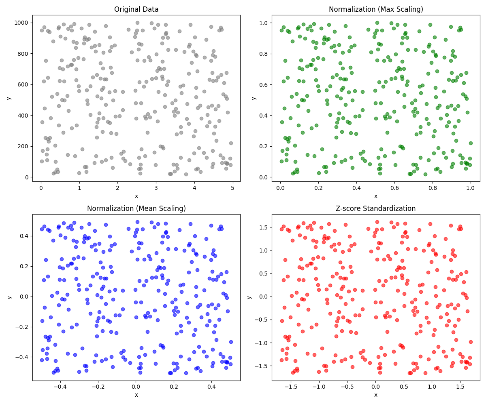

<script type="text/javascript" 
  src="http://cdn.mathjax.org/mathjax/latest/MathJax.js?config=TeX-AMS-MML_HTMLorMML">
</script>
<script type="text/x-mathjax-config">
  MathJax.Hub.Config({ tex2jax: {inlineMath: [['$', '$']]}, messageStyle: "none" });
</script>

# 概述

- 机器学习  
  - 监督学习    
  - 无监督学习  
  - 强化学习    

# 监督学习

学习把输入映射到输出的算法，监督学习的“监督”在于为其提供**包括输入和输出**的训练数据，即给定输入x的正确标签y。  

e.g.：语音转文字，机器翻译，垃圾信息分类，广告推送  

- 回归 regression   
- 分类 classification   

## 线性回归 linear regression

为一组数据拟合出一条直线，使得直线尽可能接近所有的数据点。  
线性回归的“线性”指的是：模型的输出是**输入的线性组合**，而非简单的直线，即：    
$f(x) = f(x_1, x_2, \cdots, x_n) = \beta_0 + \beta_1 x_1 + \beta_2 x_2 + \cdots + \beta_n x_n$

## 成本函数/损失函数 cost/loss function

衡量模型预测值与真实值之间的差距。  

预测值 $\hat{y}^{(i)} = f_{w,b}(x^{(i)})
$
误差 $\hat{y}^{(i)} - y^{(i)}$   
平方误差项 $(\hat{y}^{(i)} - y^{(i)})^2$  
总方误差 $\sum_{i=1}^{m} (\hat{y}^{(i)} - y^{(i)})^2$  
均方误差 $J(w, b) = \frac{1}{m} \sum_{i=1}^{m} (\hat{y}^{(i)} - y^{(i)})^2$  
通常令均方误差为 $\frac{1}{2m} \sum_{i=1}^{m} (\hat{y}^{(i)} - y^{(i)})^2$，以便于后续的求导运算  

## 梯度下降 gradient descent

梯度下降最终会找到损失函数的局部极小值，即其局部最优解  
需要不断使用不同的初始参数，最终找到全局最优解  

学习率 $\alpha \in (0, 1)$，用于控制更新参数的幅度    
梯度下降：  
  - $w = w - \alpha \frac{\partial}{\partial w} J(w, b)$  
  - $b = b - \alpha \frac{\partial}{\partial b} J(w, b)$  
  - 参数的梯度下降计算应**同时进行**，而不是先后进行，即先基于当前的参数计算更新的值，全部计算完成后再进行参数的更新   

## 多类特征

记：  
  - $ x_i $：第i个特征  
  - $ n $：每个训练样本有n个特征  
  - $ \vec{x}^{(i)} $：第i个训练样本  
  - $ \vec{x}^{(i)}_j $：第i个训练样本的第j个特征  
  - 此时，模型为 $ f_{w,b}(\vec{x}) = w_0 + w_1 x_1 + w_2 x_2 + \cdots + w_n x_n + b $  
  - 设参数 $ \vec{w} = [ w_1, w_2, \cdots, w_n ] , \vec{x} = [ x_1, x_2, \cdots, x_n ] $   
  - 则 $ f_{\vec{w},b}(\vec{x}) = \vec{w}^T \vec{x} + b = \vec{w} \cdot \vec{x} + b $，称其为 **多元线性回归**  

## 向量化

```python
w = np.array([1.0, 2.0 -3.5])
b = 4
x = np.array([20, -4, 3])

f = np.dot(w, x) + b
```

令 $\vec{w} = [ w_1, w_2, \cdots, w_n ]$  
则 $f_{ \vec{w}, b}(\vec{x}) = \vec{w} \cdot \vec{x} + b$  
其损失函数为 $J(\vec{w}, b)$  

## 特征缩放

对于取值范围较大的变量 $x_i$ ，其参数 $w_i$ 应取较小的值，反之，对取值范围较小的变量，其参数应取较大的值（相对来说）  

对两组取值范围相差较大的数据，如 $ x_i \in [0, 5], y_i \in [200, 10000]$，在使用数据进行训练前应对其进行特征缩放，使两组数据的范围长度大致相同，如标准化为 $ x_i \in [0, 10], y_i \in [0, 10]$，便于梯度下降找到全局最小值  

缩放的方法：  

- 1、除以最大值  
  - 对 $\forall x_i$，令 $x_i = \frac{x_i}{x_{max}}$，即将每一组的数据都除以该组数据的最大值  
- 2、均值标准化 将所有值都缩放到零点附近的区域  
  - 均值 $\mu = \frac{1}{n} \Sigma x_i$   
  - 缩放后变量 $x_i = \frac{x_i - \mu}{x_{max} - x_{min}}$    
- 3、Z-score 标准化  
  - 均值 $\mu = \frac{1}{n} \Sigma x_i$  
  - 标准差 $\sigma = \sqrt{\frac{1}{n} \sum (x_i - \mu)^2}$    
  - 缩放后变量 $x_i = \frac{x_i - \mu}{\sigma}$   

  


# 无监督学习

- 聚类 clustering   
  - 将没有标签的数据试图分类到不同的群组中。   
- 异常检测 anomaly detection    
  - 检测异常事件，如诈骗      
- 降维 dimensionality reduction  
  - 将大数据集在损失尽可能少信息的情况下压缩为小数据集    


