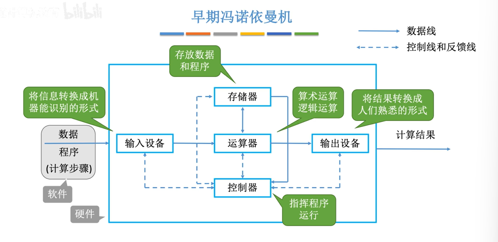
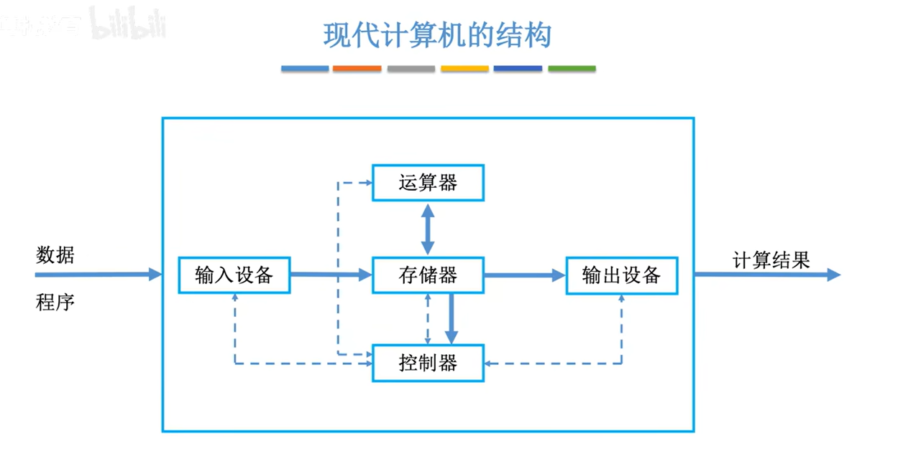
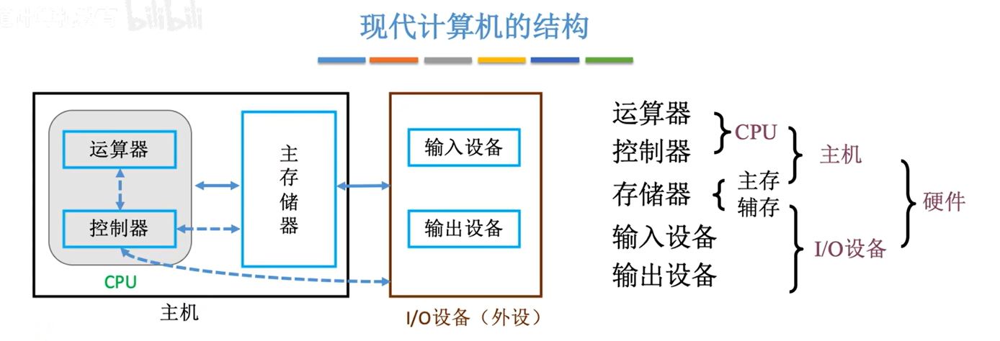

# 计算机系统概述

## 计算机的发展

第一台**电子数字**计算机：1946，ENIAC，电子管

| 发展阶段 | 时间 | 逻辑元件|
| :----: | :----: | :----: |
| 第一代 | 1946-1957 | 电子管 |
| 第二代 | 1958-1964 | 晶体管 |
| 第三代 | 1965-1971 | 中小规模集成电路 |
| 第四代 | 1972-至今 | 大规模、超大规模集成电路 |

计算机的发展趋势：  
- 微型化、多用途  
- 巨型化、超高速  

## 计算机硬件的基本组成

### 冯诺依曼机结构

存储程序：将指令以二进制代码形式存入计算机的主存储器，然后按存储器中指令的顺序执行依次执行。  

第一台采用冯诺依曼结构的计算机：EDVAC  

冯诺依曼计算机的特点：  
- 计算机由五大部件组成：运算器、控制器、存储器、输入设备、输出设备  
- 以运算器为中心  
- 存储程序  
- 指令和数据用二进制表示  
- 指令由操作码和地址码组成  
- 指令和数据以同等地位存于存储器中，可按地址寻访  

### 现代计算机结构

冯诺依曼结构以运算器为中心，所有数据都需要经过运算器中转，运算效率低。  

现代计算机以储存器为中心，输入的数据直接存入存储器，数据经运算器处理完后输出设备可以直接从存储器读取数据。  

将运算器和控制器整合为一个部件即为 **CPU**。  

计算机结构中的“主机”仅包含运算器、控制器、存储器，与通常意义上的主机（电脑机箱）不同。  

主机的主存指的是运行内存（memory），IO设备的辅存指的是外存（storage），二者合称为 **存储器**。  

## 各个硬件的工作原理

### 主存储器

主存储器包含三个主要部件：  
- 存储体：数据实际存储的地方  
- MAR 存储地址寄存器：临时存储当前访问的内存地址  
- MDR 存储数据寄存器：临时存储当前要访问的数据  

CPU读取数据：  
1. CPU将数据地址写入MAR并发送Read命令  
2. 主存储器接收命令  
3. 主存储器从MAR读取内存地址，在存储体中找到对应的数据，将其存入MDR  
4. CPU从MDR中读取数据  

CPU写入数据：  
1. CPU分别将数据和数据地址写入MDR和MAR并发送Write命令  
2. 主存储器接收命令  
3. 主存储器从MAR读取内存地址，将MDR中的数据写入存储体中  

**存储体** 被分为多个 **存储单元**，每个存储单元有唯一的 **地址**，在存储单元中存放 **存储字** （二进制代码的组合），其位数为 **存储字长**，通常为8bit的2的整数次幂倍。存储每一个二进制数（1bit）的元件称为 **存储元**。  

MAR的位数反映了存储单元的个数，MDR的位数等于存储字长。  
如4位MAR对应 $2^4$ 个存储单元，16位MDR对应16bit的存储字长。  

1 Byte = 1 B = 1 字节 = 8 bit  

### 运算器

运算器包含三个寄存器和一个核心部件：  
- 累加器 ACC：存放操作数或运算结果  
- 乘商寄存器 MQ：存放乘除运算的运算结果  
- 通用（操作数）寄存器：存放操作数  
- 算数逻辑单元 ALU：

 